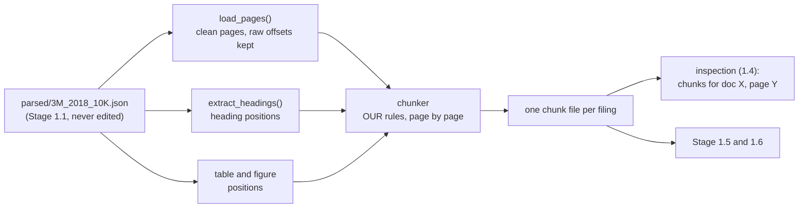
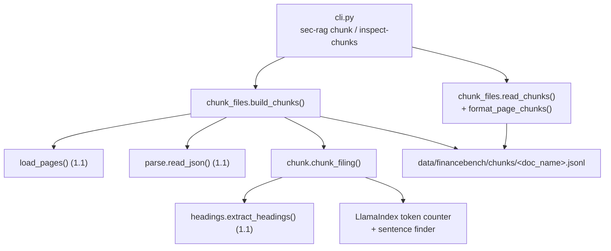
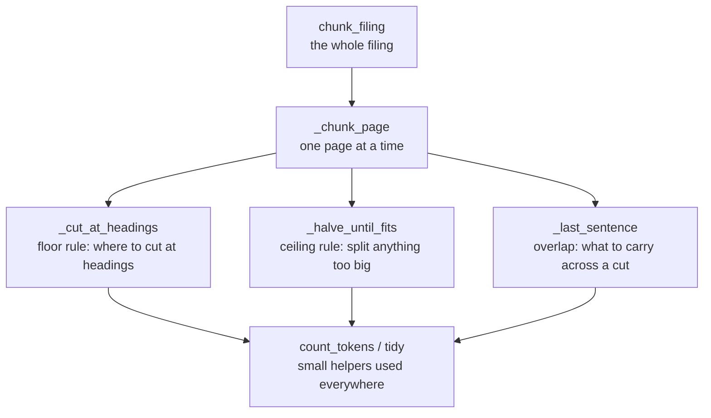

# Experiment 1 Implementation Guide — Stage 1.3 Chunk (and 1.4 Inspect)

> **For agentic workers:** REQUIRED SUB-SKILL: Use
> `superpowers:subagent-driven-development` or
> `superpowers:executing-plans` to implement one approved vertical slice at a
> time. Steps use checkbox (`- [ ]`) syntax for tracking.

> **Status:** Gates 1 (architecture and libraries) and 2 (files, data and
> interfaces) approved. Gate 3 (pseudocode, slices and tests) drafted for
> review.

**Goal:** every one of the 64 parsed filings cut into page-bounded chunks —
tables and figures whole, prose cut at headings within a size range — saved
as plain files that Stage 1.5 (keyword index) and 1.6 (embeddings) read, plus
a script to look at the chunks of any page.

**Architecture:** one chunker, written by us, that reads what Stage 1.1
already built (`load_pages`, `extract_headings`, and the table and figure
positions in the saved Azure JSON) and applies the chunking rules page by
page. It borrows two small tools from LlamaIndex: a token counter and a
sentence finder. Free and offline.

**Tech Stack:** Python 3.12; `llama-index-core==0.14.24` (already pinned);
the standard library for JSON. No new dependency.

**Requirements:** `docs sys design/Systems Design Draft.md` → Ingest files →
Chunk (rules 1-7 and Deferred). `docs sys design/Build Order.md` §1.3
"Chunking decisions" and §1.4.

## Global constraints

- Keep all changes unstaged and uncommitted until you've reviewed them.
- No paid API calls anywhere in this stage, in code or tests.
- The saved Azure JSON is never edited. Every position is a raw character
  offset into its `content`.
- Settings that change results (floor ~250, ceiling 1,024, overlap cap ~100)
  live in `configs/sec_rag.toml`, not in code.
- Exp 1 and Exp 2 search the identical chunks. Nothing in Stage 3 re-cuts
  them.
- Out of scope: the heading-fix pass (3.0), filling in `heading_path` (3.1),
  keyword pre-processing (1.5), embeddings (1.6), the fixed-size ablation
  (deferred).

---

## 1. Architecture and libraries

### The golden path



What happens to one page, in the Draft's order:

1. **Take the page from `load_pages`.** Headers, footers and page numbers are
   already blanked with spaces, so position `i` in the page's text is raw
   position `start_offset + i`.
2. **Cut out each table and each figure as its own chunk,** whole. Skip a
   figure with no text.
3. **Join the prose that's left into one stream.**
4. **Cut at headings,** left to right, only where both pieces clear ~250
   tokens. Heading lines stay in the text.
5. **Halve anything over 1,024 tokens** at the sentence boundary nearest its
   middle, repeating until every piece fits.
6. **Add overlap:** a chunk starting at a page break or a halving cut begins
   with the last sentence before the cut, up to ~100 tokens. Nothing at a
   heading cut. This changes only the text; page and offsets stay the
   chunk's own.
7. **Record each chunk:** page, filing and metadata, raw start and end
   offsets, kind (prose, table or figure), text with leftover blanks tidied,
   and an empty `heading_path`.

### Why the chunker is our own code

LlamaIndex's chunkers each break one of the rules above. `SentenceSplitter`
fills chunks greedily and leaves a small last piece, which breaks the floor.
`MarkdownNodeParser` cuts at every heading with no floor and doesn't know
about pages. The rules are the design, so they're written out where you can
read them. Both are compared in `docs/libraries/llamaindex/node_parser_modules.md`.

### The two library tools

Both come from `llama-index-core`, and both were verified to work offline.

- **Custom documents**: https://developers.llamaindex.ai/python/framework/module_guides/loading/documents_and_nodes/usage_documents/
- **Customer nodes** (basically chunks)
https://developers.llamaindex.ai/python/framework/module_guides/loading/documents_and_nodes/usage_nodes/
- **Token counter: `llama_index.core.utils.get_tokenizer()`.** Counts tokens
  for the floor, the ceiling and the overlap cap. It's OpenAI's `tiktoken`
  with the `cl100k_base` encoding, and LlamaIndex ships the data file inside
  the package, so no download is needed. Voyage counts with its own
  tokenizer, so our counts are an approximation. That's fine, because the
  floor and ceiling are rough guides, not API limits.
- **Sentence finder:
  `llama_index.core.utils.globals_helper.punkt_tokenizer.span_tokenize(text)`.**
  Returns the start and end position of every sentence, which we need
  because every cut must be a raw offset. It's used to find the halving
  point and the sentence to carry as overlap. It's NLTK's Punkt tokenizer,
  created untrained, so it doesn't know abbreviations and may end a sentence
  at "Inc." or "See Note 12.". The cost is a halving cut a few words off, or
  a shorter overlap, and neither breaks a rule.

### What to read on the two tools

- **Token counter.**
  - LlamaIndex documents it on its Settings page, under "Tokenizer":
    `docs/libraries/llamaindex/settings.md`, live at
    <https://developers.llamaindex.ai/python/framework/module_guides/supporting_modules/settings/>.
    It shows the default is `tiktoken`'s `gpt-3.5-turbo` encoding, which is
    `cl100k_base`.
  - `tiktoken`'s own README: <https://github.com/openai/tiktoken>.
  - The function itself: `utils.py` line 153 in the installed package
    (`.venv/lib/python3.12/site-packages/llama_index/core/`).
- **Sentence finder.** LlamaIndex has no documentation page for it, since
  it's an internal helper. The real documentation is NLTK's:
  - The Punkt page, <https://www.nltk.org/api/nltk.tokenize.punkt.html>,
    explains the idea (it learns abbreviations from training text, and
    without training it knows none) and documents `span_tokenize`.
  - Where LlamaIndex creates it untrained: `utils.py` line 115.
  - Where `SentenceSplitter` calls `span_tokenize`, the same way we will:
    `node_parser/text/utils.py` lines 72-88.

### Complexity budget

- One chunking module, one inspection command, and their tests. The layout
  is settled at Gate 2.
- There's no pluggable "strategy", no heading clean-up and no caching.
  Re-chunking all 64 filings takes seconds and is free, so the command just
  rebuilds.
- Deferred, as in the Draft: the fixed-size 512-token ablation, and
  FinSTAR's virtual node. HiChunk is cut.

### Traceability: design rule → where it's built

| Rule (Draft → Chunk) | Built in |
|---|---|
| 1. No chunk crosses a page | Chunker loops page by page; tests assert one page per chunk |
| 2. Tables and figures whole; empty figures skipped | Chunker, from Azure's table and figure positions |
| 3. Join prose; heading cuts with floor; halving; small page stays whole | Chunker: `extract_headings`, token counter, sentence finder |
| 4. Overlap at page breaks and halving cuts only; text only | Chunker, sentence finder |
| 5-6. Chunk record, with `heading_path` present and empty | The chunk record (Gate 2) |
| 7. Inspection script | The inspection command (1.4) |

---

## 2. Files, data and interfaces

### Files and responsibilities

The split follows Stage 1.1's pattern: `structure_report.py` holds the logic
(JSON in, text out, no files), and `inspect_parse.py` handles the files.

- **Create `src/sec_rag/chunking/chunk.py`: the chunking rules.** It takes
  a parse and its pages in memory and returns chunk records. It touches no
  files, so tests can feed it a small hand-made page.
- **Create `src/sec_rag/chunking/chunk_files.py`: chunk files on disk.** It
  builds the chunk file for each selected filing, reads one back, and
  formats one page's chunks for inspection (Stage 1.4).
- **Modify `src/sec_rag/config.py`:** validate the new settings (below).
- **Modify `src/sec_rag/cli.py`:** add the commands `chunk` and
  `inspect-chunks`, which only parse arguments and delegate.
- **Modify `configs/sec_rag.toml`:** add `chunks_dir` and a `[chunking]`
  table.
- **Tests:** create `tests/test_chunk.py` and `tests/test_chunk_files.py`;
  extend `tests/test_sec_rag_config.py` and `tests/test_sec_rag_cli.py`.
  The scenarios are listed in Gate 3.

Chunking has its own package, `src/sec_rag/chunking/`, beside
`ingestion/`. Ingestion gets the filings in and readable (parse, pages,
headings); chunking decides how they're cut, which is the design both
experiments share. `chunk.py` imports `extract_headings` from
`ingestion/headings.py`, and `chunk_files.py` imports `load_pages`,
`read_json`, `json_path` and `select_documents` from `ingestion/`.



### Configuration

```toml
[corpus]
# existing keys unchanged, plus:
chunks_dir = "data/financebench/chunks"

[chunking]
floor_tokens = 250         # a heading cut needs both pieces at least this big
ceiling_tokens = 1024      # prose over this is halved at a sentence
overlap_cap_tokens = 100   # most text carried across a page break or halving cut
```

`load_config` resolves `chunks_dir` like the other paths and checks that all
three settings are positive whole numbers. It also checks that
`ceiling_tokens` is at least twice `floor_tokens`. That's the condition
behind the Build Order's promise that "halving something over 1,024 always
leaves both sides over 512, so the floor can't be violated". If the settings
break it, the config is refused rather than the floor being broken quietly.

### The chunk file

One JSON Lines file per filing, `data/financebench/chunks/<doc_name>.jsonl`,
with one chunk per line in reading order. It's generated and never
committed, like everything under `data/`.

| Field | Example | Meaning |
|---|---|---|
| `chunk_id` | `"3M_2018_10K:p12:c0"` | filing, page index, then the chunk's number on that page (from 0, in reading order). It becomes the `TextNode` ID at Stage 1.5, and the ID in results |
| `doc_name` | `"3M_2018_10K"` | the filing, as in FinanceBench |
| `company`, `year`, `doc_type` | `"3M"`, `2018`, `"10K"` | split from the filename by `load_pages`; used for filtering |
| `page_index` | `12` | the chunk's one page, counted from 0, the same as FinanceBench's `evidence_page_num` |
| `kind` | `"prose"` | `"prose"`, `"table"` or `"figure"` |
| `start_offset`, `end_offset` | `54616`, `56048` | where the chunk's own text starts and ends in Azure's `content`, trimmed to the first and last visible character. Stage 3 attributes headings from these |
| `carried_text` | `""` | the sentence carried as overlap, or `""` if none. Kept separately so the inspection can show what was carried |
| `text` | `"## PART II\n\n### Item 5. ..."` | what gets searched and shown to the model: the carried text, then the chunk's own text, with blank runs tidied |
| `token_count` | `330` | tokens in `text`, for the summary and for estimating 1.6's cost |
| `heading_path` | `[]` | empty until Stage 3.1 |

Three details of this record:

- **Page field.** It's `page_index`, the name `load_pages` already uses.
  The benchmark's retrieved-chunk format wants `pages` as a list
  (`src/sec_rag_benchmark/pipeline/conditions.py`, line 103), so Stage 2's
  retriever returns `pages: [page_index]`. That one conversion is the
  only place a list appears.
- **Offsets describe the chunk's own piece only.** `carried_text` has no
  offsets, which is how the Draft's rule "the carried sentence lives in the
  chunk's text only" is kept.
- **Tidying.** "Blank runs tidied" means: runs of spaces become one space,
  spaces at a line's start or end are removed, three or more newlines become two,
  and the ends are stripped. Tables keep their HTML (`<table><tr><td>...`),
  exactly as Azure wrote it, because the rows and columns are what the
  answer model reads.

### Worked example: 3M 2018, page index 12

This is real data, measured with the token counter from Gate 1.

The page (Azure page 13, characters 54,574-58,758) holds four headings and
one table:

| Offset | Heading | Tokens before it | Tokens after it | Cut? |
|---|---|---|---|---|
| 54,616 | `PART II` | 0 | 330 | no, nothing before it |
| 54,629 | `Item 5. Market for Registrant's Common Equity...` | 3 | 326 | no, before is under 250 |
| 55,349 | `Issuer Purchases of Equity Securities` | 172 | 158 | no, both under 250 |
| 55,951 | `Issuer Purchases of Equity Securities (registered pursuant to Section 12...)` | 310 | 20 | no, after is under 250 |

The table runs from 56,051 to 58,710 (1,133 tokens).

The chunker produces two chunks:

```json
{"chunk_id": "3M_2018_10K:p12:c0", "doc_name": "3M_2018_10K", "company": "3M", "year": 2018, "doc_type": "10K", "page_index": 12, "kind": "prose", "start_offset": 54616, "end_offset": 56048, "carried_text": "", "text": "## PART II\n\n### Item 5. Market for Registrant' s Common Equity, ...\n\n### Issuer Purchases of Equity Securities (registered pursuant to Section 12 of the Exchange Act)", "token_count": 330, "heading_path": []}
{"chunk_id": "3M_2018_10K:p12:c1", "doc_name": "3M_2018_10K", "company": "3M", "year": 2018, "doc_type": "10K", "page_index": 12, "kind": "table", "start_offset": 56051, "end_offset": 58710, "carried_text": "", "text": "<table>\n<tr><th>Period</th>...</table>", "token_count": 1133, "heading_path": []}
```

What the example shows:

- **Every heading cut is rejected,** so the page's prose stays one 330-token
  chunk. That's the floor doing its job: four headings in 330 tokens would
  otherwise make four slivers.
- **The table stays whole at 1,133 tokens,** over the ceiling, because
  tables are never split.
- **No carried text.** The page's prose starts with a heading (`## PART
  II`), and nothing is carried at a heading. The previous page ended "...is
  included in Exhibit 95 to this annual report."; without the heading, that
  sentence would have been carried.
- **The table's title ends up in the prose chunk, not with its table.**
  Azure marked "Issuer Purchases of Equity Securities (registered...)" as a
  heading just above the table, so it's the last line of the prose. The
  rules as written give this result. It's the kind of thing the 1.4
  inspection should show you, and Stage 3's heading path gives the table
  chunk that heading anyway, which is part of what Exp 2 tests.

### Public interfaces

Listed in reading order: public function first, then the helpers it calls,
in call order. Exact pseudocode is Gate 3.

**`chunk.py`**

```python
def chunk_filing(
    raw: dict[str, Any],
    pages: list[dict[str, Any]],
    chunking: dict[str, int],
) -> list[dict[str, Any]]:
    """Cut one filing into chunk records, page by page, in reading order."""
```

- `raw` is the saved Azure JSON; `pages` is `load_pages`'s output for the
  same filing; `chunking` is the `[chunking]` config table.
- Returns the records described above, `heading_path` empty.
- Helpers, in call order:
  - `_table_and_figure_spans(raw) -> list[tuple[int, int, str]]`: each
    table and figure as (start, end, kind), sorted. Every one has exactly
    one span (checked on all 64 filings: 6,441 tables, 266 figures).
  - `_chunk_page(page, tables_and_figures, heading_positions, carry,
    chunking) -> tuple[list[dict], str]`: one page's chunks, and the
    sentence to carry into the next page.
    - `_cut_at_headings(prose, page_start, cut_points, floor) ->
      list[Piece]`: rule 3's left-to-right heading cuts.
    - `_halve_until_fits(prose, page_start, piece, ceiling) ->
      list[Piece]`: rule 3's halving, using `_halving_point`.
    - `_last_sentence(text, cap) -> str`: rule 4's carried sentence.
    - `_record(page, number, piece, kind, carried_text) -> dict`: one
      chunk record.
  - `Piece`: a small frozen dataclass (start, end, starts_at), explained in
    Gate 3.
  - `count_tokens(text) -> int` and `tidy(text) -> str`: small shared
    helpers, public because the tests and `chunk_files.py` use them.

**`chunk_files.py`**

```python
def build_chunks(
    config: dict[str, Any],
    document_names: tuple[str, ...] | None = None,
) -> dict[str, Any]:
    """Chunk each selected parsed filing, write its chunk file, and return a summary."""


def read_chunks(config: dict[str, Any], doc_name: str) -> list[dict[str, Any]]:
    """Read one filing's chunk file back into records."""


def format_page_chunks(chunks: list[dict[str, Any]], page_index: int) -> str:
    """Show every chunk on one page, carried text marked, for eyeballing (Stage 1.4)."""
```

- `build_chunks` picks filings with 1.1's `select_documents`, reads each
  parse with `read_json` and `load_pages`, and calls `chunk_filing`. It
  writes each file as `.partial` and then renames it, as the parse does,
  so an interrupted run never leaves half a file.
- Its summary: filings chunked; chunks by kind; the median prose chunk size;
  the share of prose chunks between floor and ceiling; how many exceed the
  ceiling (only through carried text); and figures skipped for having no
  text. This is the Build Order's "re-measure on all 64 filings" with a real
  tokenizer, instead of the characters ÷ 4 estimate.

**Commands**

```text
sec-rag chunk --config configs/sec_rag.toml [--documents 3M_2018_10K ...]
sec-rag inspect-chunks --config configs/sec_rag.toml --document 3M_2018_10K --page 12
```

- `chunk` rebuilds the chunk files, all filings or the ones named, and
  prints the summary. It's free, so there's no dry-run flag.
- `inspect-chunks` prints one page's chunks to the terminal. `--page` is
  the page index counted from 0, so you can paste a question's
  `evidence_page_num` straight in. That's how the Build Order's check "the
  gold page of 3 sample questions visibly contains the answer" gets done.

### Defined behaviour at the edges

Each of these gets a test in Gate 3.

- **Filing not parsed:** stops with `<doc_name>: not parsed yet` (raised by
  `load_pages`), exit code 1, and no files written for any filing.
- **Blank page, or a page of only tables and figures:** no prose chunk. The
  carry resets to nothing, since a sentence can't continue across a page
  with no prose.
- **Figure with no text** (37 of 266 in the corpus run: 34 are
  `<figure>\n</figure>`, and 3 are PayPal logos holding only a page footer,
  which `load_pages` has already blanked): no chunk, counted in the summary. A
  captioned figure is never skipped, because its caption sits inside its
  text (all 72 captions).
- **Figure without a `<figure>` tag:** two NIKE cover pages have a "figure"
  whose text is plain cover-page text. It's cut out like any figure: the
  rule is "whatever Azure lists as a figure".
- **Heading inside a table or figure** (those same two NIKE figures contain
  `## NIKE, Inc.`): not a cut point. Cuts happen only in prose.
- **Page prose under the floor:** one prose chunk, however small.
- **Prose over the ceiling with no sentence boundary** (for example a long
  list with no full stops): halve at the line break nearest the middle; if
  there isn't one, at the space nearest the middle.
- **Halving with very uneven sentences:** the Build Order's "both sides
  over 512" assumes the cut lands at the exact middle. A cut must sit at a
  sentence start, so a piece made of one very long sentence and one short
  one can split unevenly and leave a piece under the floor. The chunker
  takes the most even sentence start available and accepts that result;
  the Slice 3 summary counts prose chunks under the floor that came from
  halving, so you'll see whether it happens.
- **Table over the ceiling:** kept whole (the largest is 3,863 tokens).
- **Carried sentence over the cap:** words are dropped from its front until
  it fits, so what's kept is the end of the sentence, right before the cut.
- **First page of a filing:** nothing to carry.

### Decided: Stage 3 fills `heading_path` in place

Stage 3.1 rewrites each chunk file with only `heading_path` changed, and a
test there proves that every other field is untouched. That keeps one file
per filing, as the Draft and Build Order describe. The alternative, a
separate chunk-ID-to-heading-path file, was considered and not chosen.

---

## 3. Pseudocode, slices and tests

### How `chunk.py` fits together

`chunk.py` has three levels: the whole filing, one page, and the small
rules used on a page.



Each function below is explained in the same order: what it does in plain
steps, what it does to 3M 2018 page index 12 (the Gate 2 worked example),
then short pseudocode for whoever implements it.

Two ideas are used throughout.

**Blank things out, don't cut them out.** To take a table out of a page's
prose, the chunker replaces the table's characters with spaces (keeping
newlines), exactly as `load_pages` blanked the page headers. Nothing
shifts, so character 56,051 in Azure's text is still at position 56,051.
This blanked string is called `prose` below. It's also the Draft's "joined
prose stream": the blank gap where the table was disappears when a chunk's
text is tidied.

**A piece is a stretch of prose, plus how it starts.** Every piece has a
start and an end (raw positions in Azure's text) and a label saying why it
starts there:

- `"page"`: it's the first prose on the page;
- `"heading"`: it starts at a heading, either a heading cut or a heading at
  the very top of the page;
- `"halving"`: it's the second half of a halving cut.

The label is all the overlap rule needs: `"page"` and `"halving"` pieces
carry the previous sentence, and `"heading"` pieces don't.

```python
@dataclass(frozen=True)
class Piece:
    start: int  # raw position in Azure's content where the piece starts
    end: int  # raw position just after its last character
    starts_at: str  # "page", "heading" or "halving": decides overlap
```

In the pseudocode, `text_of(piece)` means "the piece's characters from
`prose`". Because `prose` starts at the page's start position, that's
`prose[piece.start - page_start : piece.end - page_start]`.

### `chunk_filing`: the whole filing

What it does:

1. Gather three lists from the saved parse: the pages (from `load_pages`),
   where each table and figure is, and where each heading is (from
   `extract_headings`).
2. Hand the pages to `_chunk_page` one at a time, and collect the chunks.
3. Pass one thing from each page to the next: the last sentence of its
   prose, in case the next page needs to carry it.

On 3M, this is a loop over 160 pages. Page index 12 receives the last
sentence of page 11 ("...is included in Exhibit 95 to this annual
report.") and returns two chunks.

```python
def chunk_filing(raw, pages, chunking):
    """Cut one filing into chunk records, page by page, in reading order.

    Systems Design Draft -> Chunk, rules 1-6. Pages are handled one at a
    time, which is how rule 1 (no chunk crosses a page) is kept. The only
    thing passed between pages is the sentence to carry (rule 4).
    """
    tables_and_figures = _table_and_figure_spans(raw)
    heading_positions = [heading.offset for heading in extract_headings(raw)]

    records = []
    carry = ""  # the first page has nothing to carry
    for page in pages:
        page_records, carry = _chunk_page(
            page, tables_and_figures, heading_positions, carry, chunking
        )
        records.extend(page_records)
    return records
```

`_table_and_figure_spans(raw)` is a small helper: it lists every table and
figure as (start, end, kind), sorted by start. Each has exactly one span
(checked on all 64 filings: 6,441 tables, 266 figures), and a table's span
covers exactly its `<table>...</table>` HTML. Whatever Azure lists as a
figure is included, even the two NIKE cover "figures" with no `<figure>`
tag.

### `_chunk_page`: one page, in five steps

What it does:

1. **Find what's on the page.** A page is a stretch of Azure's text: 3M
   page index 12 covers characters 54,574 to 58,758. A table or figure is
   on the page if it starts inside that stretch:
   `page_start <= start < page_end`. The table at 56,051 passes; one
   starting at 60,000 would belong to a later page. Checking only the start
   is enough, because no table or figure crosses a page. The same test
   finds the page's headings.
2. **Take out the tables and figures.** Each becomes its own chunk, as it
   is (rule 2). Then its characters are blanked in `prose`. A figure is
   skipped, not made a chunk, if nothing is left once its `<figure>` and
   `</figure>` tags are removed (37 of 266 on all 64 filings: mostly
   `<figure>\n</figure>`, plus 3 PayPal logos holding only a blanked page
   footer). A caption counts as text: all 72 captions sit
   inside their figure's text as `<figcaption>...</figcaption>`, so a
   captioned figure is always kept.
3. **Cut the prose.** Ask `_cut_at_headings` where to cut, then ask
   `_halve_until_fits` whether any piece is too big (rule 3). Headings
   inside a table or figure are ignored. A piece that's only blanks (a page
   of only tables) is dropped.
4. **Decide overlap** (rule 4):
   - the first prose piece, if labelled `"page"`, gets the sentence carried
     from the previous page;
   - a piece labelled `"halving"` gets the last sentence of the piece
     before it;
   - the last sentence of this page's prose is saved to carry onto the next
     page. If the page has no prose, nothing is carried: a sentence can't
     continue across a page of only tables.
5. **Write the records,** in reading order, numbered from 0 on the page
   (rule 5).

On 3M page index 12:

1. One table (56,051 to 58,710) and four headings are on the page.
2. The table becomes a chunk; its 2,659 characters become spaces in
   `prose`.
3. No heading cut passes the floor (see the next function), and the prose
   is 330 tokens, under the ceiling, so it stays one piece.
4. The piece starts at the `PART II` heading, so it's labelled `"heading"`
   and nothing is carried onto it. Its last sentence is saved for page 13.
5. Two records: `p12:c0` (prose, starts at 54,616) and `p12:c1` (table,
   starts at 56,051).

```python
def _chunk_page(page, tables_and_figures, heading_positions, carry, chunking):
    """One page's chunk records, and the sentence to carry onto the next page."""
    if page["start_offset"] is None:  # a blank page: no text at all
        return [], ""
    page_start = page["start_offset"]
    page_end = page_start + len(page["text"])

    # Step 1: what's on this page.
    on_page = [item for item in tables_and_figures if page_start <= item.start < page_end]

    # Step 2: tables and figures become chunks, then are blanked out of the prose.
    element_pieces = []
    prose = page["text"]
    for item in on_page:
        if item.kind == "figure" and figure_has_no_text(item):
            pass  # skipped: nothing to search
        else:
            element_pieces.append((item, item.kind))
        prose = blank_out(prose, item.start - page_start, item.end - page_start)

    # Step 3: cut the prose at headings, then halve anything too big.
    cut_points = [
        position for position in heading_positions
        if page_start <= position < page_end and not inside_any(position, on_page)
    ]
    prose_pieces = []
    for piece in _cut_at_headings(prose, page_start, cut_points, chunking["floor_tokens"]):
        prose_pieces.extend(
            _halve_until_fits(prose, page_start, piece, chunking["ceiling_tokens"])
        )
    prose_pieces = [piece for piece in prose_pieces if tidy(text_of(piece)) != ""]

    # Step 4: overlap. The carried sentence only changes a chunk's text;
    # its page and offsets stay its own.
    carried = {}
    for index, piece in enumerate(prose_pieces):
        if piece.starts_at == "page":
            carried[piece] = carry
        elif piece.starts_at == "halving":
            previous = prose_pieces[index - 1]
            carried[piece] = _last_sentence(text_of(previous), chunking["overlap_cap_tokens"])
    if prose_pieces:
        next_carry = _last_sentence(text_of(prose_pieces[-1]), chunking["overlap_cap_tokens"])
    else:
        next_carry = ""

    # Step 5: records in reading order, numbered c0, c1, ... on this page.
    everything = element_pieces + [(piece, "prose") for piece in prose_pieces]
    everything.sort(key=start position)
    records = []
    for number, (piece, kind) in enumerate(everything):
        records.append(_record(page, number, piece, kind, carried.get(piece, "")))
    return records, next_carry
```

### `_cut_at_headings`: the floor rule

What it does: walks through the page's headings left to right. For each,
it asks: "if I cut here, would the piece before this heading AND everything
after it both be at least 250 tokens?" If yes, it cuts, and the next
heading is measured from this cut. If no, the heading stays inside the
current piece. It returns the list of pieces.

It also sets each piece's label. The first piece is `"page"`, unless the
page's first visible text is a heading, in which case it's `"heading"`.
Every piece after a cut is `"heading"`.

On 3M page index 12:

| Heading | Tokens before | Tokens after | Cut? |
|---|---|---|---|
| `PART II` (54,616) | 0 | 330 | no |
| `Item 5. Market for Registrant's ...` (54,629) | 3 | 326 | no |
| `Issuer Purchases of Equity Securities` (55,349) | 172 | 158 | no |
| `Issuer Purchases ... (registered ...)` (55,951) | 310 | 20 | no |

It returns one piece, 54,574 to 58,758, labelled `"heading"` because
`PART II` is the first visible text.

```python
def _cut_at_headings(prose, page_start, cut_points, floor):
    """Split the page's prose at headings, keeping only cuts that leave both sides over the floor.

    Rule 3: "accept a heading cut only if the piece before it AND the
    remainder both clear ~250 tokens"; headings are tried left to right. A
    rejected heading stays inside its piece, and Stage 3 merges the heading
    paths.
    """
    page_end = page_start + len(prose)
    first_visible = page_start + (len(prose) - len(prose.lstrip()))

    # A heading as the first visible text counts as a heading start, so
    # nothing is carried onto it (3M page index 12 starts "## PART II").
    if first_visible in cut_points:
        label = "heading"
    else:
        label = "page"

    pieces = []
    piece_start = page_start
    for position in cut_points:  # sorted, left to right
        if position <= first_visible:
            continue  # nothing before it to make a piece from
        tokens_before = count_tokens(
            prose[piece_start - page_start : position - page_start]
        )
        tokens_after = count_tokens(prose[position - page_start :])
        if tokens_before >= floor and tokens_after >= floor:
            pieces.append(Piece(piece_start, position, label))
            piece_start = position
            label = "heading"
    pieces.append(Piece(piece_start, page_end, label))
    return pieces
```

### `_halve_until_fits`: the ceiling rule

What it does: asks "is this piece over 1,024 tokens?" If not, it returns
the piece unchanged. If so, it cuts the piece in two at the sentence start
that splits the tokens most evenly, then asks the same question about each
half, and so on until everything fits. The first half keeps the piece's
label; the second half is labelled `"halving"`, so it gets overlap.

It measures the middle in tokens, not characters, because a piece can
contain a blank gap where a table was, which has many characters but no
tokens.

Where to cut, in order of preference:

1. a sentence start, found by LlamaIndex's sentence finder;
2. if the piece has no sentence breaks (a long list with no full stops), a
   line break;
3. if there's no line break either, a space.

If there's none of these (one enormous word), the piece is left whole.

On 3M page index 12: the piece is 330 tokens, so nothing happens. A
2,500-token page with no accepted heading cut would become two pieces of
about 1,250 tokens, then four of about 625.

```python
def _halve_until_fits(prose, page_start, piece, ceiling):
    """Halve a piece at the sentence start nearest its middle until every part fits the ceiling.

    Rule 3: "halved at the nearest sentence boundary to its midpoint,
    recursively". "Nearest the middle" is measured in tokens.
    """
    if count_tokens(text_of(piece)) <= ceiling:
        return [piece]
    cut = _halving_point(prose, page_start, piece)
    if cut is None:
        return [piece]  # nowhere to cut: leave it whole
    first_half = Piece(piece.start, cut, piece.starts_at)
    second_half = Piece(cut, piece.end, "halving")
    return (_halve_until_fits(prose, page_start, first_half, ceiling)
            + _halve_until_fits(prose, page_start, second_half, ceiling))


def _halving_point(prose, page_start, piece):
    """The position inside the piece that splits its tokens most evenly.

    Candidates are sentence starts; if there are none, line breaks; if none,
    spaces. Sentence starts come from LlamaIndex's sentence finder,
    globals_helper.punkt_tokenizer.span_tokenize(text), which returns each
    sentence's (start, end) character positions (llama_index/core/utils.py
    line 115; used the same way in node_parser/text/utils.py line 79).
    Returns None if there are no candidates.
    """
    candidates = sentence starts inside the piece, except the first
    if not candidates:
        candidates = line-break positions inside the piece
    if not candidates:
        candidates = space positions inside the piece
    if not candidates:
        return None
    return the candidate where
        abs(count_tokens(before it) - count_tokens(after it)) is smallest
```

### `_last_sentence`: overlap

What it does: returns the last sentence of a piece, to be carried onto the
next chunk. The sentence can be complete, or broken off where the page
ended. If it's over 100 tokens, words are dropped from its front, so what's
kept is the part right before the cut, which is what the next chunk
continues from.

It's used twice: to carry onto the next page, and to carry onto the second
half of a halving cut.

On 3M: page index 11's prose ends "...concerning mine safety violations or
other regulatory matters required by Section 1503(a) of the Act is included
in Exhibit 95 to this annual report." That sentence would be carried onto
page 12, but page 12 starts with a heading, so it isn't used.

```python
def _last_sentence(text, cap):
    """The last sentence of `text`, cut down to at most `cap` tokens, for overlap.

    Rule 4: the carried sentence may be complete or broken off. If it's
    over the cap, words are dropped from its FRONT, keeping the part right
    before the cut.
    """
    sentences = sentence spans of text  # same sentence finder as above
    if not sentences:
        return ""
    words = tidy(text from the last sentence's start).split()
    while len(words) > 1 and count_tokens(" ".join(words)) > cap:
        words.pop(0)
    return " ".join(words)
```

### The small helpers

- **`_record(page, number, piece, kind, carried_text)`** builds one chunk
  record with Gate 2's fields. The offsets are trimmed to the piece's
  first and last visible character. `text` is the carried sentence, one
  space, then the chunk's own tidied text. The space means a sentence broken
  by a page break reads as one sentence again ("...losses on plan assets,
  and..."). `token_count` counts the whole `text`. On 3M page index 12,
  the prose piece runs from 54,574, but its first visible character is at
  54,616 (`## PART II`) and its last before the table is at 56,048, so
  those are the offsets saved.
- **`count_tokens(text)`** counts tokens in the tidied text, using
  LlamaIndex's `get_tokenizer()` (`llama_index/core/utils.py` line 153).
  That builds the `tiktoken` counter once, from the copy bundled in the
  package, so there's no network call. Counting the tidied text means blank
  gaps don't count as tokens.
- **`tidy(text)`** squashes the blanks left by page markers and removed
  tables: runs of spaces become one space, spaces at a line's start or end go, three
  or more newlines become two, and the ends are stripped. It's only used on
  text leaving the chunker; positions are always worked out on the
  untidied text.

### `chunk_files.py` pseudocode

```python
def build_chunks(config, document_names=None):
    """Chunk each selected parsed filing, write its chunk file, and return a summary.

    Every filing is chunked before any file is written, so an unparsed
    filing stops the run with nothing written, as inspect-parse does. Each
    file is written as .partial and then renamed, so an interrupted write
    never leaves half a file.
    """
    built = []
    for pdf_path in select_documents(config, document_names):   # 1.1's selection
        doc_name = pdf_path.stem
        raw = read_json(json_path(config, doc_name))              # "not parsed yet" if missing
        pages = load_pages(config, doc_name)
        records = chunk_filing(raw, pages, config["chunking"])
        built.append((doc_name, raw, records))
    for doc_name, _, records in built:
        write records as JSON Lines to chunks_path(config, doc_name) via .partial + rename
    return _summary(built, config["chunking"])


def _summary(built, chunking):
    """The counts `sec-rag chunk` prints.

    Filings; chunks by kind; median prose token_count; share of prose chunks
    between floor and ceiling; prose chunks over the ceiling (only possible
    through carried text); prose chunks under the floor that started at a
    halving cut (see "Halving with very uneven sentences"); empty figures
    skipped (figures in the parse minus figure chunks).
    """


def read_chunks(config, doc_name):
    """Read one filing's chunk file; '<doc_name>: not chunked yet' if it doesn't exist."""


def format_page_chunks(chunks, page_index):
    """One page's chunks as readable text, for Stage 1.4's eyeballing.

    For each chunk on the page: its ID, kind, token count and offsets, then
    the carried text marked as [carried: ...] if any, then the chunk's own
    text. A page with no chunks says so ("No chunks on page 12").
    """
```

Commands in `cli.py`, following `_run_parse`:

- `_run_chunk` loads the config, calls `build_chunks`, and prints the
  summary one line per count.
- `_run_inspect_chunks` loads the config, calls `read_chunks`, and prints
  `format_page_chunks(chunks, args.page)`. `--document` takes one filing,
  and `--page` is an integer.
- Errors are caught by the existing `except` in `main`: `Error: <message>`,
  exit code 1.

### Code comments to carry

Each module and function gets the docstring shown above. Inline comments go
at exactly these spots, because the code alone can't show why:

- where tables and figures are blanked rather than cut: the "blank, don't
  cut" rule and the `page_start + i` invariant;
- where a heading at the top of the page is marked `"heading"`: why nothing
  is carried onto it;
- at the `before >= floor and after >= floor` test: the Draft's wording,
  "the piece before it AND the remainder";
- at the token-balanced halving choice: why tokens and not characters;
- at the carried sentence: text only, and the offsets stay the piece's own;
- at the two LlamaIndex calls: what each returns and the source line where
  that was checked.

### Test fixtures

Tests use hand-made pages, not the real parse, and tiny settings so a test's
text stays readable: `floor_tokens = 5`, `ceiling_tokens = 12`,
`overlap_cap_tokens = 4`. A helper in `tests/test_chunk.py` builds a
`raw` and matching `pages` from a list of page strings, plus optional
table, figure and heading offsets, so every test states its own page in
full. That's the same style as `_one_page_parse` in `tests/test_load_pages.py`.

Every test in `test_chunk.py` also runs a shared check, `_assert_one_page`:
each chunk's offsets lie inside its own page's range. That's Build Order
§1.3's "assert one page per chunk", tested on every scenario rather than
once.

### Slice 1: tables, figures and heading cuts

**Purpose:** `chunk_filing` works for every rule except halving and
overlap: each table and figure is a chunk, the prose is joined, and heading
cuts respect the floor. This is the core of the chunker, and it's worth
reviewing on its own before the size and overlap rules are layered on top.

**Files:**

- Create `src/sec_rag/chunking/chunk.py`: `chunk_filing`,
  `_table_and_figure_spans`, `_chunk_page`, `_cut_at_headings`, `_record`,
  `count_tokens`, `tidy`. In this slice `_chunk_page` has no halving and no
  overlap: `carried_text` is always `""`.
- Modify `src/sec_rag/config.py` and `configs/sec_rag.toml`: `chunks_dir`
  and `[chunking]`, with the validation from Gate 2.
- Create `tests/test_chunk.py`; extend `tests/test_sec_rag_config.py`.

**Tests, each one behaviour:**

- `test_single_page_of_prose_is_one_chunk`: offsets trimmed to visible
  text; `page_index`, company, year, `doc_type` from the page; ID `...:p0:c0`;
  `heading_path == []`.
- `test_table_is_its_own_chunk_and_prose_either_side_is_joined`: a page of
  prose, table, prose gives one table chunk (its HTML exactly) and one prose
  chunk containing both prose parts, numbered in reading order.
- `test_figure_with_text_is_a_chunk_and_empty_figure_is_skipped`
- `test_heading_cut_kept_when_both_sides_clear_the_floor`
- `test_heading_cut_rejected_when_either_side_is_under_the_floor`: two
  cases, a short piece before and a short remainder after.
- `test_headings_tried_left_to_right`: three headings, where the middle one
  is rejected only because the first was kept.
- `test_heading_inside_a_table_is_not_a_cut_point`
- `test_small_page_is_still_its_own_chunk`
- `test_blank_page_gives_no_chunks`
- `test_tidy_collapses_blanks` and `test_count_tokens_ignores_blanks`
- config: `chunks_dir` resolved against the project root; a missing
  `[chunking]` is refused; a zero or negative setting is refused;
  `ceiling_tokens < 2 * floor_tokens` is refused.

**Steps:**

- [ ] Write the tests; run `uv run pytest tests/test_chunk.py
  tests/test_sec_rag_config.py -v`. Expected: FAIL, `ModuleNotFoundError:
  sec_rag.chunking.chunk`, plus the config tests failing on the missing
  validation.
- [ ] Implement from the pseudocode above, minus halving and overlap.
- [ ] Run the focused tests, then the full verification (below).
- [ ] Update this guide's "As built" notes for the slice.
- [ ] You review the uncommitted diff. Proposed commit: `Add page-bounded
  chunker with heading cuts`.

### Slice 2: halving and overlap

**Purpose:** the last two rules: pieces over the ceiling are halved at
sentences, and chunks starting at a page break or a halving cut carry the
previous sentence.

**Files:** modify `src/sec_rag/chunking/chunk.py` (add
`_halve_until_fits`, `_halving_point` and `_last_sentence`, and wire them
into `_chunk_page`); extend `tests/test_chunk.py`.

**Tests:**

- `test_prose_over_ceiling_is_halved_at_a_sentence`: each piece's own text
  is within the ceiling, and every cut sits at a sentence start.
- `test_halving_is_recursive`: a piece over four times the ceiling ends up
  as four or more pieces, none over the ceiling.
- `test_halving_falls_back_to_line_break_then_space`
- `test_halving_splits_tokens_as_evenly_as_sentences_allow`: with
  evenly sized sentences both halves clear the floor; with one long
  sentence and one short one, the cut still falls at the sentence start
  that is most even.
- `test_page_break_carries_last_sentence_of_previous_page`: page 1 ends
  mid-sentence; page 2's first chunk has `carried_text` equal to that
  sentence and `text` starting with it, while `start_offset` and
  `page_index` are page 2's own.
- `test_no_carry_when_page_starts_with_a_heading`
- `test_halving_cut_carries_last_sentence_of_previous_piece`
- `test_no_carry_at_a_heading_cut`
- `test_carried_sentence_over_cap_keeps_its_end`
- `test_carry_resets_after_a_page_with_no_prose`: a page of only a table
  sits between two prose pages.
- `test_first_page_carries_nothing`

**Steps:**

- [ ] Write the tests; run `uv run pytest tests/test_chunk.py -v`.
  Expected: the new tests FAIL (nothing halved, `carried_text` empty).
- [ ] Implement from the pseudocode.
- [ ] Run the focused tests, then the full verification.
- [ ] Update "As built".
- [ ] You review the diff. Proposed commit: `Add sentence halving and
  carried-sentence overlap`.

### Slice 3: chunk files, the `chunk` command, and the corpus run

**Purpose:** `sec-rag chunk` writes one chunk file per filing and prints
the summary; then it's run on all 64 filings.

**Files:** create `src/sec_rag/chunking/chunk_files.py` (`build_chunks`,
`_summary`, `read_chunks`, `chunks_path`); modify `src/sec_rag/cli.py`
(the `chunk` command); create `tests/test_chunk_files.py`; extend
`tests/test_sec_rag_cli.py`.

**Tests:**

- `test_build_chunks_writes_one_jsonl_per_filing`: one line per chunk,
  every field from Gate 2 present.
- `test_read_chunks_round_trips`
- `test_unparsed_filing_writes_nothing`: two filings selected, one
  unparsed; `ValueError` naming it, and no chunk file for either.
- `test_rebuild_replaces_the_file` and no `.partial` left behind.
- `test_summary_counts`: chunks by kind, median, share in range, empty
  figures skipped.
- CLI: `sec-rag chunk` prints the summary lines and returns 0; an unparsed
  filing prints `Error: ...` and returns 1.

**Steps:**

- [ ] Write the tests and watch them fail (`ModuleNotFoundError:
  sec_rag.chunking.chunk_files`).
- [ ] Implement, run the focused tests, then the full verification.
- [ ] Run it for real, free and offline: `uv run sec-rag chunk --config
  configs/sec_rag.toml`. Record the summary in this guide and in the Build
  Order's §1.3 measurements, replacing the 3M characters ÷ 4 figures. If
  the share of prose chunks between floor and ceiling is far below the 89%
  measured on 3M, stop and look before Stage 1.5.
- [ ] Update "As built".
- [ ] You review the diff. Proposed commit: `Add chunk command writing
  per-filing chunk files`.

### Slice 4: inspection (Stage 1.4)

**Purpose:** `sec-rag inspect-chunks` shows one page's chunks, and it's
used on the gold pages of three FinanceBench questions: the Build Order's
"done when" for Stage 1.

**Files:** modify `src/sec_rag/chunking/chunk_files.py` (add
`format_page_chunks`) and `src/sec_rag/cli.py` (the `inspect-chunks`
command); extend both test files.

**Tests:**

- `test_format_page_chunks_shows_each_chunk_on_the_page`: ID, kind, token
  count, text, and chunks from other pages absent.
- `test_format_page_chunks_marks_carried_text`
- `test_format_page_chunks_says_when_a_page_is_empty`
- CLI: prints the page and returns 0; a filing with no chunk file prints
  `Error: <doc>: not chunked yet` and returns 1.

**Steps:**

- [ ] Write the tests and watch them fail; implement; verify.
- [ ] Run it on the gold pages of three questions from the development
  subset, one of them a table question: `uv run sec-rag inspect-chunks
  --config configs/sec_rag.toml --document <doc_name> --page
  <evidence_page_num>`. Check that the answer is visibly inside a chunk,
  and that tables are whole. Note what you see in this guide, including how
  often a table's title sits in the prose chunk above it.
- [ ] Update "As built"; Stage 1.3 and 1.4 close here.
- [ ] You review the diff. Proposed commit: `Add chunk inspection command`.

### Verification before any slice is called done

All free and offline:

```bash
uv run ruff format --check .
uv run ruff check .
uv run mypy src/
uv run pytest
uv lock --check
git diff --check
```

Expected: no formatting or lint findings, mypy clean, every test passing,
and the lockfile unchanged (this stage adds no dependency).

### Commit boundaries

Each slice is its own commit on a branch off `main`. The documentation
changes from this session (the Draft, Build Order and Exp 1-3 edits, plus
this guide) are a separate documentation commit, made first. The corpus-run
numbers recorded in Slice 3 are results, so they go in their own
documentation commit, not with the code.

---

## As built

### Slice 1: tables, figures and heading cuts

- `src/sec_rag/chunking/chunk.py`: `chunk_filing` → `_table_and_figure_spans`,
  `_chunk_page` → `_cut_at_headings`, `_record`; plus `_blank`,
  `count_tokens` and `tidy`. `Element` (start, end, kind) holds a table or
  figure; `Piece` holds a prose stretch and its `starts_at` label.
- `src/sec_rag/config.py` and `configs/sec_rag.toml`: `chunks_dir` and
  `[chunking]`, required. Settings must be positive whole numbers (`true`
  is refused, since Python treats it as 1), and the ceiling must be at
  least twice the floor.
- Tests: `tests/test_chunk.py` (13 tests, every chunker test also checking
  one page per chunk); `tests/test_sec_rag_config.py` (7). The two existing
  test configs gained `chunks_dir` and `[chunking]`.
- Checked on the real parse: 3M 2018 page index 12 gives exactly the worked
  example: `p12:c0` prose at 54,616-56,048 (330 tokens) and `p12:c1` the
  table at 56,051-58,710 (1,133 tokens).
- Differences from the plan:
  - Chunking moved from `ingestion/` into its own `src/sec_rag/chunking/`
    package at review, so how filings are cut is kept apart from getting
    them in.
  - `tidy` also removes spaces at the start of a line, not only at the
    end. A blanked page marker often sits just before text on the same
    line, which would otherwise leave a stray leading space.
  - Elements and prose pieces are merged as simple (start, end, kind, own
    text) tuples inside `_chunk_page`, rather than a separate structure
    per kind.

### Slice 2: halving and overlap

- `chunk.py` gained `_halve_until_fits` → `_halving_point` (with
  `_imbalance`), `_last_sentence` and `_text_of`. `_chunk_page` now takes
  the carried sentence and returns `(records, next_carry)`; `_record` takes
  `carried_text`.
- Tests: 11 more in `tests/test_chunk.py` (24 in all). The one Slice 1 test
  with two prose pages now compares each chunk's own text, since page 1
  carries page 0's last sentence.
- Checked on 3M 2018 (0.6 seconds): 341 chunks, 222 of them prose, with a
  median prose chunk of 448 tokens. 86% of prose chunks are between floor
  and ceiling (the characters ÷ 4 estimate was 89%). 101 prose chunks carry
  a sentence, and 2 exceed the ceiling, only through carried text. The
  Draft's page-break example is restored exactly: `p11:c0` begins
  "...investment losses on plan assets, and relevant legislative...".
- Differences from the plan:
  - `_halving_point` binary-searches the candidates, not trying every one:
    tokens before a candidate only grow as it moves right, so the most
    even split is where "before" first reaches half, or the candidate just
    before it. It gives the same answer with far fewer token counts when
    the word-start fallback has thousands of candidates.
  - The fallback test is named
    `test_halving_falls_back_to_a_line_start_then_a_word_start`. The
    planned uneven-sentences case is covered by the "most even"
    four-sentence test, not a separate one.

### Slice 3: chunk files and the `chunk` command

- `src/sec_rag/chunking/chunk_files.py`: `build_chunks` → `_write_chunks`,
  `_summary`; `read_chunks`; `chunks_path`.
- `src/sec_rag/cli.py`: `chunk` command, `_run_chunk`.
- Tests: `tests/test_chunk_files.py` (7); `tests/test_sec_rag_cli.py` (2
  more).
- Differences from the plan:
  - The summary reports all prose chunks under the floor, not only those
    from halving cuts. Records don't keep the `starts_at` label, and adding
    a field just for this count wasn't worth it; the corpus results below
    break the small chunks down instead.

### Slice 4: inspection (Stage 1.4)

- `chunk_files.py` gained `format_page_chunks` and `write_chunk_report`;
  `cli.py` gained `inspect-chunks` (`_run_inspect_chunks`).
- Tests: 4 more in `tests/test_chunk_files.py`, 3 more in
  `tests/test_sec_rag_cli.py`.
- Differences from the plan:
  - `--page` is optional. Without it, the command writes the whole
    filing's chunks, page by page, to `chunks/<doc_name>.chunks.txt`, which
    is easier to hold beside the PDF than one printout per page. With it,
    one page prints to the terminal, as planned.
  - Page headers give both numbers: "Page index 59 (PDF page 60)", since
    FinanceBench counts from 0 and a PDF viewer from 1.

### Corpus results (27 September 2026)

`uv run sec-rag chunk --config configs/sec_rag.toml`, all 64 filings, 36
seconds, free:

| Measure | All 64 filings | 3M 2018 |
|---|---|---|
| Chunks | 21,039 (14,369 prose, 6,441 table, 229 figure) | 341 (222 prose) |
| Tokens in all | 10.1M (prose 6.4M, tables 3.7M) | — |
| Median prose chunk | 429 tokens | 448 tokens |
| Prose between floor and ceiling | 85.0% | 86% |
| Prose over the ceiling (carried text only) | 71 | 2 |
| Prose under the floor | 2,085 | — |
| Empty figures skipped | 37 | 0 |

- The Build Order's embedding estimate holds: it assumed ~10k chunks of
  ~1k tokens (~10M tokens). There are twice as many chunks, but smaller,
  and the total is 10.1M (9.8M before tables carried their titles).
- Gold-page check (Build Order's "done when"), on both FinanceBench
  questions about 3M 2018:
  - `financebench_id_03029`, FY2018 capital expenditure, $1,577m, page
    index 59: the figure is inside `p59:c1`, the whole cash-flow table
    ("Purchases of property, plant and equipment (PP&E) (1,577)").
  - `financebench_id_04672`, page index 57: `p57:c1` is the whole balance
    sheet table.
- **Found: statement titles were cut off from their tables.** Of the 2,085
  prose chunks under the floor, 811 are under 50 tokens, and 742 of those
  sit on a page with a table. Many are a financial statement's title, e.g.
  `p57:c0` is only "3M Company and Subsidiaries Consolidated Balance Sheet
  At December 31" plus a one-line note, while the table chunk `p57:c1`
  never said "balance sheet". Keyword and dense search for "balance sheet"
  would then find the title, not the numbers. The rules as first written
  produced this (tables cut out whole, the page's prose one piece), so it
  was a design gap, not a bug. Decided below.

### Change after the corpus run: tables carry the text above them

Decided 27 September 2026 (`Systems Design Draft.md` → Chunk → rule 2;
`Build Order.md` 1.3 → tables).

- **Rule.** A table chunk's `carried_text` is the visible text between the
  previous table or figure on its page (or the page's top) and the table,
  tidied, with words dropped from the front until it fits
  `overlap_cap_tokens` (100). Figures carry nothing. The title's prose
  chunk is left as it is.
- **Rejected.** A whole-page chunk per table page: 1,496 of 4,305 table
  pages hold two or more tables, median 1,101 tokens, largest 3,870.
  Azure's table captions: 89 of 6,441 tables have one.
- **Code.** `_chunk_page` step 2 tracks `above_from` (the end of the last
  element seen, starting at the page's top) and, for a table, carries
  `_keep_end(tidy(above), cap)`. `_keep_end` is the front-trimming loop
  that `_last_sentence` already used, pulled out so both share it.
- **Tests.** `tests/test_chunk.py`: `test_table_carries_its_title_from_just_above`,
  `test_text_above_a_table_over_the_cap_keeps_its_end`,
  `test_second_table_carries_only_the_text_after_the_first`,
  `test_table_at_the_top_of_a_page_carries_nothing`,
  `test_figure_carries_nothing`; the two tests that pinned a table chunk's
  text to the bare table now check that the table ends it.
- **Result.** Chunk counts and prose measures are unchanged; 5,643 of
  6,441 tables (88%) now carry text, and 633 table chunks contain "balance
  sheet". `p57:c1` now begins `[carried: ## 3M Company and Subsidiaries
  Consolidated Balance Sheet At December 31]`. Total tokens 9.8M → 10.1M.
- **Known limits.** A table at the top of a page (often continued from the
  previous page) carries nothing. When the text above is an ordinary
  paragraph, the table carries its last ~100 tokens, which is usually the
  lead-in ("...were as follows:") and sometimes less relevant.
- **Caveat for Exp2.** Table chunks now contain nearby headings as words,
  part of the signal Exp2 adds to the dense score; it can narrow Exp2's
  gain on table questions and must be stated in the write-up.
