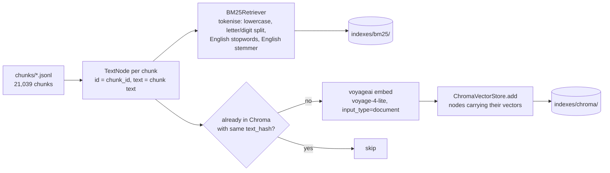
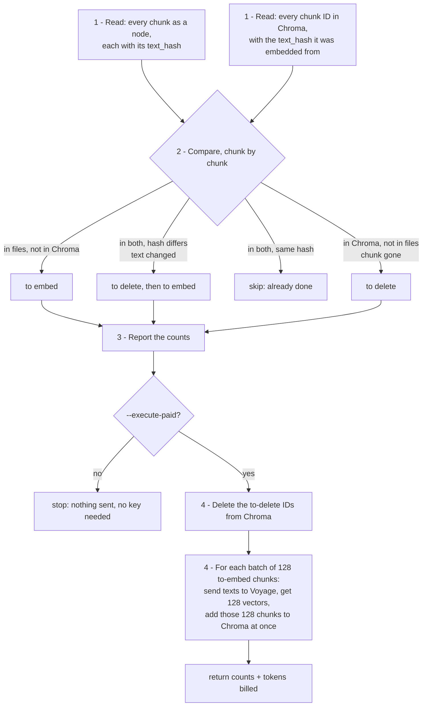

# Experiment 1 Implementation Guide — Stages 1.5 Keyword Index and 1.6 Embed

> **For agentic workers:** REQUIRED SUB-SKILL: Use
> `superpowers:subagent-driven-development` or
> `superpowers:executing-plans` to implement one approved vertical slice at a
> time. Steps use checkbox (`- [ ]`) syntax for tracking.

**Goal:** turn the 21,039 saved chunks into the two searchable indexes Exp1
retrieves from — a BM25 keyword index and a Chroma vector store of
voyage-4-lite embeddings — both saved to disk and reloadable.

**Architecture:** read `data/financebench/chunks/*.jsonl` → one LlamaIndex
`TextNode` per chunk → (a) LlamaIndex's `BM25Retriever` (wrapping `bm25s`),
saved to disk; (b) embeddings from the `voyageai` client, cached per chunk,
stored through LlamaIndex's `ChromaVectorStore` in a local Chroma database.

**Tech Stack:** `llama-index-retrievers-bm25==0.8.0` (+ `bm25s`, PyStemmer,
both already installed with it), `voyageai==0.5.0`,
`llama-index-vector-stores-chroma==0.6.0`, `chromadb==1.5.9`. Nothing new to
install.

**Requirements:** `docs sys design/Build Order.md` → 1.5, 1.6;
`docs sys design/Systems Design Draft.md` → Tech stack, "Pre-process for
keyword search", "Embed chunk".

## Global constraints

- Mon 28 Sep is the last coding day (Build Order → Timeline). This stage and
  all of Stage 2 are due today, so the guide is kept to what Exp1 needs.
- Settings live in `configs/sec_rag.toml`, not code.
- Embedding is the only paid step here (inside Voyage's 200M free tokens:
  ~10.1M needed). Like `parse`, `embed` only reports what it would do unless
  given `--execute-paid`. `VOYAGE_API_KEY` is read lazily.
- Tests make no paid calls: the embedder is passed in, and tests pass a fake.
- Exp2 hook: Chroma must let Exp2 read chunk vectors back out (Build Order
  3.3 scores in numpy). Heading paths are not stored here.

---

## 1. Architecture and libraries

### The golden path



- **What gets indexed:** each chunk's `text` (carried text + its own text),
  exactly what the answer model later reads.
- **What rides along as metadata:** `chunk_id`, `doc_name`, `company`,
  `year`, `doc_type`, `page_index`, `kind`. Filters (Stage 2.1) use
  `doc_name`, `company`, `year`, `doc_type`; the page metrics use
  `doc_name` + `page_index`.
- **The same `TextNode`s feed both indexes**, so a chunk has one ID
  everywhere and a filter written once (`MetadataFilters`) works on both.

### Keyword index: `BM25Retriever`

What it does: builds the four BM25 structures (Build Order 1.5) with `bm25s`,
searches them, and applies metadata filters before scoring (confirmed by the
Stage 0 spike, `tests/test_bm25_metadata_filters.py`).

Settings, all passed to `BM25Retriever.from_defaults`:

| Setting | Value | Why |
|---|---|---|
| `token_pattern` | `(?u)[^\W\d_]+\|\d+` — a run of letters, or a run of digits | the letter/digit split: `FY2018` → `fy`, `2018` (98 of 112 questions use FY-style years). `bm25s` lowercases before applying the pattern |
| `language` | `"en"` | English stopwords removed |
| `stemmer` | `Stemmer.Stemmer("english")` | "revenues" matches "revenue"; both sides stemmed |
| k1, b | 1.5, 0.75 | not exposed by the wrapper; these are `bm25s`'s defaults and the design's values |

The wrapper doesn't do three things we need, and one job is beyond any
setting. Each was checked by running the installed package (27 Sep 2026):

1. **Saving the index forgets how we split words.** Chunks are split into
   words our way when the index is built (`FY2018` → `fy`, `2018`). Saving
   writes only three settings to `retriever.json` — `similarity_top_k`,
   `verbose`, the filter mask — and not our word-splitting pattern or
   stemmer (base.py line 32). Reloading with LlamaIndex's
   `from_persist_dir` therefore splits every *question* with the default
   pattern, which keeps `fy2018` as one word — a word no chunk contains. No
   error; the match just never happens.
   - Fix: our own `load_bm25_index` reloads the saved index with `bm25s`
     and hands it to a new `BM25Retriever` together with the pattern and
     stemmer from config. Test: a reloaded index still finds "fiscal 2018"
     for the question "FY2018".
2. **Metadata would be searched as if it were chunk text.** Before
   indexing, the wrapper glues every metadata field onto the front of the
   chunk's text (base.py line 105). A 3M chunk would be indexed as
   `doc_name: 3M_2018_10K / company: 3M / year: 2018 / page_index: 59 /
   Capital expenditure was...`, so "2018" would match every chunk of every
   2018 filing.
   - Fix: each node lists all its metadata keys in
     `excluded_embed_metadata_keys`, which tells LlamaIndex to leave them
     out of the text. They stay attached for filtering. Test: the indexed
     text of a node equals the chunk's `text`.
3. **A filtered search fills up its results with filtered-out chunks.**
   Found by the Stage 0 spike: ask for the top 10 inside a filing that has
   only 6 matching chunks, and it returns those 6 plus 4 chunks from other
   filings, each with score 0.
   - Fix: Stage 2.2's retrieval function throws away score-0 results. Noted
     here because it belongs to BM25; built there, where searching is.
4. **Two-digit years (`FY22`) — dropped, 27 Sep 2026.** Build Order 1.5
   planned to expand them to `2022`, but none of the 112 questions uses one
   (checked against `financebench_open_source_10k.jsonl`), and expanding
   would have to assume the 21st century. Nothing is built.

The fifth finding, Chroma measuring distance with L2 unless told
otherwise, belongs to the vector store and is under "Vector store" below.

### Embeddings: `voyageai` client, called directly

Decided at Stage 0.4 (Draft → Tech stack): not through LlamaIndex's Voyage
wrapper, so the call, its batching and its cost are visible in our code.

- `vo.embed(texts, model="voyage-4-lite", input_type="document")`; questions
  are embedded later (Stage 2.2) with `input_type="query"`.
- `output_dimension=1024`, `output_dtype="float"` — both Voyage's defaults,
  but set explicitly in config so every run's saved config records them, and
  so question embeddings (Stage 2.2) are made the same way. Why these values
  (`docs/libraries/voyage/flexible-dimensions-and-quantization.md` lines 9-13
  and 50-56):
  - cost is per token, not per dimension, so a shorter vector saves no money,
    only storage — and 21,039 × 1,024 floats is ~86 MB, which is nothing
  - 256/512 dimensions lose "a slight" amount of retrieval quality; 2,048
    gains a little but doubles storage. 1,024 is the default Voyage reports
    its scores at, and what the RTEB choice was based on
  - `float` is "the highest precision / retrieval accuracy"; `int8` and
    `binary` save storage we don't need
- Batches: at most 1,000 texts and 1M tokens per call for voyage-4-lite;
  we send 128 chunks per call (~64k tokens), about 165 calls. Basic rate
  limit is 16M tokens and 2,000 requests per minute, so the whole corpus fits
  well inside one minute's limit; no pacing is needed, only a retry on a
  rate-limit error.
- **Chroma is the cache** (Build Order 1.6: "keyed by model name + hash of
  chunk text"). The collection is named after the model
  (`chunks_voyage-4-lite_1024`), and every stored chunk carries a `text_hash`
  (SHA-256 of its text). A run embeds only chunks that are missing or whose
  hash changed, and writes each batch to Chroma as soon as it returns: a
  crash loses at most one batch, and a re-chunk re-embeds only changed
  chunks. A separate cache file would be ~400 MB of JSON holding the same
  vectors Chroma already holds.

### Vector store: Chroma through `ChromaVectorStore`

- A local `chromadb.PersistentClient(path="data/financebench/indexes/chroma")`,
  one collection, `chunks_voyage-4-lite_1024` (model and dimension: vectors of a different length can't share a collection).
- **Created with cosine distance.** Chroma's default is squared L2, and
  LlamaIndex turns a distance into a score with `exp(-distance)` (base.py
  line 471). For unit-length Voyage vectors the ranking is the same either
  way, and RRF uses only ranks — but cosine keeps the scores readable, and
  Exp2 adds cosines.
- Nodes are added with `node.embedding` already set, so LlamaIndex never
  calls an embedding model itself. Search (Stage 2.2) passes a
  `VectorStoreQuery(query_embedding=..., similarity_top_k=..., filters=...)`,
  and the `MetadataFilters` become a Chroma `where` clause before search.
- Exp2 hook: `collection.get(ids=..., include=["embeddings"])` returns the
  stored vectors.

### Rejected

- **`chromadb` directly, without LlamaIndex.** Works, but BM25 would take
  LlamaIndex `MetadataFilters` and Chroma a raw `where` dict: two filter
  formats for the one retrieval function.
- **LlamaIndex's `VectorStoreIndex` + Voyage embedding wrapper.** Hides the
  embedding calls and their batching; ruled out at Stage 0.4.
- **`VectorStoreIndex` over our own vectors.** It would accept them (it
  embeds only nodes whose `embedding` is empty: installed source
  `llama_index/core/indices/utils.py` line 190), but it adds nothing we use:
  it needs a LlamaIndex embedding model for questions, which falls back to
  OpenAI unless one is set, and its retriever returns only the top-k list.
  We embed questions with Voyage ourselves and call
  `ChromaVectorStore.query` — the call `VectorStoreIndex` makes underneath.
- **LlamaIndex's `IngestionPipeline`** (transformations → embed → vector
  store, with a cache and a docstore). Checked against the installed source
  (`llama_index/core/ingestion/pipeline.py`) on 27 Sep 2026:
  - its cache key is one hash of *all* input nodes' text plus the
    transformation (`get_transformation_hash`, lines 58-69), so changing one
    chunk misses the cache for all 21,039 and re-embeds the corpus. Our
    per-chunk `text_hash` re-embeds only what changed
  - it writes to one vector store; BM25 isn't one, so the keyword index is
    built outside it either way. Hybrid search happens at query time
    (Stage 2.2, RRF), not at ingestion, so it doesn't favour a pipeline
  - its transformations are chunkers, metadata extractors and an embedding
    model. Our chunking is already done (Stage 1.3), and embedding through
    it needs a LlamaIndex embedding class — the Voyage wrapper ruled out at
    Stage 0.4, or a custom `TransformComponent` around the same Voyage call
    we'd write anyway
  - net: the same three steps (chunks → nodes → embed + store) with a
    cache that fits our data worse. Reconsider if ingestion ever needs
    several swappable transformations (e.g. an LLM metadata extractor)

### Complexity budget

Three small modules (nodes, BM25, embed), two CLI commands (`index-bm25`, `embed`),
config, and tests. Out of scope: query-side search (Stage 2.2), heading
embeddings (Stage 3.2), Elasticsearch (future work).

### What to read

In the order the code uses them. "Installed source" lines are from the
pinned packages in `.venv` — trust them over a doc page if the two disagree.

**Background, first (5 minutes)**
- What an embedding is and why similar texts get close vectors: LlamaIndex
  "Embeddings" page, the "Concept" section only —
  <https://developers.llamaindex.ai/python/framework/module_guides/models/embeddings/>.
  The rest of that page is about LlamaIndex embedding classes, which we
  don't use (Voyage is called directly)

**BM25 (Stage 1.5)**
- `docs/libraries/llamaindex/bm25_retriever.md` lines 80-120 (build,
  `persist`, `from_persist_dir`) and 265-300 (`MetadataFilters`) —
  <https://developers.llamaindex.ai/python/framework/integrations/retrievers/bm25_retriever/>
- `docs/libraries/bm25s/README.md` lines 89-137 (tokenise, index, retrieve,
  save/load) — <https://github.com/xhluca/bm25s#quickstart>
- Installed source, `.venv/lib/python3.12/site-packages/llama_index/retrievers/bm25/base.py`:
  line 32 (`DEFAULT_PERSIST_ARGS`: what is and isn't saved), lines 99-112
  (what text gets indexed: `MetadataMode.EMBED`), 211-227 (`persist` /
  `from_persist_dir`), 229-236 (how a query is tokenised)
- LlamaIndex nodes, hiding metadata from the indexed text:
  `docs/libraries/llamaindex/usage_documents.md`, search
  "excluded_embed_metadata_keys" —
  <https://developers.llamaindex.ai/python/framework/module_guides/loading/documents_and_nodes/usage_documents/>
- `tests/test_bm25_metadata_filters.py` — the Stage 0 spike, showing filters
  and the zero-score padding

**Embeddings (Stage 1.6)**
- `docs/libraries/voyage/embeddings.md` line 17 (voyage-4-lite: 32k context,
  1,024 dims) and lines 60-82 (`input_type`, the 1,000-text / 1M-token batch
  limits, `output_dimension`) — <https://docs.voyageai.com/docs/embeddings>
- `docs/libraries/voyage/rate-limits.md` lines 11-16 (16M TPM / 2,000 RPM)
  and 95-140 (batching and retrying) — <https://docs.voyageai.com/docs/rate-limits>
- `docs/libraries/voyage/pricing.md` — the 200M free tokens —
  <https://docs.voyageai.com/docs/pricing>

**Chroma (Stage 1.6)**
- Start with LlamaIndex's usual way, so the rest reads as "the same, one
  level down": "Using VectorStoreIndex", sections "Creating and managing
  nodes directly" and "Storing the vector index" —
  <https://developers.llamaindex.ai/python/framework/module_guides/indexing/vector_store_index/>.
  We skip `VectorStoreIndex` and call the vector store it wraps (see
  Rejected), but the page shows how nodes, a `StorageContext` and a vector
  store fit together
- `.claude/skills/chroma-local/SKILL.md` lines 118-135 (create a collection,
  add, query — its example uses a server client; we use the on-disk one) and
  `.claude/skills/chroma-local/data-model.md` lines 70-91 (`where` filter
  operators)
- the on-disk client isn't in the local notes: installed source
  `.venv/lib/python3.12/site-packages/chromadb/__init__.py` line 199
  (`PersistentClient(path=...)`), and Chroma docs, search "persistent
  client" — <https://docs.trychroma.com/docs/run-chroma/clients>
- `docs/libraries/llamaindex/metadata_filtering.md` lines 50-130 (building a
  `ChromaVectorStore`) and 132-280 (`MetadataFilters` against Chroma) —
  <https://developers.llamaindex.ai/python/examples/vector_stores/chroma_metadata_filter/>
- Installed source, `.venv/lib/python3.12/site-packages/llama_index/vector_stores/chroma/base.py`:
  lines 284-320 (`add`: stores `node.embedding`), 371-424 (`query`: filters
  → `where`), 471 (`exp(-distance)`)
- Distance setting (cosine vs L2): `get_or_create_collection(...,
  configuration={"hnsw": {"space": "cosine"}})` — installed source
  `chromadb/api/client.py` line 323 (`configuration` argument) and
  `chromadb/api/collection_configuration.py` lines 195-198 (`space`); Chroma
  docs, search "configure collection hnsw space" —
  <https://docs.trychroma.com/docs/collections/configure>

**Optional: the alternatives we rejected, read last**
- LlamaIndex's Voyage wrapper —
  <https://developers.llamaindex.ai/python/framework/integrations/embeddings/voyageai/>:
  the same `voyage-4-lite` call hidden behind a LlamaIndex class (ruled out
  at Stage 0.4)
- `IngestionPipeline`, sections "Caching" and "Document Management" —
  <https://developers.llamaindex.ai/python/framework/module_guides/loading/ingestion_pipeline/>:
  read alongside the "Rejected" note, which explains why its cache doesn't
  fit

### Traceability

| Requirement | Where |
|---|---|
| BM25 via LlamaIndex, k1=1.5, b=0.75 (1.5) | `BM25Retriever`, `bm25s` defaults |
| letter/digit split (1.5) | `token_pattern` (2-digit years dropped: no question uses one) |
| persist the index (1.5) | save + our own load function |
| voyage-4-lite, `input_type` document/query (1.6) | embed module |
| cache by model + text hash (1.6) | collection per model, `text_hash` per chunk |
| Chroma with metadata, filter by all or none (1.6) | `ChromaVectorStore` + `MetadataFilters` |
| filter before ranking (Draft → Retrieve) | BM25 weight mask; Chroma `where` |
| paid step has a no-spend equivalent (CLAUDE.md) | `embed` reports only; `embed --execute-paid` spends (same flag as `parse`) |

---

## 2. Files, data and interfaces (Gates 2 and 3 reviewed together)

### Files and responsibilities

A new folder, `src/sec_rag/indexing/`, beside `chunking/`: indexing is its
own step with its own libraries (CLAUDE.md lists "indexing" as one of
`sec_rag`'s responsibilities).

| File | Responsibility |
|---|---|
| `src/sec_rag/indexing/__init__.py` | package docstring |
| `src/sec_rag/indexing/nodes.py` | `chunks_to_nodes`: chunk records → `TextNode`s, shared by both indexes so a chunk has one ID and one metadata set |
| `src/sec_rag/indexing/bm25_index.py` | build, save and reload the BM25 index |
| `src/sec_rag/indexing/embed.py` | embed chunks with Voyage and store them in Chroma; open the store for Stage 2.2 |
| `src/sec_rag/config.py` | modify: require `[bm25]` and `[embedding]`, resolve `corpus.indexes_dir` |
| `configs/sec_rag.toml` | modify: add the settings below |
| `src/sec_rag/cli.py` | modify: `index-bm25` and `embed` commands |
| `tests/test_nodes.py`, `tests/test_bm25_index.py`, `tests/test_embed.py` | one per module; no network (fake embedder, Chroma on `tmp_path`) |
| `tests/test_sec_rag_config.py`, `tests/test_sec_rag_cli.py` | modify: new sections and commands |

### Configuration

```toml
[corpus]
# existing keys unchanged, plus:
indexes_dir = "data/financebench/indexes"   # bm25/ and chroma/ go here

[bm25]
token_pattern = '(?u)[^\W\d_]+|\d+'  # runs of letters or runs of digits: FY2018 -> fy, 2018
stopwords = "en"                     # bm25s's English stopword list
stemmer = "english"                  # PyStemmer's English stemmer

[embedding]
model = "voyage-4-lite"
batch_size = 128                     # chunks per Voyage call (limit 1,000 texts / 1M tokens)
output_dimension = 1024              # Voyage's default; also used for question embeddings
output_dtype = "float"               # Voyage's default, full precision
```

The config loader checks: `[bm25]` has three non-empty strings,
`[embedding].model` is a non-empty string, `batch_size` is a whole number
from 1 to 1,000 (Voyage's limit; `bool` refused as for chunking),
`output_dimension` is one of 256, 512, 1024, 2048 (the values voyage-4-lite
accepts, `embeddings.md` line 81), and `output_dtype` is `"float"` (Chroma
stores floats; the quantised types would need converting first).

### Saved files

```
data/financebench/indexes/
  bm25/                  # bm25s arrays + corpus (node metadata) + retriever.json
  chroma/                # Chroma's on-disk database; collection "chunks_voyage-4-lite_1024"
```

Both are generated and gitignored (`data/` already is).

### The node: one chunk, worked example

Chunk record in, `TextNode` out, for `3M_2018_10K:p59:c1`:

```python
TextNode(
    id_="3M_2018_10K:p59:c1",
    text="...(carried title) <table>...Purchases of property, plant and equipment (PP&E) (1,577)...</table>",
    metadata={
        "chunk_id": "3M_2018_10K:p59:c1",
        "doc_name": "3M_2018_10K",
        "company": "3M",
        "year": 2018,
        "doc_type": "10K",
        "page_index": 59,
        "kind": "table",
        "text_hash": "9f2c...",   # SHA-256 of text: Chroma's cache key
    },
    excluded_embed_metadata_keys=[...every key above...],  # BM25 finding 2
    excluded_llm_metadata_keys=[...every key above...],    # same rule for any LLM-facing text
)
```

Not carried: offsets, `carried_text` (already inside `text`),
`token_count`, `heading_path` (Stage 3 stores heading data separately).
Chroma accepts only strings, numbers and booleans as metadata, and all of
these are.

### Public interfaces

`nodes.py`

```python
METADATA_KEYS = (
    "chunk_id",
    "doc_name",
    "company",
    "year",
    "doc_type",
    "page_index",
    "kind",
    "text_hash",
)


def chunks_to_nodes(chunks: list[dict[str, Any]]) -> list[TextNode]:
    """One TextNode per chunk record, id = chunk_id, text = the chunk's text, metadata hidden from indexing."""
```

`bm25_index.py`

```python
def build_bm25_index(config: dict[str, Any]) -> dict[str, int]:
    """Index every filing's chunks with BM25, save it to indexes/bm25/, return {"filings", "chunks"}."""


def load_bm25_index(
    config: dict[str, Any], similarity_top_k: int = 10
) -> BM25Retriever:
    """Reload the saved index WITH the config's word-splitting pattern, stopwords and stemmer (finding 1)."""
```

`embed.py`

```python
Embedder = Callable[[list[str]], tuple[list[list[float]], int]]
# texts in -> (one vector per text, tokens billed). The real one calls Voyage;
# tests pass a fake, so no test can spend.


def embed_corpus(
    config: dict[str, Any],
    execute_paid: bool = False,
    embedder: Embedder | None = None,
) -> dict[str, int]:
    """Bring Chroma in line with the chunk files, embedding only what's missing or changed.

    Without execute_paid: reports and changes nothing. Returns {"chunks",
    "stored", "to_embed", "to_delete", "estimated_tokens", "batches"}; with
    execute_paid it also returns "embedded" and "tokens_billed".
    """


def open_chunk_store(config: dict[str, Any]) -> ChromaVectorStore:
    """Open the saved collection for searching (Stage 2.2) and for reading vectors back (Stage 3.3)."""
```

`cli.py`

```
uv run sec-rag index-bm25 --config configs/sec_rag.toml            # free
uv run sec-rag embed --config configs/sec_rag.toml                 # free: report only
uv run sec-rag embed --config configs/sec_rag.toml --execute-paid  # PAID (free allowance)
```

### Defined behaviour at the edges

| Case | Behaviour |
|---|---|
| a filing has no chunk file | `ValueError("<doc>: not chunked yet")`, from `read_chunks`, before anything is built or sent |
| BM25 index missing on load | `ValueError("BM25 index not built yet: run sec-rag index-bm25")` |
| `VOYAGE_API_KEY` unset | `ValueError` naming the variable, raised only with `--execute-paid`; report mode needs no key |
| a chunk's text changed since it was embedded | its old entry is deleted, then it is re-embedded (Chroma's `add` ignores an ID it already has) |
| a chunk ID in Chroma but no longer in the chunk files | deleted |
| Voyage rate-limit or network error | the client retries 3 times (`voyageai.Client(max_retries=3)`); if it still fails, the command stops. Batches already stored stay stored, so rerunning resumes |
| a chunk too long for Voyage | impossible here (largest ~3,900 tokens, limit 32,000); `truncation=False` makes Voyage refuse rather than silently cut, so a surprise is an error, not a quietly worse vector |
| rebuilding BM25 | always a full rebuild (~a minute, free); the old directory is replaced only after the new one is saved |

---

## 3. Pseudocode, slices and tests

Each function below starts with **Read first**: the pages that explain the
library calls in it, in the order they appear in the code. The same
references sit in the comments, so the finished code points at them too.
`base.py` paths are the installed packages under
`.venv/lib/python3.12/site-packages/`.

### `chunks_to_nodes`

**Read first**
- what a `TextNode` is and its fields (`id_`, `text`, `metadata`):
  `docs/libraries/llamaindex/usage_nodes.md` —
  <https://developers.llamaindex.ai/python/framework/module_guides/loading/documents_and_nodes/usage_nodes/>
- hiding metadata from indexed text: `docs/libraries/llamaindex/usage_documents.md`
  line 124 onwards, "excluded_embed_metadata_keys" —
  <https://developers.llamaindex.ai/python/framework/module_guides/loading/documents_and_nodes/usage_documents/>
- why it matters here: `llama_index/retrievers/bm25/base.py` lines 99-112 (the
  wrapper indexes `get_content(metadata_mode=MetadataMode.EMBED)`)

```python
def chunks_to_nodes(chunks):
    nodes = []
    for chunk in chunks:
        metadata = {key: chunk[key] for key in METADATA_KEYS if key != "text_hash"}
        # Chroma's cache key (see embed_corpus): same text, same hash.
        metadata["text_hash"] = sha256(chunk["text"].encode("utf-8")).hexdigest()
        nodes.append(
            TextNode(  # usage_nodes.md: a node = text + id + metadata
                id_=chunk["chunk_id"],  # one ID for the chunk in both indexes
                text=chunk["text"],
                metadata=metadata,
                # Finding 2: BM25Retriever indexes get_content(MetadataMode.EMBED)
                # (bm25/base.py lines 99-112), which would prepend these fields as
                # words. Excluded keys are left out of that text
                # (usage_documents.md, "excluded_embed_metadata_keys").
                excluded_embed_metadata_keys=list(METADATA_KEYS),
                excluded_llm_metadata_keys=list(METADATA_KEYS),
            )
        )
    return nodes
```

### `build_bm25_index` and `load_bm25_index`

**Read first**
- building and saving a BM25 retriever: `docs/libraries/llamaindex/bm25_retriever.md`
  lines 80-120 —
  <https://developers.llamaindex.ai/python/framework/integrations/retrievers/bm25_retriever/>
- what `bm25s` does underneath (tokenise, stopwords, stemmer, index,
  save/load, k1/b defaults): `docs/libraries/bm25s/README.md` lines 89-137 —
  <https://github.com/xhluca/bm25s#quickstart>
- the wrapper's own code: `llama_index/retrievers/bm25/base.py` lines 32-38
  (`DEFAULT_PERSIST_ARGS`: all that `persist` saves), 99-112 (how chunks are
  tokenised), 211-227 (`persist` / `from_persist_dir`), 229-236 (how a
  question is tokenised)
- the filter behaviour Stage 2.2 relies on: `tests/test_bm25_metadata_filters.py`

```python
def build_bm25_index(config):
    chunks = []
    for doc_name in select_documents(config):  # the 64 filings, in the usual order
        chunks.extend(
            read_chunks(config, doc_name)
        )  # ValueError if a filing isn't chunked yet
    nodes = chunks_to_nodes(chunks)
    settings = config["bm25"]
    # bm25_retriever.md lines 80-110: from_defaults(nodes=..., stemmer=..., language=...).
    # Underneath (bm25/base.py lines 104-112) this calls bm25s.tokenize with our
    # pattern, stopwords and stemmer, then bm25s.BM25().index(...).
    retriever = BM25Retriever.from_defaults(
        nodes=nodes,
        token_pattern=settings[
            "token_pattern"
        ],  # FY2018 -> fy, 2018; bm25s lowercases first
        language=settings["stopwords"],  # becomes bm25s.tokenize(stopwords=...)
        stemmer=Stemmer.Stemmer(settings["stemmer"]),
    )
    # k1=1.5, b=0.75 are bm25s's defaults (bm25s README); the wrapper does not
    # expose them, and they are the design's values (Build Order 1.5).
    bm25_dir = Path(config["corpus"]["indexes_dir"]) / "bm25"
    partial_dir = bm25_dir.with_name("bm25.partial")
    # persist (bm25/base.py lines 211-217) = bm25s's own save + retriever.json.
    # Saved beside the old index first, so a crash never leaves half an index.
    retriever.persist(str(partial_dir))
    replace_directory(
        partial_dir, bm25_dir
    )  # delete the old bm25/, rename partial to bm25/
    return {"filings": len(select_documents(config)), "chunks": len(nodes)}


def load_bm25_index(config, similarity_top_k=10):
    bm25_dir = Path(config["corpus"]["indexes_dir"]) / "bm25"
    if not bm25_dir.exists():
        raise ValueError("BM25 index not built yet: run sec-rag index-bm25")
    # Finding 1: retriever.json holds only DEFAULT_PERSIST_ARGS (bm25/base.py
    # line 32), so from_persist_dir (lines 219-227) would rebuild the retriever
    # with the default token pattern. Load the arrays with bm25s instead
    # (bm25s README, "save/load") and re-apply our settings.
    bm25 = bm25s.BM25.load(str(bm25_dir), load_corpus=True)
    settings = config["bm25"]
    return BM25Retriever(
        existing_bm25=bm25,  # bm25/base.py lines 92-94: skips re-indexing
        similarity_top_k=similarity_top_k,
        token_pattern=settings[
            "token_pattern"
        ],  # used on every question (lines 229-236)
        stemmer=Stemmer.Stemmer(settings["stemmer"]),
    )
```

Stopwords only matter when chunks are tokenised at build time; the
wrapper's query tokenisation uses `bm25s`'s default English list (base.py
lines 229-236), the same words, so both sides drop the same stopwords.

### `open_chunk_store`

Read before `embed_corpus`, which calls it.

**Read first**
- LlamaIndex's usual layering (nodes → index → vector store), so this reads
  as the same thing one level down: "Using VectorStoreIndex", sections
  "Creating and managing nodes directly" and "Storing the vector index" —
  <https://developers.llamaindex.ai/python/framework/module_guides/indexing/vector_store_index/>
- the on-disk Chroma client: installed `chromadb/__init__.py` line 199
  (`PersistentClient(path=...)`) — <https://docs.trychroma.com/docs/run-chroma/clients>
- cosine instead of the default L2: installed
  `chromadb/api/collection_configuration.py` line 442 (default `"l2"`) and
  `chromadb/api/client.py` line 323 (`configuration=`) —
  <https://docs.trychroma.com/docs/collections/configure>
- wrapping a Chroma collection for LlamaIndex: `docs/libraries/llamaindex/metadata_filtering.md`
  lines 50-130 —
  <https://developers.llamaindex.ai/python/examples/vector_stores/chroma_metadata_filter/>

```python
def open_chunk_store(config):
    # corpus.indexes_dir is resolved to an absolute path by load_config,
    # like chunks_dir: data/financebench/indexes
    indexes_dir = Path(config["corpus"]["indexes_dir"])
    model = config["embedding"]["model"]  # "voyage-4-lite"
    dimension = config["embedding"]["output_dimension"]  # 1024
    # chromadb/__init__.py line 199: an on-disk database at this path,
    # created on first use and reopened after.
    client = chromadb.PersistentClient(path=str(indexes_dir / "chroma"))
    collection = client.get_or_create_collection(
        f"chunks_{model}_{dimension}",  # a new model or length never mixes vectors
        # Chroma defaults to squared L2 (collection_configuration.py line 442);
        # the space is fixed when the collection is created (Chroma docs,
        # "configure").
        configuration={"hnsw": {"space": "cosine"}},
    )
    # metadata_filtering.md lines 120-130: ChromaVectorStore(chroma_collection=...)
    return ChromaVectorStore(chroma_collection=collection)
```

**The two lines in the LlamaIndex examples that we don't write.** The
Chroma and `VectorStoreIndex` pages continue:

```python
storage_context = StorageContext.from_defaults(vector_store=vector_store)
index = VectorStoreIndex(nodes, storage_context=storage_context)
```

- `StorageContext` is a box of stores — vector store, docstore, index store
  — handed to an index so it knows where to put things. Here it holds just
  our `ChromaVectorStore`.
- `VectorStoreIndex(nodes, ...)` embeds any node without a vector using a
  LlamaIndex embedding model, calls `vector_store.add(nodes)`, and later
  offers `index.as_retriever()`, which embeds each question with that same
  model and calls `vector_store.query(...)`.
- We call `add` and `query` on the `ChromaVectorStore` ourselves (see
  Rejected → "`VectorStoreIndex` over our own vectors"), so neither line is
  needed and `open_chunk_store` returns the store itself. What it returns is
  what those two lines would have wrapped.

### `embed_corpus`

**In plain words.** `embed_corpus` makes Chroma hold exactly one vector for
every chunk in the chunk files, and pays Voyage only for chunks it doesn't
already have. It does that in four steps:



**Worked example: three runs.**

| Run | Chunk files | Chroma before | Step 2 decides | Voyage calls |
|---|---|---|---|---|
| first `embed` | 21,039 chunks | empty | 21,039 to embed | none (report only) |
| first `embed --execute-paid` | 21,039 | empty | 21,039 to embed | 165 batches, ~10.1M tokens |
| again, nothing changed | 21,039 | 21,039, same hashes | all skipped | none |
| after a re-chunk that changed 5,643 table chunks | 21,039 | 21,039, 5,643 hashes differ | delete 5,643, embed 5,643 | 45 batches |

A crash in the middle of the paid run loses at most the batch in flight:
the batches before it are already in Chroma, so the next run's step 2 sees
them as "same hash" and skips them.

**Why delete before re-embedding?** Chroma's `add` silently ignores an ID it
already has, so adding the new vector for a changed chunk would keep the old
one. Deleting first makes room.


**Read first**
- `vo.embed`, `input_type`, `truncation`, and the 1,000-text / 1M-token
  batch limits: `docs/libraries/voyage/embeddings.md` lines 60-82 —
  <https://docs.voyageai.com/docs/embeddings>
- rate limits, batching and retrying: `docs/libraries/voyage/rate-limits.md`
  lines 11-16 and 95-140 — <https://docs.voyageai.com/docs/rate-limits>
- the Python client's options: not in the offline pages. The installed
  client's signature is `voyageai.Client(api_key=None, max_retries=0,
  timeout=None, base_url=None)` (checked with `inspect.signature` on
  `voyageai==0.5.0`), so retries are off unless we ask. Setup page:
  <https://docs.voyageai.com/docs/api-key-and-installation>
- how `ChromaVectorStore.add` stores a node's vector, and why a changed chunk
  is deleted first: `llama_index/vector_stores/chroma/base.py` lines 284-320
  (it calls `collection.add`, which ignores an ID already stored)
- reading stored metadata back: `.claude/skills/chroma-local/SKILL.md`
  lines 118-135 (collection calls) — <https://docs.trychroma.com/docs/querying-collections/get>

```python
def embed_corpus(config, execute_paid=False, embedder=None):
    # Step 1: every chunk as a node, and what Chroma already holds.
    chunks = []
    for doc_name in select_documents(config):
        chunks.extend(read_chunks(config, doc_name))
    nodes = chunks_to_nodes(chunks)
    store = open_chunk_store(config)
    # Chroma is the cache. collection.get(include=["metadatas"]) returns every
    # stored ID with its metadata, including the text_hash it was embedded from.
    # store.client is the raw Chroma collection (chroma/base.py lines 366-369).
    saved = store.client.get(include=["metadatas"])
    stored_hash = {}
    for chunk_id, metadata in zip(saved["ids"], saved["metadatas"]):
        stored_hash[chunk_id] = metadata["text_hash"]

    # Step 2: compare. Delete what is gone or changed; embed what is new or changed.
    wanted = {node.node_id: node for node in nodes}
    to_delete = []
    for chunk_id, text_hash in stored_hash.items():
        if (
            chunk_id not in wanted
            or wanted[chunk_id].metadata["text_hash"] != text_hash
        ):
            to_delete.append(chunk_id)
    to_embed = []
    for node in nodes:
        if node.node_id not in stored_hash or node.node_id in to_delete:
            to_embed.append(node)

    # Step 3: report. Without execute_paid this is all that happens: no key, no call.
    batch_size = config["embedding"]["batch_size"]
    report = {
        "chunks": len(nodes),
        "stored": len(stored_hash),
        "to_embed": len(to_embed),
        "to_delete": len(to_delete),
        # cl100k count: an estimate, since Voyage counts tokens its own way
        "estimated_tokens": sum(count_tokens(node.text) for node in to_embed),
        "batches": math.ceil(len(to_embed) / batch_size),
    }
    if not execute_paid or (not to_embed and not to_delete):
        return report

    # Step 4: pay. The key is read here, never before (CLAUDE.md: load lazily).
    if embedder is None:
        embedder = _voyage_embedder(config["embedding"])
    # chroma/base.py lines 284-320: add() calls collection.add, which ignores
    # IDs it already holds, so a changed chunk is deleted before it is re-added.
    if to_delete:
        store.client.delete(ids=to_delete)
    tokens_billed = 0
    # embeddings.md lines 66-69: at most 1,000 texts and 1M tokens per call;
    # 128 chunks is ~64k tokens, far inside both.
    for start in range(0, len(to_embed), batch_size):
        batch = to_embed[start : start + batch_size]
        vectors, tokens = embedder([node.text for node in batch])
        for node, vector in zip(batch, vectors):
            node.embedding = vector
        store.add(batch)  # saved now: a crash loses at most this batch
        tokens_billed += tokens
        print(
            f"batch {start // batch_size + 1}/{report['batches']}, {tokens_billed:,} tokens"
        )
    return report | {"embedded": len(to_embed), "tokens_billed": tokens_billed}


def _voyage_embedder(settings):
    key = os.environ.get("VOYAGE_API_KEY")
    if not key:
        raise ValueError("VOYAGE_API_KEY is not set")
    # Client(max_retries=...) retries rate-limit and network errors; the
    # default is 0 (rate-limits.md lines 95-140 recommend retrying).
    client = voyageai.Client(api_key=key, max_retries=3)

    def embed(texts):
        # embeddings.md lines 60-82: input_type="document" for chunks ("query"
        # for questions, Stage 2.2); truncation=False makes an over-long text
        # an error instead of a silently cut vector.
        result = client.embed(
            texts,
            model=settings["model"],
            input_type="document",
            truncation=False,
            # flexible-dimensions-and-quantization.md: 1024 floats, the defaults, stated
            output_dimension=settings["output_dimension"],
            output_dtype=settings["output_dtype"],
        )
        return result.embeddings, result.total_tokens  # total_tokens: what Voyage bills

    return embed
```

### Code comments to carry

- `nodes.py`: why metadata is excluded (finding 2), and why `text_hash`
  exists (Chroma is the cache).
- `bm25_index.py`: why loading doesn't use `from_persist_dir` (finding 1),
  where k1/b come from, why years only expand after "FY".
- `embed.py`: why the collection is cosine, why delete-then-add, where
  `VOYAGE_API_KEY` is read, and why `truncation=False`.

### Slice 1: nodes and the BM25 index (free)

**Files:** `indexing/__init__.py`, `indexing/nodes.py`,
`indexing/bm25_index.py`, config + TOML (`indexes_dir`, `[bm25]`), CLI
`index-bm25`, `tests/test_nodes.py`, `tests/test_bm25_index.py`, config and
CLI test updates.

Tests:
- `test_node_has_chunk_id_text_and_metadata` — id, text, the seven fields,
  `text_hash` is the SHA-256 of the text
- `test_node_metadata_is_hidden_from_indexed_text` —
  `node.get_content(MetadataMode.EMBED) == chunk["text"]` (finding 2)
- `test_bm25_finds_fiscal_year_after_reload` — build over 3 small fixture
  chunks, reload with `load_bm25_index`, query `"FY2018 capital
  expenditure"`: the chunk saying "fiscal 2018 capital expenditure" ranks
  first (finding 1; fails with `from_persist_dir`)
- `test_bm25_does_not_match_on_metadata` — a query for the filing's company
  name finds nothing in a chunk whose text doesn't contain it
- `test_load_before_build_is_an_error`
- config: `[bm25]` missing or empty value refused; CLI: `index-bm25` prints
  the counts

**Run:** `uv run sec-rag index-bm25 --config configs/sec_rag.toml` on all 64
filings. **Check:** reload, and search `"FY2018 capital expenditure"`
filtered to `doc_name = 3M_2018_10K`: `3M_2018_10K:p59:c1` (the cash-flow
table with $1,577m) should be in the top 10.

**Commit:** `Add BM25 keyword index over the chunks`.

### Slice 2: embeddings in Chroma (report free, embedding paid)

**Files:** `indexing/embed.py`, config + TOML (`[embedding]`), CLI `embed`,
`tests/test_embed.py`, config and CLI test updates.

Tests (fake embedder returning fixed unit vectors and a token count;
Chroma on `tmp_path`):
- `test_report_mode_embeds_nothing_and_needs_no_key` — counts correct,
  collection empty, fake never called, no `VOYAGE_API_KEY` in the
  environment
- `test_execute_paid_stores_every_chunk_with_metadata` — collection count ==
  chunks; a stored item's metadata has `doc_name`, `page_index`, `text_hash`
- `test_second_run_embeds_nothing` — fake called zero times the second time
- `test_changed_chunk_is_re_embedded_and_removed_chunk_deleted`
- `test_collection_uses_cosine`
- `test_filtered_search_returns_only_that_filing` — `store.query` with
  `MetadataFilters(doc_name=...)` returns only that filing's chunks
- `test_missing_key_is_an_error_only_when_paying`
- CLI: `embed` without `--execute-paid` prints the report and makes no call

**Run:** `embed` (report), then — after you approve the spend —
`embed --execute-paid` (~10.1M tokens, ~165 calls, inside the 200M free
allowance). Then run `embed` again: it must report 0 to embed.
**Check:** one real Voyage query embedding for `"3M capital expenditure
2018"` (`input_type="query"`, a few tokens), filtered to 3M 2018: `p59:c1`
should be in the top 10.

**Commit:** `Add Voyage embeddings stored in Chroma`.

### Verification before a slice is called done

```
uv run ruff format --check src tests
uv run ruff check .
uv run mypy src/
uv run pytest -q
uv lock --check
git diff --check
```
