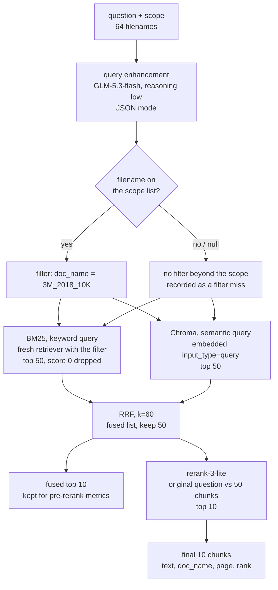
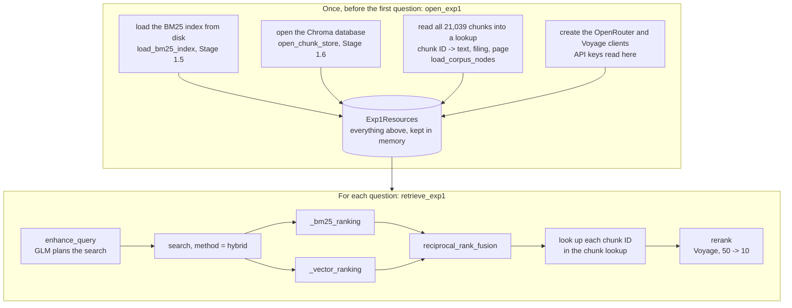
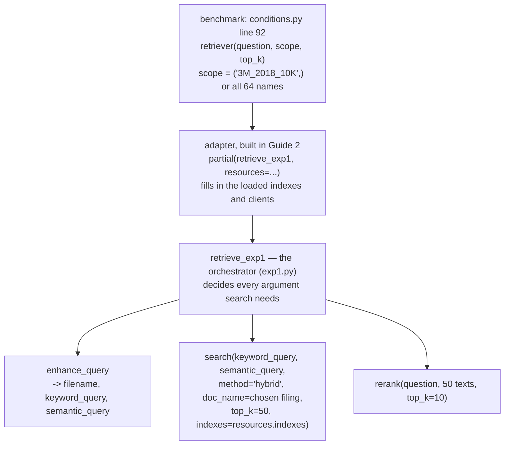

# Experiment 1 Implementation Guide — Stages 2.1 Query Enhancement, 2.2 Retrieval and 2.3 Rerank

> **For agentic workers:** REQUIRED SUB-SKILL: Use
> `superpowers:subagent-driven-development` or
> `superpowers:executing-plans` to implement one approved vertical slice at a
> time. Steps use checkbox (`- [ ]`) syntax for tracking.

**Goal:** given a FinanceBench question and the filings it may search, return
the 10 chunks the answer model will read. Along the way, keep what the metrics
need: the fused top 10 before reranking, the filing query enhancement chose,
and what each paid call cost.

**Architecture:** one GLM-5.3-flash call (reasoning `low`) turns the question
into a filename, a keyword query and a semantic query. BM25 and Chroma each
search the chosen filing, returning 50 chunks each. Our own reciprocal rank
fusion (RRF) merges the two lists. Voyage's `rerank-3-lite` reorders the fused
50 against the original question and keeps the top 10.

**Tech Stack:** already installed, nothing new —
`llama-index-retrievers-bm25==0.8.0` (BM25, via the Stage 1.5 index),
`llama-index-vector-stores-chroma==0.6.0` + `chromadb==1.5.9` (vector search,
via the Stage 1.6 store), `voyageai==0.5.0` (query embedding and reranking),
`openai` (the OpenRouter call, as the benchmark already uses).

**Requirements:** `docs sys design/Build Order.md` → 2.1, 2.2, 2.3;
`docs sys design/Systems Design Draft.md` → Retrieve (the DECIDED 27 Sep 2026
bullets) and Tech stack; `docs sys design/Exp 1/Exp 1.md` → Retrieval.

## Global constraints

- Build only what the Exp1 run needs: this and Guide 2 "Run" are due today.
- ONE retrieval function (query, method, filter, top_k, structure weight = 0)
  and ONE query-enhancement prompt, reused by Exp2 and Exp3.
- Settings in `configs/sec_rag.toml`; no new dependencies.
- Paid calls (OpenRouter, Voyage embed, Voyage rerank) need `--execute-paid`;
  keys are read lazily; tests use fakes.

---

## Gate 1 — Architecture and libraries

*Status: approved 27 Sep 2026.*

### What this stage does, in plain terms

The benchmark hands us two things: the question, and the list of filings it
is allowed to search (the **scope**). Single-store's scope is the question's
own filing; shared-store's is all 64. We hand back the 10 chunks the answer
model will read.

Four steps sit in between:

1. **Ask GLM to plan the search.** It sees the question and the filenames in
   scope, and replies with three things: which filing to search, a keyword
   query, and a full-sentence semantic query. The prompt tells it to write
   the keyword query with financial shorthand expanded alongside the
   original — PP&E / PPNE → property, plant and equipment; COGS → cost of
   goods sold; DPO → days payable outstanding; FCF → free cash flow; capex →
   capital expenditure, purchases of property, plant and equipment — because
   BM25 matches only the words a filing actually uses.
2. **Search twice.** BM25 matches the keyword query's words; Chroma matches
   the semantic query's meaning. Both look only inside the chosen filing, and
   each returns its best 50 chunks.
3. **Merge the two lists** with RRF, which uses each chunk's position in each
   list, not its score.
4. **Rerank.** Voyage's reranker reads the question and each of the fused 50
   chunks together, scores how well each chunk answers it, and we keep the
   best 10.

### The golden path, with one real question

Question (FinanceBench, 3M 2018): *"What is the FY2018 capital expenditure
amount (in USD millions) for 3M? Give a response to the question by relying on
the details shown in the cash flow statement."* Condition: shared-store, so
the scope is all 64 filings.



What each step would produce for that question:

| Step | Output |
|---|---|
| Query enhancement | `{"filename": "3M_2018_10K", "keyword_query": "3M 2018 capital expenditure purchases of property plant and equipment PP&E cash flow statement", "semantic_query": "How much did 3M spend on purchases of property, plant and equipment in fiscal year 2018, according to its cash flow statement?"}` |
| Filter | `doc_name == "3M_2018_10K"` — 341 chunks searchable instead of 21,039 |
| BM25 | 50 chunk IDs in score order, e.g. `3M_2018_10K:p59:c1` (the cash-flow table) somewhere in the list |
| Chroma | 50 chunk IDs in cosine order |
| RRF | one list of up to 100 IDs (usually fewer — chunks both searches found appear once), cut to 50 |
| Rerank | 10 chunk IDs, each with a relevance score; the gold page (p59) should be among them |

The table's outputs are illustrative, not results: nothing has run yet.

### Components

| Component | Call | Why, and where to read it |
|---|---|---|
| Query enhancement | our own OpenRouter call in `sec_rag`: `responses.create(..., reasoning={"effort": "low"}, text={"format": {"type": "json_object"}})`, provider pinned to `z-ai` | JSON mode, not a strict schema: Z.AI doesn't support `structured_outputs` (OpenRouter endpoint list, checked 27 Sep). Our code checks the three fields. Its own call, not the benchmark's `generate()`, so the system never imports the benchmark. Read: <https://openrouter.ai/docs/features/structured-outputs> |
| BM25 | `BM25Retriever(existing_bm25=..., filters=..., similarity_top_k=50)`, made fresh per search from the Stage 1.5 index | Filter read only at creation (finding 5); score-0 results dropped (finding 3). Read: `docs/libraries/llamaindex/bm25_retriever.md` |
| Query embedding | `voyageai.Client.embed(..., input_type="query")` | Pairs with the chunks' `document` embeddings. Read: `docs/libraries/voyage/embeddings.md` |
| Vector search | `ChromaVectorStore.query(VectorStoreQuery(..., similarity_top_k=50, filters=...))` on the Stage 1.6 store | Filters before searching; its score isn't the cosine, but RRF uses only order. Read: `docs/libraries/llamaindex/vector_stores.md` |
| RRF | ours, ~10 lines | `QueryFusionRetriever` sends one query to every retriever (`fusion_retriever.py` lines 270-271) and fixes k=60 (line 122). Read: `docs/libraries/llamaindex/rrf_fusion.md` |
| Rerank | `voyageai.Client.rerank(question, texts, model="rerank-3-lite", top_k=10, truncation=False)` | 32,000-token context, ≤ 1,000 documents; our 50 fit. Error, not silent cut, if oversized. Read: `docs/libraries/voyage/reranker.md` lines 190-215 |
| Chunk text | chunk ID → record, loaded once from `chunks/*.jsonl` | BM25's copy has HTML stripped; the reranker and GLM need the tables intact. |

### Edge cases

- **No valid filename** (`null`, or not on the list): search the whole scope;
  `filter_status = "fallback"`.
- **Reply not JSON, or missing a field:** as above, and both queries become
  the raw question; `enhancement_status = "invalid_reply"` (Benchmark.md →
  failure diagnosis splits wrong-document failures on this).
- **BM25 finds nothing:** RRF uses Chroma's list alone. Every filing has
  ≥ 147 chunks, so Chroma always fills 50.
- **A paid call fails after retries:** the question is recorded as `error`
  and a rerun resumes it.

### Rejected

- `QueryFusionRetriever`: one query for all retrievers, fixed k.
- LlamaIndex's Voyage rerank package: a new dependency for one call.
- Strict JSON schema: needs unpinning the provider, so queries could run on a
  different host from the answer model.

### Scope

Builds: query enhancement, the retrieval function, RRF, rerank, Exp1
retrieval for one question, and a spot-check command, `sec-rag retrieve`
(BM25-only without `--execute-paid`; full path, printing GLM's plan, fused
and reranked top 10 and cost, with it).

Deferred: benchmark wiring, metrics and runs (Guide 2); the structure
weight's behaviour (Exp2); retries (Exp3); filters wider than one filing.

### Traceability

| Build Order | Lands in |
|---|---|
| 2.1 one JSON call, closed filename list, one shared prompt | query enhancement |
| 2.1 filter first, fallback if no match | retrieval function |
| 2.2 one function with arguments, Exp2 hook | retrieval function |
| 2.2 RRF k=60 over top 50s; no auto-merge | RRF |
| 2.3 `rerank-3-lite`, 50 → 10, original question | rerank |
| 2.5 pre-rerank top 10, chosen filename, costs | returned with the final 10 |

## Gate 2 — Files, data and interfaces

*Status: approved 28 Sep 2026.*

### Files

| File | Responsibility |
|---|---|
| Create `src/sec_rag/retrieval/__init__.py` | package docstring |
| Create `src/sec_rag/retrieval/exp1.py` | **read first.** `retrieve_exp1` — the whole Exp1 path for one question; `open_exp1` loads everything it needs |
| Create `src/sec_rag/retrieval/query_enhancement.py` | the ONE prompt and the OpenRouter call that returns a search plan |
| Create `src/sec_rag/retrieval/search.py` | the ONE retrieval function, BM25 and Chroma rankings, RRF |
| Create `src/sec_rag/retrieval/rerank.py` | the Voyage rerank call |
| Modify `src/sec_rag/config.py`, `configs/sec_rag.toml` | three new sections (below) |
| Modify `src/sec_rag/cli.py` | `retrieve` spot-check command |
| Tests | `test_exp1.py`, `test_query_enhancement.py`, `test_search.py`, `test_rerank.py`; additions to `test_sec_rag_config.py`, `test_sec_rag_cli.py` |

Why these splits: query enhancement, search and rerank are each reused on
their own later (Exp3's tools call the first two; Exp2 changes only search).
`exp1.py` is the one place that wires them in Exp1's fixed order.

### How the modules call each other



`open_exp1` loads everything once, so the 112 questions don't each reload an
83 MB index. The chunk lookup exists because both searches return only chunk
IDs, and BM25's stored text has its HTML stripped: the lookup gives back each
chunk's original text, filing and page. The paid clients are created here, so
only paid commands call `open_exp1`. The spot-check command calls
`open_exp1` then `retrieve_exp1`; Guide 2 does the same from the benchmark's
retriever slot.

### How this plugs into the benchmark

The benchmark never calls `search` directly. Three layers, top to bottom:



- `retrieve_exp1(question, scope, top_k, resources)` matches the slot's
  three arguments; `resources` is bound once by the adapter.
- `search`'s extra arguments come from inside `retrieve_exp1`: the two queries
  from `enhance_query`, `method="hybrid"` fixed for Exp1, `doc_name` from
  the filter rule, `top_k=50` from `[retrieval] rerank_candidates`,
  `indexes` from `resources`. Exp3 will call `search` with its own choices,
  and the ablations with other `method` values — which is why `search` takes
  them as arguments rather than deciding them.
- The slot today expects a list of chunks back; `retrieve_exp1` returns the
  bundle. Guide 2's minimal 2.0 change makes the slot accept the bundle, use
  `bundle["chunks"]` where it uses the list now, and save the rest for the
  metrics.

### Configuration (`configs/sec_rag.toml`)

```toml
[query_enhancement]
model = "z-ai/glm-5.3-flash"
base_url = "https://openrouter.ai/api/v1"
upstream_provider = "z-ai"        # same host as the answer model; no fallbacks
reasoning_effort = "low"
temperature = 0.0
max_output_tokens = 4096          # reasoning tokens count as output
timeout_seconds = 120.0
max_retries = 5
prompt_version = "exp1-query-enhancement-v1"

[retrieval]
candidates_per_search = 50        # BM25 and Chroma each return this many
rrf_k = 60
rerank_candidates = 50            # fused list length handed to the reranker

[rerank]
model = "rerank-3-lite"
```

The final 10 is not here: it is the benchmark's `retrieval_depth`, passed in
as `top_k`, so the chunks GLM sees and the depth metrics use can't disagree.

### Four words used below

- **Scope** — the list of filings a question is allowed to search, decided by
  the benchmark condition, not by us. Single-store: just the question's own
  filing, e.g. `("3M_2018_10K",)`. Shared-store: all 64 filenames. It is the
  outer boundary; query enhancement can only narrow within it.
- **Search plan** — what query enhancement hands back: GLM's three decisions
  (which filing, the keyword query, the semantic query), plus whether its
  reply was usable and what the call cost. "Plan" because it decides how the
  search will run before any search happens.
- **Bundle** — the one dictionary `retrieve_exp1` returns per question:
  the final 10 chunks, plus everything the metrics need (pre-rerank 10,
  search plan, filter applied, token counts). Shown in full below.
- **Chunk lookup** — a dictionary from chunk ID to that chunk's record
  (original text, filing, page), built once from the chunk files.

### Records, following the 3M question

**Search plan** (from `enhance_query`):

```python
{
    "filename": "3M_2018_10K",
    "keyword_query": "3M 2018 capex capital expenditure purchases of property plant and equipment PP&E cash flow statement",
    "semantic_query": "How much did 3M spend on purchases of property, plant and equipment in fiscal year 2018, according to its cash flow statement?",
    "enhancement_status": "ok",  # or "invalid_reply"
    "call": {
        "requested_model": "z-ai/glm-5.3-flash",
        "returned_model": "...",
        "usage": {...},
        "cost": 0.0004,
        "latency_seconds": 3.1,
        "reply_text": '{"filename": "3M_2018_10K", "keyword_query": ...}',
    },
}
```

**Chunk**, in the shape the benchmark already reads (`conditions.py`,
`page_metrics`):

```python
{
    "chunk_id": "3M_2018_10K:p59:c1",
    "doc_name": "3M_2018_10K",
    "pages": [59],
    "rank": 1,
    "score": 0.91,
    "text": "<original chunk text, HTML kept>",
}
```

**Bundle** (from `retrieve_exp1`):

```python
{
    "chunks": [...10 chunks...],             # reranked; score = relevance
    "pre_rerank_chunks": [...10 chunks...],  # fused top 10; score = RRF sum
    "search_plan": {...as above...},
    "filter_doc_name": "3M_2018_10K",        # the filter actually applied, or None
    "filter_status": "chosen",               # or "fallback"
    "usage": {"embedding_tokens": 31, "rerank_tokens": 48210},
    "latency_seconds": 5.4,
}
```

Filter accuracy (Guide 2) is `filter_doc_name == gold doc_name`;
query-enhancement cost is `search_plan.call.cost`; Voyage costs are the two
token counts × price.

### Interfaces, main function first

**`exp1.py`**

```python
@dataclass
class Exp1Resources:
    """Everything loaded once by open_exp1 and reused for every question."""
    indexes: SearchIndexes      # the two searchable indexes (search.py, below)
    chunks: dict[str, dict]     # the chunk lookup
    openrouter: OpenAI          # client for the query-enhancement call
    voyage: voyageai.Client     # client for reranking (search uses the same one to embed)
    config: dict                # the loaded configs/sec_rag.toml

def open_exp1(config: dict) -> Exp1Resources
```

A dataclass is a plain container with named fields — here, the five things
every question needs. `open_exp1` fills it: loads BM25, opens Chroma, builds
the chunk lookup, creates the two clients (reading `OPENROUTER_API_KEY` and
`VOYAGE_API_KEY`).

```python
def retrieve_exp1(question: str, scope: tuple[str, ...], top_k: int,
                  resources: Exp1Resources) -> dict   # the bundle
```

Steps: `enhance_query` → choose the filter → `search(method="hybrid",
top_k=50)` → look up each chunk ID → keep the first 10 as pre-rerank →
`rerank` the 50 → top `top_k` (10). Filter rule: a valid filename → that
filing; otherwise a one-filing scope → that filing; otherwise a scope of
every filing → no filter; any other scope raises `ValueError` (FinanceBench
never produces one).

**`query_enhancement.py`**

```python
def enhance_query(question: str, filenames: list[str], config: dict,
                  openrouter: OpenAI) -> dict   # the search plan
```

It needs three steps, so three helpers, each with one job:

- `build_enhancement_messages(question, filenames)` — writes the prompt
  (below) with this question and filename list filled in. Separate so tests
  can check the prompt without any API call, and so Exp3 reuses the exact
  prompt.
- the OpenRouter call itself, inside `enhance_query`.
- `_read_plan(reply_text, question, filenames)` — turns GLM's reply into the
  search plan: parses the JSON, checks the three fields, drops a filename
  that isn't on the list, and on a bad reply falls back to the raw question
  with `"invalid_reply"`. Separate because it's where every edge case lives,
  and tests feed it bad replies directly.
- `openrouter_client(config)` — creates the client from the config and
  `OPENROUTER_API_KEY`; called by `open_exp1`.

**`search.py`** — the ONE retrieval function

```python
@dataclass
class SearchIndexes:
    """The two searchable indexes, loaded once, plus what searching them needs."""
    bm25: bm25s.BM25                  # the Stage 1.5 keyword index
    store: ChromaVectorStore          # the Stage 1.6 vector store
    voyage: voyageai.Client | None    # to embed the semantic query; None = BM25 only
    config: dict                      # word-splitting settings, embedding model, 50, k=60

def search(keyword_query: str, semantic_query: str, *, method: str,
           doc_name: str | None, top_k: int, indexes: SearchIndexes,
           structure_weight: float = 0.0) -> dict
```

- `indexes` — which indexes to search. Passed in rather than loaded inside,
  so loading happens once, and tests can pass tiny indexes built in a temp
  folder.
- `method` — `"bm25"`, `"semantic"` or `"hybrid"`. The first two return that
  one ranking; hybrid fuses both. The ablations and Exp3's agent choose this.
- `doc_name` — the filter: one filing, or `None` for none.
- `top_k` — how many to return (Exp1: 50, for the reranker).
- `structure_weight` — Exp2's hook. Exp2 adds a second score to each chunk's
  semantic score, "how well the question matches this chunk's section
  headings", multiplied by this weight. At 0 the term vanishes and search is
  exactly Exp1, which is how Exp2 checks it hasn't broken Exp1. Built in
  Stage 3.3; until then anything but 0 raises `NotImplementedError`.
- Returns `{"ranked": [(chunk_id, score), ...], "embedding_tokens": int}`.

Two keyword and semantic queries rather than one: hybrid sends different
text to each. Exp3's agent passes the same string twice if it writes one.

Helpers, in call order: `_bm25_ranking(indexes, keyword_query, doc_name)`
and `_vector_ranking(indexes, semantic_query, doc_name)` each return up to 50
`(chunk_id, score)` pairs; `reciprocal_rank_fusion(rankings, k)` merges them.

**`rerank.py`**

```python
def rerank(question: str, texts: list[str], top_n: int, config: dict,
           voyage: voyageai.Client) -> tuple[list[tuple[int, float]], int]
```

Returns `[(position in texts, relevance score), ...]` best first, and the
tokens billed. `retrieve_exp1` maps positions back to chunks.

**Tests pass fake clients:** small classes with the same method as the real
one (`responses.create`, `embed`, `rerank`) that return canned replies and
record what they were sent. No network, no keys.

### The query-enhancement prompt (a contract, so exact)

System: `You plan searches over SEC 10-K filings. Reply with one JSON object and nothing else.`

User:

```text
Choose the filing that answers the question, and write two search queries.

Filings you can search:
{one filename per line}

Reply with this JSON object:
{"filename": one filename from the list, exactly as written, or null if none clearly fits,
 "keyword_query": keywords for a keyword (BM25) search,
 "semantic_query": one full sentence for a meaning-based search}

keyword_query: keep the question's company, years and financial terms, and add the wording a 10-K would use for any shorthand, keeping the shorthand too. For example:
- PP&E or PPNE -> property, plant and equipment
- COGS -> cost of goods sold
- DPO -> days payable outstanding
- FCF -> free cash flow
- capex -> capital expenditure, purchases of property, plant and equipment
- FY2018 -> fiscal year 2018

semantic_query: restate the question as one plain sentence, with shorthand written out.

<question>
{question}
</question>
```

### Nothing persisted

This stage writes no files. The benchmark saves the bundle on each
prediction row (Guide 2).

## Gate 3 — Slices and tests

*Status: approved 28 Sep 2026 (Gate 2 likewise).*

Three slices, each committed on its own. Slices 1 and 2 are independent;
slice 3 wires them together. Tests build tiny real indexes in a temp folder
with the existing `index_config` fixture (`tests/conftest.py`): BM25 via
`build_bm25_index`, Chroma via `embed_corpus` with the existing
`FakeEmbedder`. Every paid client is a fake.

### What to read, and in what order

**Before implementation** (this guide): "What this stage does" → the 3M
golden path → "Four words used below" → "Records" → "Interfaces" → then each
slice below, in order. Each slice's pseudocode covers only that slice's
files; each slice ends with its own "after implementation" reading list.

**After all three slices**, the code reads top-down from the entry point:
`exp1.py` (Slice 3) → `query_enhancement.py`, `search.py`, `rerank.py`
(Slices 1-2) → `cli.py` (Slice 3).

### Slice 1: search — the ONE retrieval function (no paid calls)

**Files:** create `retrieval/__init__.py`, `retrieval/search.py`,
`tests/test_search.py`; modify `config.py`, `configs/sec_rag.toml` (add
`[retrieval]`), `tests/test_sec_rag_config.py`.

**Reminder from Gate 2:** `search` is the ONE retrieval function. It
doesn't decide its own arguments: `retrieve_exp1` (Slice 3) decides them for
Exp1, and the ablations and Exp3 will pass others. It returns chunk IDs and
scores only; turning IDs into full chunks (text, filing, page) happens in
Slice 3 with the chunk lookup.

**The shape every ranking uses** — a list of `(chunk_id, score)` pairs,
**best first**, higher score = better match:

```python
[("3M_2018_10K:p59:c1", 12.4), ("3M_2018_10K:p58:c2", 9.7), ...]
```

`_bm25_ranking`, `_vector_ranking` and `reciprocal_rank_fusion` all return
this shape, so `search` can return any of them as `"ranked"`.

**The arguments, with their possible values:**

| Argument | Type | Values | Example |
|---|---|---|---|
| `keyword_query` | `str` | any text; BM25 uses it | `"3M 2018 capex capital expenditure purchases of property plant and equipment"` |
| `semantic_query` | `str` | any text; Chroma uses it | `"How much did 3M spend on property, plant and equipment in 2018?"` |
| `method` | `str` | exactly one of `"bm25"`, `"semantic"`, `"hybrid"` | `"hybrid"` (Exp1's main run always) |
| `doc_name` | `str` or `None` | a filing name, or `None` for no filter | `"3M_2018_10K"` |
| `top_k` | `int` | how many chunks to return | `50` |
| `indexes` | `SearchIndexes` | the container from `open_search_indexes` | — |
| `structure_weight` | `float` | must be `0.0` until Exp2 | `0.0` |

Which searches run for each `method`:

| `method` | BM25 runs? | Chroma runs? | Merged with RRF? |
|---|---|---|---|
| `"bm25"` | yes | no | no — BM25's list is returned |
| `"semantic"` | no | yes | no — Chroma's list is returned |
| `"hybrid"` | yes | yes | yes |

**Example call and what comes back:**

```python
result = search(
    "3M 2018 capex capital expenditure purchases of property plant and equipment",
    "How much did 3M spend on property, plant and equipment in 2018?",
    method="hybrid",
    doc_name="3M_2018_10K",
    top_k=50,
    indexes=indexes,
)
# result == {
#     "ranked": [("3M_2018_10K:p59:c1", 0.0325), ("3M_2018_10K:p58:c2", 0.0318), ...],  # up to 50
#     "embedding_tokens": 17,    # what Voyage billed to embed the semantic query
# }
```

Each item in `ranked` is a pair `(chunk_id, score)`, best first. With
`"hybrid"` the score is the RRF sum; with `"bm25"` it is BM25's score; with
`"semantic"` it is Chroma's.

**Pseudocode:**

```python
def search(
    keyword_query: str,
    semantic_query: str,
    *,
    method: str,
    doc_name: str | None,
    top_k: int,
    indexes: SearchIndexes,
    structure_weight: float = 0.0,
) -> dict:
    """Rank chunks for one query pair; Build Order 2.2's ONE function."""
    if structure_weight != 0.0:
        raise NotImplementedError("structure weight is Exp2 (Build Order 3.3)")
    if method not in ("bm25", "semantic", "hybrid"):
        raise ValueError(f"unknown method: {method}")

    embedding_tokens = 0
    rankings: list[list[tuple[str, float]]] = []  # one list per search that ran

    # BM25 runs for "bm25" and "hybrid".
    if method in ("bm25", "hybrid"):
        rankings.append(_bm25_ranking(indexes, keyword_query, doc_name))

    # Chroma runs for "semantic" and "hybrid".
    if method in ("semantic", "hybrid"):
        vector_ranking, embedding_tokens = _vector_ranking(
            indexes, semantic_query, doc_name
        )
        rankings.append(vector_ranking)

    # Only "hybrid" has two lists to merge; otherwise return the one list.
    if method == "hybrid":
        id_lists = [[chunk_id for chunk_id, _score in ranking] for ranking in rankings]
        ranked = reciprocal_rank_fusion(
            id_lists, k=indexes.config["retrieval"]["rrf_k"]
        )
    else:
        ranked = rankings[0]
    return {"ranked": ranked[:top_k], "embedding_tokens": embedding_tokens}


def _bm25_ranking(
    indexes: SearchIndexes, query: str, doc_name: str | None
) -> list[tuple[str, float]]:
    """BM25's best 50 chunks for the keyword query, inside the filter.

    Returns [(chunk_id, bm25_score), ...], best first, at most 50, every
    score > 0. Example: [("3M_2018_10K:p59:c1", 12.4), ("3M_2018_10K:p58:c2", 9.7)].
    Sorted because bm25s's retrieve defaults to sorted=True (bm25s/__init__.py
    line 681) and the wrapper keeps that order; test_search.py pins it.
    """
    filters = _doc_filter(doc_name)  # MetadataFilters for doc_name, or None
    # Step 1 — build a retriever for THIS filter. Stage 1.5 finding 5: the
    # retriever reads its filter only when created, so make one per search
    # from the already-loaded index (~0.01 s). No query yet.
    retriever = BM25Retriever(
        existing_bm25=indexes.bm25,
        filters=filters,
        similarity_top_k=50,
        token_pattern=...,
        stemmer=...,
    )
    # Step 2 — search: THIS is where the keyword query is used.
    # retriever.retrieve(query) splits it into words, scores every chunk, and
    # returns NodeWithScore objects best first (.node.node_id is the chunk ID,
    # .score the BM25 score).
    results = retriever.retrieve(query)
    ranking = []
    for result in results:
        # A filtered search still returns 50, padding with score-0 chunks
        # from outside the filter (the filter is a weight mask, bm25/base.py
        # lines 128-146), and finding 3's zero padding too. Keep only real
        # matches.
        if result.score > 0:
            ranking.append((result.node.node_id, result.score))
    return ranking


def _vector_ranking(
    indexes: SearchIndexes, query: str, doc_name: str | None
) -> tuple[list[tuple[str, float]], int]:
    """Chroma's 50 nearest chunks to the semantic query, inside the filter.

    Returns two things:
    - [(chunk_id, similarity), ...], best first, exactly 50 (every filing
      has ≥ 147 chunks). Example: [("3M_2018_10K:p59:c1", 0.76), ...].
      Sorted because Chroma returns nearest first and ChromaVectorStore.query
      keeps that order (chroma/base.py lines 445-480); test_search.py pins it.
      The similarity is exp(-distance), not the cosine — fine, since only the
      order is used (Draft → Tech stack → Chroma).
    - embedding_tokens: how many tokens Voyage counted in the semantic query,
      e.g. 17. Voyage bills per token, so this is the embedding cost of the
      question (free within the 200M allowance, but Build Order 2.5 records
      it). BM25 costs nothing, so it has no such number.
    """
    # Step 1 — turn the semantic query into a vector (one paid Voyage call).
    # input_type="query" pairs with the chunks' "document" embeddings
    # (docs/libraries/voyage/embeddings.md).
    embedded = indexes.voyage.embed(
        [query],
        model="voyage-4-lite",
        input_type="query",
        truncation=False,
        output_dimension=1024,
        output_dtype="float",
    )
    # Step 2 — ask Chroma for the 50 nearest chunk vectors, inside the filter.
    found = indexes.store.query(
        VectorStoreQuery(
            query_embedding=embedded.embeddings[0],
            similarity_top_k=50,
            filters=_doc_filter(doc_name),
        )
    )
    ranking = list(zip(found.ids, found.similarities))
    return ranking, embedded.total_tokens


def _doc_filter(doc_name: str | None) -> MetadataFilters | None:
    """The "only this filing" filter, in the one format both searches accept.

    _doc_filter("3M_2018_10K") -> MetadataFilters(filters=[
        MetadataFilter(key="doc_name", operator=FilterOperator.EQ, value="3M_2018_10K")])
    _doc_filter(None) -> None, meaning no filter: search every chunk.

    Every chunk carries doc_name in its metadata (Stage 1.5 nodes.py), so
    this keeps only chunks whose doc_name equals the chosen filing. The same
    object goes to both searches, which apply it differently:
    - BM25Retriever turns it into a 0/1 mask over all 21,039 chunks and
      scores only the 1s (bm25/base.py lines 128-146);
    - ChromaVectorStore translates it into Chroma's own where-clause,
      {"doc_name": {"$eq": "3M_2018_10K"}} (chroma/base.py, _to_chroma_filter
      line 64 and the "==" -> "$eq" mapping at line 47).
    Read: docs/libraries/llamaindex/metadata_filtering.md lines 140-190.
    """
    if doc_name is None:
        return None
    return MetadataFilters(
        filters=[
            MetadataFilter(key="doc_name", operator=FilterOperator.EQ, value=doc_name)
        ]
    )


def reciprocal_rank_fusion(
    rankings: list[list[str]], k: int
) -> list[tuple[str, float]]:
    """Merge ranked ID lists: each chunk scores the sum of 1/(k + rank) over lists.

    Takes IDs only (best first), because RRF uses positions, not scores.
    Returns [(chunk_id, rrf_score), ...], best first — sorted by the last
    line. Example with k=60: a chunk 1st in BM25 and 5th in Chroma scores
    1/61 + 1/65 = 0.0318.
    """
    scores: dict[str, float] = {}
    for ranking in rankings:
        for rank, chunk_id in enumerate(ranking, start=1):
            scores[chunk_id] = scores.get(chunk_id, 0.0) + 1.0 / (k + rank)
    # Best first; ties broken by chunk ID so the order never depends on luck.
    return sorted(scores.items(), key=lambda item: (-item[1], item[0]))
```

`open_search_indexes(config, voyage)` also lives here and fills
`SearchIndexes`: `bm25s.BM25.load` (as `load_bm25_index` does) plus
`open_chunk_store`.

**Read after implementation:** `search.py` — `search`, then
`_bm25_ranking`, `_vector_ranking`, `_doc_filter`, `reciprocal_rank_fusion`,
`open_search_indexes`; then `tests/test_search.py` in the same order.

**Tests** (`test_search.py`, two tiny filings `AAA_2020_10K`, `BBB_2020_10K`):
- RRF: the worked example from the Draft (ranks 1+5 → 0.0318 beats rank 2
  alone → 0.0161); ties ordered by chunk ID.
- BM25 with `doc_name="AAA_2020_10K"` returns only AAA chunks, and no score-0
  chunk even when the query matches one chunk.
- BM25 and semantic rankings each come back best first (scores never rise
  down the list), pinning the two library behaviours the code relies on.
- semantic with a fake Voyage client: sends `input_type="query"`, returns
  only filtered chunks, reports the fake's tokens.
- hybrid returns the fused order; `top_k` cuts it.
- `structure_weight=0.5` raises `NotImplementedError`; `method="x"` raises
  `ValueError`.
- config: `[retrieval]` values must be positive whole numbers.

**As built (28 Sep 2026):** as planned, in `src/sec_rag/retrieval/search.py`
(`search`, `_bm25_ranking`, `_vector_ranking`, `_doc_filter`,
`reciprocal_rank_fusion`, `open_search_indexes`, `SearchIndexes`). Plan/code
differences:
- the 50s come from `[retrieval] candidates_per_search`, and model, length
  and dtype from `[embedding]`, rather than written in code;
- `_vector_ranking` refuses a `SearchIndexes` with no Voyage client, so the
  free spot check (opened with `voyage=None`) can only run BM25 — pinned by
  `test_semantic_without_a_voyage_client_is_refused`.

Tests: 10 in `tests/test_search.py`, plus 5 config tests. All passed first
run; full suite 224 passed.

Free check on the real index (3M capex keyword query, BM25 only): opening
takes 0.2 s, a filtered search 0.02 s. Filtered to `3M_2018_10K`, all 50
results are 3M 2018 and the gold cash-flow table `p59:c1` ranks **14th** —
outside a top 10, inside the 50 the reranker sees, which is what shape A is
for. Unfiltered, it is not in the top 50 (Coca-Cola chunks rank first).

**Commit:** `Add hybrid search with reciprocal rank fusion`

### Slice 2: query enhancement and rerank (paid clients, faked in tests)

**Files:** create `retrieval/query_enhancement.py`, `retrieval/rerank.py`,
their tests; modify `config.py`, `configs/sec_rag.toml` (add
`[query_enhancement]`, `[rerank]`), `test_sec_rag_config.py`.

```python
def enhance_query(question: str, filenames: list[str], config: dict,
                  openrouter: OpenAI) -> dict:
    """Ask GLM for the search plan: filing, keyword query, semantic query.

    Returns the search plan (Gate 2 → Records), including a "call" record
    of what the GLM call cost and how long it took on its own.
    """
    settings = config["query_enhancement"]

    # Time the GLM call alone. retrieve_exp1 (Slice 3) separately times the
    # whole retrieval, so a report can say "5.4 s total, 3.1 s of it query
    # enhancement" — the same per-call timing generation.py does for answers.
    started = time.perf_counter()
    response = openrouter.responses.create(
        model=settings["model"],
        input=build_enhancement_messages(question, filenames),
        temperature=settings["temperature"],
        max_output_tokens=settings["max_output_tokens"],
        reasoning={"effort": settings["reasoning_effort"]},   # "low"
        text={"format": {"type": "json_object"}},   # JSON mode: Z.AI has no strict schema
        store=False,
        extra_body={"provider": {"order": [settings["upstream_provider"]],
                                 "allow_fallbacks": False}},
    )
    latency_seconds = time.perf_counter() - started   # timer stops here

    plan = _read_plan(response.output_text, question, filenames)
    usage = response.usage.model_dump() if response.usage else {}
    plan["call"] = {
        "requested_model": settings["model"],
        "returned_model": response.model,
        "usage": usage,                  # input, output and reasoning tokens
        "cost": usage.get("cost"),       # OpenRouter reports the charge in usage
        "latency_seconds": latency_seconds,
    }
    return plan

def _read_plan(reply_text, question, filenames):
    try: reply = json.loads(reply_text)
    except (json.JSONDecodeError, TypeError): return fallback
    if not a dict, or keyword_query / semantic_query not non-empty strings:
        return fallback  # filename None, both queries = question, "invalid_reply"
    filename = reply.get("filename")
    if filename not in filenames: filename = None   # null or not on the list
    return {"filename": filename, "keyword_query": ..., "semantic_query": ...,
            "enhancement_status": "ok"}

def rerank(question: str, texts: list[str], top_n: int, config: dict,
           voyage: voyageai.Client) -> tuple[list[tuple[int, float]], int]:
    """Reorder texts by how well each answers the question; keep the best top_n.

    Only defined here. It is CALLED in Slice 3, by retrieve_exp1, with the
    original question and the 50 fused chunks' texts.

    Returns ([(position in texts, relevance score), ...] best first, tokens billed).
    Example: ([(3, 0.91), (0, 0.84), ...], 48210) means texts[3] is the best
    match. Positions, not chunk IDs, because Voyage only sees the texts;
    retrieve_exp1 maps positions back to chunks.
    """
    result = voyage.rerank(question, texts, model=config["rerank"]["model"],
                           top_k=top_n, truncation=False)
    return [(r.index, r.relevance_score) for r in result.results], result.total_tokens
```

Where Slice 2's functions are called: `enhance_query` and `rerank` are both
called only by `retrieve_exp1` (Slice 3), which runs them in order —
`enhance_query` first, then `search` (Slice 1), then `rerank`. Slices 1 and 2
build the parts; Slice 3 connects them.

**Tests:**
- prompt contains every filename, the question, and the shorthand examples
  (PP&E, COGS, DPO, FCF, capex).
- `_read_plan`: valid reply → `"ok"`; filename not on list → `None` but
  `"ok"`; `null` → `None`; not JSON / missing field / empty string →
  `"invalid_reply"` with both queries = the question.
- `enhance_query` with a fake OpenRouter client: sends reasoning `low`, JSON
  mode, provider pin, `store=False`; returns the call's cost and usage.
- `rerank` with a fake Voyage client: sends the original question,
  `rerank-3-lite`, `top_k`, `truncation=False`; returns positions, scores,
  tokens.
- config: reasoning effort must be `low`/`high`/`max`; model strings non-empty.

**Read after implementation:** `query_enhancement.py` — `enhance_query`,
then `build_enhancement_messages`, `_read_plan`, `openrouter_client`;
`rerank.py` — `rerank`; then `tests/test_query_enhancement.py`,
`tests/test_rerank.py`.

**As built (28 Sep 2026):** `src/sec_rag/retrieval/query_enhancement.py`
(`enhance_query`, `build_enhancement_messages`, `_read_plan`,
`openrouter_client`; the prompt as `SYSTEM_PROMPT` and `USER_PROMPT`) and
`src/sec_rag/retrieval/rerank.py` (`rerank`); `[query_enhancement]` and
`[rerank]` in `configs/sec_rag.toml`, validated in `config.py`. Plan/code
differences:
- **prompt layout:** the shorthand examples are one per line. Wrapped as
  first drafted, "cost of goods sold" was split across a line break, which
  `test_prompt_asks_for_shorthand_to_be_expanded` caught. The guide's copy
  of the prompt is updated to match.
- **no `provider` in the call record:** the provider is pinned with no
  fallbacks, so it is always Z.AI.
- **`reply_text` added to the call record** (agreed 28 Sep 2026): GLM's
  exact reply, since `_read_plan` turns a made-up filename into `None` and a
  broken reply into the raw question. Failure diagnosis can then tell "said
  null" from "invented a filing" and see what a broken reply looked like.
- clients are typed `Any` so tests can pass fakes with the same methods.

Tests: 11 in `test_query_enhancement.py` (18 cases with parameters), 2 in
`test_rerank.py`, 3 more config tests (9 cases), including one that loads the
repository's own `configs/sec_rag.toml`. Full suite 250 passed.

**Commit:** `Add query enhancement and Voyage rerank calls`

### Slice 3: Exp1 retrieval for one question, plus `sec-rag retrieve`

**Files:** create `retrieval/exp1.py`, `tests/test_exp1.py`; modify
`cli.py`, `tests/test_sec_rag_cli.py`, `README.md` (the command).

```python
def retrieve_exp1(question, scope, top_k, resources):
    """Exp1's fixed path: plan, filter, hybrid search, rerank (Build Order 2.1-2.3)."""
    started = time.perf_counter()
    plan = enhance_query(question, list(scope), resources.config, resources.openrouter)
    filter_doc_name, filter_status = _choose_filter(plan["filename"], scope, resources.chunks)
    found = search(plan["keyword_query"], plan["semantic_query"], method="hybrid",
                   doc_name=filter_doc_name, top_k=config rerank_candidates (50),
                   indexes=resources.indexes)
    fused = _to_chunks(found["ranked"], resources.chunks)    # lookup: ID -> original text
    order, rerank_tokens = rerank(question, [c["text"] for c in fused], top_k,
                                  resources.config, resources.voyage)
    reranked = [fused[i] with score = s for i, s in order], ranks renumbered 1..
    return {"chunks": reranked, "pre_rerank_chunks": fused[:top_k], "search_plan": plan,
            "filter_doc_name": filter_doc_name, "filter_status": filter_status,
            "usage": {"embedding_tokens": found["embedding_tokens"],
                      "rerank_tokens": rerank_tokens},
            "latency_seconds": time.perf_counter() - started}

def _choose_filter(filename, scope, chunks):
    if filename is not None:          # _read_plan already checked it is in scope
        return filename, "chosen"
    if len(scope) == 1:
        return scope[0], "fallback"
    if set(scope) == {every doc_name in chunks}:
        return None, "fallback"
    raise ValueError("Exp1 filters to one filing or none")
```

`_choose_filter` decides which filing both searches look inside. By the time
it runs, `_read_plan` has already turned `null`, unlisted names and broken
replies into `None`.

| Case | Filter | Status | Why |
|---|---|---|---|
| GLM gave a valid filename | that filing | `"chosen"` | the normal path |
| `None`, one-filing scope (single-store) | the scope's filing | `"fallback"` | can't search wider than the benchmark allows |
| `None`, all-64 scope (shared-store) | `None` (no filter) | `"fallback"` | search everything rather than nothing (Draft's fallback rule) |
| any other scope | `ValueError` | — | FinanceBench never produces one |

`"chosen"` rows are scored for filter accuracy; `"fallback"` separates "GLM
declined or broke" from "GLM chose wrong" in failure diagnosis.

`sec-rag retrieve --config ... --question "..." (--scope DOC ... | --all-filings)
[--execute-paid]`: without the flag, prints the BM25-only ranking for the raw
question over the scope (no keys, no network); with it, `open_exp1` +
`retrieve_exp1`, printing the search plan, fused top 10, reranked top 10
(filing, page, score) and token counts.

**Tests:**
- `retrieve_exp1` with fake clients over the tiny indexes: returns 10 (or
  fewer) chunks in the benchmark's shape (`chunk_id`, `doc_name`, `pages`,
  `rank`, `score`, `text`), with original text (HTML kept, though BM25's copy
  had it stripped); `pre_rerank_chunks` is the fused order; the reranker was
  sent the original question.
- filter: valid filename → `"chosen"`; `null` in single-store → scope's
  filing, `"fallback"`; `null` in shared-store → `None`, `"fallback"`; a
  two-filing scope → `ValueError`.
- CLI: without `--execute-paid` no client is created and BM25 results print;
  `--scope` and `--all-filings` together are refused.

**Paid check (asks first; a few pence):** `sec-rag retrieve --execute-paid`
on three FinanceBench questions — 3M 2018 capex in shared-store, and two
others — confirming the chosen filing, that the gold page appears in the
reranked 10, and the per-question latency and cost.

**Read after implementation:** `exp1.py` — `retrieve_exp1` (the whole path,
calling Slices 1-2), then `_choose_filter`, `_to_chunks`, `open_exp1`;
`cli.py` — `_run_retrieve`; then `tests/test_exp1.py` and the new tests in
`tests/test_sec_rag_cli.py`.

**Commit:** `Add Exp1 retrieval pipeline and retrieve command`

**As built (28 Sep 2026).** `retrieval/exp1.py`, `tests/test_exp1.py`
(10 tests), four CLI tests; 265 tests pass. Differences from the plan:

- **four more public functions in `exp1.py`**, so the CLI only parses and
  delegates: `preview_bm25(question, scope, top_k, config)` (the free
  preview; its filter uses `_choose_filter`'s no-choice rule),
  `all_filings(config)` (the shared-store scope, for `--all-filings`;
  it lists the PDFs in the prepared folder at run time via
  `select_documents`, nothing hardcoded, so adding a filing, then parsing,
  chunking and indexing it, widens the scope with no code change; only
  `expected_documents` in `configs/sec_rag.toml`, the parse step's
  completeness check, would need bumping. Benchmark runs take their scope
  from the dataset via `conditions.py` instead),
  `load_chunk_lookup(config)` (the chunk lookup, built from
  `load_corpus_nodes` so every ID search returns is in it) and
  `voyage_client()` (reads `VOYAGE_API_KEY`, `max_retries=3` as in
  `embed.py`). The last two are what `open_exp1` calls.
- **`--top-k` flag** (default 10), so the preview and paid check can show
  more than the benchmark's depth.
- **free preview on the real indexes**, 3M 2018 capex question: about 2.5 s
  including loading. With `--scope 3M_2018_10K`, BM25's top 10 is all 3M
  but misses gold page 59 (it ranks 14th, finding from Slice 1). With
  `--all-filings`, the raw question's top 10 is mixed with Walmart and
  Boeing chunks, which is the case query enhancement's filter exists for.

**Read after implementation (as built):** `exp1.py` — `retrieve_exp1`,
`_choose_filter`, `_to_chunks`, then `preview_bm25`, `open_exp1`,
`load_chunk_lookup`; `cli.py` — `_run_retrieve`, `_print_chunks`; then
`tests/test_exp1.py` and the `retrieve` tests at the end of
`tests/test_sec_rag_cli.py`.

### Verification, every slice

`uv run ruff format --check . && uv run ruff check . && uv run mypy src &&
uv run pytest -q && uv lock --check && git diff --check`
