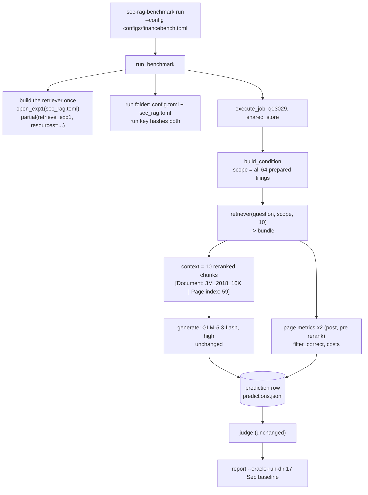
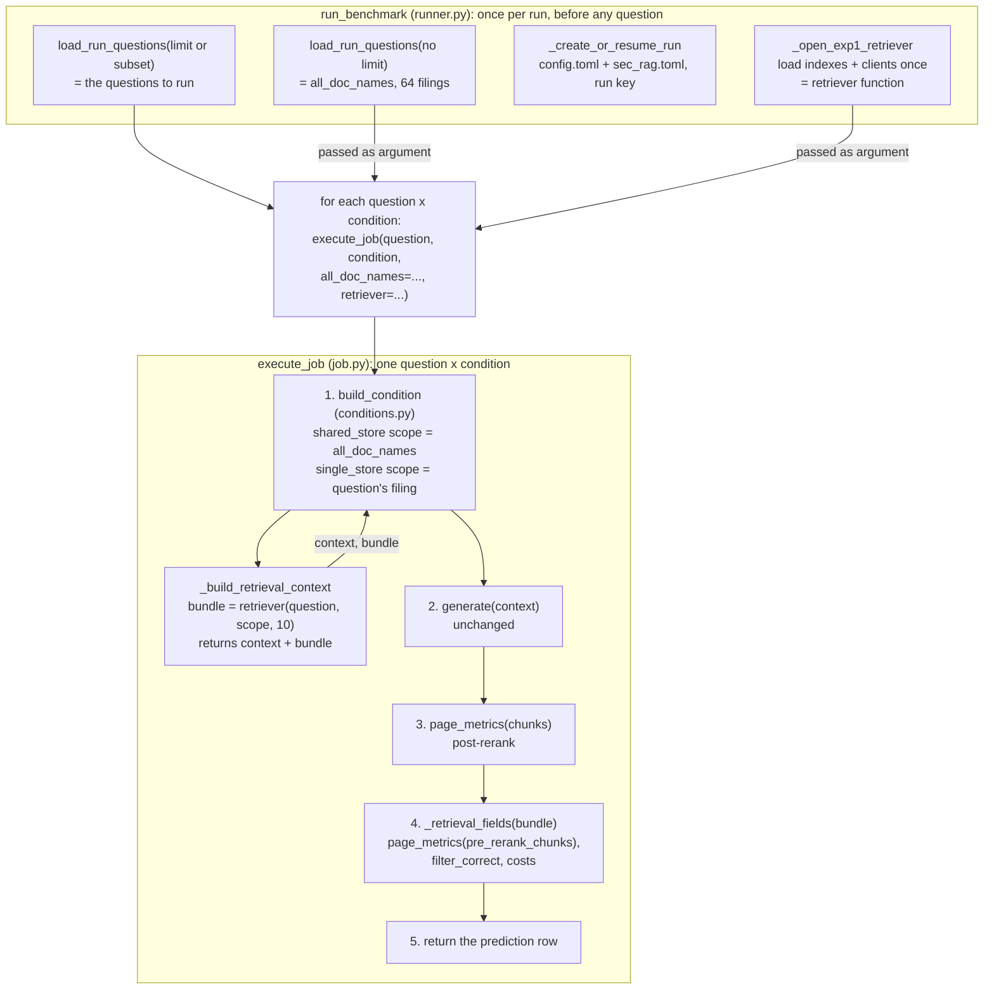
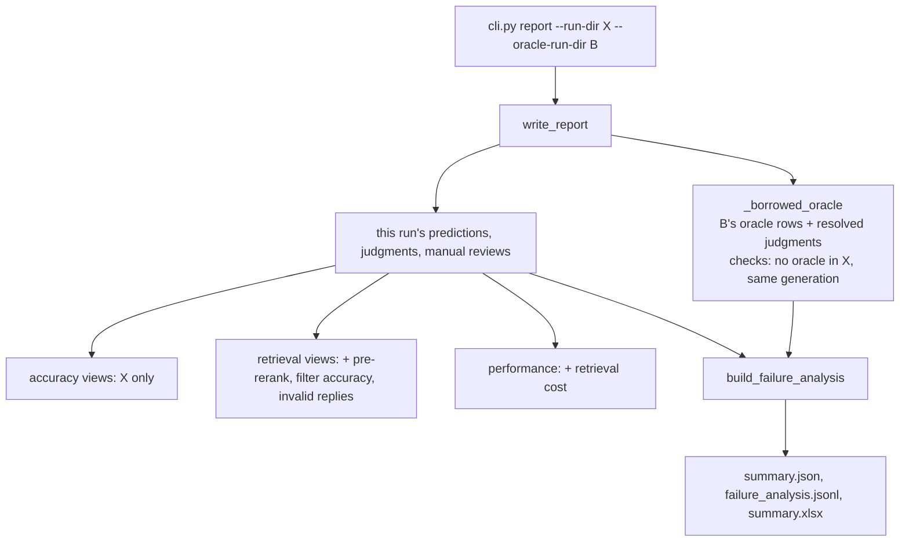

# Experiment 1 Implementation Guide — Stages 2.0 Plug, 2.4 Feed, 2.5 Metrics and 2.6 Run

> **For agentic workers:** REQUIRED SUB-SKILL: Use
> `superpowers:subagent-driven-development` or
> `superpowers:executing-plans` to implement one approved vertical slice at a
> time. Steps use checkbox (`- [ ]`) syntax for tracking.

**Goal:** run Exp1 through the FinanceBench benchmark on single-store and
shared-store, with every metric Build Order 2.5 asks for, then judge, report
and write the results into `Exp 1.md`.

**Architecture:** the benchmark's existing retriever slot
(`conditions.py`) now receives the bundle that `retrieve_exp1` already
returns. The benchmark keeps the reranked chunks as the model's context, saves
the rest of the bundle on the prediction row, and computes the new metrics from
it. Reporting gains the pre-rerank and filter columns, retrieval cost, the
wrong-document split, and a way to borrow the 17 Sep baseline's oracle answers.
No new model-facing behaviour: retrieval is Stage 2.1-2.3's, generation and
judging are the baseline's.

**Tech Stack:** nothing new. The benchmark imports `sec_rag.retrieval.exp1`
(already built); `functools.partial` from the standard library binds its
resources.

**Requirements:** `docs sys design/Build Order.md` → 2.0 (the DECIDED 28 Sep
minimal plug), 2.4, 2.5, 2.6; `docs sys design/Systems Design Draft.md` →
Retrieve (the HARNESS bullets) and Generate answer; `docs sys design/Benchmark.md`
→ reporting and failure diagnosis; `docs sys design/Exp 1/Exp 1.md` → Metrics,
Results.

## Global constraints

- Today (Mon 28 Sep) is the last coding day. Build only what the Exp1 run
  needs. Cutting anything further needs the user's approval.
- Invariants: same answer model, settings and prompt as the baseline run;
  ONE retrieval function and ONE query-enhancement prompt (untouched here);
  every run labelled with experiment and variant.
- Settings in config, not code; no new dependencies.
- `sec_rag` never imports `sec_rag_benchmark`; the benchmark may import
  `sec_rag`.
- Paid calls only in `run` without `--dry-run`, and `judge`; tests use fakes.
- Checkpoint after every job (the runner already does).

---

## Gate 1 — Architecture and libraries

*Status: approved 28 Sep 2026, with `variant = "full"`.*

### What this stage does, in plain terms

Stage 2.1-2.3 built a function that takes a question and the filings it may
search, and hands back the 10 chunks to read plus a record of how it chose
them (the **bundle**). Nothing has yet asked it a question inside the
benchmark. This stage connects the two, so a benchmark run can:

1. hand each question to `retrieve_exp1`, with the scope the condition
   allows: the question's own filing (single-store) or all 64 (shared-store);
2. show the model the reranked 10 chunks, labelled exactly as the oracle's
   pages are, and get an answer through the unchanged generator;
3. save on the prediction row what the metrics need: page metrics before and
   after reranking, which filing was used and whether it was right, and what
   retrieval cost;
4. judge and report as the baseline did, with the report now also showing the
   new columns and splitting "wrong document" failures by cause.

Then we run it: a 10-question smoke run, the full 112 questions in both
conditions, judge, report, and write the numbers into `Exp 1.md`.

### The golden path, with one real question

Question 03029 (3M 2018 capex), shared-store:



What the new parts of the saved row would hold for that question (values
illustrative, from the Stage 2.3 paid check):

| Field | Value |
|---|---|
| `retrieved_chunks` | the 10 reranked chunks; p59 at rank 1 |
| `page_recall` / `page_mrr` (post-rerank) | 1.0 / 1.0 |
| `pre_rerank_chunks` | the fused top 10; p59 at rank 5 |
| `pre_rerank_page_recall` / `pre_rerank_page_mrr` | 1.0 / 0.2 |
| `filter_doc_name`, `filter_status`, `enhancement_status` | `"3M_2018_10K"`, `"chosen"`, `"ok"` |
| `filter_correct` | `True` (shared-store only; `None` in single-store) |
| costs | query enhancement ≈ $0.0002; 31 embedding tokens, ≈ 30,000 rerank tokens, each × $0.02/1M |

### Components

| Component | Change | Why |
|---|---|---|
| `pipeline/conditions.py` | the retriever returns the bundle; context uses `bundle["chunks"]` with the oracle's `_page_block` label; the condition result carries the rest of the bundle | Build Order 2.0 minimal plug; 2.4 identical labels |
| `execution/runner.py` | builds the Exp1 retriever when a retrieval condition is selected; shared-store scope = all 64 prepared filings; snapshots `sec_rag.toml` into the run and its run key | decisions A, B, D |
| `execution/job.py` | second `page_metrics()` call on the pre-rerank chunks; `filter_correct`; retrieval fields and costs onto the row | Build Order 2.5 |
| `config.py` + `configs/financebench.toml` | `[run] sec_rag_config` path; Exp1 run labels and conditions | decision A; run labels |
| `sec_rag/retrieval/exp1.py` + `configs/sec_rag.toml` | the bundle's `usage` gains USD at Voyage's list price | decision G; prices are Voyage's, so they live with the Voyage settings |
| `reporting/report.py`, `workbook.py` | averages the pre-rerank metrics and `filter_correct`; counts invalid replies; retrieval cost; `--oracle-run-dir` | Build Order 2.5, decision C |
| `reporting/failure_analysis.py` | `wrong_document` split by cause | Benchmark.md → failure diagnosis |
| `cli.py` | `report --oracle-run-dir` | decision C |

**The `conditions.py` row, before and after.** Three changes inside
`_build_retrieval_context`:

1. The retriever now returns the bundle (a dictionary), not a list, so the
   chunks are read from it:

   ```python
   # before
   retrieved_chunks = retriever(question, scope, top_k)  # a list
   # after
   bundle = retriever(question, scope, top_k)  # a dict
   retrieved_chunks = bundle["chunks"]  # the 10 reranked chunks
   ```

2. Each chunk's header, the line the model reads above its text, is written
   by the same `_page_block` helper (`conditions.py` lines 38-39) that
   already labels oracle and long-context pages:

   ```text
   before:  [Chunk: 3M_2018_10K:p59:c1 | Document: 3M_2018_10K | Pages: 59 | Rank: 1]
   after:   [Document: 3M_2018_10K | Page index: 59]
   ```

   The Exp1-vs-oracle gap should then come from which text is supplied,
   not from how the prompt looks (Build Order 2.4). Chunk ID and rank stay
   on the saved row; they are just not shown to the model.

3. The rest of the bundle, which the model never sees but the metrics need,
   is passed on to `job.py` under a new `"retrieval"` key in the condition
   result (`None` for closed-book, oracle and long-context):

   ```python
   {"context": "...", "context_pages": [...], "retrieved_chunks": [...10 reranked...],
    "retrieval": {"pre_rerank_chunks": [...], "search_plan": {...},
                  "filter_doc_name": "3M_2018_10K", "filter_status": "chosen",
                  "usage": {...}, "latency_seconds": 4.7}}
   ```

No library is added. `retrieve_exp1` is called exactly as `sec-rag retrieve
--execute-paid` already calls it; the paid check proved that path.

### Decisions this guide rests on (approved 28 Sep, now in Build Order 2.0-2.6)

- **A. Where the retriever comes from.** `configs/financebench.toml` gains
  `[run] sec_rag_config = "configs/sec_rag.toml"`. `run_benchmark` builds the
  retriever from it only when single-store or shared-store is selected, so a
  baseline-condition run still needs no Voyage key. Tests pass a fake
  retriever, as they do today.
- **B. Shared-store scope.** Always all 64 prepared filings, even when
  `--subset` or `--limit` selects fewer questions. Taken from the `doc_name`
  of every prepared question (`load_run_questions` with no limit), which
  covers exactly the 64 filings and uses the questions' own name format
  (`3M_2018_10K`). The smoke run then tests
  the real 64-way choice, and `_choose_filter`'s "every filing" check holds.
- **C. Oracle answers for failure diagnosis.** `report --oracle-run-dir
  <baseline>` reads that run's oracle predictions and judgments (with its
  manual reviews, if any) and uses them only for failure diagnosis. Accuracy
  views stay this run's own. The report refuses the option if the two runs'
  `[generation]` sections differ, since the comparison assumes the same
  answer model and settings.
- **D. Snapshot.** When a retrieval condition is selected, `sec_rag.toml` is
  copied into the run folder beside `config.toml`, and its bytes join the run
  key; resuming with changed retrieval settings is refused.
- **E. No pattern check.** Smoke (10) → full → judge → report.
- **F. Exp2** is decided after Exp1 is reported.
- **G. Voyage cost** as tokens plus list-price USD ($0.02/1M for both models,
  <https://docs.voyageai.com/docs/pricing>, checked 28 Sep); inside the free
  allowance, so not the billed amount.

### One more decision, proposed here: the Exp1 run config

The run's labels and conditions live in `financebench.toml`'s `[run]`. Two
ways to give Exp1 its own:

- **Proposed: edit `configs/financebench.toml`'s `[run]`** to
  `experiment = "exp1"`, `variant = "full"`,
  `conditions = ["single_store", "shared_store"]`, plus `sec_rag_config`.
  The baseline run is not lost: its folder keeps its own `config.toml`
  snapshot. The run folder becomes `results/<timestamp>--exp1--full`.
  A variant is a label, not code: `full` is the complete system, and each
  ablation is named after what it switches off (`bm25-only`,
  `semantic-only`, `no-rerank`, `no-query-enhancement`; Build Order 2.2), so
  an ablation run later changes `variant` in one line.
- Alternative: a second file, `configs/exp1.toml`, repeating every section
  of `financebench.toml`. Rejected: two copies of the generation settings
  can drift, which is the invariant most worth protecting.

### Edge cases

- **`retrieve_exp1` raises for one question** (a paid call fails after its
  retries): the runner already writes it to `errors.jsonl` and moves on; a
  resume retries it. A missing key raises before the first job and stops the
  run (`_should_stop_run` already matches `API_KEY`).
- **Retriever returns no chunks:** cannot happen (Chroma always fills 50),
  but the row still saves; page metrics are 0 and diagnosis says
  `no_chunks_retrieved`.
- **Query enhancement declines (`fallback`) in shared-store:** the search
  runs over all 64; `filter_correct = False`.
- **`did_not_fit`:** a 10-chunk prompt is ~10k tokens against a 1M window,
  so not expected; the existing handling stays.
- **Old run folders** (no `pre_rerank_*`, no `filter_status`): report still
  reads them; the new columns show no sample, and wrong-document rows keep
  the plain `wrong_document` subtype.
- **`--oracle-run-dir` given but this run also has oracle rows:** refused,
  so a question can't have two oracle answers.

### Rejected

- **Full 2.0 refactor** (move formatter, prompt and generator into
  `sec_rag`; pipeline returns answer + chunks + trace): only pays off with
  Exp3's loop, which is designed, not built. Kept in Build Order 2.0 as the
  future design.
- **Re-running the three baselines, or oracle inside the Exp1 run:** the 17
  Sep run already used today's settings and judge; re-running spends money
  and time to reproduce the same numbers.
- **Computing Voyage USD in the benchmark:** the benchmark would need to
  know Voyage's prices; they belong beside the Voyage model names in
  `sec_rag.toml`.

### Scope

Builds: the plug, the row fields, the report additions, the oracle borrow,
the snapshot; then the smoke run, full run, judging, report and the `Exp 1.md`
results.

Deferred or cut: the full 2.0 refactor (Exp3); the pattern check (cut, E);
Exp1 ablations (first on the cut list; after the main run, only if time);
retrieval metrics by an LLM judge (limitation, Benchmark.md).

Complexity budget: roughly three slices of code, each a few dozen lines plus
tests, then run time (~45 minutes for 224 jobs at ~12 s each, from the
baseline's answer latency plus the Stage 2.3 retrieval check, plus judging).

### Traceability

| Requirement | Lands in |
|---|---|
| Build Order 2.0 minimal plug; Draft → Generate answer | conditions.py, runner.py |
| 2.4 `[Document \| Page]` identical labels | conditions.py |
| 2.5 page metrics pre and post rerank | job.py, report.py, workbook.py |
| 2.5 filter accuracy, shared-store only | job.py, report.py |
| 2.5 embedding + rerank cost on the row | exp1.py (USD), job.py, report.py |
| Benchmark.md wrong-document split | failure_analysis.py |
| run labels (Draft HARNESS) | financebench.toml `[run]` |
| 2.6 smoke → full → judge → report, baselines reused | the run slice; report `--oracle-run-dir` |

## Gate 2 — Files, data and interfaces

*Status: approved 28 Sep 2026.*

### Files

Grouped by the slice that changes them (Gate 3 orders the slices).

| File | Change | Slice |
|---|---|---|
| `src/sec_rag_benchmark/pipeline/conditions.py` | `Retriever` returns the bundle; retrieval blocks use `_page_block`; condition result gains `"retrieval"` | 1 |
| `src/sec_rag_benchmark/execution/job.py` | **read first in Slice 1.** Pre-rerank metrics, `filter_correct`, retrieval fields and costs on the row | 1 |
| `src/sec_rag_benchmark/execution/runner.py` | shared-store scope from every prepared question; builds the Exp1 retriever; snapshots `sec_rag.toml` into the run and its key | 1 |
| `src/sec_rag_benchmark/config.py` | resolves `[run] sec_rag_config` to an absolute path when present | 1 |
| `configs/financebench.toml` | `[run]`: `experiment = "exp1"`, `variant = "full"`, the two retrieval conditions, `sec_rag_config` | 1 |
| `src/sec_rag/retrieval/exp1.py` | bundle `usage` gains `embedding_cost_usd`, `rerank_cost_usd` | 1 |
| `src/sec_rag/config.py`, `configs/sec_rag.toml` | `usd_per_million_tokens` in `[embedding]` and `[rerank]`, validated ≥ 0 | 1 |
| `src/sec_rag_benchmark/reporting/report.py` | **read first in Slice 2.** `write_report(run_dir, oracle_run_dir=None)`; new retrieval columns; retrieval cost | 2 |
| `src/sec_rag_benchmark/reporting/failure_analysis.py` | `wrong_document` split into four causes; filter fields on the analysis row | 2 |
| `src/sec_rag_benchmark/reporting/workbook.py` | column lists and labels for the new fields | 2 |
| `src/sec_rag_benchmark/cli.py` | `report --oracle-run-dir` | 2 |
| Tests | `tests/test_golden_path.py` (conditions, job, runner, report, CLI, as today), `tests/test_failure_analysis.py`, `tests/test_exp1.py`, `tests/test_sec_rag_config.py` | 1, 2 |
| Docs | `FinanceBench Implementation Guide.md` sections 4, 7, 10, 11 (Build Order 2.0: same slice as the code); `README.md` Exp1 run commands; `Exp 1.md` Results | 1, 2, 3 |

No new module: every change sits in the file that already owns that job.

### How the modules call each other



The two "passed as argument" arrows are values made once and handed to
every job: the 64-filing tuple becomes shared-store's scope inside
`build_condition`, and the retriever function (indexes and clients already
loaded, so not reloaded 224 times) is what `_build_retrieval_context` calls.
`execute_job`, not `_build_retrieval_context`, calls `generate` and the
metrics, in the numbered order. `sec_rag` is imported only by `runner.py`
(for `_open_exp1_retriever`); `conditions.py` and `job.py` see only the
bundle's dictionary shape, so their tests keep using fake retrievers.



### Configuration

`configs/financebench.toml`:

```toml
[run]
experiment = "exp1"
variant = "full"
conditions = ["single_store", "shared_store"]
retrieval_depth = 10
results_dir = "results"
sec_rag_config = "configs/sec_rag.toml"   # read only when a retrieval condition runs
```

`configs/sec_rag.toml` (new keys only):

```toml
[embedding]
usd_per_million_tokens = 0.02   # voyage-4-lite list price, docs.voyageai.com/docs/pricing (28 Sep 2026)

[rerank]
usd_per_million_tokens = 0.02   # rerank-3-lite list price, same page; inside the free allowance
```

`config.py` (benchmark) resolves `sec_rag_config` like `results_dir` when
the key is present. `run_benchmark` raises `ValueError("Retrieval conditions
need [run] sec_rag_config")` before creating a run folder if a retrieval
condition is selected, no retriever was passed in, and the key is missing.

### Records, following question 03029 in shared-store

**Bundle** from `retrieve_exp1`, as today plus two `usage` keys:

```python
{
    "chunks": [...10 reranked...],
    "pre_rerank_chunks": [...fused top 10...],
    "search_plan": {"filename": "3M_2018_10K", "keyword_query": "...", "semantic_query": "...",
                    "enhancement_status": "ok", "call": {"cost": 0.0002, "latency_seconds": 1.9, ...}},
    "filter_doc_name": "3M_2018_10K",
    "filter_status": "chosen",
    "usage": {"embedding_tokens": 31, "rerank_tokens": 30210,
              "embedding_cost_usd": 6.2e-07,      # 31 x 0.02 / 1e6
              "rerank_cost_usd": 0.00060420},    # 30,210 x 0.02 / 1e6
    "latency_seconds": 4.7,
}
```

**Condition result** from `build_condition`: as Section 7 of the
FinanceBench guide, plus `"retrieval"`, the bundle without `"chunks"`
(those are already `retrieved_chunks`); `None` for the three non-retrieval
conditions.

**Prediction row** (retrieval conditions). Existing fields unchanged,
including `cost` (the answer call only) and `page_*` (post-rerank). New
fields, in this order after `page_mrr`:

```python
{
    "pre_rerank_chunks": [...fused top 10...],
    "pre_rerank_page_recall": 1.0,
    "pre_rerank_page_precision": 0.1,
    "pre_rerank_page_mrr": 0.2,
    "search_plan": {...as in the bundle, reply_text kept for audit...},
    "enhancement_status": "ok",            # copied up from search_plan for reporting
    "filter_doc_name": "3M_2018_10K",
    "filter_status": "chosen",
    "filter_correct": True,                # shared_store: filter_doc_name == doc_name; single_store: None
    "retrieval_usage": {...bundle usage...},
    "query_enhancement_cost": 0.0002,      # OpenRouter's, None if not returned
    "retrieval_cost_usd": 0.00080482,      # query enhancement + embedding + rerank; None if any part is None
    "retrieval_latency_seconds": 4.7,
}
```

Non-retrieval rows get the four `pre_rerank_*` metric fields as `None`
(mirroring `page_*` today) and none of the other new fields. `did_not_fit`
rows are unchanged.

**Failure-analysis row** gains `enhancement_status`, `filter_status`,
`filter_doc_name` (copied from the prediction, `None` if absent), and
`wrong_document` becomes one of four subtypes, checked in this order:

| Subtype | Rule |
|---|---|
| `wrong_document_invalid_reply` | `enhancement_status == "invalid_reply"` |
| `wrong_document_declined` | `filter_status == "fallback"` (valid reply, `null` or unlisted name) |
| `wrong_document_wrong_filing` | `filter_doc_name` is not a target filing |
| `wrong_document_filter_bug` | the gold filing was chosen, yet no chunk came from it |
| `wrong_document` (unchanged) | the row has no `filter_status` (an older run) |

**Report additions** (`summary.json`):

- each `retrieval_metrics` row gains `pre_rerank_page_recall`,
  `pre_rerank_page_precision`, `pre_rerank_page_mrr`, `filter_accuracy`, each
  with its `_sample_size`, and `invalid_reply_count`. `filter_accuracy` is the
  mean of `filter_correct` over rows where it is not `None`, so its sample is
  shared-store only.
- each `generation_performance` row gains `retrieval_cost_sample_size`,
  `total_retrieval_cost_usd`, `average_retrieval_cost_per_answer_usd`,
  `average_retrieval_latency_seconds`.
- `failure_analysis` gains `oracle_source`: the borrowed run's folder name,
  or `None`.

A column missing from every row (an older run) reports `None` with sample
size 0, rather than failing.

### Persisted artifacts

| File | Change |
|---|---|
| `results/<run>/sec_rag.toml` | new: exact copy of `configs/sec_rag.toml`, written when a retrieval condition is selected; resuming with a different file is refused |
| `results/<run>/config.toml` | unchanged format (`financebench.toml` + `[selection]`) |
| `predictions.jsonl` | the new row fields above |
| `failure_analysis.jsonl`, `summary.json`, `summary.xlsx` | the new fields above |
| the borrowed baseline folder | only read |

Run key: `sha256(config.toml bytes + sec_rag.toml bytes)[:12]` when a
retrieval condition is selected, otherwise `config.toml` bytes alone as
today, so existing baseline run keys don't change.

### Interfaces, main function first

**`conditions.py`**

```python
Retriever = Callable[[str, tuple[str, ...], int], dict[str, Any]]   # returns the bundle

def build_condition(question, condition, pdf_dir, all_doc_names, *, retriever=None, top_k=10) -> dict
    # unchanged signature; result gains "retrieval": dict | None

def _build_retrieval_context(question, scope, retriever, top_k) -> dict
    # bundle = retriever(question["question"], scope, top_k)
    # retrieved_chunks = sorted(bundle["chunks"], by rank)[:top_k]
    # each block = _page_block(doc_name, pages[0], text); ValueError if a chunk has != 1 page
    #   (Build Order 1.3: no chunk crosses a page)
    # returns context, context_pages, retrieved_chunks, retrieval = bundle minus "chunks"
```

**`job.py`**

```python
def execute_job(question, condition_name, job_id, *, pdf_dir, all_doc_names,
                generation_config, retrieval_depth, retriever=None, generator=generate) -> dict
    # unchanged signature; adds the pre-rerank metrics and _retrieval_fields(...) to the row

def _retrieval_fields(question, condition_name, retrieval, retrieval_depth) -> dict
    # the new row fields above: second page_metrics() call on pre_rerank_chunks,
    # filter_correct (shared_store only), costs summed, latency
```

**`runner.py`**

```python
def run_benchmark(config, config_path, *, conditions=None, limit=None, subset=None,
                  requested_run_dir=None, retriever=None, generator=generate) -> dict
    # unchanged signature. Changes:
    # - all_doc_names from load_run_questions(config["dataset"]) with no limit (64 filings)
    # - if a retrieval condition is selected and retriever is None:
    #     retriever = _open_exp1_retriever(Path(config["run"]["sec_rag_config"]))
    #   (after the run folder exists, before the first job)

def _open_exp1_retriever(sec_rag_config_path: Path) -> Retriever
    # partial(retrieve_exp1, resources=open_exp1(sec_rag.config.load_config(path)))
    # paid path: reads OPENROUTER_API_KEY and VOYAGE_API_KEY (open_exp1)

def _create_or_resume_run(config, config_path, selected_conditions, selected_questions,
                          subset, requested_run_dir, sec_rag_config_path: Path | None) -> dict
    # new last argument; None when no retrieval condition is selected
```

**`sec_rag/retrieval/exp1.py`**: `retrieve_exp1` signature unchanged; its
`usage` gains the two USD keys, computed as `tokens ×
config[section]["usd_per_million_tokens"] / 1_000_000`.

**`report.py`**

```python
def write_report(run_dir, oracle_run_dir=None) -> dict
    # oracle_run_dir None: exactly today's behaviour plus the new columns

def _borrowed_oracle(oracle_run_dir, snapshot, own_predictions) -> tuple[list[dict], dict[str, dict]]
    # (B's latest oracle predictions, B's resolved judgments for them)
    # ValueError if this run already has oracle rows, or if B's [generation] != this run's
```

`build_failure_analysis(predictions, judgments, *, top_k)` keeps its
signature; `write_report` passes it this run's rows plus the borrowed oracle
rows, and the two judgment mappings merged (job IDs differ by run key, so
they cannot collide).

**`cli.py`**: `report --run-dir PATH [--oracle-run-dir PATH]` →
`write_report(args.run_dir, args.oracle_run_dir)`.

### Errors

| Situation | Behaviour |
|---|---|
| retrieval condition, no retriever, no `sec_rag_config` | `ValueError` before any folder is made |
| missing `OPENROUTER_API_KEY` / `VOYAGE_API_KEY` | `open_exp1` raises `RuntimeError` before the first job; the CLI prints it and exits 2 |
| resume with a changed `sec_rag.toml` | `ValueError("Run directory contains a different configuration")`, as for `config.toml` |
| one question's retrieval or answer call fails | written to `errors.jsonl`, run continues, resume retries (existing behaviour) |
| a chunk with 0 or 2+ pages | `ValueError` for that job (should be impossible after Stage 1.3) |
| `--oracle-run-dir` with oracle rows in this run, or different `[generation]` | `ValueError`, nothing written |

## Gate 3 — Slices and tests

*Status: approved 28 Sep 2026.*

Three slices. Slice 1 makes an Exp1 run possible and complete on the
prediction row; Slice 2 makes the report read it; Slice 3 is the paid run and
the write-up. Slice 2 can't be judged useful without Slice 1's rows, and
Slice 3 needs both, so they run in order.

### What to read, and in what order

Before Slice 1: `execution/job.py` (`execute_job`), then
`pipeline/conditions.py` (`_build_retrieval_context`, `_page_block`), then
`execution/runner.py` (`run_benchmark`, `_create_or_resume_run`), then
`sec_rag/retrieval/exp1.py` (`retrieve_exp1`'s return). Before Slice 2:
`reporting/report.py` (`write_report`, `_average_retrieval_metrics`,
`_generation_performance_for_subset`), then
`reporting/failure_analysis.py` (`build_failure_analysis`, the
`wrong_document` branch).

### Slice 1: an Exp1 benchmark run writes complete prediction rows (no paid calls in tests)

**Purpose:** `sec-rag-benchmark run --config configs/financebench.toml`
runs Exp1 on single-store and shared-store, and each row carries the
Build Order 2.5 fields.

**Files:** modify `pipeline/conditions.py`, `execution/job.py`,
`execution/runner.py`, `config.py` (benchmark), `sec_rag/retrieval/exp1.py`,
`sec_rag/config.py`, `configs/financebench.toml`, `configs/sec_rag.toml`;
tests in `tests/test_golden_path.py`, `tests/test_exp1.py`,
`tests/test_sec_rag_config.py`; docs: FinanceBench guide sections 4
(prediction row), 7 (retriever shape, label), 10 (runner: scope, snapshot,
retriever), README Exp1 run commands.

**Reading path:** `execute_job` → `_retrieval_fields`; `build_condition` →
`_build_retrieval_context`; `run_benchmark` → `_open_exp1_retriever`,
`_create_or_resume_run`; `retrieve_exp1`'s `usage`.

- [x] **Step 1: Write the failing tests** (`tests/test_golden_path.py`
  unless stated). A fake retriever returns a bundle built from two chunks:

  ```python
  # search_plan mimics enhance_query's real shape; job.py reads only
  # enhancement_status and call.cost from it, and saves the rest as-is.
  def fake_bundle_retriever(question, scope, top_k):
      seen_scopes.append(scope)
      return {
          "chunks": [chunk("b.pdf", 3, rank=1), chunk("b.pdf", 7, rank=2)],
          "pre_rerank_chunks": [chunk("b.pdf", 7, rank=1), chunk("b.pdf", 3, rank=2)],
          "search_plan": {
              "filename": "b.pdf",
              "enhancement_status": "ok",
              "call": {"cost": 0.0002, "latency_seconds": 1.0},
          },
          "filter_doc_name": "b.pdf",
          "filter_status": "chosen",
          "usage": {
              "embedding_tokens": 30,
              "rerank_tokens": 1000,
              "embedding_cost_usd": 6e-07,
              "rerank_cost_usd": 2e-05,
          },
          "latency_seconds": 2.5,
      }
  ```

  1. `test_retrieval_context_uses_page_label_and_keeps_bundle`: context
     blocks read `[Document: b.pdf | Page index: 3]`, with no `Chunk:` or
     `Rank:`; `retrieved_chunks` is `bundle["chunks"]` in rank order;
     `result["retrieval"]` holds every bundle key except `"chunks"`; oracle's
     `result["retrieval"]` is `None`.
  2. `test_retrieval_context_rejects_multi_page_chunk`: a chunk with
     `pages=[3, 4]` raises `ValueError`.
  3. `test_job_records_pre_rerank_metrics_filter_and_costs`: gold page
     `("b.pdf", 3)`. Post-rerank MRR is 1.0 (rank 1); pre-rerank MRR is 0.5
     (rank 2). Shared-store: `filter_correct is True`; with
     `filter_doc_name="a.pdf"` it is `False`; with `None` (fallback) it is
     `False`; single-store: `None`. `retrieval_cost_usd == 0.0002 + 6e-07 +
     2e-05`; with `call.cost = None` it is `None`.
     `enhancement_status` is copied up.
  4. `test_non_retrieval_rows_have_null_pre_rerank_metrics`: an oracle row
     has the four `pre_rerank_*` metric keys as `None` and no `filter_*` keys.
  5. `test_runner_shared_store_scope_is_every_prepared_filing`: `run_benchmark(...,
     limit=1, conditions=["shared_store"], retriever=fake)` → the scope seen
     holds every doc_name in the prepared sample, not only question 1's.
  6. `test_runner_snapshots_sec_rag_config_into_run_key`: with a
     `sec_rag_config` path and a fake retriever, the run folder contains
     `sec_rag.toml` identical to the source; changing the source then
     resuming the same `--run-dir` raises `ValueError`; a closed-book-only
     run writes no `sec_rag.toml`, and its run key is the hash of its
     `config.toml` bytes alone, as today.
  7. `test_runner_requires_sec_rag_config_for_retrieval`: shared-store, no
     retriever, no key → `ValueError`, and no run folder created.
  8. `test_load_config_resolves_sec_rag_config`: a relative path becomes
     absolute under the project root.
  9. `tests/test_exp1.py::test_retrieve_exp1_usage_has_list_price_usd`: with
     the fake clients, `usage["rerank_cost_usd"] == rerank_tokens * 0.02 / 1e6`
     and likewise for embedding.
  10. `tests/test_sec_rag_config.py`: `usd_per_million_tokens` missing or
      negative in `[embedding]` or `[rerank]` → `ValueError`.

  Existing tests whose fake retriever returns a list
  (`test_all_conditions_and_retrieval_scopes`,
  `test_retrieval_condition_sorts_and_limits_chunks_before_building_context`)
  change to return a bundle; their assertions on the old `[Chunk | ...]`
  label change to the page label.

- [x] **Step 2: Run them; expect failures** — `uv run pytest
  tests/test_golden_path.py tests/test_exp1.py tests/test_sec_rag_config.py -q`:
  `TypeError: list indices must be integers` (bundle indexed as list),
  missing `pre_rerank_page_mrr`, missing `sec_rag.toml`, missing
  `rerank_cost_usd`.

- [x] **Step 3: Implement.**

  `conditions.py`:

  ```python
  def _build_retrieval_context(question, scope, retriever, top_k):
      """Ask the retriever for the bundle; label its chunks as the oracle labels pages.

      The retriever is Exp1's retrieve_exp1 bound to its resources (runner.py);
      it returns the bundle (Implementation Guide 2.1-2.3 -> Records). The model
      reads only bundle["chunks"]; the rest travels on as "retrieval" for
      job.py's metrics (Build Order 2.5).
      """
      if retriever is None:
          raise RetrieverUnavailable("Retrieval condition needs a retriever")
      bundle = retriever(question["question"], scope, top_k)
      retrieved_chunks = sorted(bundle["chunks"], key=rank)[:top_k]
      blocks, context_pages = [], []
      for chunk in retrieved_chunks:
          # Build Order 1.3: no chunk crosses a page, so one page index each.
          if len(chunk["pages"]) != 1:
              raise ValueError(f"Chunk {chunk['chunk_id']} must cover exactly one page")
          page = chunk["pages"][0]
          # Build Order 2.4: the same [Document | Page] label as oracle pages,
          # so the prompt's shape can't explain an Exp1-vs-oracle gap.
          blocks.append(_page_block(chunk["doc_name"], page, chunk["text"]))
          add (doc_name, page) to context_pages if new
      retrieval = {key: value for key, value in bundle.items() if key != "chunks"}
      return {"context": "\n\n".join(blocks), "context_pages": context_pages,
              "retrieved_chunks": retrieved_chunks, "retrieval": retrieval}
  ```

  The three non-retrieval builders add `"retrieval": None`.

  `job.py`:

  ```python
  def _retrieval_fields(question, condition_name, retrieval, retrieval_depth):
      """The Build Order 2.5 fields beyond the post-rerank page metrics.

      pre-rerank = the fused top 10 before the reranker; scoring both sets at
      the same depth shows the reranker's own effect, and doubles as the
      no-reranker ablation's retrieval numbers (Draft -> Retrieve, DECIDED).
      filter_correct is scored only in shared_store: single_store's scope is
      already the gold filing, so the choice there is not a real choice.
      """
      pre = page_metrics(gold_pages(question), retrieval["pre_rerank_chunks"], retrieval_depth)
      plan = retrieval["search_plan"]
      usage = retrieval["usage"]
      if condition_name == "shared_store":
          filter_correct = retrieval["filter_doc_name"] == question["doc_name"]   # None -> False
      else:
          filter_correct = None
      qe_cost = plan["call"].get("cost")
      parts = [qe_cost, usage["embedding_cost_usd"], usage["rerank_cost_usd"]]
      retrieval_cost = None if any(part is None for part in parts) else sum(parts)
      return {
          "pre_rerank_chunks": retrieval["pre_rerank_chunks"],
          "pre_rerank_page_recall": pre["page_recall"], ...precision, ...mrr,
          "search_plan": plan,
          "enhancement_status": plan["enhancement_status"],
          "filter_doc_name": retrieval["filter_doc_name"],
          "filter_status": retrieval["filter_status"],
          "filter_correct": filter_correct,
          "retrieval_usage": usage,
          "query_enhancement_cost": qe_cost,
          "retrieval_cost_usd": retrieval_cost,
          "retrieval_latency_seconds": retrieval["latency_seconds"],
      }
  ```

  `execute_job`, the two `page_metrics()` calls side by side (Build Order
  2.5: "call `page_metrics()` twice"):

  ```python
  if condition_name in RETRIEVAL_CONDITIONS:
      # 1st call, existing and unchanged: the reranked top 10 the model read
      # (condition["retrieved_chunks"] is bundle["chunks"]) -> page_recall,
      # page_precision, page_mrr, i.e. the post-rerank metrics.
      retrieval_metrics.update(
          page_metrics(
              gold_pages(question), condition["retrieved_chunks"], retrieval_depth
          )
      )
      # 2nd call, inside _retrieval_fields: the fused top 10 before reranking
      # -> pre_rerank_page_recall, pre_rerank_page_precision, pre_rerank_page_mrr.
      retrieval_metrics.update(
          _retrieval_fields(
              question, condition_name, condition["retrieval"], retrieval_depth
          )
      )
  else:
      retrieval_metrics.update(
          page_recall=None,
          page_precision=None,
          page_mrr=None,
          pre_rerank_page_recall=None,
          pre_rerank_page_precision=None,
          pre_rerank_page_mrr=None,
      )
  ```

  `runner.py`:

  ```python
  # in run_benchmark, after the questions are selected:
  retrieval_selected = bool(set(selected_conditions) & RETRIEVAL_CONDITIONS)
  sec_rag_config_path = None
  if retrieval_selected:
      configured = config["run"].get("sec_rag_config")
      if configured is None and retriever is None:
          raise ValueError("Retrieval conditions need [run] sec_rag_config")
      if configured is not None:
          sec_rag_config_path = Path(configured)
  run_identity = _create_or_resume_run(..., sec_rag_config_path)
  # Build Order 2.0 decision B: shared-store searches all 64 prepared filings,
  # whatever --subset/--limit selected, so a smoke run tests the real choice.
  every_question = load_run_questions(config["dataset"])
  all_doc_names = tuple(dict.fromkeys(row["doc_name"] for row in every_question))
  if retrieval_selected and retriever is None:
      # Paid path: open_exp1 reads both API keys and loads the indexes once.
      retriever = _open_exp1_retriever(sec_rag_config_path)
  ```

  `_create_or_resume_run`: when `sec_rag_config_path` is not `None`, read its
  bytes, refuse if `run_dir/"sec_rag.toml"` exists with different bytes,
  write it, and hash `config_bytes + sec_rag_bytes` for the run key.
  Otherwise unchanged, so baseline keys stay as they are.

  `_open_exp1_retriever(path)`: `return partial(retrieve_exp1,
  resources=open_exp1(load_sec_rag_config(path)))`, with the two `sec_rag`
  imports at the top of `runner.py`.

  `exp1.py`, in `retrieve_exp1`'s return: `embedding_cost_usd =
  found["embedding_tokens"] * config["embedding"]["usd_per_million_tokens"] /
  1_000_000`, and the same for rerank; comment: list price, our usage sits in
  the free allowance (Build Order 2.5).

  Configs as Gate 2 → Configuration.

- [x] **Step 4: Verify** — focused tests, then the whole suite and checks
  (Verification, below). No-spend check on the real data:
  `uv run sec-rag-benchmark run --config configs/financebench.toml --subset
  smoke --dry-run` → 20 planned jobs, both conditions "requires retriever",
  0 API requests.

- [x] **Step 5: Reconcile** this guide's as-built note and the FinanceBench
  guide sections 4, 7, 10.

  **As built (28 Sep).** Code as planned above. Differences from the plan:
  `_create_or_resume_run`'s `sec_rag_config_path` defaults to `None`, so the
  existing direct caller in `tests/test_development_subsets.py` and baseline
  runs are unchanged; `tests/test_sec_rag_cli.py`'s config text gained the
  two `usd_per_million_tokens` keys that `sec_rag.config` now requires.
  Verification: ruff check clean, mypy clean, 280 tests pass, lock and
  `git diff --check` clean; `ruff format --check` flags only two documents
  that were already unformatted before this slice (the FinanceBench guide
  and `old/2026-09-07-financebench-harness-mvp.md`), left untouched. Smoke
  dry run: 20 planned jobs, both conditions "requires retriever", 0 API
  requests.

- [ ] **Step 6: User reviews the uncommitted diff.**

- [ ] **Step 7: Commits after approval** (result-affecting config apart
  from code):
  - `Plug Exp1 retrieval into benchmark runs` — code and tests
  - `Label benchmark runs as Exp1 full` — `configs/financebench.toml`,
    `configs/sec_rag.toml`
  - `Document the Exp1 benchmark plug` — the two guides, README

### Slice 2: the report reads Exp1 rows and borrows the baseline oracle (no paid calls)

**Purpose:** `sec-rag-benchmark report --run-dir <exp1> --oracle-run-dir
<baseline>` writes a report with pre/post-rerank metrics, filter accuracy,
invalid replies, retrieval cost, and a failure diagnosis split by cause.

**Files:** modify `reporting/report.py`, `reporting/failure_analysis.py`,
`reporting/workbook.py`, `cli.py`; tests in `tests/test_golden_path.py`,
`tests/test_failure_analysis.py`; docs: FinanceBench guide section 11,
README (drop "Not built yet").

**Reading path:** `write_report` → `_borrowed_oracle` →
`_retrieval_metric_views` → `_average_retrieval_metrics` →
`_generation_performance_for_subset`; then `build_failure_analysis`'s
wrong-document branch → `_wrong_document_cause`.

- [x] **Step 1: Write the failing tests.**
  1. `test_report_averages_pre_rerank_and_filter_accuracy`: two shared-store
     rows (`filter_correct` True, False) and one single-store (`None`):
     shared-store `filter_accuracy == 0.5`, `filter_accuracy_sample_size ==
     2`; single-store `filter_accuracy is None`, sample 0; `pre_rerank_page_mrr`
     averaged with its sample size; `invalid_reply_count` counts
     `enhancement_status == "invalid_reply"`.
  2. `test_report_adds_retrieval_cost`: `total_retrieval_cost_usd` sums
     `retrieval_cost_usd`, skipping `None`, with its sample size.
  3. `test_report_reads_old_rows_without_new_fields`: a baseline-style run
     with retrieval rows lacking the new keys reports them as `None`, sample 0.
  4. `test_report_borrows_oracle_for_failure_diagnosis`: run X has a wrong
     shared-store answer with no chunk from the gold filing and
     `filter_status="chosen"`, `filter_doc_name="a.pdf"`; run B has that
     question's oracle row judged correct. `write_report(X, B)` →
     failure subtype `wrong_document_wrong_filing`,
     `failure_analysis.oracle_source == B.name`, and X's accuracy views
     contain no oracle condition. Without B → `missing_oracle`.
  5. `test_report_borrowed_oracle_uses_its_manual_review`: B's oracle judgment
     disputed, B's `manual_reviews.jsonl` says 1 → classified, not
     `oracle_judge_disagreement`.
  6. `test_report_refuses_borrow_on_own_oracle_or_generation_mismatch`: X
     with an oracle row → `ValueError`; B's `[generation]` with
     `reasoning_effort = "low"` → `ValueError`; neither writes `summary.json`.
  7. `tests/test_failure_analysis.py`: one test per wrong-document cause, in
     the rule order (invalid reply beats fallback, fallback beats wrong
     filing), plus a row without `filter_status` → plain `wrong_document`.
  8. CLI: `report --run-dir X --oracle-run-dir B` calls
     `write_report(X, B)`; without the flag, `write_report(X, None)`.
  9. Workbook: the new labels ("Pre-rerank page MRR", "Filter accuracy",
     "Retrieval cost (USD)") appear in `sharedStrings.xml`.

- [x] **Step 2: Run them; expect failures** (missing keys, unknown
  `oracle_run_dir` argument, `wrong_document` instead of the split subtype).

- [x] **Step 3: Implement.**

  `report.py`:

  ```python
  RETRIEVAL_METRICS = ("page_recall", "page_precision", "page_mrr",
                       "pre_rerank_page_recall", "pre_rerank_page_precision",
                       "pre_rerank_page_mrr")

  def _average_retrieval_metrics(report_view, prediction_subset, **subset_identity):
      for name in RETRIEVAL_METRICS:
          # An older run has no pre-rerank column at all: report no sample
          # rather than failing, so old folders stay reportable.
          column = prediction_subset.get(name)
          values = [] if column is None else numeric, non-null values of column
          row[name] = mean or None; row[f"{name}_sample_size"] = len(values)
      # filter_correct is True/False in shared_store, None elsewhere
      # (Build Order 2.5: filter accuracy is meaningful only in shared_store).
      flags = [value for value in column "filter_correct" if isinstance(value, bool)]
      row["filter_accuracy"] = sum(flags) / len(flags) if flags else None
      row["filter_accuracy_sample_size"] = len(flags)
      row["invalid_reply_count"] = count of enhancement_status == "invalid_reply"

  def write_report(run_dir, oracle_run_dir=None):
      ...as today up to resolved_judgments and snapshot...
      failure_predictions = terminal_predictions
      failure_judgments = resolved_judgments
      oracle_source = None
      if oracle_run_dir is not None:
          borrowed_rows, borrowed_judgments = _borrowed_oracle(
              Path(oracle_run_dir), snapshot, terminal_predictions)
          # Build Order 2.6: the 17 Sep baseline already answered oracle at
          # today's settings; its answers are only compared against, never
          # added to this run's accuracy views.
          failure_predictions = terminal_predictions + borrowed_rows
          failure_judgments = {**resolved_judgments, **borrowed_judgments}
          oracle_source = Path(oracle_run_dir).name
      failure_rows = build_failure_analysis(failure_predictions, failure_judgments, top_k=...)
      failure_summary = {**summarize_failure_analysis(failure_rows), "oracle_source": oracle_source}
      ...rest unchanged...

  def _borrowed_oracle(oracle_run_dir, snapshot, own_predictions):
      if any(row["eval_mode"] == "oracle" for row in own_predictions):
          raise ValueError("This run has its own oracle answers; do not borrow another run's")
      borrowed_snapshot = tomllib.loads((oracle_run_dir / "config.toml").read_text())
      # The comparison only isolates retrieval if the same model answered
      # with the same settings (CLAUDE.md -> Invariants).
      if borrowed_snapshot["generation"] != snapshot["generation"]:
          raise ValueError("Oracle run used different generation settings")
      rows = [row for row in _latest_rows_by_job_id(.../"predictions.jsonl").values()
              if row["eval_mode"] == "oracle"]
      judgments = _resolve_judgments(_latest_rows_by_job_id(.../"judgments.jsonl"),
                                     _latest_rows_by_job_id(.../"manual_reviews.jsonl"))
      return rows, {row["job_id"]: judgments[row["job_id"]] for row in rows if row["job_id"] in judgments}
  ```

  `_generation_performance_for_subset` gains the four retrieval-cost fields,
  computed like the existing cost fields from `retrieval_cost_usd` and
  `retrieval_latency_seconds`.

  `failure_analysis.py`: the row copies `enhancement_status`,
  `filter_status`, `filter_doc_name`; the `not retrieved_target_document`
  branch uses

  ```python
  def _wrong_document_cause(prediction, target_documents):
      """Why no chunk came from the target filing (Benchmark.md -> failure diagnosis).

      Checked in order, so each failure gets its earliest cause: a broken reply
      also produces a fallback, and a fallback has no chosen filing to be wrong.
      """
      if "filter_status" not in prediction:
          return "wrong_document", "No retrieved chunk came from a target filing."
      if prediction.get("enhancement_status") == "invalid_reply":
          return (
              "wrong_document_invalid_reply",
              "Query enhancement's reply was unusable; all filings were searched.",
          )
      if prediction["filter_status"] == "fallback":
          return (
              "wrong_document_declined",
              "Query enhancement chose no listed filing; all filings were searched.",
          )
      if prediction.get("filter_doc_name") not in target_documents:
          return (
              "wrong_document_wrong_filing",
              "Query enhancement chose a different filing.",
          )
      return (
          "wrong_document_filter_bug",
          "The gold filing was chosen, yet no chunk came from it.",
      )
  ```

  with four new `METHODOLOGY` entries matching those rules.

  `workbook.py`: add the new keys to `RETRIEVAL_COLUMNS`,
  `PERFORMANCE_CONDITION_COLUMNS`, `FAILURE_DETAIL_COLUMNS`
  (`filter_status`, `filter_doc_name`), `LABELS`, `PERCENT_COLUMNS`
  (pre-rerank metrics, filter accuracy), `CURRENCY_COLUMNS`.

  `cli.py`: `report_parser.add_argument("--oracle-run-dir", type=Path)`;
  `write_report(args.run_dir, args.oracle_run_dir)`.

- [x] **Step 4: Verify** — focused, then full (Verification). No-spend check:
  `uv run sec-rag-benchmark report --run-dir
  results/20260917-012959--financebench--baseline-context-conditions-v1`
  still succeeds and reports the same accuracies as before.

- [x] **Step 5: Reconcile** guide and FinanceBench guide section 11; README.

  **As built (28 Sep).** Code as planned above. Differences from the plan:
  `filter_accuracy` counts values with `pd.api.types.is_bool`, not
  `isinstance(value, bool)`, because pandas yields numpy's bool when a column
  holds only True/False (a shared-store-only run); failure rows also copy
  `enhancement_status`; the failure sheet's fixed column widths shift for its
  two new columns; `tests/test_judge.py`'s exact cost-block assertion gains
  the four empty retrieval-cost fields. Verification: ruff check clean, mypy
  clean, 292 tests pass, lock and `git diff --check` clean; `ruff format
  --check` flags only the same two pre-existing documents. No-spend check:
  the 17 Sep baseline re-reported with identical `answer_accuracy` and
  `run_status` (oracle 0.914 over 105 scored, long-context 0.872, closed-book
  0.387), and its `[generation]` snapshot equals today's config, so the
  borrow will be accepted.

- [ ] **Step 6: User reviews the uncommitted diff.**

- [ ] **Step 7: Commits after approval:**
  `Report pre-rerank, filter and retrieval cost`, then
  `Document the Exp1 report additions`.

### Slice 3: run, judge, report, write up (paid; asks before each paid step)

**Purpose:** Build Order 2.6's minimum result: Exp1 vs the three baselines,
judged and reported, in `Exp 1.md`.

Estimated spend: answers ≈ $0.0003 and query enhancement ≈ $0.0002 per job,
so the full 224 jobs ≈ $0.11, plus the smoke run's 20 ≈ $0.01; Voyage
inside the free allowance; judging two DeepSeek calls per answer. Time: ~12 s
per job, so ~5 minutes for smoke and ~45 for full, plus judging.

- [ ] **Step 1: Smoke run (asks first).** `uv run sec-rag-benchmark run
  --config configs/financebench.toml --subset smoke`. Expect 20 generated, 0
  failed. Check three rows by hand: the scope reached 64 filings (a
  shared-store `search_plan` with a valid filename), both `page_mrr` and
  `pre_rerank_page_mrr` present, `retrieval_cost_usd` a small number, the
  context header in `[Document | Page index]` form.
- [ ] **Step 2: Judge and report the smoke run (asks first).** `judge`, then
  `report --oracle-run-dir <baseline>`. Expect every wrong answer classified
  or visibly unclassified, none `missing_oracle`; the workbook opens.
- [ ] **Step 3: Full run (asks first).** `uv run sec-rag-benchmark run
  --config configs/financebench.toml`. A new folder (its selection differs
  from smoke's). If interrupted, resume with `--run-dir`. Expect 224
  generated, 0 failed. Meanwhile, the user can adjudicate the baseline's 16
  disputed answers (`manual_review.csv` → `import-manual-review` →
  `report`), which completes the baselines out of 112.
- [ ] **Step 4: Judge (asks first), adjudicate, report.** `judge`;
  `export-manual-review`; user fills `human_accuracy`;
  `import-manual-review`; `report --oracle-run-dir <baseline>`.
- [ ] **Step 5: Write `Exp 1.md` → Results**, the same day: accuracy for all
  five conditions (three from the baseline run, two from Exp1), each with
  *n* and `did_not_fit`; page recall/precision/MRR pre- and post-rerank per
  condition; shared-store filter accuracy and invalid replies; the failure
  split; cost and latency per question; segmented by question type and
  cognitive skill where *n* allows. State the known differences: chunk text
  is Azure markdown vs PyMuPDF text for oracle; Voyage cost is list price.
- [ ] **Step 6: User reviews; commit** `Record Exp1 results` (docs only; no
  results files are committed).

### Verification, every slice

`uv run ruff format --check . && uv run ruff check . && uv run mypy src &&
uv run pytest -q && uv lock --check && git diff --check`
