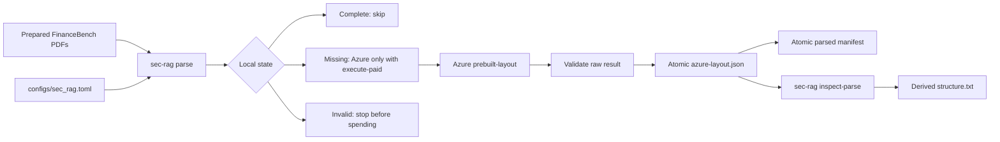

# Experiment 1 Implementation Guide

> **For agentic workers:** REQUIRED SUB-SKILL: Use
> `superpowers:subagent-driven-development` or `superpowers:executing-plans` to
> implement one approved vertical slice at a time. Steps use checkbox (`- [ ]`)
> syntax for tracking.

**Goal:** Build Stage 1.1's resumable Azure Document Intelligence parser, with
an explicit spending guard, validated raw caches, per-filing provenance and
offline structure inspection.

**Architecture:** `sec_rag` is the system being evaluated and has its own CLI
and configuration. It reads the prepared FinanceBench PDFs without importing
the benchmark harness, saves Azure's complete raw result per filing, and keeps
a separate parse manifest. The existing `sec_rag_benchmark` package remains the
evaluator.

**Tech Stack:** Python 3.12; `uv`/`uv_build` for one locked project containing
two import packages; `azure-ai-documentintelligence==1.0.2` for
`prebuilt-layout`; PyMuPDF for independent PDF page counts; standard-library
JSON, hashing and atomic rename for caches and provenance.

**Requirements:** `docs sys design/Build Order.md` Stage 1.1 and
`docs sys design/Systems Design Draft.md` → Ingest files. Benchmark integration
is governed by `docs sys design/Benchmark.md`.

## Global constraints

- Keep all changes unstaged and uncommitted until the user reviews them.
- Python is 3.12 and direct dependencies remain exactly pinned. No dependency
  is added for this slice.
- Tests and normal verification make no paid API calls. A real parse requires
  the visibly paid `--execute-paid` flag.
- Credentials are read lazily from
  `AZURE_DOCUMENT_INTELLIGENCE_KEY` and
  `AZURE_DOCUMENT_INTELLIGENCE_ENDPOINT`; never print or persist them.
- Save `AnalyzeResult.as_dict()` unchanged. Transformations belong to later
  stages and must not alter the raw cache.
- Process filings serially and stop on the first failure.
- A valid final cache prevents another Azure call. Invalid or stale state fails
  closed instead of being overwritten or silently re-parsed.
- Page conversion, noise removal, metadata attachment, heading correction,
  chunking, embedding and retrieval are explicitly out of scope.
- The future Stage 2.0 pipeline migration is documented in Build Order but is
  not implemented during Stage 1.1.

## 1. Architecture and library evidence

### System boundary and golden path



`sec_rag` may read the generated corpus directory, but it does not import
`sec_rag_benchmark`. This keeps experiment behaviour independent from
evaluation code. At Stage 2.0, the benchmark will call a pipeline contract; it
will not absorb parsing or retrieval behaviour.

### Libraries and checked sources

- Azure call and response fields:
  - offline:
    `docs/libraries/azure-di/sdk-python-quickstart.md`,
    `docs/libraries/azure-di/layout-model.md`, and
    `docs/libraries/azure-di/markdown-output.md`
  - live:
    <https://learn.microsoft.com/azure/ai-services/document-intelligence/quickstarts/get-started-sdks-rest-api>
    and
    <https://learn.microsoft.com/azure/ai-services/document-intelligence/prebuilt/layout>
  - implementation reference: `scripts/spike_azure_structure.py`
- Limits and spending guard:
  - offline: `docs/libraries/azure-di/service-limits.md`
  - live:
    <https://learn.microsoft.com/azure/ai-services/document-intelligence/service-limits>
  - S0 accepts PDFs up to 500 MB and 2,000 pages; the corpus is within those
    limits. Serial submission stays far below the default 15 analyze
    transactions per second.
- Packaging two modules:
  - <https://docs.astral.sh/uv/concepts/build-backend/>
  - configure `module-name = ["sec_rag", "sec_rag_benchmark"]`; a uv workspace
    is rejected because both modules share one release, environment and
    lockfile.

Rejected alternatives:

- Extending the spike as production code: it mixes diagnostic reporting,
  `sys.exit` control flow and paid state, and is not a package API.
- A provider-neutral parser interface: PageIndex was rejected, and normalising
  multiple hypothetical response schemas now would risk losing Azure fields.
- Parallel parsing: it shortens wall-clock time but adds throttling and
  concurrent-manifest failure modes without changing the experiment.
- Copying PDFs into per-document parse directories: it creates a second source
  of truth.

## 2. Files, data and interfaces

### Main-function-first reading path

Read the finished slice in this order:

1. `src/sec_rag/cli.py::main()` — terminal actions and spending flags.
2. `src/sec_rag/config.py::load_config()` — validated, resolved settings.
3. `src/sec_rag/ingestion/azure.py::parse_corpus()` — complete parse workflow.
4. Its helpers in call order: document discovery, state classification, cache
   validation, Azure call, manifest update and atomic writes.
5. `src/sec_rag/ingestion/inspection.py::inspect_parses()` — offline report.
6. Corresponding tests in the same order.

### Files and responsibilities

- Create `configs/sec_rag.toml` — result-affecting RAG-system settings.
- Create `src/sec_rag/__init__.py` — package marker only.
- Create `src/sec_rag/config.py` — load and validate `sec_rag.toml`; resolve
  project-relative paths.
- Create `src/sec_rag/cli.py` — `parse` and `inspect-parse` argument parsing and
  delegation.
- Create `src/sec_rag/ingestion/__init__.py` — ingestion package marker.
- Create `src/sec_rag/ingestion/azure.py` — discovery, classification,
  validation, manifesting and paid Azure parsing.
- Create `src/sec_rag/ingestion/inspection.py` — deterministic reports from
  completed raw caches.
- Modify `pyproject.toml` — package both modules and expose `sec-rag`.
- Modify `scripts/spike_azure_structure.py` — after inspection exists, delegate
  offline reporting to production functions; retain it only as a diagnostic
  convenience.
- Create `tests/test_sec_rag_config.py`.
- Create `tests/test_azure_ingestion.py`.
- Create `tests/test_parse_inspection.py`.
- Create `tests/test_sec_rag_cli.py`.
- Modify `tests/test_package_structure.py` — recognise both packages and CLIs.
- Modify `README.md` — document current, tested parse/inspect commands
  and retain benchmark smoke/pattern commands.

No benchmark execution, condition, generation or reporting source file changes
in Stage 1.1.

### Configuration contract

`configs/sec_rag.toml` starts with only settings needed now:

```toml
[corpus]
prepared_dir = "data/financebench"
parsed_dir = "data/financebench/parsed"
expected_documents = 64

[parsing]
provider = "azure-document-intelligence"
model_id = "prebuilt-layout"
output_content_format = "markdown"
```

`load_config(path: str | Path) -> dict[str, Any]`:

- requires exactly these current fields while allowing later top-level sections;
- resolves `prepared_dir` and `parsed_dir` relative to the repository root
  containing `configs/`;
- requires `expected_documents > 0`;
- accepts only the settled provider, model and output format;
- does not read credentials or inspect generated data.

### CLI contract

```text
sec-rag parse
    --config PATH
    [--documents DOC_NAME ...]
    [--execute-paid]

sec-rag inspect-parse
    --config PATH
    [--documents DOC_NAME ...]
```

- No action flag means a read-only plan: no files and no API clients.
- `--execute-paid` recreates a missing manifest entry from a minimally validated
  cache, then submits only PDFs with no final cache.
- No `--documents` means every prepared PDF in sorted filename order.
- A named document may be written with or without `.pdf`; normalise it to the
  prepared document stem. Reject duplicates and unknown names before mutation
  or client creation.
- Return code `0` means the selected action completed; `2` means invalid
  arguments, configuration or local state, missing credentials, Azure failure
  or response validation failure.

### Public ingestion interface

```python
def parse_corpus(
    config: dict[str, Any],
    document_names: tuple[str, ...] | None = None,
    *,
    execute_paid: bool = False,
    client: Any | None = None,
) -> dict[str, Any]:
    """Plan or execute one serial corpus parse."""
```

Return shape:

```python
{
    "action": "plan",
    "selected": 64,
    "counts": {
        "complete": 1,
        "missing": 63,
        "invalid": 0,
        "parsed": 0,
        "manifest_entries_recreated": 0,
    },
    "documents": [
        {
            "doc_name": "3M_2018_10K",
            "status": "complete",
            "pages": 160,
            "message": "validated cache and manifest",
        }
    ],
}
```

The operation first checks every selected document. If any existing cache is
invalid, it raises `ParseStateError` before manifest updates, credential reads
or Azure calls. This all-or-nothing preflight prevents a late invalid cache
from being discovered after earlier missing filings have already been charged.

### Persisted layout

```text
data/financebench/
├── financebench_document_information_10k.jsonl
├── manifest.json
├── pdfs/
│   └── 3M_2018_10K.pdf
└── parsed/
    ├── manifest.json
    └── 3M_2018_10K/
        ├── azure-layout.json
        └── structure.txt
```

`structure.txt` is derived and excluded from cache validity.

### Parse-manifest schema

```json
{
  "schema_version": 1,
  "documents": {
    "3M_2018_10K": {
      "source_pdf": "pdfs/3M_2018_10K.pdf",
      "source_pdf_sha256": "...",
      "cache_file": "3M_2018_10K/azure-layout.json",
      "cache_sha256": "...",
      "page_count": 160,
      "model_id": "prebuilt-layout",
      "output_content_format": "markdown",
      "sdk_package": "azure-ai-documentintelligence",
      "sdk_version": "1.0.2",
      "parse_completed_at": "2026-09-21T12:00:00+00:00",
      "recorded_at": "2026-09-21T12:00:00+00:00"
    }
  }
}
```

- When a valid cache exists but its manifest entry is missing, recreate the
  entry locally before paid parsing continues. Set `parse_completed_at` to
  `null` rather than inventing the earlier Azure completion time; `recorded_at`
  is the time the entry was recreated.
- The manifest contains only completed documents. Failures are terminal output
  for that invocation, not persisted as completed records.

### Cache validation

`validate_cache(raw: dict[str, Any], pdf_path: Path) -> int` performs the
minimum checks needed before an existing file can safely suppress another paid
call. It returns the page count or raises `ParseStateError`.

It requires:

- a non-empty string `content`;
- a list-valued, non-empty `pages` collection;
- exactly the same page count as PyMuPDF reports for the source PDF.

That is deliberately all Stage 1.1 validates. It does not compare extracted
text with PDF text or inspect every paragraph/table/section span. Page-number
conversion and span behaviour are tested where they are used in Stages
1.2-1.3. Every optional and unknown Azure field is still preserved unchanged.

### Atomicity and recovery

- Write JSON to `azure-layout.json.partial`, flush and close it, then replace
  `azure-layout.json`.
- Write the complete next manifest to `manifest.json.partial`, then replace
  `manifest.json`.
- A stale `.partial` file is never accepted as a final cache and may be
  overwritten by the next attempt.
- JSON is finalised before the manifest. If a crash happens between them, the
  next paid execution validates the existing JSON, recreates its manifest
  entry locally and does not call Azure again.
- If manifest writing fails after JSON finalisation, stop before the next
  filing.

### Offline inspection interface

```python
def inspect_parses(
    config: dict[str, Any],
    document_names: tuple[str, ...] | None = None,
) -> dict[str, int]:
    """Write deterministic structure reports for valid completed caches."""
```

It reuses the role census, section-depth, heading-list, page-map and page-count
checks proven in `scripts/spike_azure_structure.py`. The report labels raw
Azure levels as diagnostic; it does not imply that the heading-fix pass has
run. Missing or invalid caches fail before any report is written.

## 3. Pseudocode

### `parse_corpus()`

```text
load and sort the prepared PDFs
normalise and validate optional document names
load parsed/manifest.json, or an empty schema when absent

FOR every selected PDF:
    IF final JSON is absent:
        classify missing
    ELSE:
        load JSON
        require non-empty content
        require Azure page count == PyMuPDF page count
        classify complete if those checks pass, otherwise invalid

IF any invalid:
    raise before changing files or creating Azure client

IF execute_paid is false:
    return classifications

FOR every complete document missing a manifest entry:
    recreate the entry locally
    atomically rewrite the manifest

IF no documents are missing:
    return without reading credentials or creating a client

create or use the injected Azure client
FOR every missing document in sorted order:
    call prebuilt-layout with markdown output and PDF bytes
    convert result with as_dict()
    require non-empty content and a page count matching the PDF
    atomically save the dictionary unchanged
    add its manifest entry
    atomically rewrite manifest
return counts
```

### Azure call

```python
poller = client.begin_analyze_document(
    config["parsing"]["model_id"],
    body=pdf_file,
    output_content_format=DocumentContentFormat.MARKDOWN,
)
raw = poller.result().as_dict()
```

This signature is pinned by the installed SDK and
`scripts/spike_azure_structure.py`. Imports and credential reads stay inside
the paid-client creation path so planning and inspection work offline.

## 4. Vertical implementation slices

### Slice 1: Working resumable parser

**Purpose:** Install the second package/CLI, plan without spending, and parse
only missing documents through a fake-client-tested serial operation.

**Files:** `pyproject.toml`, `configs/sec_rag.toml`,
`src/sec_rag/{__init__,config,cli}.py`,
`src/sec_rag/ingestion/{__init__,azure}.py`,
`tests/test_sec_rag_config.py`, `tests/test_sec_rag_cli.py`,
`tests/test_azure_ingestion.py`, `tests/test_package_structure.py`.

- [ ] Write failing tests for two packaged modules, two CLIs, path resolution,
  all-document default selection, named selection, unknown/duplicate names,
  valid/invalid/missing caches, read-only planning, unchanged response
  persistence, missing-manifest recreation, lazy credentials, injected fake
  client, sorted serial calls, atomic finalisation, stop-on-first-failure,
  resume and no-op paid runs.
- [ ] Run the focused tests and confirm failure because `sec_rag` does not
  exist.
- [ ] Implement the config and read-only planner, then the one-document Azure
  call, then the explicit serial loop. Keep the minimum cache check together:
  readable JSON, non-empty content and matching PDF page count.
- [ ] Run:

```bash
uv run pytest -q tests/test_sec_rag_config.py tests/test_sec_rag_cli.py \
  tests/test_azure_ingestion.py tests/test_package_structure.py
uv run sec-rag parse --config configs/sec_rag.toml
```

- [ ] Reconcile this guide with the actual interfaces and show the unstaged
  slice diff.
- [ ] After approval, draft a focused commit:
  `Add resumable Azure parsing`. The user executes the Git commands.

#### As-built Slice 1

Implemented on 21 September 2026, pending user review:

- `pyproject.toml` packages both `sec_rag` and `sec_rag_benchmark` and exposes
  `sec-rag`.
- `configs/sec_rag.toml` holds the settled corpus and Azure Layout settings.
- `src/sec_rag/config.py::load_config()` resolves configuration paths without
  reading data or credentials.
- `src/sec_rag/cli.py::main()` exposes `parse`, `--documents` and the explicit
  `--execute-paid` guard.
- `src/sec_rag/ingestion/azure.py::parse_corpus()` first classifies every
  selected PDF, returns without mutation in plan mode, then serially parses
  only missing PDFs in paid mode. `_classify_documents()` calls
  `validate_cache()`, `_parse_pdf()` converts Azure's SDK object through
  `as_dict()`, and `_write_json()` / `_write_manifest()` checkpoint atomically.
- The parse operation returns public JSON-ready document statuses; internal
  source/cache paths never leave the module.
- `tests/test_azure_ingestion.py` uses an Azure-shaped fake client to cover
  planning, raw-result persistence, skipping/resume, missing-manifest recovery,
  invalid-cache stop, named-selection validation and lazy credentials.
- `tests/test_sec_rag_config.py` and `tests/test_sec_rag_cli.py` cover the new
  configuration and terminal boundary.

The minimum cache validation intentionally remains limited to readable JSON,
non-empty content and matching Azure/PDF page counts. Span validation remains
deferred to the page-mapping and chunking stages.

### Slice 2: Offline structure inspection and operator commands

**Purpose:** Produce human-readable reports for the initial named test parses
and document the safe operating sequence.

**Files:** `src/sec_rag/ingestion/inspection.py`,
`src/sec_rag/cli.py`, `scripts/spike_azure_structure.py`,
`tests/test_parse_inspection.py`, `tests/test_sec_rag_cli.py`, `README.md`.

- [ ] Write failing tests that pin deterministic role, section, heading,
  page-map and page-count reporting; reject incomplete caches; and prove no
  Azure import, credentials or request is needed.
- [ ] Implement `inspect_parses()` and make the spike's offline path delegate
  to it.
- [ ] Add README commands in this order:

```bash
uv run sec-rag parse --config configs/sec_rag.toml
uv run sec-rag parse --config configs/sec_rag.toml \
  --documents 3M_2018_10K AMD_2022_10K --execute-paid
uv run sec-rag inspect-parse --config configs/sec_rag.toml \
  --documents 3M_2018_10K AMD_2022_10K
uv run sec-rag parse --config configs/sec_rag.toml --execute-paid
```

- [ ] Preserve the benchmark smoke and pattern dry-run commands. State that
  paid benchmark runs and paid Azure parses are separate operations.
- [ ] Run focused inspection/CLI tests and the existing smoke/pattern dry-run
  commands.
- [ ] Reconcile the guide and show the unstaged slice diff.
- [ ] After approval, draft: `Add offline parse inspection`.

## 5. Final verification and acceptance

No paid API command is part of automated verification:

```bash
uv run ruff format --check src tests
uv run ruff check src tests
uv run mypy src
uv run pytest -q
uv lock --check
git diff --check

uv run sec-rag parse --config configs/sec_rag.toml
uv run sec-rag inspect-parse --config configs/sec_rag.toml \
  --documents 3M_2018_10K

uv run sec-rag-benchmark run \
  --config configs/financebench.toml \
  --conditions closed_book oracle long_context \
  --subset smoke \
  --dry-run
uv run sec-rag-benchmark run \
  --config configs/financebench.toml \
  --conditions closed_book oracle long_context \
  --subset pattern \
  --dry-run
```

Stage 1.1 is complete when:

- both packages and CLIs install from the one locked project;
- an unflagged parse plans all 64 prepared PDFs without mutation or clients;
- paid mode calls Azure only for missing PDFs and is covered by fake clients;
- a valid cache with a missing manifest entry is recorded locally rather than
  submitted to Azure again;
- each completed parse has validated verbatim JSON and an auditable manifest
  entry;
- reruns skip completed filings and stop safely on invalid state or first
  failure;
- selected completed filings produce offline `structure.txt` reports;
- README commands match executable behaviour;
- the complete no-spend verification suite passes;
- the initial real paid batch and full corpus remain separate,
  user-authorised operational steps.

## 6. Requirements traceability

- Parse once/cache forever → cache validation, atomicity and resume tests in
  Slice 1.
- Preserve full Azure output and spans → unchanged-dictionary and validation
  tests in Slice 1.
- Separate parse manifest → schema and missing-entry recovery tests in Slice 1.
- Explicit spending/no-spend equivalent → plan/paid CLI tests.
- Small inspected batch before corpus → Slice 2 commands and reports.
- Separate system and evaluator → packaging tests in Slice 1; no benchmark
  source changes.
- Future pipeline plug without premature refactor → Build Order Stage 2.0,
  explicitly deferred from both slices.
