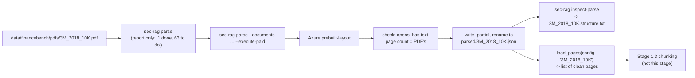
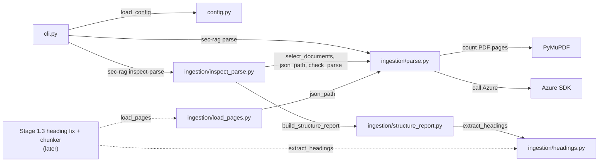

# Experiment 1 Implementation Guide — Stage 1.1 Parse

> **For agentic workers:** REQUIRED SUB-SKILL: Use
> `superpowers:subagent-driven-development` or
> `superpowers:executing-plans` to implement one approved vertical slice at a
> time. Steps use checkbox (`- [ ]`) syntax for tracking.

> **Status:** Gates 1 (architecture and libraries), 2 (files, data and
> interfaces) and 3 (pseudocode, slices and tests) approved. Slice 1 built;
> slices 2 and 3 not started.

**Goal:** all 64 FinanceBench filings parsed by Azure exactly once, saved,
checked, and readable as clean pages ready for chunking.

**Architecture:** three pieces, each with one job. The **parse run**
(`sec-rag parse`) is the only code that talks to Azure or spends money. The
**inspection** (`sec-rag inspect-parse`) writes a readable report of each
saved parse so you can eyeball the headings. **`load_pages`** turns one saved
parse into clean pages for Stage 1.3's chunker. The last two are free and
offline.

**Tech Stack:** Python 3.12; `azure-ai-documentintelligence==1.0.2` for the
`prebuilt-layout` call; PyMuPDF to count a PDF's real pages; the standard
library for JSON, regular expressions and the instant file rename. All three
are already in the project's pinned dependencies.

**Requirements:** `docs sys design/Systems Design Draft.md` → Ingest files →
"Parser output decisions". `docs sys design/Build Order.md` §1.1 repeats them
in build order.

## Global constraints

- Keep all changes unstaged and uncommitted until you've reviewed them.
- Python 3.12, direct dependencies exactly pinned; this stage needs no
  dependency beyond those.
- Tests make no paid API calls: they use a fake Azure client. Only
  `sec-rag parse --execute-paid` can spend money.
- Credentials (`AZURE_DOCUMENT_INTELLIGENCE_KEY`,
  `AZURE_DOCUMENT_INTELLIGENCE_ENDPOINT`) are read only when a paid call is
  actually about to happen, and never printed or saved.
- The saved JSON is exactly what Azure returned (`result.as_dict()`). Nothing
  ever edits it.
- Out of scope for this stage: chunking, the heading-fix LLM pass, tables as
  their own chunks, embeddings and retrieval (Stage 1.3 onwards).

---

## 1. Architecture and libraries

### The golden path



The order you'll actually run it in:

1. `sec-rag parse` — see what's done and what's missing. Spends nothing.
2. `sec-rag parse --documents <2-3 filings> --execute-paid` — parse a few.
3. `sec-rag inspect-parse --documents <same filings>` — read their
   `structure.txt`, and check whether Azure returned any figures.
4. `sec-rag parse --execute-paid` — parse the rest. Any filing already saved,
   such as 3M 2018 from the Stage 0 spike, is skipped.

### Libraries, and where each claim was checked

- **`azure-ai-documentintelligence==1.0.2`** — Microsoft's Python library for
  sending a PDF to Azure's `prebuilt-layout` model and getting the result
  back. Two things about that result shape the design below:
  - it's one markdown string for the whole filing (`content`), plus lists —
    `pages`, `paragraphs`, `tables`, `sections` — that point into that string
    by character position. That's how every piece maps back to its page;
  - Azure marks page headers, footers, page numbers and page breaks inside
    that string, so they can be found and blanked out.
  - The exact calls, and where each was checked, are in section 3.
- **PyMuPDF** — counts the PDF's real pages, for the "check a saved file"
  rule. It's independent of Azure, which is exactly why it's a useful check.
- **Standard library** — `json` to read and write, `re` to find the page
  markers, `Path.replace()` for the instant rename.
- **Not used in this stage:** LlamaIndex, Chroma, Voyage. They start at 1.3.

### Checked on the real 3M parse

- Every page has exactly one span: page 13 is characters 54,574-58,758 of
  `content`. So cutting `content` into pages is one slice per page.
- The markers in 3M are `PageHeader` (145), `PageNumber` (147) and
  `PageBreak` (159). 3M has no page footers, but Azure's docs say other
  filings can.
- 3M has no figures: no `figures` field and no `<figure>` tags.

### Design decisions

- **Every heading and every chunk is located by its raw character position**
  in Azure's `content`. Headings get theirs from Azure's paragraph spans, and
  chunks (Stage 1.3) from the page text they're cut from. Matching the two up
  is how a chunk gets its heading path, so page cleaning must never shift a
  position.
- **Page noise is blanked out, not cut out.** Each page is sliced from the
  untouched `content` using its span, then each marker comment
  (`<!-- PageHeader="..." -->` and the like) is replaced by the same number
  of spaces. The page text stays exactly as long as the raw slice, so
  position `i` in a page's text is raw position `start_offset + i`.
  - E.g. 3M page 13 starts at raw position 54,574. Its `PART II` heading is at
    54,616, so it's at position 42 in the page's text.
  - The leftover spaces are tidied when each chunk's final text is made in
    Stage 1.3, after the positions have been used.
  - Markers are found by their comment text rather than by the labelled
    paragraphs' ranges: both work on the markdown `content`, and the comments
    are simpler to find and test.
- **The heading list is its own step.** `extract_headings` turns Azure's JSON
  into one row per heading — raw offset, page, level, text. The inspection
  report prints it; in Stage 1.3 the heading-fix pass corrects it (renaming,
  re-levelling) and the chunker uses it. Throughout, a heading's raw offset
  never changes: it is the heading's permanent ID and position.
- **No depth limit until after the heading fix.** The heading list and the
  report keep every level Azure gives. The five-level cap is applied in
  Stage 1.3, when chunks get their heading paths, after the heading-fix pass
  has re-levelled the tree — capping Azure's raw levels first could cut off
  headings that only look deep because Azure mis-nested them.
- **Company, year and filing type come from the filename**, read from the
  right (`JOHNSON_JOHNSON_2022_10K` → `JOHNSON_JOHNSON` / `2022` / `10K`).
  The filename is also what the model picks from when choosing which filing
  to search, so both use the same name. Filenames are kept exactly as
  FinanceBench provides them, because the filename is FinanceBench's key for
  questions, evidence pages and page metrics.

### Rejected alternatives

- **A separate processing record** (hashes, SDK version, timestamps per
  filing): Azure's JSON already records `modelId`, `apiVersion` and
  `contentFormat`; "which filings are done" is just which JSON files exist.
- **One folder per filing** (`parsed/<doc_name>/azure-layout.json`): purely
  cosmetic. With just one JSON and one report per filing, a single flat folder
  is simpler to list and check.
- **Saving cleaned pages as a second file:** a second copy to keep in sync;
  `load_pages` takes about a second, so there's nothing to save.
- **Parsing several filings at once:** faster, but adds throttling and
  write-collision failure modes for a one-off run.

### Traceability to the draft

| Draft requirement | Where it's met |
|---|---|
| Save Azure's raw JSON verbatim, markdown output | parse run |
| Skip saved filings; `--execute-paid`; `--documents`; one at a time, stop on first error; `.partial` then rename; check a saved file | parse run |
| Eyeball the structure; check for figures | inspection |
| Headings located by character position | `extract_headings` |
| Remove headers/footers/page numbers; keep figure text; company/year/type; `pageNumber - 1` | `load_pages` |

---

## 2. Files, data and interfaces

### Files and what each one is responsible for

```text
configs/
└── sec_rag.toml                   paths and Azure settings
src/sec_rag/
├── cli.py                         the `parse` and `inspect-parse` commands; prints results
├── config.py                      loads and checks sec_rag.toml
└── ingestion/
    ├── parse.py                   the parse run: send each PDF to Azure, check it, save its JSON — the only code that calls Azure
    ├── inspect_parse.py           file handling only: pick filings, read and check each saved JSON, write the report to <doc_name>.structure.txt by calling structure_report.py
    ├── structure_report.py        the analysis only, no files: one loaded JSON in -> report text out (heading list, each page's heading path, noise and figure counts)
    ├── headings.py                extract the heading list from one loaded JSON: raw offset, page, level, text per heading
    └── load_pages.py              load and prepare each page's content for chunking
tests/
├── test_parse.py                  parse run, with a fake Azure client
├── test_inspect_parse.py          inspection report
├── test_headings.py               heading list: offsets, pages, levels
├── test_sec_rag_cli.py            command routing and printed output
└── test_load_pages.py             load_pages, including the page-number test
```

Why the heading list gets its own module: two different consumers need it —
the inspection report now, and Stage 1.3's heading-fix pass and chunker later.
Keeping it apart means Stage 1.3 imports the heading list without importing
report formatting.

Why the inspection is split across two modules: `inspect_parse.py` deals with
files (which filings, reading and checking their JSON, writing
`structure.txt` by calling structure_report.py), while `structure_report.py` only turns an already-loaded
JSON into text. The heading analysis is the fiddly part worth testing
thoroughly, and because it touches no files, a test can hand it a small
made-up dictionary and check the text that comes back.

Why `load_pages` gets its own module rather than living in `parse.py`: it's a
different job. `parse.py` gets Azure's result onto disk once; `load_pages.py`
reads it back as often as chunking needs, for free. Keeping them apart means
the file Stage 1.3's chunker imports contains only the free, offline step.

How the modules use each other. Read each arrow as "uses": the box at the
tail imports something from the box at the head.



- `cli.py` is the front door. It reads the config, then hands each command to
  the module that does the work.
- `parse.py` is the only box with an arrow to the Azure SDK, so it's the only
  place money can be spent.
- `inspect_parse.py` and `load_pages.py` borrow small helpers from `parse.py`
  (which PDFs to work on, where a JSON lives, the file check), so those rules
  are written once. They don't borrow the Azure call.
- `structure_report.py` gets its heading list from `headings.py` and only
  formats it.
- The dotted arrows are future: Stage 1.3 will call `load_pages` for page text
  and `extract_headings` for the heading list, and match them up by raw
  position. It reaches `parse.py` only for `json_path`, and never triggers an
  Azure call: `parse.py` loads the Azure library only inside the paid path of
  `parse_corpus`.

### Files on disk

```text
data/financebench/
├── pdfs/
│   └── 3M_2018_10K.pdf            the one copy of each PDF (made by dataset preparation)
└── parsed/
    ├── 3M_2018_10K.json            Azure's raw result, exactly as returned
    └── 3M_2018_10K.structure.txt   inspection report; nothing depends on it
```

- A filing counts as parsed when `<doc_name>.json` exists and passes the
  check. `structure.txt` plays no part in that.
- `<doc_name>.json.partial` only ever exists for the moment between writing
  and renaming. If one is left behind by a crash, it's ignored — the skip rule
  only looks for `<doc_name>.json`.

### Configuration

```toml
[corpus]
prepared_dir = "data/financebench"
parsed_dir = "data/financebench/parsed"
expected_documents = 64

[parsing]
provider = "azure-document-intelligence"
model_id = "prebuilt-layout"
output_content_format = "markdown"
```

`load_config()` resolves both paths relative to the project folder and
refuses any other provider, model or output format. It doesn't read
credentials or data.

### Commands

```text
sec-rag parse --config configs/sec_rag.toml [--documents DOC_NAME ...] [--execute-paid]
sec-rag inspect-parse --config configs/sec_rag.toml [--documents DOC_NAME ...]
```

- Without `--documents`, both work on all 64 PDFs.
- Names can be given with or without `.pdf`. An unknown name, or the same
  name twice, is an error.
- Example output of the plain `sec-rag parse` (spends nothing):

```text
Selected: 64
Done: 1
Missing: 63
Parsed now: 0
```

- Exit code `0` means success; `1` means something went wrong (message
  printed); `2` is argparse's own code for a mistyped command.

### Interface 1: the parse run — `parse.py`

```python
def parse_corpus(
    config: dict[str, Any],
    document_names: tuple[str, ...] | None = None,
    *,
    execute_paid: bool = False,
    client: Any | None = None,
) -> dict[str, Any]:
    """Report which filings are parsed, and with execute_paid, parse the missing ones."""
```

- `client` exists only so tests can pass in a fake Azure client. In real use
  it's left empty and the real client is created only when a missing filing
  is about to be sent.
- Returns the names of the filings in each group, so the CLI and tests can see
  exactly which filings are where. Worked example, plain run with only 3M on disk:

```python
{
    "action": "plan",  # "execute_paid" when --execute-paid was given
    "selected": 64,
    "done": ["3M_2018_10K"],  # saved and passed the check
    "missing": ["3M_2022_10K", ...],  # 63 names, no JSON yet
    "parsed": [],  # parsed during this run (only with execute_paid)
}
```

- Errors — all raise `ParseStateError` with the filing's name in the message,
  and the CLI prints it and exits `1`:
  - a saved JSON fails the check (won't open, empty `content`, or page count
    differs from the PDF's). Raised **before** any Azure call, so a bad file
    is never overwritten or paid for again;
  - Azure's fresh result fails the same check. Raised before anything is
    saved; earlier filings in the run stay saved;
  - an unknown or repeated name in `--documents`.
- Missing credentials raise `RuntimeError` naming the two environment
  variables — only when a paid call is actually about to happen.

Smaller pieces other modules use:

```python
def select_documents(
    config: dict[str, Any], document_names: tuple[str, ...] | None
) -> list[Path]:
    """Return the PDFs to work on: all prepared PDFs, or the named ones, in sorted order."""


def json_path(config: dict[str, Any], doc_name: str) -> Path:
    """Return where a filing's saved Azure JSON lives: parsed/<doc_name>.json."""


def check_parse(raw: dict[str, Any], pdf_path: Path) -> int:
    """Check a parse is trustworthy, and return its page count."""
```

`check_parse` is used twice: on a JSON already saved on disk, and on Azure's
fresh result before it's saved. Same three checks both times.

### Interface 2: inspection — `inspect_parse.py` and `structure_report.py`

```python
def inspect_parses(
    config: dict[str, Any],
    document_names: tuple[str, ...] | None = None,
) -> dict[str, int]:
    """Write <doc_name>.structure.txt for each selected, already-parsed filing."""
```

- Returns `{"inspected": 3}`.
- Every selected filing must already be parsed and pass the check; otherwise
  it raises `ValueError` before writing any report.
- `structure_report.build_structure_report(doc_name, raw) -> str` is a pure
  function: saved JSON in, report text out, no files touched. It gets the
  heading list from `extract_headings` and formats it, with each heading's raw
  offset shown. The report includes a line giving the number of `<figure>`
  tags in `content`, so the "did Azure return any figures?" check is answered
  by the report itself.

### Interface 3: the heading list — `headings.py`

```python
@dataclass
class Heading:
    offset: int  # raw position in Azure's content: the heading's permanent ID
    page: int  # Azure pageNumber the heading starts on (counts from 1)
    level: int | None  # depth in Azure's section tree; None if no section opens with it
    text: str  # the heading's words, whitespace tidied


def extract_headings(raw: dict[str, Any]) -> list[Heading]:
    """List every heading in a saved parse with its raw position, page, level and text, in reading order."""
```

The headings on 3M's page 13 (real data):

```python
[
    Heading(offset=54616, page=13, level=..., text="PART II"),
    Heading(
        offset=54629,
        page=13,
        level=...,
        text="Item 5. Market for Registrant' s Common Equity, ...",
    ),
    Heading(
        offset=55349, page=13, level=..., text="Issuer Purchases of Equity Securities"
    ),
    Heading(
        offset=55951,
        page=13,
        level=...,
        text="Issuer Purchases of Equity Securities (registered ...",
    ),
]
```

- `offset` points at the start of the heading's markdown line: `content[54616:]`
  begins `## PART II`.
- Levels are Azure's raw levels, exactly as its section tree gives them;
  correcting them is Stage 1.3's job.

### Interface 4: load and prepare pages for chunking — `load_pages.py`

```python
def load_pages(config: dict[str, Any], doc_name: str) -> list[dict[str, Any]]:
    """Load one filing's saved parse and prepare each page's content for chunking, in page order."""
```

One returned page, using 3M's page 13 (the real data):

```python
{
    "doc_name": "3M_2018_10K",
    "company": "3M",
    "year": 2018,
    "doc_type": "10K",
    "page_index": 12,  # FinanceBench's evidence_page_num: Azure's pageNumber 13, minus 1
    "start_offset": 54574,  # raw position where this page begins in Azure's content (None for a blank page)
    "text": "                                       \n\n\n## PART II\n\n\n### Item 5. Market for ..."
    "... described above.\n\n\n                        \n                  \n\n",
}
```

How that page is made from the raw JSON:

```text
Azure's pages[12]:  pageNumber 13, spans [{offset: 54574, length: 4184}]

content[54574 : 54574 + 4184]  (cut from the untouched content)
    '<!-- PageHeader="Table of Contents" -->\n\n\n## PART II\n\n\n### Item 5. Market for ...'
    ...
    '... described above.\n\n\n<!-- PageNumber="13" -->\n<!-- PageBreak -->\n\n'

replace each <!-- PageHeader/PageFooter/PageNumber/PageBreak --> marker
with the same number of spaces (39 spaces for the PageHeader here)
    '                                       \n\n\n## PART II\n\n\n### Item 5. Market for ...'

the text is still 4,184 characters long, so positions still line up:
    PART II heading, raw offset 54616  ->  text position 54616 - 54574 = 42
    text[42:52] == '## PART II'
```

- `text` is exactly as long as the page's raw slice, and is never trimmed,
  so `start_offset + position in text` is always the raw position. That's
  what lets Stage 1.3 match a chunk to the headings before it.
- `text` stays markdown: headings keep their `#`s, tables stay as Azure's
  HTML tables, and figure text stays inside its `<figure>` tags.
- `year` is a number (`2018`, not `"2018"`), so later filters can compare years.
- Errors: raises `ValueError` if the filing has no saved JSON, or if its
  filename doesn't end in `_<4-digit year>_<type>`.
- `load_pages` doesn't re-run the PyMuPDF page-count check; that happened when
  the filing was parsed.

Helpers it calls, in order:

```text
load_pages()
├── parse.json_path()           where the saved JSON is
├── _split_doc_name()           "JOHNSON_JOHNSON_2022_10K" -> ("JOHNSON_JOHNSON", 2022, "10K")
└── _blank_page_markers()       one page's text in, the same text with markers turned into spaces
```

### Reading order

1. `cli.py::main()` — every command the system accepts.
2. `parse.py::parse_corpus()`, then its helpers in the order it calls them.
3. `inspect_parse.py::inspect_parses()` → `structure_report.py::build_structure_report()`
   → `headings.py::extract_headings()`.
4. `load_pages.py::load_pages()` → `_split_doc_name()` → `_blank_page_markers()`.

Each test file is read after the module it tests.

---

## 3. Pseudocode, slices and tests

The code is built in three slices, each ending in something you can run and
test on its own:

| Slice | What becomes possible | Needs |
|---|---|---|
| 1. The parse run | `sec-rag parse` reports and, with `--execute-paid`, parses safely | — |
| 2. Heading list and inspection | `extract_headings` gives each heading's raw offset, page, level and text; `sec-rag inspect-parse` writes `<doc_name>.structure.txt`, incl. figure count | slice 1 |
| 3. Clean pages | `load_pages` returns clean pages for chunking | slice 1 |

**Slice 1 must be finished before any paid run.** Until then the code looks
for the saved 3M parse in the wrong place and would pay for it again. The paid
runs themselves come after slices 1 and 2 (see "Running it" at the end).

Every slice ends the same way: run the full checks (bottom of this section),
update this guide with anything built differently from the plan, then show
you the uncommitted diff. Nothing is committed without your approval.

### The Azure library calls the code relies on

- **The call:** `client.begin_analyze_document("prebuilt-layout", body=<PDF
  bytes>, output_content_format=DocumentContentFormat.MARKDOWN)`. It returns
  a "poller", because Azure takes minutes; `poller.result()` waits for the
  finished parse.
  - Offline: `docs/libraries/azure-di/sdk-python-quickstart.md`. Live:
    [Quickstart, Python](https://learn.microsoft.com/en-gb/azure/ai-services/document-intelligence/quickstarts/get-started-sdks-rest-api?view=doc-intel-4.0.0&pivots=programming-language-python)
  - Microsoft's layout page names the format enum `ContentFormat.MARKDOWN`;
    in the installed SDK (1.0.2) it's `DocumentContentFormat.MARKDOWN`
- **Saving:** the result object isn't JSON-ready, so call `result.as_dict()`
  and then `json.dump` it.
  - Live: [SDK README → "Parse analyzed result to JSON format"](https://learn.microsoft.com/en-us/python/api/overview/azure/ai-documentintelligence-readme?view=azure-python#parse-analyzed-result-to-json-format)
- **What comes back:** `content` (the whole filing as one markdown string),
  `pages`, `paragraphs`, `tables`, `sections`. Each of these carries `spans`
  (start position + length) pointing into `content`.
  - Offline: `docs/libraries/azure-di/layout-model.md`. Live:
    [Layout model → markdown output](https://learn.microsoft.com/en-gb/azure/ai-services/document-intelligence/prebuilt/layout?view=doc-intel-4.0.0&tabs=rest%2Csample-code#output-response-to-markdown-format)
- **How page noise appears in `content`:** as HTML comments,
  `<!-- PageHeader="..." -->`, `<!-- PageFooter="..." -->`,
  `<!-- PageNumber="..." -->`, and `<!-- PageBreak -->` between pages.
  Figures are wrapped in `<figure>` tags, with any text Azure read from them
  inside.
  - Offline: `docs/libraries/azure-di/markdown-output.md` → "Figure" and
    "PageNumber/PageHeader/PageFooter"
- **Limits:** a paid (S0) resource takes PDFs up to 500 MB and 2,000 pages;
  our largest filing is well inside that.
  - Offline: `docs/libraries/azure-di/service-limits.md`

### Slice 1: the parse run

**What becomes possible:** `sec-rag parse` reports which filings are done and
missing; `sec-rag parse --execute-paid` parses the missing ones, one at a time,
safely.

**Files:** `src/sec_rag/ingestion/parse.py`, `src/sec_rag/cli.py`,
`tests/test_parse.py`, `tests/test_sec_rag_cli.py`.

**Reading path:** `parse_corpus()` → `select_documents()` → `json_path()` →
`_read_json()` → `check_parse()` → `_create_azure_client()` →
`_send_to_azure()` → `_write_json()`.

#### `parse_corpus()`

```text
parse_corpus(config, document_names, execute_paid, client):
    pdf_paths = select_documents(config, document_names)

    # Sort every selected filing into done or missing BEFORE anything can spend.
    done, missing = [], []
    FOR each pdf_path (e.g. pdfs/3M_2018_10K.pdf):
        doc_name = pdf_path's name without ".pdf"         # "3M_2018_10K"
        IF json_path(config, doc_name) doesn't exist:     # parsed/3M_2018_10K.json
            add pdf_path to missing
            CONTINUE
        raw = _read_json(that path)        # ParseStateError if it won't open
        check_parse(raw, pdf_path)         # ParseStateError if it fails: stop,
                                           # never overwrite or pay again
        add doc_name to done

    result = {action: "plan", selected: len(pdf_paths),
              done: done, missing: [names of missing], parsed: []}
    IF not execute_paid, or nothing is missing:
        RETURN result                      # no client, no credentials, no files

    result.action = "execute_paid"
    client = the injected fake client, or _create_azure_client()
    FOR each pdf_path in missing, in sorted order:
        raw = _send_to_azure(client, pdf_path)    # the paid call, a few minutes
        check_parse(raw, pdf_path)                # bad result: stop before saving;
                                                  # earlier filings stay saved
        _write_json(json_path(config, doc_name), raw)
        move doc_name from result.missing to result.done
        add doc_name to result.parsed
    RETURN result
```

Any exception from Azure itself (wrong key, quota, network) is not caught: it
stops the loop straight away, which is the "stop at the first error" rule.
Everything saved before it stays saved.

#### Helpers

```text
select_documents(config, document_names):
    all_pdfs = every *.pdf in <prepared_dir>/pdfs, sorted
    IF document_names is None: RETURN all_pdfs
    FOR each name: drop a trailing ".pdf"
        repeated name -> ParseStateError("Document was selected more than once: ...")
        unknown name  -> ParseStateError("Prepared PDF is unknown: ...")
    RETURN the named PDFs, sorted

json_path(config, doc_name):
    RETURN <parsed_dir>/<doc_name>.json

_read_json(path):
    RETURN json.loads(the file's text)
    won't open or isn't valid JSON -> ParseStateError("<doc_name>: cannot read saved parse: ...")

check_parse(raw, pdf_path):
    content missing or only whitespace -> ParseStateError("<doc_name>: parse has no content")
    pages missing or empty             -> ParseStateError("<doc_name>: parse has no pages")
    count the PDF's pages with PyMuPDF
    len(pages) != PDF page count       -> ParseStateError("<doc_name>: Azure has 159 pages but PDF has 160")
    RETURN the page count

_create_azure_client():
    import the Azure SDK here, not at the top of the file   # so free commands never load it
    read AZURE_DOCUMENT_INTELLIGENCE_KEY and _ENDPOINT from the environment
    either missing -> RuntimeError naming both variables
    RETURN DocumentIntelligenceClient(endpoint, AzureKeyCredential(key))

_send_to_azure(client, pdf_path):
    open the PDF as bytes
    poller = client.begin_analyze_document("prebuilt-layout", body=<bytes>,
                 output_content_format=DocumentContentFormat.MARKDOWN)
    RETURN poller.result().as_dict()            # the whole result, exactly as returned

_write_json(path, raw):
    write json.dumps(raw) to <path>.partial      # e.g. 3M_2018_10K.json.partial
    rename <path>.partial to <path>              # instant: the file is whole or absent
```

#### `cli.py`

`main()` parses the arguments and hands `parse` to `parse_corpus` and
`inspect-parse` to `inspect_parses`. For `parse` it prints:

```text
Selected: 64
Done: 1
Missing: 63
Parsed now: 0
```

`ParseStateError`, `RuntimeError`, `ValueError` and `OSError` are caught,
printed as `Error: <message>`, and return exit code `1`.

#### Comments the code needs

- At the classification loop: why every filing is sorted into done/missing
  before any Azure call (a bad saved file must stop the run before it spends).
- At the Azure import inside `_create_azure_client`: loaded only here so free
  commands never need the SDK or credentials.
- At `_write_json`: why `.partial` then rename (a half-written file would be
  mistaken for a finished parse by the skip rule).
- At `check_parse`: that PyMuPDF's count is the independent check on Azure.

#### Tests — `tests/test_parse.py`

Tests build small real PDFs (1-2 pages) with PyMuPDF in a temporary folder and
use a fake Azure client that records every call and returns an Azure-shaped
dictionary. No test touches the network or needs credentials.

| Test | Setup | Expected |
|---|---|---|
| plan reports without spending | 2 PDFs, 1 saved JSON, no credentials in the environment | `done` = 1 name, `missing` = 1 name, `parsed` = []; no client created; no new files |
| execute-paid saves and then skips | 2 PDFs, nothing saved, fake client | both `<doc_name>.json` saved exactly as the fake returned them; no `.partial` left; a second run makes zero Azure calls |
| bad saved file stops before spending | saved JSON with 1 page for a 2-page PDF, plus a missing filing | `ParseStateError` naming the filing; zero Azure calls; the bad file unchanged |
| bad Azure result stops the run | 3 missing PDFs; fake returns a wrong page count for the 2nd | 1st saved; `ParseStateError` for the 2nd, nothing saved for it; 3rd never sent |
| leftover `.partial` counts as missing | only `<doc_name>.json.partial` on disk | that filing is listed as `missing` |
| `--documents` selection | names with and without `.pdf`; an unknown name; a repeated name | `.pdf` accepted; unknown and repeated raise `ParseStateError` |
| credentials only when paying | no credentials in the environment | plan: fine; execute-paid with nothing missing: fine; execute-paid with a missing filing: `RuntimeError` naming both variables |

**`tests/test_sec_rag_cli.py`:** plain `sec-rag parse` prints the four lines
above and exits `0`; a missing-credentials error prints `Error: ...` and
exits `1`.

**Draft commit:** `Simplify Azure parse run to flat JSON files`

#### As built

Built as planned, in `src/sec_rag/ingestion/parse.py` and `tests/test_parse.py`
(8 tests, plus 2 in `tests/test_sec_rag_cli.py`). Where the code differs from
the pseudocode above:

- `_send_to_azure(client, pdf_path, model_id)` takes the model name from
  `config["parsing"]["model_id"]` rather than writing `"prebuilt-layout"` into
  the code, because settings live in config. The config loader already
  refuses any other model.
- It passes the open PDF file to `body=` rather than its bytes read into
  memory. The SDK accepts either, and the file stays open until
  `poller.result()` returns.
- `inspection.py` was pointed at `parse.py` and the flat layout
  (`parsed/<doc_name>.json`, report `parsed/<doc_name>.structure.txt`) in this
  slice, so the suite stays green after `azure.py` is deleted. Slice 2
  replaces it with `inspect_parse.py`.
- Checked on the real corpus: `sec-rag parse --config configs/sec_rag.toml`
  prints `Selected: 64 / Done: 1 / Missing: 63 / Parsed now: 0`, so the saved
  3M parse is found and won't be paid for again.

### Slice 2: inspection

**What becomes possible:** `extract_headings` gives the heading list (raw
offset, page, level, text) that Stage 1.3 will build on, and
`sec-rag inspect-parse` writes a readable `<doc_name>.structure.txt` of it next
to each saved parse, including whether Azure returned any figures.

**Files:** `src/sec_rag/ingestion/headings.py`,
`src/sec_rag/ingestion/inspect_parse.py`,
`src/sec_rag/ingestion/structure_report.py`, `tests/test_headings.py`,
`tests/test_inspect_parse.py`, `tests/test_sec_rag_cli.py`.

**Reading path:** `inspect_parses()` → `structure_report.build_structure_report()`
→ `headings.extract_headings()` → the report's formatting helpers, in the
order the report's sections appear.

#### `inspect_parses()`

```text
inspect_parses(config, document_names):
    reports = []
    FOR each pdf_path in select_documents(config, document_names):
        path = json_path(config, doc_name)
        IF path doesn't exist -> ValueError("<doc_name>: not parsed yet")
        raw = _read_json(path)
        check_parse(raw, pdf_path)
        reports.append((<parsed_dir>/<doc_name>.structure.txt,
                        build_structure_report(doc_name, raw)))
    # All reports are built before any is written, so one bad filing means
    # no reports are written at all rather than some.
    FOR each (report_path, text) in reports: write text to report_path
    RETURN {"inspected": len(reports)}
```

#### How Azure's JSON becomes a heading list and a report

Neither function works out the structure itself. Azure has already done that:
every paragraph arrives labelled with a role, and the `sections` list records
which section contains which. Steps 1-2 read those labels into the heading
list (`extract_headings`, in `headings.py`); steps 3-4 summarise that list as
the report (`build_structure_report`, in `structure_report.py`), so you can
judge whether Azure got the structure right.

The worked example below is a made-up miniature of 3M's first pages, small
enough to follow by hand.

**The input — the parts of Azure's JSON it reads:**

```text
paragraphs (Azure's list, with the role Azure gave each one):
  [0] role=title           "PART I"                    starts on page 4
  [1] role=sectionHeading  "Item 1. Business"          starts on page 4
  [2] role=(none)          "3M is a diversified ..."   starts on page 4   <- body text
  [3] role=sectionHeading  "Item 1A. Risk Factors"     starts on page 10
  [4] role=title           "PART II"                   starts on page 13
  [5] role=sectionHeading  "Item 5. Market for ..."    starts on page 13

sections (Azure's flat list; each says what it contains, by reference):
  [0] contains /sections/1, /sections/4             <- the whole document
  [1] contains /paragraphs/0, /sections/2, /sections/3
  [2] contains /paragraphs/1, /paragraphs/2
  [3] contains /paragraphs/3
  [4] contains /paragraphs/4, /sections/5
  [5] contains /paragraphs/5
```

**Step 1 (`extract_headings`) — find the headings.** Keep only paragraphs whose
role is `title` or `sectionHeading`, noting each one's text, start page
(`boundingRegions[0].pageNumber`) and raw position in `content`
(`spans[0].offset`). Paragraph 2 is body text, so it's skipped. The headings
are returned sorted by raw position, which is reading order.

**Step 2 (`extract_headings`) — work out each heading's level from the
sections tree.**

```text
section 0 is the top:                      depth 0
section 0 contains sections 1 and 4:       depth 1 each
section 1 contains sections 2 and 3:       depth 2 each
section 4 contains section 5:              depth 2

a section's first /paragraphs/N is the heading that opens it:
  section 1 opens with paragraph 0  ->  "PART I"                 level 1
  section 2 opens with paragraph 1  ->  "Item 1. Business"       level 2
  section 3 opens with paragraph 3  ->  "Item 1A. Risk Factors"  level 2
  section 4 opens with paragraph 4  ->  "PART II"                level 1
  section 5 opens with paragraph 5  ->  "Item 5. Market for ..." level 2
```

This relies on Azure listing a parent section before its children, which held
on 3M. A heading that doesn't open any section gets `level=None`; the report
counts such headings and leaves them out of the page path (none on 3M).

**Step 3 (`build_structure_report`) — carry the headings across pages.**

```text
active path = empty
FOR each page from 1 to the last page:
    FOR each heading that starts on this page, in reading order:
        remove headings from the end of the path at the same or a deeper level
        add this heading
    record the active path for this page, at full depth
```

On the example:

```text
pages 1-3     (before any heading)
page 4        PART I > Item 1. Business          PART I (level 1) added, then Item 1 (level 2)
pages 5-9     PART I > Item 1. Business          no new heading: path carries over
page 10       PART I > Item 1A. Risk Factors     Item 1A (level 2) replaces Item 1 (level 2)
pages 11-12   PART I > Item 1A. Risk Factors
page 13       PART II > Item 5. Market for ...   PART II (level 1) replaces PART I and
                                                 everything under it; then Item 5 added
```

This page-level path is for eyeballing only. Stage 1.3 attributes headings to
chunks by raw position instead, so a page with several headings is split
correctly. The path is shown at full depth, however deep Azure nests it, so
the report shows exactly what Azure returned.

**Step 4 (`build_structure_report`) — write the report.** Six sections, each
answering one question:

1. **Role census** — how many paragraphs have each role, and what share is
   header/footer/page-number noise?
2. **Sections tree** — how many sections, how deep they nest, and whether they
   carry character positions.
3. **Headings** — one line per heading: raw offset, page, level, text. Plus how many
   `Item ...` headings there are and at which levels. On a well-structured
   filing all Items share one level.
4. **Page → heading path** — step 3's result, with Azure's page number and
   FinanceBench's page number side by side.
5. **Figures** — how many `<figure>` tags are in `content`, and how many
   entries in Azure's `figures` list (0 if the field is absent).
6. **Page count** — the page count, already checked against the PDF.

On the real 3M parse, sections 3 and 4 are where the problems show: the 21
Items sit at four different levels, so on page 12 `Item 4` appears *under*
`Item 1B`. That's what the Stage 1.3 heading-fix pass corrects. This report
uses Azure's raw levels and is for eyeballing only.

**Why only the section tree, not also the markdown `#` count:** Azure writes
the `#`s in `content` from the same nesting it puts in `sections`, so the two
can't disagree in a way that tells us anything. On 3M they match for all 295
headings.

**Comments the code needs:** in `extract_headings`, that `offset` is the raw
position and the heading's permanent ID (later stages rename and re-level
headings but never change it); at the level calculation, that depth 0 is a
real level (so check `is not None`, not truthiness), and that the single
forward pass assumes parents are listed before children.

#### Tests — `tests/test_headings.py`

| Test | Setup | Expected |
|---|---|---|
| levels from the sections tree | the worked example above as a made-up dictionary | PART I 1, Item 1 2, Item 1A 2, PART II 1, Item 5 2; body paragraph not included |
| offset is the raw position | made-up `content` with `## PART II` at position 42 and a paragraph span at 42 | `offset == 42` and `content[42:]` starts with `## PART II` |
| reading order | headings listed out of order in `paragraphs` | returned sorted by `offset` |
| depth 0 is a real level | a heading opening a depth-0 section | `level == 0`, not `None` |
| heading outside the tree | a `sectionHeading` paragraph no section opens | returned with `level is None` |

#### Tests — `tests/test_inspect_parse.py`

| Test | Setup | Expected |
|---|---|---|
| writes a report with no credentials | 1 PDF + valid saved JSON, no credentials | `<doc_name>.structure.txt` written next to the JSON; returns `{"inspected": 1}` |
| report builder touches no files | a small made-up dictionary, called directly | returns text containing the doc name and all six section titles |
| page path | the worked example above | page 10 → `PART I > Item 1A. Risk Factors`; page 13 → `PART II > Item 5. Market for ...` |
| heading outside the tree | a heading with `level=None` | counted in the Headings section; left out of the page path |
| figure count | made-up `content` with two `<figure>` tags | Figures section reports 2 |
| unparsed filing stops everything | 2 selected, only 1 parsed | `ValueError` naming the unparsed one; no report written |

**`tests/test_sec_rag_cli.py`:** `sec-rag inspect-parse` prints
`Inspected: 1` and exits `0`.

**Draft commit:** `Extract heading list and simplify inspection`

### Slice 3: clean pages

**What becomes possible:** `load_pages(config, doc_name)` returns each page's
cleaned markdown text with its FinanceBench page number, its raw start
position and the filing's metadata, ready for Stage 1.3's chunker.

**Files:** `src/sec_rag/ingestion/load_pages.py`, `tests/test_load_pages.py`.

**Reading path:** `load_pages()` → `_split_doc_name()` →
`_blank_page_markers()`.

#### `load_pages()`

```text
load_pages(config, doc_name):
    path = json_path(config, doc_name)
    IF path doesn't exist -> ValueError("<doc_name>: not parsed yet")
    raw = json.loads(the file's text)
    company, year, doc_type = _split_doc_name(doc_name)
    content = raw["content"]

    pages = []
    FOR each page in raw["pages"]:
        spans = page["spans"]
        IF spans is empty:                       # a truly blank page
            start_offset, text = None, ""
        ELSE IF more than one span:              # never seen (3M: one per page); fail
            -> ValueError("<doc_name>: page <n> has <k> spans")   # loudly rather than mis-map
        ELSE:
            start_offset = spans[0].offset
            # Cut this page out of the UNTOUCHED content, then blank its markers.
            text = _blank_page_markers(content[start_offset : start_offset + spans[0].length])
        pages.append({
            "doc_name": doc_name, "company": company, "year": year, "doc_type": doc_type,
            "page_index": page["pageNumber"] - 1,   # Azure counts from 1, FinanceBench from 0
            "start_offset": start_offset,
            "text": text,
        })
    RETURN pages
```

#### Helpers

```text
_split_doc_name(doc_name):
    # Read from the right: the company name itself may contain "_".
    company, year, doc_type = doc_name split on "_" from the right, at most twice
        "JOHNSON_JOHNSON_2022_10K" -> "JOHNSON_JOHNSON", "2022", "10K"
    fewer than 3 parts, or year isn't 4 digits
        -> ValueError("<doc_name>: filename must end in _<year>_<type>")
    RETURN company, int(year), doc_type

_blank_page_markers(text):
    replace every match of  <!-- PageHeader=...-->, <!-- PageFooter=...-->,
                            <!-- PageNumber=...-->, <!-- PageBreak -->
    with the same number of spaces
        regular expression: <!--\s*Page(Header|Footer|Number|Break)\b.*?-->
        (non-greedy, and "." also matches newlines, in case a header's
         quoted text runs over two lines; a newline inside a marker is kept
         as a newline, so line structure is unchanged too)
    RETURN the result — same length as the input, never trimmed
```

**Comments the code needs:** the blank-don't-cut rule and why (text position +
`start_offset` must equal the raw position, so chunks can be matched to
headings in Stage 1.3); the `pageNumber - 1` conversion, naming the rule from
the design draft ("never use the page number printed in the footer"); why the
filename is read from the right; where the marker format was confirmed
(`docs/libraries/azure-di/markdown-output.md`).

#### Tests — `tests/test_load_pages.py`

| Test | Setup | Expected |
|---|---|---|
| **page number is `pageNumber - 1`** | made-up parse with pages numbered 1, 2, 3 | `page_index` values 0, 1, 2 |
| markers blanked, content kept | a page containing a PageHeader, a heading, body text, PageNumber, PageBreak | no `<!--` left; heading and body unchanged; `len(text)` equals the page's span length |
| **positions still line up** | a heading at raw offset 60 on a page starting at raw offset 18 | `start_offset == 18` and `text[42:]` starts with the heading's `##` line |
| a PageFooter is blanked too | page text containing `<!-- PageFooter="..." -->` | footer gone, length unchanged |
| figure text kept | page containing `<figure>` with a caption and numbers | the figure's text is still in `text` |
| each page gets only its own text | 2 pages whose spans cover different parts of `content` | each `text` contains only its own page's words |
| page with no spans | a blank page with `spans: []` | returned, with `start_offset is None` and `text == ""` |
| page with two spans | a page with 2 spans | `ValueError` naming the page |
| filename read from the right | `JOHNSON_JOHNSON_2022_10K` and `3M_2018_10K` | `("JOHNSON_JOHNSON", 2022, "10K")`, `("3M", 2018, "10K")` |
| bad filename | `NOTAFILING` | `ValueError` |
| not parsed yet | no saved JSON | `ValueError` naming the filing |
| real 3M parse (skipped if absent) | `parsed/3M_2018_10K.json` on disk | 160 pages; page index 12 has `start_offset == 54574`, length 4,184, no `<!--`, and `text[42:52] == "## PART II"` |

The last test reads the real saved parse only if it exists (it lives in the
Git-ignored `data/` folder), so the suite still passes on a fresh clone.

**Draft commit:** `Add load_pages with position-preserving cleaning`

### Running it

After slices 1 and 2 are committed:

1. `uv run sec-rag parse --config configs/sec_rag.toml` — expect `Done: 1`,
   `Missing: 63`. If 3M shows as missing, stop: the code isn't finding the
   saved parse.
2. `uv run sec-rag parse --config configs/sec_rag.toml --documents PEPSICO_2022_10K JPMORGAN_2022_10K --execute-paid`
   — two filings, about $4. Different industries from 3M, so the headings get
   a fair test.
3. `uv run sec-rag inspect-parse --config configs/sec_rag.toml --documents 3M_2018_10K PEPSICO_2022_10K JPMORGAN_2022_10K`
   — read the three `structure.txt` files: were the Items found, and were any
   figures returned?
4. `uv run sec-rag parse --config configs/sec_rag.toml --execute-paid` —
   the remaining 61 filings, about $104. Re-run the same command if it stops
   partway; finished filings are skipped.

**Stage 1.1 is done when:** all 64 JSON files are saved and pass the check,
and the `load_pages` tests pass.

### Checks before each slice is called finished

```bash
uv run ruff format --check .
uv run ruff check .
uv run mypy src/
uv run pytest
uv lock --check
git diff --check
```

All must pass with no paid API calls.
