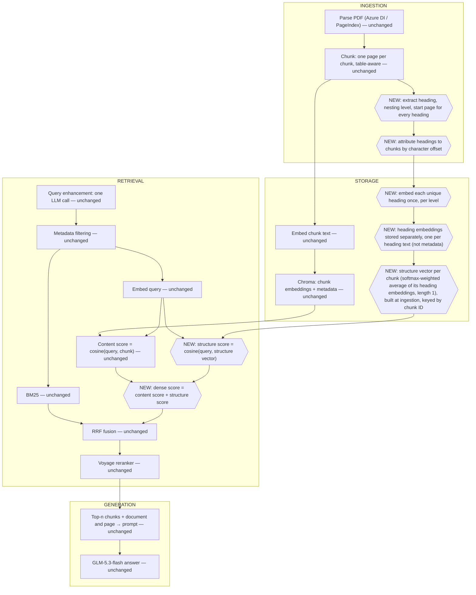

# Experiment 2 — Structure-Aware Retrieval

## Experiment

- **What's being tested:** whether adding document structure to the dense (semantic) score improves retrieval, on top of Experiment 1's pipeline.
- **The one change:** Experiment 2 is Experiment 1 with exactly ONE change — the dense score.
  - Unchanged: parsing, chunking, query enhancement, BM25, RRF, reranker, generation — all identical to Experiment 1.
  - Changed: how chunk-to-query semantic similarity is computed.
    - Instead of only comparing the query embedding to the chunk embedding, the query embedding is also compared to a structure vector built from the chunk's heading path.
    - The two scores are added together.
- **Why structure might help specifically for 10-Ks:**
  - Every 10-K, from any company, is organized into the same four Parts with the same numbered Items in the same order, because the SEC mandates this template (Part I business/risk factors, Part II MD&A and financial statements, Part III governance, Part IV exhibits).
    - This structure is legally fixed and identical across every filer — it's a far more robust signal than inferring headings from inconsistent styling.
  - If a chunk's heading path says "Item 7. MD&A > Liquidity and Capital Resources," that's strong, cheap, reliable evidence about what kind of content the chunk holds, on top of whatever the chunk text itself says.
  - The bet: folding that heading information into the retrieval score should push section-appropriate chunks up the ranking.
    - Especially for questions where the wording of the chunk itself is ambiguous but its section is a dead giveaway (e.g. a number that could be capex or cash flow, but sits under "Investing Activities").
- **Framing:** this is a training-free approximation of Fin-STAR, not a replication.
  - Fin-STAR trains a small model to generate a "virtual node" heading and learns projections for its attention mechanism.
  - Here, everything is done with an off-the-shelf embedding model — no training loop, no labelled data, no loss function.

## Data

- Identical to Experiment 1: FinanceBench, 112 questions across 64 10-K PDFs (`doc_type == "10k"` exactly, excluding the separate `10k_annualreport` type).
- Same five FinanceBench context conditions where applicable, same metrics, same judge.
  - Judge: DeepSeek-V4-Flash via Azure Foundry.
  - Answers generated with `z-ai/glm-5.3-flash` via OpenRouter.
- Keeping the data, model, and generation settings identical to Experiment 1 is deliberate.
  - It isolates the one variable being tested (the dense score), so the comparison between Experiment 1 and Experiment 2 is clean.

## Models / architecture

Same models as Experiment 1:
- **Embedding**: Voyage `voyage-4-lite`, `input_type="document"` for chunks and headings, `input_type="query"` for questions.
- **Reranker**: Voyage reranker API (`rerank-3-lite`).
- **Answer generation**: `z-ai/glm-5.3-flash` via OpenRouter, same settings as every other condition and experiment.
- **Judge**: DeepSeek-V4-Flash via Azure Foundry.
- **Parser**: Azure Document Intelligence `prebuilt-layout`; the Stage 0 spike rejected PageIndex
  because Azure found the heading text and spans needed here.

- **The only architectural change is the dense scorer:**
  - Experiment 1's chunk-embedding-only cosine similarity is replaced by chunk-similarity plus structure-similarity.
  - This can't be expressed as a fused ranked list, so it isn't something RRF can produce.
    - It's a small function beside Experiment 1's dense search that adds two similarity scores per chunk, reached through the same retrieval function with its structure weight set to 1 instead of 0.

## System design

Full pipeline, stage by stage. Each bullet is marked **UNCHANGED** (identical to Experiment 1) or **NEW** (introduced in this experiment), so the one-change framing stays visible throughout.

**Ingestion**
- **Parse the filing (UNCHANGED).**
  - Azure Document Intelligence `prebuilt-layout`, producing markdown output plus structural JSON.
  - Cached to disk once, out of Git; chunking never re-parses.
- **Chunk within page boundaries (UNCHANGED).**
  - No chunk crosses a page, so page-based retrieval metrics stay exact.
  - Tables and figures are their own chunks, never split; prose is cut at section headings (floor ~250, ceiling 1,024 tokens), using Azure's raw heading positions — exactly Experiment 1's chunks.
  - Each chunk carries metadata for filtering: filing type, company ticker, financial year, page number.
- **Extract document structure (NEW).**
  - For every heading in the parsed document, record its text, its nesting level, and its start page.
    - Azure supplies the heading text, character spans and levels. Its raw levels are used as they
      come: the planned heading-fix pass was deferred to fit the build window (see Design
      decisions). The chunks are identical to Experiment 1's either way, since they were cut at
      Azure's heading positions, which the fix would never have moved.
- **Attribute headings to chunks (NEW).**
  - By character offset: each heading holds from its own position until the next heading at the same or higher nesting level starts.
  - A chunk is given the headings whose range covers it; a chunk covering text under two headings gets both, merged (shared ancestors once, distinct tails joined), which is simply the set of every heading open anywhere in the chunk.
  - This gives each chunk a heading path — the list of headings from the top level down to the most specific one that applies to it, capped at 6 levels.

**Storage**
- **Chunk embeddings (UNCHANGED).**
  - `voyage-4-lite`, `input_type="document"`, stored in the vector store alongside chunk metadata, filterable with `where`-style filtering before search.
- **Keyword index (UNCHANGED).**
  - `bm25s` via LlamaIndex's `BM25Retriever`; both indexes support metadata filtering before search.
- **Embed each heading level separately (NEW).**
  - Each heading in a chunk's path is embedded on its own — not joined into one string.
  - Each unique heading text is embedded once and reused across every chunk that shares it, rather than re-embedding the same heading per chunk.
- **Store the heading embeddings (NEW).**
  - Kept separately from chunk embeddings, in their own Chroma collection with one row per unique heading text — not bundled into the chunk's metadata fields. Keyed by the text, so each heading is embedded once, and a rebuild embeds only headings not already stored.
  - Linked to a chunk via its heading path.
- **Build each chunk's structure vector at ingestion (NEW).**
  - The structure vector (see Retrieval) depends only on the chunk and its headings, never on the query, so it is computed once when the index is built and stored in a third Chroma collection, one row per chunk, keyed by chunk ID, with the chunk's heading path saved alongside for inspection.
  - A query then reads only its filtered filing's vectors, rather than loading the whole corpus.

**Retrieval**
- **Query enhancement (UNCHANGED).**
  - One LLM call returns structured JSON: company, year(s), doc_type, a keyword query, and a semantic query.
  - Not called again: Experiment 2 reuses the plan Experiment 1's run saved for each question and condition. The model doesn't reproduce its output exactly, so fresh calls would change the chosen filing or queries for some questions and blur the comparison.
- **Metadata filtering (UNCHANGED).**
  - Filters chunks before search, by filename (`COMPANY_YEAR_TYPE.pdf`).
  - Falls back to unfiltered search if the filter matches no filing.
- **BM25 search (UNCHANGED).**
  - Runs over the (possibly filtered) chunk set.
- **Dense (semantic) search — CHANGED, this is the one variable.**
  - **Content score (UNCHANGED half).** Cosine similarity between the query embedding and the chunk's own embedding.
  - **Combine heading embeddings into one structure vector (NEW).**
    - The chunk's own embedding is compared (dot product) against each of its heading embeddings, turned into softmax weights.
    - Those weights are used to take a weighted average of the heading embeddings — this weighted average is the chunk's structure vector.
    - It's then normalised to length 1 (an average of length-1 vectors is shorter than 1, so this step matters).
  - **Structure score (NEW).** Cosine similarity between the query embedding and the chunk's structure vector.
  - **Final dense score (NEW).** Content score + structure score.
    - Chunks with no heading fall back to the content score alone.
    - The query embedding is the semantic query's, as in Experiment 1.
  - **Ranking (CHANGED with it).** Every chunk in the filtered filing is scored exactly and the best 50 kept, instead of asking the vector store for its nearest 50 by content alone — those would miss chunks that the structure score lifts from outside the content top 50.
- **RRF fusion (UNCHANGED).**
  - Combines the BM25 ranked list with the (now structure-aware) dense score ranked list, k=60.
- **Reranking (UNCHANGED).**
  - Voyage reranker (`rerank-3-lite`) over the fused top-k (retrieval depth 10) to produce the final top-n context.
  - The reranker only ever sees chunk text — not the structure score (see Metrics, pre/post-rerank reporting).

**Generation**
- **Context assembly (UNCHANGED).**
  - Same `[Document | Page]` shape as Experiment 1.
  - The heading path is deliberately NOT shown to the answer model. It feeds only the dense score, so this experiment changes ranking alone; showing it would also change what the model reads, and a gain could not be attributed to either.
- **Answer model (UNCHANGED).**
  - GLM-5.3-flash via OpenRouter, same settings as every other condition and experiment.

## Theory

- **The core idea, in words first.**
  - Each chunk has a heading path — a small set of ancestor section headings.
  - Embed the chunk and embed each heading in its path separately.
  - Ask "how similar is this chunk to each of its own headings?"
    - That similarity, turned into softmax weights, tells you how much to trust each heading level.
  - Use those weights to take a weighted average of the heading embeddings.
    - That weighted average is a single "structure vector" summarising where in the document this chunk sits.
  - This is exactly an attention mechanism (query = chunk embedding, keys and values = heading embeddings), except with no learned projection matrices — they're just the identity.
- **The key move: concatenate, don't merge.**
  - Instead of averaging the structure vector into the chunk embedding, or replacing the chunk embedding with it, the two are conceptually concatenated into one longer vector — structure vector followed by chunk embedding.
    - So the chunk's own content embedding is preserved untouched, just living in its own half of the vector.
  - At query time, the query embedding is duplicated into both halves to match.
- **Why concatenation matters: it decomposes.**
  - The dot product of two concatenated vectors is just the sum of the dot products of their matching halves.
  - So the final retrieval score splits cleanly into two independent pieces added together:
    - a structural-relevance term (query vs. structure vector)
    - a content-relevance term (query vs. chunk embedding)
- **The result that actually matters for implementation.**
  - Because the score decomposes additively, there's no need to build a real double-length vector store.
  - Compute the two similarity scores separately, with ordinary single-length embeddings, and add them.
  - No training, no labelled data, no access to model internals — just the same off-the-shelf embedding model used twice.

## Design decisions

- **Structure source: Azure, decided by the Stage 0 spike.**
  - Azure found all 21 Item headings in 3M 2018, nested sections to depth 8 and populated every
    section span. PageIndex was rejected because a second paid parse was unnecessary.
  - Azure's raw levels are used unchanged — a stated limitation. A heading-fix pass (Stage 3.0) was
    designed to correct them, since the same Item series appeared across four levels, but was
    deferred to fit the build window. What it costs: some ancestors are wrong (3M's three financial
    statements stack as if nested, with no `Item 8` above them), the SEC cover heading is the root of
    most of Parts I-II, and raw depths reach 10, so the depth limit below drops the deepest headings
    (2.6% of all headings sit deeper than 6). What survives: a chunk's nearest heading is always
    on its path, so wrong levels corrupt ancestors, not the local heading. Chunk boundaries are
    unaffected either way.
- **HiChunk cut.**
  - HiChunk's chunk-point predictor needs a fine-tuned model run over vLLM, which needs a GPU. Not used here.
- **SLM virtual node deferred.**
  - Fin-STAR's virtual node (a small model generating an extra synthetic heading from the chunk's own content) is not implemented in this experiment.
  - It's added later if time allows.
- **Depth limit of 6, applied now — one more than Fin-STAR's 5.**
  - If a chunk's heading path has more than 6 levels, the excess is dropped by removing the deepest headings.
  - Why 6: on Azure's raw levels, false top headings such as the SEC cover text take up a level, pushing the real headings one deeper. A cap of 5 would drop 9% of the corpus's headings, including real fifth-level ones; a cap of 6 drops 2.6%.
  - (Fin-STAR's other constraint, discriminativeness, only applies to the virtual node, so it doesn't apply until that's added.)
- **Softmax divisor (temperature) is a config setting, starting value 0.05.**
  - This departs from the √d used in the theory above, and it's worth explaining why.
  - With `d=1024`, √d = 32. Heading-to-chunk similarities sit roughly between -1 and 1, so dividing by 32 squashes all of them very close to 0 before the softmax.
    - This means every heading level ends up weighted almost equally, and the "weighted average" collapses into a plain average regardless of which heading is actually most relevant.
  - Measured on synthetic vectors (top 10 of 500 chunks, compared against the plain-average/equal-weights version):
    - a divisor of 1 returns about 9.8 of the same top-10 chunks as equal weights (effectively the same system)
    - a divisor of 0.05 returns about 7.3 of the same 10 (a genuinely different, more selective system)
  - So 0.05 is the starting default because it's the setting that actually makes the weighting do something.
- **Normalise the structure vector to length 1.**
  - An average of several length-1 vectors is shorter than 1, so this normalisation has to happen explicitly before the structure score is computed.
- **Heading embeddings are stored separately, one per unique heading text — not in metadata.**
  - They're linked to a chunk via its heading path, not bundled into the chunk's metadata fields. Keying by text rather than chunk ID stores each shared heading once (9,640 across the 64 filings, instead of ~100k mostly duplicate copies).
- **Structure vectors are built at ingestion and stored per chunk.**
  - They don't depend on the query, so building them once means a query reads only its filing's vectors. The softmax divisor and depth limit therefore become build settings; changing either means rebuilding the structure vectors (cheap: no embedding calls, since the headings are stored).
- **Every in-scope chunk is scored exactly, rather than by the vector store's approximate search.**
  - The vector store's nearest-neighbour search ranks by content alone, so it can't be asked for the top 50 by the combined score. Scoring the ~330 chunks of the filtered filing directly is cheap and exact.
  - Checked against the vector store on our index: its approximate search recovers 49.98 of the exact top 50 within a filing, and its similarities match exact cosines to six decimals, so the switch changes essentially nothing on its own. The weight-zero check below measures this on the real queries.
  - Not scaled for production: a query that falls back to no filing scores every chunk. At much larger corpora, storing chunk + structure as one vector would let an approximate index search the combined score directly (future work).
- **Chunks with no heading fall back to the chunk score alone.**
  - There's no structure term to add if there's no heading path, so the content score is used unchanged.

## Metrics

- Same as Experiment 1: page recall, page precision, page MRR, answer accuracy from the judge, plus token usage/latency/cost per answer.
  - All segmented by question type, cognitive skill, and condition as in the benchmark.
- **One addition specific to Experiment 2:** page metrics must be reported both before and after reranking, not just after.
  - The reranker only sees chunk text (not the structure score).
  - So if Experiment 2's structural gain shows up in the pre-rerank ranking but gets washed out by the reranker afterwards, that's an important finding in itself.
  - It would be invisible if only post-rerank metrics were reported.
- **Query-enhancement cost is not re-incurred.** Because B reuses A's saved query plans, B's run makes no query-enhancement calls; report its cost as A's, carried over, so per-question totals stay comparable.

## Baseline and ablations

Build ladder:

- **(A) Experiment 1** — equivalent to this system with the structure weight set to zero. This is the baseline.
- **(B) Heading path, no virtual node** — the version actually built in this experiment: structure vector from real ancestor headings only.
- **(C) Path + virtual node** — Fin-STAR's SLM-generated synthetic heading added into the path. Deferred.

A vs. B alone is a complete Experiment 2 result.

- **A** is Experiment 1's full run (224 jobs: 112 questions × single-store and shared-store), not re-run.
- **B** is labelled experiment `exp2`, variant `heading-path`: the same 224 jobs, judged, reusing A's query plans, so the dense score is the only difference.
- **Weight-zero check, before trusting B.** Run the new scorer with the structure weight at 0 and compare it with A's ranking over the 224 stored semantic queries: it should agree on about 49.98 of the top 50 (the vector store's approximation, not a bug). The same weight-0 ranking gives A's pre-rerank page metrics computed with B's code, so the pre-rerank A vs. B comparison differs in exactly one number.

Optional extra: a divisor comparison, comparing the softmax divisor of 1 (≈ equal-weight averaging) against 0.05 (the selective default), to show how much the weighting choice itself changes retrieval — not a required part of the main result.

## Results

Runs (each folder's `summary.xlsx` is committed where marked):

- **A:** Experiment 1's full run, `results/20260928-202531--exp1--full` (committed).
- **B:** `results/20260929-172553--exp2--heading-path` (committed): 224 jobs, all successful, every one reusing A's saved query plan. Structure weight 1, softmax divisor 0.05, depth limit 6, Azure's raw heading levels.
- **Weight-zero check:** `results/20260929-170731--exp2--weight-zero-check`.
- Judging: 206 of B's 224 answers were settled by the judge; the 18 disputed ones were adjudicated by hand under the same rule as A's.

### Weight-zero check (before trusting B)

At weight 0 the new scorer should reproduce A. It did:

- **Top-50 overlap with the vector store: mean 49.70 of 50, minimum 43.** Below 50 only because the vector store's search is approximate. The shortfall clusters in a few filings (Ulta Beauty 2023, Verizon, Johnson & Johnson), and none of the 33 searches below 50 changed its pre-rerank recall.
- **A's pre-rerank recall rebuilt with the scorer:** single-store 0.854, identical to A's report; shared-store 0.784 against A's 0.793. The gap is one question (`financebench_id_01964`), where the gold chunk sat 9th of 10, only 0.0001 in fusion score ahead of the 10th. Re-embedding the query came back very slightly different and pushed it to 11th. Re-running that one search reproduced A exactly, so the scorer is not the cause.
- So pre-rerank differences between A and B of about one question per condition (about 0.009 recall) are within this re-embedding noise. B is compared with A's rebuilt numbers below, so both come from the same code.

### A vs. B (headline result)

| | single-store A | single-store B | shared-store A | shared-store B |
|---|---|---|---|---|
| Page recall, pre-rerank | 0.854 | 0.841 | 0.784 | 0.814 |
| Page precision, pre-rerank | 0.128 | 0.129 | 0.121 | 0.128 |
| **Page MRR, pre-rerank** | **0.536** | **0.614** | **0.530** | **0.627** |
| Page recall, post-rerank | 0.957 | 0.960 | 0.942 | 0.942 |
| Page precision, post-rerank | 0.144 | 0.147 | 0.142 | 0.145 |
| Page MRR, post-rerank | 0.783 | 0.783 | 0.766 | 0.765 |
| Filter accuracy | — | — | 98.2% | 98.2% |
| Answer accuracy | 90.2% (101/112) | 91.1% (102/112) | 86.6% (97/112) | 87.5% (98/112) |
| Cost per answer | $0.0022 | $0.0021 | $0.0015 | $0.0016 |

Pre-rerank A figures are from the weight-zero check; post-rerank A figures are from A's report.

- **The structure term ranks gold pages higher before reranking.** Pre-rerank MRR rises by 0.078 (single-store) and 0.097 (shared-store). It improved for 36 and 38 questions and worsened for 17 and 16, so the gain is broad rather than driven by a few questions.
- **It mostly reorders rather than finds new pages.** Pre-rerank recall moves by less than 0.03 either way: down 0.013 in single-store (3 questions better, 5 worse) and up 0.030 in shared-store (8 better, 3 worse). Only the shared-store gain is clearly larger than the one-question noise above.
- **The gain is largest where headings describe the content well.** Per segment (A from its own report, so within the noise above), pre-rerank MRR for metrics-generated questions (financial-statement line items, under headings such as "Consolidated Statements of Cash Flows") rises from 0.556 to 0.707 single-store and 0.548 to 0.676 shared-store. Numerical-reasoning questions rise from 0.540 to 0.648 single-store. For domain-relevant questions (single-store 0.495 to 0.516) and logical-reasoning questions (0.502 to 0.507) it barely moves: their answers sit under generic headings.
- **Answer accuracy does not change measurably.** B is one question ahead in each condition, but that is noise, as the next section shows.

### Pre- vs. post-reranking

The reranker erases the structural gain completely.

- Post-rerank MRR is unchanged: no question improved in either condition, and one worsened in shared-store. Post-rerank recall differs by at most 0.003.
- The reason is where the reranker sits. It receives the fused top 50 and re-orders them by chunk text alone. The structure term mostly moves chunks around *inside* that 50 (A and B share 7.6 of their pre-rerank top 10 on average), so the reranker gets nearly the same candidates and puts them back in the same order. After reranking, A and B share 9.2 (single-store) and 9.1 (shared-store) of their final 10 chunks.
- This is the finding the pre-rerank metrics were required for. On post-rerank metrics alone, B would look like it did nothing.
- So structure helps a pipeline that has no reranker, or one that passes fewer candidates to it. Neither was run: that needs Experiment 1's no-reranker ablation, which was cut.

**Why answer accuracy moved by one question.** 18 of the 224 jobs changed verdict between A and B (10 up, 8 down). In all 18, post-rerank recall is the same in A and B: 17 found a gold page both times and one missed it both times. So none of these changes come from retrieval. They come from two other sources:

- **The answer model regenerates.** Every job calls the model again, so the same context can produce a differently worded answer that the judge grades differently.
- **Human review is uneven between runs.** Only answers where the two judge passes disagree reach a human. In 9 of the 18 flips, one run's answer was reviewed by hand and the other's was settled by the judge. For example, American Water Works' dividends (`financebench_id_05718`): both judge passes marked A's answers wrong, so nobody reviewed them, while B's went to review and were marked correct. That favours B by one question per condition. The reverse happens for AmEx's operating margin (`financebench_id_00723`, single-store), which favours A by one.

So answer accuracy cannot separate A from B at this sample size. The retrieval metrics are the result.

**Cost and latency.** Cost is unchanged. B makes no query-enhancement calls; it carries A's cost for them so the totals compare. The exact scorer adds no paid call. B's retrieval took 0.9 s against A's 3.8 s, but only because the query-enhancement call was skipped, not because scoring is faster.

### Divisor comparison (optional extra)

Not run: optional, and outside the build window. Only divisor 0.05 was measured.

### Failure-mode notes

| | single-store A | single-store B | shared-store A | shared-store B |
|---|---|---|---|---|
| Wrong answers | 11 | 10 | 15 | 14 |
| Oracle also wrong | 7 | 8 | 7 | 7 |
| Gold pages retrieved, answer still wrong | 4 | 2 | 6 | 4 |
| Wrong filing chosen | 0 | 0 | 2 | 2 |
| Right filing, no gold page retrieved | 0 | 0 | 0 | 1 |
| Correct with no gold page retrieved | 4 | 4 | 4 | 3 |

- The two wrong-filing failures are the same questions in A and B (`financebench_id_02981`, `financebench_id_06247`), since B reuses A's filter choices.
- B's one right-filing, no-gold-page failure is AmEx's geographies (`financebench_id_01028`, shared-store). Neither A nor B retrieved a gold page for it; A's answer was judged correct by hand as borderline, and B's was judged wrong.
- Every other difference between the columns falls within the answer-level noise described above.

### Limitations

- Azure's raw heading levels are used, since the heading fix was cut. Some ancestors are therefore wrong (see Design decisions), which can only weaken the structure term.
- One run each for A and B, one weight (1) and one divisor (0.05).
- Nothing in the code ties the structure vectors to the chunk vectors they were built from. A free check before B's run confirmed they matched: all 21,032 structure rows belong to existing chunks, and the 7 chunks without one sit before their filing's first heading (`Implementation Guide 3.1-3.4 Structure.md` → Slice 4).
