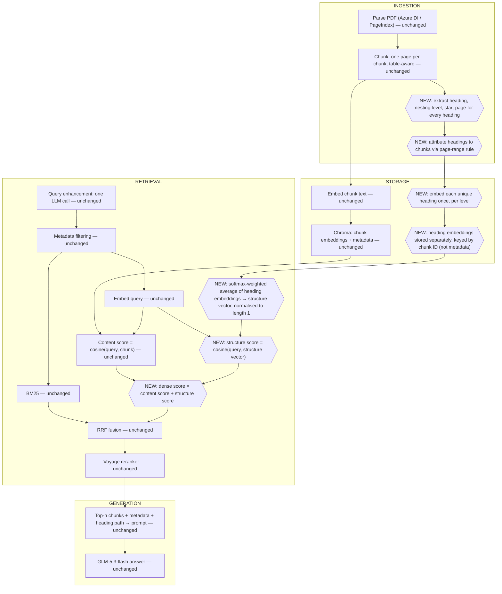

# Experiment 2 — Structure-Aware Retrieval

## Experiment

- **What's being tested:** whether adding document structure to the dense (semantic) score improves retrieval, on top of Experiment 1's pipeline.
- **The one change:** Experiment 2 is Experiment 1 with exactly ONE change — the dense score.
  - Unchanged: parsing, chunking, query enhancement, BM25, RRF, reranker, generation — all identical to Experiment 1.
  - Changed: how chunk-to-query semantic similarity is computed.
    - Instead of only comparing the query embedding to the chunk embedding, the query embedding is also compared to a structure vector built from the chunk's heading path.
    - The two scores are added together.
- **Why structure might help specifically for 10-Ks:**
  - Every 10-K, from any company, is organized into the same four Parts with the same numbered Items in the same order, because the SEC mandates this template (Part I business/risk factors, Part II MD&A and financial statements, Part III governance, Part IV exhibits).
    - This structure is legally fixed and identical across every filer — it's a far more robust signal than inferring headings from inconsistent styling.
  - If a chunk's heading path says "Item 7. MD&A > Liquidity and Capital Resources," that's strong, cheap, reliable evidence about what kind of content the chunk holds, on top of whatever the chunk text itself says.
  - The bet: folding that heading information into the retrieval score should push section-appropriate chunks up the ranking.
    - Especially for questions where the wording of the chunk itself is ambiguous but its section is a dead giveaway (e.g. a number that could be capex or cash flow, but sits under "Investing Activities").
- **Framing:** this is a training-free approximation of Fin-STAR, not a replication.
  - Fin-STAR trains a small model to generate a "virtual node" heading and learns projections for its attention mechanism.
  - Here, everything is done with an off-the-shelf embedding model — no training loop, no labelled data, no loss function.

## Data

- Identical to Experiment 1: FinanceBench, 112 questions across 64 10-K PDFs (`doc_type == "10k"` exactly, excluding the separate `10k_annualreport` type).
- Same five FinanceBench context conditions where applicable, same metrics, same judge.
  - Judge: DeepSeek-V4-Flash via Azure Foundry.
  - Answers generated with `z-ai/glm-5.3-flash` via OpenRouter.
- Keeping the data, model, and generation settings identical to Experiment 1 is deliberate.
  - It isolates the one variable being tested (the dense score), so the comparison between Experiment 1 and Experiment 2 is clean.

## Models / architecture

Same models as Experiment 1:
- **Embedding**: Voyage `voyage-4-lite`, `input_type="document"` for chunks and headings, `input_type="query"` for questions.
- **Reranker**: Voyage reranker API (`rerank-3-lite`).
- **Answer generation**: `z-ai/glm-5.3-flash` via OpenRouter, same settings as every other condition and experiment.
- **Judge**: DeepSeek-V4-Flash via Azure Foundry.
- **Parser**: Azure Document Intelligence `prebuilt-layout` (PageIndex as a live fallback — see Design decisions).

- **The only architectural change is the dense scorer:**
  - Experiment 1's chunk-embedding-only cosine similarity is replaced by chunk-similarity plus structure-similarity.
  - This can't be expressed as a fused ranked list, so it isn't something RRF can produce.
    - It's a small (~20-line) custom `BaseRetriever` subclass that computes a weighted sum of two similarity scores per chunk.

## System design

Full pipeline, stage by stage. Each bullet is marked **UNCHANGED** (identical to Experiment 1) or **NEW** (introduced in this experiment), so the one-change framing stays visible throughout.

**Ingestion**
- **Parse the filing (UNCHANGED).**
  - Azure Document Intelligence `prebuilt-layout` (PageIndex as a live fallback — see Design decisions), producing markdown output plus structural JSON.
  - Cached to disk once, out of Git; chunking never re-parses.
- **Chunk within page boundaries (UNCHANGED).**
  - One chunk = one page, so page-based retrieval metrics stay exact.
  - Tables are their own chunk (split by rows if oversized, header repeated); everything else goes through the 1,024-token splitter.
  - Each chunk carries metadata for filtering: filing type, company ticker, financial year, page number.
- **Extract document structure (NEW).**
  - For every heading in the parsed document, record its text, its nesting level, and its start page.
    - Comes from whichever parser is used — structure source is still open (see Design decisions).
- **Attribute headings to chunks (NEW).**
  - From each heading's start page, compute its page range.
    - The range ends where the next heading at the same or higher nesting level starts.
  - A chunk is given the headings whose range covers the chunk's page.
    - If two headings start on the same page, the chunk is attributed the one that covers more of that page.
  - This gives each chunk a heading path — the list of headings from the top level down to the most specific one that applies to it.

**Storage**
- **Chunk embeddings (UNCHANGED).**
  - `voyage-4-lite`, `input_type="document"`, stored in the vector store alongside chunk metadata, filterable with `where`-style filtering before search.
- **Keyword index (UNCHANGED).**
  - `bm25s` via LlamaIndex's `BM25Retriever`; both indexes support metadata filtering before search.
- **Embed each heading level separately (NEW).**
  - Each heading in a chunk's path is embedded on its own — not joined into one string.
  - Each unique heading text is embedded once and reused across every chunk that shares it, rather than re-embedding the same heading per chunk.
- **Store the heading embeddings (NEW).**
  - Kept separately from chunk embeddings, keyed by chunk ID — not bundled into the chunk's metadata fields.
  - Linked to a chunk via its heading path.

**Retrieval**
- **Query enhancement (UNCHANGED).**
  - One LLM call returns structured JSON: company, year(s), doc_type, a keyword query, and a semantic query.
- **Metadata filtering (UNCHANGED).**
  - Filters chunks before search, by filename (`COMPANY_YEAR_TYPE.pdf`).
  - Falls back to unfiltered search if the filter matches no filing.
- **BM25 search (UNCHANGED).**
  - Runs over the (possibly filtered) chunk set.
- **Dense (semantic) search — CHANGED, this is the one variable.**
  - **Content score (UNCHANGED half).** Cosine similarity between the query embedding and the chunk's own embedding.
  - **Combine heading embeddings into one structure vector (NEW).**
    - The chunk's own embedding is compared (dot product) against each of its heading embeddings, turned into softmax weights.
    - Those weights are used to take a weighted average of the heading embeddings — this weighted average is the chunk's structure vector.
    - It's then normalised to length 1 (an average of length-1 vectors is shorter than 1, so this step matters).
  - **Structure score (NEW).** Cosine similarity between the query embedding and the chunk's structure vector.
  - **Final dense score (NEW).** Content score + structure score.
    - Chunks with no heading fall back to the content score alone.
- **RRF fusion (UNCHANGED).**
  - Combines the BM25 ranked list with the (now structure-aware) dense score ranked list, k=60.
- **Reranking (UNCHANGED).**
  - Voyage reranker (`rerank-3-lite`) over the fused top-k (retrieval depth 10) to produce the final top-n context.
  - The reranker only ever sees chunk text — not the structure score (see Metrics, pre/post-rerank reporting).

**Generation**
- **Context assembly (partly NEW).**
  - Same `[Document | Page | Section]` shape as Experiment 1.
  - The Section field is now populated from the chunk's heading path, which only exists because of this experiment's ingestion changes.
- **Answer model (UNCHANGED).**
  - GLM-5.3-flash via OpenRouter, same settings as every other condition and experiment.

## Theory

- **The core idea, in words first.**
  - Each chunk has a heading path — a small set of ancestor section headings.
  - Embed the chunk and embed each heading in its path separately.
  - Ask "how similar is this chunk to each of its own headings?"
    - That similarity, turned into softmax weights, tells you how much to trust each heading level.
  - Use those weights to take a weighted average of the heading embeddings.
    - That weighted average is a single "structure vector" summarising where in the document this chunk sits.
  - This is exactly an attention mechanism (query = chunk embedding, keys and values = heading embeddings), except with no learned projection matrices — they're just the identity.
- **The key move: concatenate, don't merge.**
  - Instead of averaging the structure vector into the chunk embedding, or replacing the chunk embedding with it, the two are conceptually concatenated into one longer vector — structure vector followed by chunk embedding.
    - So the chunk's own content embedding is preserved untouched, just living in its own half of the vector.
  - At query time, the query embedding is duplicated into both halves to match.
- **Why concatenation matters: it decomposes.**
  - The dot product of two concatenated vectors is just the sum of the dot products of their matching halves.
  - So the final retrieval score splits cleanly into two independent pieces added together:
    - a structural-relevance term (query vs. structure vector)
    - a content-relevance term (query vs. chunk embedding)
- **The result that actually matters for implementation.**
  - Because the score decomposes additively, there's no need to build a real double-length vector store.
  - Compute the two similarity scores separately, with ordinary single-length embeddings, and add them.
  - No training, no labelled data, no access to model internals — just the same off-the-shelf embedding model used twice.

## Design decisions

- **Structure source: still OPEN.**
  - Either Azure Document Intelligence or PageIndex works with the same method, as long as it gives each heading, its nesting level, and its start page.
  - This needs to be checked on 2-3 filings before committing — specifically whether Azure's `sections` actually nest correctly and whether Item headings sit at the top level, or whether PageIndex is needed instead.
- **HiChunk cut.**
  - HiChunk's chunk-point predictor needs a fine-tuned model run over vLLM, which needs a GPU. Not used here.
- **SLM virtual node deferred.**
  - Fin-STAR's virtual node (a small model generating an extra synthetic heading from the chunk's own content) is not implemented in this experiment.
  - It's added later if time allows.
- **Fin-STAR depth limit of 5, applied now.**
  - If a chunk's heading path has more than 5 levels, the excess is dropped by removing the deepest headings.
  - (Fin-STAR's other constraint, discriminativeness, only applies to the virtual node, so it doesn't apply until that's added.)
- **Softmax divisor (temperature) is a config setting, starting value 0.05.**
  - This departs from the √d used in the theory above, and it's worth explaining why.
  - With `d=1024`, √d = 32. Heading-to-chunk similarities sit roughly between -1 and 1, so dividing by 32 squashes all of them very close to 0 before the softmax.
    - This means every heading level ends up weighted almost equally, and the "weighted average" collapses into a plain average regardless of which heading is actually most relevant.
  - Measured on synthetic vectors (top 10 of 500 chunks, compared against the plain-average/equal-weights version):
    - a divisor of 1 returns about 9.8 of the same top-10 chunks as equal weights (effectively the same system)
    - a divisor of 0.05 returns about 7.3 of the same 10 (a genuinely different, more selective system)
  - So 0.05 is the starting default because it's the setting that actually makes the weighting do something.
- **Normalise the structure vector to length 1.**
  - An average of several length-1 vectors is shorter than 1, so this normalisation has to happen explicitly before the structure score is computed.
- **Heading embeddings are stored separately, keyed by chunk ID — not in metadata.**
  - They're linked to a chunk via its heading path, not bundled into the chunk's metadata fields.
- **Chunks with no heading fall back to the chunk score alone.**
  - There's no structure term to add if there's no heading path, so the content score is used unchanged.

## Metrics

- Same as Experiment 1: page recall, page precision, page MRR, answer accuracy from the judge, plus token usage/latency/cost per answer.
  - All segmented by question type, cognitive skill, and condition as in the benchmark.
- **One addition specific to Experiment 2:** page metrics must be reported both before and after reranking, not just after.
  - The reranker only sees chunk text (not the structure score).
  - So if Experiment 2's structural gain shows up in the pre-rerank ranking but gets washed out by the reranker afterwards, that's an important finding in itself.
  - It would be invisible if only post-rerank metrics were reported.

## Baseline and ablations

Build ladder:

- **(A) Experiment 1** — equivalent to this system with the structure weight set to zero. This is the baseline.
- **(B) Heading path, no virtual node** — the version actually built in this experiment: structure vector from real ancestor headings only.
- **(C) Path + virtual node** — Fin-STAR's SLM-generated synthetic heading added into the path. Deferred.

A vs. B alone is a complete Experiment 2 result.

Optional extra: a divisor comparison, comparing the softmax divisor of 1 (≈ equal-weight averaging) against 0.05 (the selective default), to show how much the weighting choice itself changes retrieval — not a required part of the main result.

## Results

*(placeholder — no results yet)*

### A vs. B (headline result)

- Page recall:
- Page precision:
- Page MRR:
- Answer accuracy:

### Pre- vs. post-reranking

- Page metrics before reranking:
- Page metrics after reranking:

### Divisor comparison (optional extra)

- Divisor = 1:
- Divisor = 0.05:

### Failure-mode notes

-
