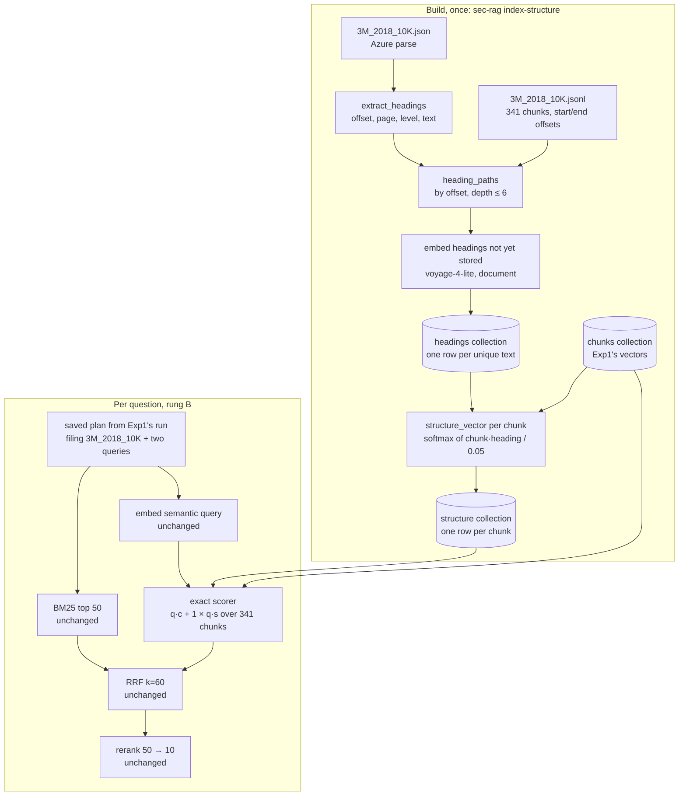
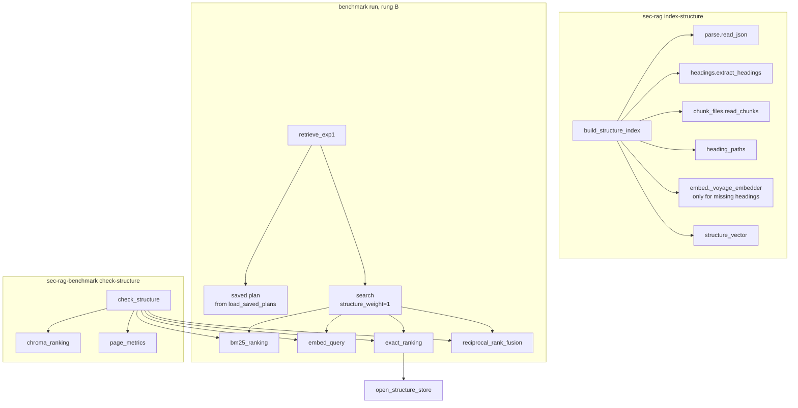

# Experiment 2 Implementation Guide — Stages 3.1 Heading Paths, 3.2 Heading Embeddings, 3.3 Scorer and 3.4 Verify and Run

> **For agentic workers:** REQUIRED SUB-SKILL: Use
> `superpowers:subagent-driven-development` or
> `superpowers:executing-plans` to implement one approved vertical slice at a
> time. Steps use checkbox (`- [ ]`) syntax for tracking.

**Goal:** rung B of Experiment 2 — Exp1 with one change, the dense score gains
a structure term from each chunk's heading path — built, checked against
Exp1 at weight 0, run on single-store and shared-store, and reported against
rung A with pre-rerank page metrics.

**Architecture:** a build command attributes Azure's raw headings to Exp1's
chunks, embeds each unique heading once and saves one structure vector per
chunk in two new Chroma collections. At query time, `search` with a non-zero
`structure_weight` scores every chunk in the filtered filing exactly in
numpy, as `q · chunk + weight × q · structure`, instead of asking Chroma for
its nearest 50. Everything else is Exp1's code, and rung B reuses the query
plans Exp1's full run saved.

**Tech Stack:** `chromadb` (already installed) for the two new collections;
`voyageai` (installed) to embed headings; `numpy` (installed) for the scorer.
No new dependency.

**Requirements:** `docs sys design/Build Order.md` → Stage 3;
`docs sys design/Systems Design Draft.md` → chunking rule 6, Embed chunk →
Experiment 2, Semantic search → Experiment 2; `docs sys design/Exp 2/Exp 2.md`.

## Global constraints

- Python 3.12, managed with `uv`; no new dependency (CLAUDE.md → Project
  constraints).
- Exp1 with exactly one thing changed: parsing, chunks, query enhancement,
  BM25, RRF, reranker, answer prompt and model settings are Exp1's, untouched
  (CLAUDE.md → Invariants).
- Retrieval stays ONE function: `search(..., structure_weight=0)`. At 0 it is
  exactly Exp1's code path, so rung A is never re-run.
- The heading path feeds only the scorer; the answer model still sees
  `[Document | Page]` blocks with no section label.
- Azure's raw heading levels, unchanged: the heading fix (3.0) is deferred, a
  stated limitation (Build Order 3.0).
- Deferred, not built: the heading fix (3.0), the virtual node (rung C), the
  divisor comparison, the no-filing fallback at scale.
- Every paid command has a no-spend default; tests make no paid call.
- Every run is labelled `exp2` / `heading-path` in its config snapshot and
  reports.

---

## Gate 1 — Architecture and libraries

### What this stage does, in plain terms

Exp1 ranks a chunk for the semantic search by one number: how close the
question's vector is to the chunk's vector. Exp2 adds a second number: how
close the question is to the chunk's *headings*. A chunk under
"Item 8 > Consolidated Statement of Cash Flows" should rise for a capex
question even when its own text is only a table of figures.

Three pieces make that possible:

1. **Heading path per chunk (3.1).** Azure's parse already lists every
   heading with its position, page and nesting level. A chunk's path is every
   heading "open" anywhere in its span, found by character offset.
2. **Heading and structure vectors (3.2).** Each unique heading text is
   embedded once. Each chunk's structure vector is a weighted average of its
   headings' vectors, weighted by how similar each heading is to the chunk
   itself, and saved. It never depends on the question, so it is built once.
3. **The scorer (3.3).** For each question, read the chosen filing's chunk
   and structure vectors (~330 each), score every chunk, keep the top 50,
   and hand that list to RRF exactly where Chroma's list went before.

Then 3.4 checks the new scorer at weight 0 reproduces Exp1's ranking, and
runs rung B.

### The golden path, with one real question

3M 2018's capital-expenditure question, shared-store. The plan Exp1 saved
chose `3M_2018_10K`, keyword query "3M FY2018 capital expenditure purchases
of property, plant and equipment cash flow statement":



### Components

| Component | Call | Why, and where to read it |
|---|---|---|
| Heading list | `extract_headings(raw)` (`ingestion/headings.py`), already built | Gives offset, page, Azure level and tidied text per heading. Measured over the 64 filings: 20,789 headings, 9,640 unique texts, levels 0-10, none unplaced. |
| Chunk offsets | `start_offset`, `end_offset` on each chunk record (Stage 1.3) | Raw positions in the same Azure `content` the heading offsets use, so the two can be compared directly. |
| Headings collection | raw `chromadb` collection `headings_voyage-4-lite_1024`, `get` / `add` | One row per unique text, ID = SHA-256 of the text; doubles as the embedding cache. Read: Chroma docs "add", "get" (`chroma-local` skill). |
| Structure collection | raw `chromadb` collection `structure_voyage-4-lite_1024`, `upsert`, `get(where=...)` | One row per chunk with a heading path; build settings saved on the collection's metadata. Raw client, not LlamaIndex's wrapper, because only `get` is needed, never similarity search. |
| Heading embeddings | `voyageai.Client.embed(texts, input_type="document", ...)` | Same model, length and type as the chunks, so heading and chunk vectors are comparable. Read: `docs/libraries/voyage/embeddings.md` lines 60-82. |
| Scorer | ~30 lines of numpy in `search.py` | Real cosines, not LlamaIndex's `exp(-distance)` score (`chroma/base.py` line 472), so the two terms can be added. |
| Saved plans | Exp1 full run's `predictions.jsonl` → `search_plan`, keyed by (question, condition) | Rung B skips the GLM call so the plan cannot differ from A's. Checked: all 224 (question, condition) keys are unique. |

### Decisions for Gate 1

Three choices the design documents did not settle. Each has a recommendation.

**1. How rung B gets its settings — DECIDED 29 Sep 2026: two Exp2 config
files.** B needs `experiment = "exp2"`,
`variant = "heading-path"`, `structure_weight = 1` and the saved-plans path,
while Exp1's settings stay as they are.

- **Chosen: two Exp2 config files.** `configs/financebench-exp2.toml`
  and `configs/sec_rag-exp2.toml`, copies of Exp1's files with those keys
  changed, run with `--config configs/financebench-exp2.toml`. A test loads
  each pair and fails if they differ anywhere except the allowed keys, so the
  copies cannot drift from Exp1 unnoticed. That test is the "one thing
  changed" invariant, enforced.
- Rejected: editing Exp1's config files in place for the run. It leaves `main`
  in Exp2's state, and a later Exp1 rerun silently becomes Exp2.
- Rejected: a small override layer merging an Exp2 file over Exp1's. New
  merging code for two files.

**2. The depth limit — DECIDED 29 Sep 2026: 6, by chain depth.** A
heading's depth is its position in the chain of headings open at that point
(1 = outermost), as Draft → chunking rule 6 states; a heading deeper than 6
joins no path. 6 rather than Fin-STAR's 5 because false top headings such as
the SEC cover text push real ones one level deeper on raw levels. Measured
over the 64 filings: 543 of 20,789 headings are dropped (2.6%), against
1,986 at 5. Chain depth, not Azure's level number, so a rare skipped level
(1, 3, 7) costs nothing; the two counts differ by 29 headings.

**3. How the weight-zero check runs — DECIDED 29 Sep 2026: its own
command.**

- **Chosen: `sec-rag check-structure`.** For each of
  the 224 rows in A's run it re-embeds the saved semantic query, then
  compares Chroma's top 50 with the scorer's top 50 at weight 0, and
  computes A's pre-rerank page recall, precision and MRR with BM25 + RRF +
  the weight-0 scorer. Retrieval only: no GLM call, no rerank, no answer.
  Cost: 224 query embeddings, inside the free allowance.
- Rejected: a full benchmark run at weight 0. It also pays for answers and
  judging (~$0.40) that the check does not need.

### Edge cases

- **A chunk with no heading open** (text before a filing's first heading):
  no structure row; its structure score is 0, so it keeps the content score
  alone (Draft → Semantic search → Experiment 2).
- **A heading deeper than 6 in its chain:** dropped from every path it would join.
- **Two chunks under the same heading text:** one headings row, shared.
- **The build settings changed** (divisor or depth limit) since the
  structure collection was built: the run stops with "rebuild with
  `sec-rag index-structure`". Rebuilding is local, with no Voyage call.
- **Shared-store falls back to no filing:** the scorer reads every chunk
  (21,039 rows). Slow but correct; A had no fallbacks.
- **A question missing from the saved plans:** stop with an error naming it,
  rather than calling GLM and breaking "the dense score is the only
  difference".

### Rejected

- A `BaseRetriever` subclass: `search.py` calls Chroma directly, so a plain
  function beside `_vector_ranking` is the smaller change (decided 29 Sep).
- Chroma's nearest 50, then adding the structure score: misses chunks that
  structure lifts from outside the content top 50.
- A double-length vector store: the concatenated score equals the two scores
  added, so there is nothing to store twice.
- Storing structure vectors in a `.npz` file: one storage system for every
  vector instead (decided 29 Sep).

### Scope

Builds: heading attribution, the headings and structure collections, the
`sec-rag index-structure` command, the scorer behind `structure_weight`,
plan reuse, the Exp2 config pair, `sec-rag check-structure`, rung B's run,
judging and report, and the results in `Exp 2.md`.

Deferred: the heading fix (3.0), the virtual node (rung C), the divisor
comparison, a scalable index for the no-filing fallback.

### Traceability

| Requirement | Lands in |
|---|---|
| 3.1 heading path by offset, open headings, set in document order | heading attribution |
| 3.1 depth ≤ 6, drop the deepest | heading attribution (decision 2) |
| 3.2 each unique heading embedded once, stored apart, keyed by text | headings collection |
| 3.2 structure vector per chunk at ingestion; build settings recorded | structure collection, `index-structure` |
| 3.3 softmax over chunk·heading, divisor 0.05, normalised | structure vector |
| 3.3 exact score over the filtered filing, top 50, real cosines | scorer |
| 3.3 no heading → content score alone | scorer |
| 3.4 weight-zero check, overlap and A's pre-rerank metrics | `check-structure` (decision 3) |
| 3.4 plug: weight in config, same `search` | Exp2 config pair (decision 1) |
| 3.4 B reuses A's saved plans | plan reuse |
| 3.4 B = `exp2` / `heading-path`, 224 jobs, judged | the run |

## Gate 2 — Files, data and interfaces

### Files

| File | Change | Responsibility |
|---|---|---|
| `src/sec_rag/indexing/structure.py` | create | Stages 3.1-3.2: heading paths per chunk, heading embeddings, structure vectors, and the two collections. One module because they form one build, run by one command |
| `src/sec_rag/retrieval/search.py` | modify | Stage 3.3: the exact scorer behind `structure_weight`; the query embedding and Chroma search split into public steps so the check can reuse them |
| `src/sec_rag/retrieval/exp1.py` | modify | pass `structure_weight` from config to `search`; reuse saved plans when configured |
| `src/sec_rag/config.py` | modify | validate the new `[structure]` section and `query_enhancement.reuse_plans_from` |
| `src/sec_rag/cli.py` | modify | `sec-rag index-structure [--execute-paid]` |
| `src/sec_rag_benchmark/evaluation/structure_check.py` | create | Stage 3.4's weight-zero check. In the benchmark package because it scores page metrics against gold pages, which the system never sees |
| `src/sec_rag_benchmark/cli.py` | modify | `sec-rag-benchmark check-structure [--execute-paid]` |
| `configs/sec_rag.toml` | modify | `[structure]` and `reuse_plans_from = ""`, at Exp1's values |
| `configs/sec_rag-exp2.toml`, `configs/financebench-exp2.toml` | create | rung B's config pair (decision 1) |
| `tests/test_structure.py` | create | attribution, softmax, build with a fake embedder |
| `tests/test_search.py`, `tests/test_exp1.py`, `tests/test_sec_rag_config.py` | modify | scorer, plan reuse, config validation |
| `tests/test_exp2_configs.py` | create | the Exp2 files differ from Exp1's only in the allowed keys |
| `tests/test_structure_check.py` | create | overlap and pre-rerank metrics on tiny indexes |

Not changed: chunking, the chunk files, BM25, the chunk collection, query
enhancement's prompt, rerank, generation, the benchmark runner and
reporting. `report` already reads pre-rerank fields, so B's report needs no
new code.

### How the modules call each other

**Benchmark run, rung B — what happens for one question** (3M's capex
question, shared-store):

1. **`retrieve_exp1` gets the question**, the same entry point Exp1 used;
   the benchmark calls it once per question.
2. **It fetches the saved plan instead of asking GLM.** In Exp1, GLM chose
   the filing and wrote the two search queries. For rung B,
   `load_saved_plans` has already read Exp1's results file, so the plan is
   looked up: filing `3M_2018_10K`, keyword query "3M FY2018 capital
   expenditure…", semantic query "How much did 3M spend on capital
   expenditures…". Identical to A's, so it cannot be the cause of any
   difference.
3. **It calls `search` with `structure_weight=1`**, Exp1's search with one
   number changed. Inside `search`:
   - `bm25_ranking` — keyword search inside the 3M filing, top 50. Exactly
     Exp1's.
   - `embed_query` — turns the semantic query into a vector with Voyage.
     Exactly Exp1's.
   - `exact_ranking` — the only new step. It loads the vectors of all 341
     chunks in the 3M filing from the chunk collection, and their structure
     vectors (the headings' blended vector) from the structure collection;
     `open_structure_store` opens that collection, first checking it was
     fully built with the right settings. For each chunk it computes
     score = (question · chunk) + 1 × (question · headings), and keeps the
     top 50. In Exp1 this step was Chroma's "give me the 50 nearest
     chunks", which only looks at the chunk vector.
   - `reciprocal_rank_fusion` — merges the BM25 list and the new semantic
     list into one ranking, as in Exp1.
4. **Back in `retrieve_exp1`**, the reranker picks the best 10 and GLM
   answers from them. Both unchanged, so they are not drawn below.

So rung B is Exp1 with only the semantic ranking step swapped.

**check-structure:** run `exact_ranking` with the heading part switched off
(weight 0). The score is then just question · chunk, which is what Chroma
computes, so the two should agree.



### Configuration

Added to `configs/sec_rag.toml`, at the values that keep Exp1 exactly Exp1:

```toml
[structure]
max_depth = 6            # chain depth; one more than Fin-STAR's 5 (Gate 1, decision 2)
softmax_divisor = 0.05   # T in softmax(chunk·heading / T) (Build Order 3.3)
weight = 0.0             # 0 = Exp1, Chroma's search; non-zero = the exact scorer

[query_enhancement]
reuse_plans_from = ""    # "" = call GLM (Exp1); a run folder = reuse its saved plans
```

`configs/sec_rag-exp2.toml` is a copy with `weight = 1.0` and
`reuse_plans_from = "results/20260928-202531--exp1--full"`.
`configs/financebench-exp2.toml` is a copy with `experiment = "exp2"`,
`variant = "heading-path"` and `sec_rag_config = "configs/sec_rag-exp2.toml"`.
`test_exp2_configs.py` fails if either pair differs anywhere else.

`max_depth` and `softmax_divisor` are build settings: they shape the saved
structure vectors. `weight` and `reuse_plans_from` are run settings.

Validation (`config.py`): `max_depth` a positive whole number;
`softmax_divisor` a number above 0; `weight` a number of at least 0;
`reuse_plans_from` a string, resolved against the project root when not
empty, like the corpus paths.

Adding keys changes `sec_rag.toml`'s bytes, so a resume of rung A's folder
would now refuse (its snapshot differs). A is complete, so nothing resumes it.

### Records, following one 3M chunk

The chunk is `3M_2018_10K:p59:c1`, the cash-flow statement's table. Its
record in `chunks/3M_2018_10K.jsonl` is unchanged from Exp1 and supplies
`start_offset` and `end_offset`.

**1. Its heading path**, from `heading_paths` (computed with the prototype of
the rule, 29 Sep): every heading open anywhere in its span, in document
order, each once, chain depth ≤ 6:

```python
[
    "3M Company and Subsidiaries Consolidated Statement of Income Years ended December 31",
    "3M Company and Subsidiaries Consolidated Balance Sheet At December 31",
    "3M Company and Subsidiaries Consolidated Statement of Cash Flows Years ended December 31",
]
```

The first two are wrong ancestors, the raw-levels limitation from Build
Order 3.0: Azure put the three statements at levels 1, 2 and 3, so they
stack as if nested. The softmax is what copes: the table's own vector is
closest to the cash-flow heading, so that heading gets most of the weight.

**2. A headings row**, one per unique text, in `headings_voyage-4-lite_1024`:

```python
{
    "id": "9f2c…",  # sha256 of the text, hex
    "embedding": [...1024 floats...],  # voyage-4-lite, input_type="document"
    "metadata": {"text": "3M Company and Subsidiaries Consolidated Statement of Cash Flows Years ended December 31"},
}
```

**3. A structure row**, one per chunk with a path, in
`structure_voyage-4-lite_1024`:

```python
{
    "id": "3M_2018_10K:p59:c1",  # same ID as the chunk
    "embedding": [...1024 floats, length 1...],  # structure_vector(...)
    "metadata": {
        "doc_name": "3M_2018_10K",  # for the filter
        "heading_path": "3M Company … Statement of Income … > … Balance Sheet … > … Cash Flows …",  # inspection only
    },
}
```

The collection's own metadata records how its vectors were built:

```python
{"max_depth": 6, "softmax_divisor": 0.05, "complete": True}
```

`complete` is False while a build runs and True once every filing is saved,
so a crashed build cannot be searched half-finished.

**4. The saved plan rung B reuses**, from rung A's
`predictions.jsonl` → `search_plan`, keyed by (question, condition):

Same shape as Exp1's search plan (Exp 1 → Implementation Guide 2.1-2.3 →
Records), with one key added. Values are A's single-store row for this
question:

```python
{
    "filename": "3M_2018_10K",
    "keyword_query": "3M FY2018 capital expenditure purchases of property, plant and equipment cash flow statement",
    "semantic_query": "How much did 3M spend on capital expenditures, i.e., purchases of property, plant and equipment, in fiscal year 2018 according to the cash flow statement?",
    "enhancement_status": "ok",  # or "invalid_reply"
    "call": {  # A's GLM call, kept as saved
        "requested_model": "z-ai/glm-5.3-flash",
        "returned_model": "z-ai/glm-5.3-flash",
        "usage": {...},
        "cost": 0.00008407,
        "latency_seconds": 2.7,
        "reply_text": '{"filename": "3M_2018_10K", "keyword_query": ...}',
    },
    "reused_from": "20260928-202531--exp1--full",  # added by B
}
```

Keeping A's `call` means `job.py` records A's query-enhancement cost on B's
row, which is what `Exp 2.md` → Metrics asks for ("carried over"). B's
retrieval latency excludes the GLM call, so latency is compared without it.

**5. The check's output**, `results/<timestamp>--exp2--weight-zero-check/structure_check.json`:

```python
{
    "rows": 224,
    "mean_top50_overlap": 49.98,  # expected; exact figure is the result
    "min_top50_overlap": 49,
    "pre_rerank": {  # A's pre-rerank metrics, computed with the exact scorer at weight 0
        "single_store": {"page_recall": ..., "page_precision": ..., "page_mrr": ...},
        "shared_store": {...},
    },
    "embedding_tokens": ...,
}
```

plus `structure_check_rows.jsonl`, one row per (question, condition) with its
overlap and page metrics, and a copy of the `sec_rag.toml` it used.

### Interfaces, main function first

**`indexing/structure.py`**

```python
def build_structure_index(config: dict, execute_paid: bool = False,
                          embedder: Embedder | None = None) -> dict[str, int]
```
The whole build. Reads each filing's parse and chunks, attributes paths,
compares the needed heading texts with the headings collection, reports.
Without `execute_paid`, stops after the report if any heading is missing.
Otherwise embeds the missing ones, then rebuilds the structure collection
from scratch (local, no Voyage call). So the no-flag command is free but
not read-only: once every heading is stored, it rewrites the structure
collection in Chroma, which is how a divisor change is applied. Returns
`{"filings", "chunks", "chunks_with_path", "unique_headings", "stored_headings", "to_embed",
"estimated_tokens"}`, plus `"embedded"`, `"tokens_billed"` and
`"structure_rows"` when it built.

```python
def heading_paths(headings: list[Heading], chunks: list[dict],
                  max_depth: int) -> dict[str, list[str]]
```
Chunk ID → heading texts. For each chunk, replay the headings up to its
`end_offset` with the stack rule (close every open heading at the same or a
deeper level, then open this one). The path is the headings open at
`start_offset` plus every heading opened inside the span, keeping only
those at chain depth ≤ `max_depth`, each text once, in document order. A
chunk with no heading open gets no entry. Replaying per chunk rather than
sweeping once keeps each chunk independent: 341 chunks × ~300 headings is
instant.

```python
def structure_vector(chunk_vector: np.ndarray, heading_vectors: np.ndarray,
                     divisor: float) -> np.ndarray
```
`s = V @ c`, `a = softmax(s / divisor)`, `h = a @ V`, returned at length 1
(Build Order 3.3). Inputs normalised first.

```python
def open_structure_store(config: dict) -> chromadb.Collection
```
The structure collection, for searching. Raises ValueError "rebuild with
`sec-rag index-structure`" when it is missing, not `complete`, or built with
a `max_depth` or `softmax_divisor` other than the config's.

**`retrieval/search.py`**

```python
def search(keyword_query, semantic_query, *, method, doc_name, top_k,
           indexes, structure_weight=0.0) -> dict
```
Unchanged signature and return. At `structure_weight == 0` it runs exactly
as now. Otherwise the semantic ranking is `exact_ranking(...)` instead of
`chroma_ranking(...)`; BM25 and RRF are untouched.

```python
def embed_query(indexes: SearchIndexes, text: str) -> tuple[np.ndarray, int]
def chroma_ranking(indexes, query_vector, doc_name) -> list[tuple[str, float]]
def exact_ranking(indexes, query_vector, doc_name,
                  structure_weight: float) -> list[tuple[str, float]]
def bm25_ranking(indexes, query, doc_name) -> list[tuple[str, float]]
```
`embed_query` and `chroma_ranking` are today's `_vector_ranking` split in
two, so the check can send one query vector to both rankings.
`bm25_ranking` is today's `_bm25_ranking`, made public for the check.
`exact_ranking` reads the filing's chunk rows and structure rows with
`get(where={"doc_name": ...}, include=["embeddings"])`, scores
`C @ q + weight × (S @ q)` with a missing structure row scoring 0, and
returns the top `candidates_per_search`, ties broken by chunk ID.

`SearchIndexes` gains `structure: chromadb.Collection | None`.
`open_search_indexes` fills it with `open_structure_store(config)` when
`config["structure"]["weight"] != 0`, else None.

**`retrieval/exp1.py`**

```python
def load_saved_plans(run_dir: Path) -> dict[tuple[str, str], dict]
```
(question, condition) → `search_plan`, from the latest successful row per
job in `predictions.jsonl`. Raises if a key repeats.

`Exp1Resources` gains `saved_plans: dict | None`, filled by `open_exp1` when
`reuse_plans_from` is set. `retrieve_exp1` looks the plan up under
(question, "single_store" if the scope is one filing else "shared_store")
and raises ValueError naming the question if absent; otherwise it calls
`enhance_query` as now. It passes `structure_weight=config["structure"]["weight"]`
to `search`.

**`sec_rag_benchmark/evaluation/structure_check.py`**

```python
def check_structure(benchmark_config_path: Path, baseline_run_dir: Path,
                    execute_paid: bool = False) -> dict
```
For each row of the baseline run: embed its saved semantic query once;
overlap = |Chroma's top 50 ∩ `exact_ranking` at weight 0's top 50|; A's
pre-rerank chunks = `reciprocal_rank_fusion` of `bm25_ranking` and
`exact_ranking` at 0, top `retrieval_depth`, scored with `page_metrics`
against the row's `gold_pages`. Without `execute_paid`, reports the row
count and estimated query tokens only.

### Library facts this relies on

Checked on the installed `chromadb` 1.5.9 in a throwaway database, 29 Sep
2026 (read alongside `.claude/skills/chroma-local/querying/python.md`,
"include"):

- `get(where={"doc_name": ...}, include=["embeddings"])` returns the
  vectors as one numpy array, rows in the same order as `ids`.
- `upsert` replaces an existing ID's vector and metadata.
- A collection's `metadata` can be set at creation and read back; `modify`
  changes it.
- At most 5,461 rows per write (`client.get_max_batch_size()`), so writes go
  one filing at a time (~330 rows).
- Collection names need 3-512 characters from `[a-zA-Z0-9._-]`.

### Reading order

`build_structure_index` → `heading_paths` → `structure_vector` →
`open_structure_store`; then `search` → `exact_ranking`; then
`retrieve_exp1` → `load_saved_plans`; then `check_structure`.

## Gate 3 — Slices and tests

Four slices, in order. Slices 1-3 are code, each with its own commit on
`exp2-structure` (in `.worktrees/exp2-structure`); slice 4 is the run and the
write-up, and changes no code. Tests use `tests/conftest.py`'s `index_config`
(a temp corpus with tiny BM25 and Chroma indexes) and fake embedders, so no
test spends.

Before slice 1: commit today's design edits and this guide on `main`, then
`git merge main` inside the worktree, so the code starts from the approved
design.

### Slice 1: heading paths and the two collections (`sec-rag index-structure`)

**Purpose:** every chunk with a heading path gets a structure vector, saved
and marked complete, built from Azure's raw headings.

**Files:** create `src/sec_rag/indexing/structure.py`, `tests/test_structure.py`;
modify `src/sec_rag/config.py`, `src/sec_rag/cli.py`, `configs/sec_rag.toml`,
`tests/test_sec_rag_config.py`, `tests/test_sec_rag_cli.py`.

**Reading path:** `build_structure_index` → `heading_paths` →
`structure_vector` → `open_structure_store`.

**Pseudocode:**

Step 1 reuses Stage 1.1-1.2's functions, no new code:

1. `json_path(config, doc_name)` gives where the saved Azure parse lives:
   `parsed_dir/<doc_name>.json`.
2. `read_json(path)` loads that file into a Python dict. If the file is
   missing or corrupt, it raises an error that names the filing.
3. `extract_headings(raw)` turns the dict into a list of
   `Heading(offset, page, level, text)` rows, sorted by position in the
   document.

`open_structure_store(config)` raises ValueError("structure vectors not
built, or built with other settings: rebuild with `sec-rag index-structure`")
when the collection is missing, `complete` is not True, or its `max_depth` or
`softmax_divisor` differ from the config's.

```python
def heading_paths(headings, chunks, max_depth):
    """Chunk ID -> the heading texts open anywhere in that chunk (chunking rule 6).

    Stack rule, as build_page_map: a new heading closes every open heading
    at the same or a deeper level, then opens. A heading's chain depth is
    its position in the stack after it opens (1 = outermost). Replayed per
    chunk so each chunk's answer depends only on its own offsets.
    """
    # A heading outside Azure's section tree has level None and can't be
    # compared with the stack. None of the 20,789 has one; refuse, don't guess.
    for heading in headings:
        if heading.level is None:
            raise ValueError(f"heading at offset {heading.offset} has no level: {heading.text!r}")
    paths = {}
    for chunk in chunks:
        stack = []            # open headings, outermost first
        open_at_start = []    # the stack as it stood when the chunk began
        opened_inside = []    # headings starting inside the chunk's span
        for heading in headings:                     # sorted by offset
            if heading.offset >= chunk["end_offset"]:
                break
            while stack and stack[-1].level >= heading.level:
                stack.pop()
            stack.append(heading)
            if heading.offset < chunk["start_offset"]:
                open_at_start = list(stack)
            elif len(stack) <= max_depth:
                opened_inside.append(heading)
        # Chain depth <= max_depth drops the deepest (Gate 1, decision 2).
        kept = open_at_start[:max_depth] + opened_inside
        texts = list(dict.fromkeys(h.text for h in kept))   # each once, in order
        if texts:
            paths[chunk["chunk_id"]] = texts
    return paths


def structure_vector(chunk_vector, heading_vectors, divisor):
    """Softmax-weighted average of a chunk's heading vectors (Build Order 3.3)."""
    c = chunk_vector / norm(chunk_vector)
    V = heading_vectors / norm(heading_vectors, axis=1, keepdims=True)
    similarities = V @ c                       # chunk-to-heading, NOT query-to-heading
    scaled = similarities / divisor
    weights = exp(scaled - scaled.max())       # minus the max: same softmax, no overflow
    weights = weights / weights.sum()
    blended = weights @ V
    return blended / norm(blended)             # an average of unit vectors is shorter than 1


def build_structure_index(config, execute_paid=False, embedder=None):
    # 1. every filing's paths, from its cached parse and its chunk file
    for doc_name in the prepared filings:
        headings = extract_headings(read_json(json_path(config, doc_name)))
        chunks = read_chunks(config, doc_name)
        paths[doc_name] = heading_paths(headings, chunks, max_depth)
    # 2. compare the needed texts with the headings collection
    needed = every unique text across all paths
    stored = headings.get(ids=[sha256(text) for text in needed], include=[])["ids"]
    missing = texts whose hash is not stored
    report = counts + estimated tokens (count_tokens, as embed.py)
    if missing and not execute_paid:
        return report                          # nothing sent, no key read
    # 3. embed the missing headings, in embedding.batch_size batches, saving
    #    each batch before the next so a crash loses one batch at most
    # 4. rebuild the structure collection from scratch: delete it, create it
    #    with {"max_depth", "softmax_divisor", "complete": False}; per filing,
    #    read its chunk vectors (chunk collection, where doc_name) and its
    #    heading vectors (headings, by hash), compute structure_vector for
    #    each chunk with a path, upsert the filing's rows
    # 5. modify the metadata to "complete": True
    return report | {"embedded", "tokens_billed", "structure_rows"}
```

**`structure_vector`, step by step.** A chunk has vector $c$ and headings
$h_1, \dots, h_n$ (its path, $n \le 6$); $\tau$ is the divisor (0.05).

1. Make every vector length 1, so a dot product is a cosine (i.e. divide vector by its length, which is RMSE of all vector values. Hence, 0 = unrelated, 1 = perfectly related, -1 = opposite direction):

   $$\hat c = \frac{c}{\lVert c \rVert}, \qquad \hat h_i = \frac{h_i}{\lVert h_i \rVert}$$

   Voyage already returns length-1 vectors; this is a safeguard.

2. How close each heading is to the **chunk** (not the question, so it is
   fixed at build time and stored once):

   $$s_i = \hat h_i \cdot \hat c$$

3. Softmax: turn those into weights that sum to 1. Dividing by $\tau$
   multiplies the gaps by 20, so the closest heading takes most of the weight:

   $$w_i = \frac{e^{s_i/\tau}}{\sum_{j=1}^{n} e^{s_j/\tau}} = \frac{e^{(s_i - s_{\max})/\tau}}{\sum_{j} e^{(s_j - s_{\max})/\tau}}$$

   The two forms are equal ($e^{-s_{\max}/\tau}$ cancels top and bottom); the
   code uses the second so `exp` never overflows.

4. Weighted average of the headings:

   $$b = \sum_{i=1}^{n} w_i \, \hat h_i$$

5. Back to length 1. An average of vectors pointing different ways is
   shorter than 1, and by a different amount per chunk, which would shrink
   some chunks' structure scores more than others:

   $$\text{structure} = \frac{b}{\lVert b \rVert}$$

At question time the scorer adds it to the content score, with query
vector $\hat q$ and weight $\lambda$ (0 for A, 1 for B):

$$\text{score} = \hat q \cdot \hat c + \lambda \, (\hat q \cdot \text{structure})$$

**Worked example** (made-up similarities, a 3M cash flow chunk):

| Heading | $s_i$ | $s_i/\tau$ | $e^{(s_i - s_{\max})/\tau}$ | $w_i$ |
|---|---|---|---|---|
| Item 8. Financial Statements | 0.40 | 8 | $e^{-4} = 0.018$ | 0.01 |
| Consolidated Statement of Cash Flows | 0.60 | 12 | $e^{0} = 1.000$ | 0.72 |
| Purchases of PP&E | 0.55 | 11 | $e^{-1} = 0.368$ | 0.27 |

Each $w_i$ is its exp value over their sum, 1.386. The structure vector is
mostly "Cash Flows", partly "PP&E", barely "Item 8": the broad heading half
the filing shares hardly counts. A small $\tau$ gives nearly all the weight
to the closest heading (test 7); a large $\tau$ makes the weights equal, a
plain average (test 8).

**Tests (`tests/test_structure.py`):**

1. `test_path_is_the_open_headings_in_document_order` — Item 7 (level 1) then
   Liquidity (level 2) before a chunk → `["Item 7", "Liquidity"]`.
2. `test_same_or_higher_level_closes_a_heading` — Item 7, then Item 8 (level 1)
   before the chunk → `["Item 8"]`.
3. `test_a_chunk_spanning_two_headings_gets_both` — Part I open, Item 2 and
   Item 3 start inside → `["Part I", "Item 2", "Item 3"]` (the Draft's example).
4. `test_headings_deeper_than_max_depth_are_dropped` — a chain of 8, max 6 →
   the outer 6.
5. `test_repeated_text_appears_once`.
6. `test_a_chunk_before_any_heading_has_no_path`.
7. `test_structure_vector_has_length_one_and_favours_the_closest_heading` —
   two headings, one parallel to the chunk: weight > 0.99 at divisor 0.05.
8. `test_a_large_divisor_approaches_the_plain_average` — divisor 1,000 → within
   1e-3 of the normalised mean.
9. `test_dry_run_reports_and_sends_nothing` — fake embedder never called;
   report counts right.
10. `test_paid_build_embeds_only_missing_headings` — the fake embedder is
    not called on the second build.
11. `test_build_marks_the_collection_complete_with_its_settings`.
12. `test_open_structure_store_refuses_other_settings_or_an_incomplete_build`.
13. `test_a_heading_without_a_level_is_refused`.

Plus `test_sec_rag_config.py`: `[structure]` present and valid; bad
`max_depth`, `softmax_divisor`, `weight` each refused. `test_sec_rag_cli.py`:
`index-structure` delegates with `execute_paid` false by default.

**Then, on the real corpus:**

```bash
uv run sec-rag index-structure --config configs/sec_rag.toml                 # free: headings missing, so report only, writes nothing
set -a && source .env && set +a
uv run sec-rag index-structure --config configs/sec_rag.toml --execute-paid  # paid, inside the free allowance
uv run sec-rag index-structure --config configs/sec_rag.toml                 # free, but writes: rebuilds the structure collection in Chroma, embeds nothing
```

What to look for:

- **Free run (done 29 Sep):** `Filings: 64`, `Chunks: 21039 (21032 with a
  heading path)`, `Unique headings: 9493`, `To embed: 9493`, `Estimated
  tokens: 99,372`, `Nothing sent`. 9,493, not the 9,640 unique texts in the
  corpus: 147 appear only deeper than 6, so no path uses them. The 7 chunks
  without a path sit before their filing's first heading.
- **Paid run (done 29 Sep):** 75 `batch n/75` lines, then `Embedded now:
  9493`, `Structure vectors saved: 21032`. Tokens billed ~92k, under the
  99,372 estimate: the estimate counts with cl100k, Voyage with its own
  tokeniser.
  If it stops part-way, rerun the same command: finished batches are kept.
- **Second free run:** `Already embedded: 9493`, `To embed: 0`, `Embedded
  now: 0`, `Structure vectors saved: 21032`.
- **Spot check:** `3M_2018_10K:p59:c1`'s stored `heading_path` is the three
  statement headings in Gate 2's record 1 (the free attribution already
  gives exactly that list):

```bash
uv run python -c "
from sec_rag.config import load_config
from sec_rag.indexing.structure import open_structure_store
row = open_structure_store(load_config('configs/sec_rag.toml')).get(ids=['3M_2018_10K:p59:c1'])
print(row['metadatas'][0]['heading_path'])"
```

**Commit:** `Build heading paths and structure vectors`.

### Slice 2: the scorer, plan reuse and the Exp2 configs

**Purpose:** `search` with a non-zero weight ranks by content + structure;
`retrieve_exp1` reuses saved plans; rung B's config pair exists and is
provably Exp1's plus the allowed changes.

**Files:** modify `src/sec_rag/retrieval/search.py`,
`src/sec_rag/retrieval/exp1.py`, `tests/test_search.py`, `tests/test_exp1.py`;
create `configs/sec_rag-exp2.toml`, `configs/financebench-exp2.toml`,
`tests/test_exp2_configs.py`.

**Reading path:** `search` → `exact_ranking`; `retrieve_exp1` →
`load_saved_plans`.

**Pseudocode:**

```python
def exact_ranking(indexes, query_vector, doc_name, structure_weight):
    """Score every chunk in scope as q·chunk + weight × q·structure (Build Order 3.3).

    Exact, not Chroma's nearest 50: a chunk structure lifts from outside the
    content top 50 would otherwise never be scored. Real cosines, since every
    vector is length 1, unlike the exp(-distance) LlamaIndex reports.
    """
    where = {"doc_name": doc_name} if doc_name else None
    chunk_rows = indexes.store.client.get(where=where, include=["embeddings"])
    q = query_vector / norm(query_vector)
    C = normalise rows of chunk_rows["embeddings"]
    scores = C @ q                                          # content
    if structure_weight != 0:
        structure_rows = indexes.structure.get(where=where, include=["embeddings"])
        structure_by_id = dict(zip(structure_rows["ids"], normalised rows))
        for i, chunk_id in enumerate(chunk_rows["ids"]):
            if chunk_id in structure_by_id:                 # no heading -> content alone
                scores[i] += structure_weight * (structure_by_id[chunk_id] @ q)
    ranked = sorted(zip(chunk_rows["ids"], scores), key=lambda p: (-p[1], p[0]))
    return ranked[: indexes.config["retrieval"]["candidates_per_search"]]
```

In `search`, the semantic branch becomes: `vector, tokens =
embed_query(...)`; then `exact_ranking(...)` if `structure_weight != 0`,
else `chroma_ranking(...)`. The `NotImplementedError` goes.

In `retrieve_exp1`: `plan = _saved_plan(...)` when `resources.saved_plans`
is set, else `enhance_query(...)` as now; `search(...,
structure_weight=config["structure"]["weight"])`.

**Tests:**

1. `test_exact_ranking_at_weight_zero_ranks_by_cosine` — hand-made vectors;
   order and scores equal numpy's cosines.
2. `test_structure_lifts_a_chunk_with_a_matching_heading` — two chunks equally
   close to q; the one whose structure vector is parallel to q ranks first at
   weight 1, second-equal at 0.
3. `test_a_chunk_without_a_structure_row_keeps_its_content_score`.
4. `test_exact_ranking_respects_the_filter`.
5. `test_search_uses_chroma_at_weight_zero_and_the_scorer_otherwise` —
   replaces `test_structure_weight_is_refused_until_exp2`.
6. `test_saved_plan_is_used_and_glm_is_not_called` — fake OpenRouter client
   that fails if called.
7. `test_a_question_missing_from_the_saved_plans_is_refused`.
8. `test_load_saved_plans_keys_by_question_and_condition`.
9. `test_exp2_configs_differ_only_in_the_allowed_keys` — loads both pairs as
   dicts; allowed: `run.experiment`, `run.variant`, `run.sec_rag_config`,
   `structure.weight`, `query_enhancement.reuse_plans_from`.

**Then:** `uv run sec-rag-benchmark run --config configs/financebench-exp2.toml --dry-run`
→ expect 224 jobs, no key needed.

**Commit:** `Score chunks with their heading structure`. The configs are
result-affecting, so they go in their own commit:
`Add the Exp2 heading-path run configs`.

### Slice 3: the weight-zero check (`sec-rag-benchmark check-structure`)

**Purpose:** prove the scorer at weight 0 reproduces Exp1, and produce A's
pre-rerank page metrics from the same code B uses.

**Files:** create `src/sec_rag_benchmark/evaluation/structure_check.py`,
`tests/test_structure_check.py`; modify `src/sec_rag_benchmark/cli.py`.

**Pseudocode:**

```python
def check_structure(benchmark_config_path, baseline_run_dir, execute_paid=False):
    rows = latest successful rows of baseline_run_dir/predictions.jsonl
    if not execute_paid:
        return {"rows": len(rows), "estimated_query_tokens": ...}
    # The Exp2 config has weight 1, so this also opens the structure
    # collection: the check refuses to run before index-structure is built.
    indexes = open_search_indexes(sec_rag_config, voyage_client())
    for row in rows:
        plan = row["search_plan"]
        doc_name = row["filter_doc_name"]           # A's filter, as it searched
        vector, tokens = embed_query(indexes, plan["semantic_query"])
        chroma_50 = chroma_ranking(indexes, vector, doc_name)
        exact_50 = exact_ranking(indexes, vector, doc_name, 0.0)
        overlap = len(ids(chroma_50) & ids(exact_50))
        fused = reciprocal_rank_fusion(
            [ids(bm25_ranking(indexes, plan["keyword_query"], doc_name)), ids(exact_50)],
            k=rrf_k)
        pre_rerank = chunks for fused[:retrieval_depth]
        metrics = page_metrics(row["gold_pages"], pre_rerank, retrieval_depth)
        append {job_id, condition, overlap, **metrics}
    write structure_check_rows.jsonl, structure_check.json, sec_rag.toml copy
```

**Tests (`tests/test_structure_check.py`, tiny indexes, fake Voyage):**

1. `test_dry_run_reads_no_key_and_counts_rows`.
2. `test_identical_rankings_give_full_overlap` — on the tiny corpus the
   exact and Chroma rankings agree, overlap = the list length.
3. `test_pre_rerank_metrics_match_page_metrics_on_the_fused_list`.
4. `test_summary_averages_per_condition`.

**Then:**

```bash
uv run sec-rag-benchmark check-structure --config configs/financebench-exp2.toml --baseline-run-dir results/20260928-202531--exp1--full               # free
set -a && source .env && set +a
uv run sec-rag-benchmark check-structure --config configs/financebench-exp2.toml --baseline-run-dir results/20260928-202531--exp1--full --execute-paid
```

**Pass:** mean overlap ≥ 49.5 of 50, and A's weight-0 pre-rerank page
recall within 0.01 of A's reported pre-rerank recall in each condition. If
not, stop: the scorer, not the headings, would explain any A vs B gap.

**Commit:** `Check the structure scorer at weight zero`.

### Slice 4: rung B's run, report and results (no code)

```bash
set -a && source .env && set +a
uv run sec-rag-benchmark run --config configs/financebench-exp2.toml --limit 5                   # paid smoke: 10 jobs
uv run sec-rag-benchmark run --config configs/financebench-exp2.toml                             # paid: 224 jobs, ~$0.40
uv run sec-rag-benchmark judge --config configs/financebench-exp2.toml --run-dir results/<B>    # paid
uv run sec-rag-benchmark export-manual-review --run-dir results/<B>
uv run sec-rag-benchmark import-manual-review --run-dir results/<B>                             # after reviewing
uv run sec-rag-benchmark report --run-dir results/<B> --oracle-run-dir results/20260917-012959--financebench--baseline-context-conditions-v1
```

Smoke pass: every row's `search_plan.reused_from` is A's folder, and no
query-enhancement call appears in OpenRouter's usage.

Then record in `Exp 2.md` → Results: A vs B page recall, precision and MRR
before and after reranking, per condition (A's pre-rerank from the check);
answer accuracy; the check's overlap; failure-mode notes. If time runs out,
cut the judged answers first (Build Order → cut 3): page metrics alone are
the minimum result.

### Verification, every code slice

```bash
uv run ruff format --check src tests
uv run ruff check .
uv run mypy src/
uv run pytest -q
uv lock --check
git diff --check
```
