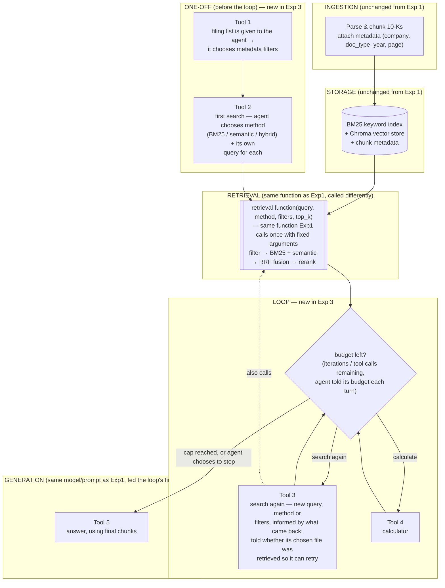

# Experiment 3 — Agents: LLMs autonomously using tools in a loop

## Experiment

- Experiments 1 and 2 both do a single fixed pass: retrieve once with fixed arguments, then generate.
  - Experiment 3 replaces that fixed pass with a loop.
    - the model uses tools to choose its own metadata filters, choose its own retrieval method and queries, look at what came back, decide to search again if it needs to, and calculate — instead of retrieving once and being handed whatever comes back.
  - The case for this: [Anthropic's effective context engineering piece](https://www.anthropic.com/engineering/effective-context-engineering-for-ai-agents) makes the case for letting agents intelligently navigate files, THEN load their contents into context, rather than deciding everything up front.
  - If the first search picks the wrong filing, the wrong method, or a bad query, a fixed pipeline has no way to recover.
    - whatever came back is what the model answers from.
    - an agent that can see its own retrieval result and re-search should recover from exactly those failures.
- Experiment 3 builds on Experiment 1's retrieval, not a new retrieval system.
  - the retrieval function itself — query, retrieval method (BM25 / semantic / hybrid), metadata filters, top_k — is the same one Experiment 1 calls with fixed arguments.
  - Experiment 3's search tool is this same function, with the agent choosing those arguments at runtime.
  - Getting this wrong (i.e. writing retrieval twice) would mean any difference in results couldn't be cleanly attributed to the loop rather than to a different retriever.
  - The same discipline applies to query enhancement.
    - the query-enhancement prompt lives in one place, called by both — Exp1 calls it once up front, Exp3's agent does the same job through its own tool steps.
    - otherwise the two experiments quietly diverge and the comparison stops being clean.
- So the question this experiment answers: does letting the model navigate and re-search, on top of the exact same retrieval building blocks as Experiment 1, do better than one fixed retrieve-then-answer pass?
  - and if so, how much of that gain is retry-on-failure versus calculation/verification (see Baseline and ablations).

## Data

Same as Experiment 1:
- FinanceBench, filtered to `doc_type == "10k"` — 112 questions across 64 10-K PDFs.
- Same five-condition structure and same page-level gold evidence, keyed as `(doc_name, page_num)` pairs.
- Same judge: DeepSeek-V4-Flash via a direct-from-Azure Microsoft Foundry deployment, following Zheng et al. — different model from the generator, given the correct reference answer before grading, graded twice with answer order swapped, only trusting a verdict both passes agree on, outputting a binary correct/incorrect.
- Same metrics base: page recall, page precision, page MRR, answer accuracy, token usage/cost — see Metrics below for what Exp3 adds on top.

## Models / architecture

- Same generator model, same settings, same answer prompt as every other condition and experiment.
  - `z-ai/glm-5.3-flash` via OpenRouter, chosen from the FAB v2 leaderboard on accuracy/cost efficiency.
  - the rule: same model, settings and answer prompt across every condition and experiment, so only retrieval differs.
  - Experiment 3 has one deliberate, stated deviation from that rule — see budget-in-prompt under Design decisions.
- What changes for Exp3 is not the model but the loop and the tools around it.
  - the model is now called before and between retrievals, not once after a single fixed retrieval.

## System design

Experiment 3 reuses Experiment 1's whole pipeline up to generation — parsing, chunking, storage, and the retrieval function itself are untouched. The loop and its tools are the only new piece, so each stage below says what is unchanged and what is new, to keep any difference in results attributable to the loop.

**Ingestion — unchanged from Experiment 1**
- Parse each 10-K PDF with Azure Document Intelligence's `prebuilt-layout` model, producing markdown plus structural JSON (pages, paragraphs, tables, sections).
  - the raw JSON is cached to disk once, out of Git, and is the source of truth; the markdown is one field (`content`) inside it, with other fields pointing into it by character position.
  - chunking never re-parses.
- Strip page headers, footers, and printed page numbers before chunking.
  - convert Azure's 1-indexed `pageNumber` to FinanceBench's zero-indexed `evidence_page_num` by subtracting 1 — never use the printed footer page number.
- Document-level metadata (company, doc_type, doc_period) comes from `financebench_document_information.jsonl`, not from parsing.
- Chunk within page boundaries: every chunk covers exactly one page, overlap only within a page.
  - reason: keeps page-based retrieval metrics (recall, precision, MRR) exact.
- Tables are their own chunks; an oversized table is split by rows, repeating the header row. Everything else goes to a 1,024-token recursive/sentence splitter (token count, not character count).
- Each chunk carries metadata for filtering: filing type, company ticker, financial year, page number.
- Nothing here changes for Exp3 — same parser, same chunker, same metadata fields, feeding the same store.

**Storage — unchanged from Experiment 1**
- Keyword index: `bm25s` via LlamaIndex's `BM25Retriever`, same parameters (k1=1.5, b=0.75), filterable by metadata before search.
  - BM25 word statistics still come from the whole corpus even when filtered, same as Elasticsearch, so results stay comparable if the keyword backend is swapped later.
- Vector store: Chroma, holding chunk embeddings (`voyage-4-lite`, `input_type="document"`) plus chunk metadata, also filterable before search (`where`-style filtering).
- Both indexes are the same two Exp1 built — Exp3 adds no new storage.
  - the loop's tools query these same indexes, just more than once and with agent-chosen arguments instead of fixed ones.

**Retrieval — same function and same steps inside it; what's new is who calls it, and how often**
- UNCHANGED: the retrieval function itself takes query, retrieval method (BM25 / semantic / hybrid), metadata filters, and top_k — it is the exact function Experiment 1 calls once with fixed arguments.
  - Experiment 3's search tool is this same function; the agent chooses those arguments at runtime instead of them being fixed.
  - writing retrieval twice would mean any difference in results couldn't be cleanly attributed to the loop rather than to a different retriever.
- UNCHANGED: the query-enhancement prompt lives in one place, called by both experiments.
  - Exp1 calls it once up front; Exp3's agent does the same job through its own tool steps (Tool 1 and Tool 2 below).
- UNCHANGED: inside the function, the same sequence runs on every call.
  - metadata filter first (fall back to unfiltered search if the filter matches no filing).
  - BM25 keyword search and semantic (embedding cosine-similarity) search run in parallel over the (possibly filtered) chunk set.
  - RRF fusion (k=60) combines the two ranked lists via LlamaIndex's `QueryFusionRetriever`.
  - Voyage reranker takes the fused top-k (retrieval depth 10) to the final top-n.
- NEW: the agent decides the arguments for each call, can call the function more than once per question, and sees each call's results before deciding whether to search again, change method/query/filters, calculate, or stop.
  - this is exactly Tools 1-4 in the tool set below.

**Generation — same model, prompt, and context shape; what's new is what feeds it**
- UNCHANGED: `z-ai/glm-5.3-flash` via OpenRouter, same settings and same answer prompt as every other condition and experiment.
  - context blocks use the identical `[Document | Page | Section]` shape used in Exp1, so prompt formatting can't explain a results gap.
- NEW: the chunks handed to the model are whatever the loop ended on — the result of however many searches and re-searches happened — not the output of one fixed retrieval call.
- NEW: the prompt also carries budget/remaining-turns information.
  - reason: Exp3 is the only experiment that can be cut off mid-loop (see Design decisions, budget-in-prompt).

**Tool set (the loop) — new in Exp3**

FINAL TOOL SET: fixed one-off steps first, loop after.

1. **(one-off)** Filing list → metadata filters.
   - give the agent the list of available filings.
   - it chooses metadata filters.
2. **(one-off)** First search.
   - the agent chooses the retrieval method (BM25 / semantic / hybrid) and its own query for each of them.
3. **(loop)** Repeat search.
   - new query, method, or filters, informed by what came back.
   - recursive RAG — use thinking-mode for the feedback loop (ReAct, HiRec).
   - let it also know whether its chosen file was retrieved, so it can retry.
4. **(loop)** Calculator.
5. Answer.

## Deferred tools

Two tools were deliberately left out of Exp3, both noted in the systems design draft as "Deferred":

- **Query decomposition into sub-questions, using Fin-STAR's symbolic logic topology** (∩ / \ / aggregation) — decompose the query into "atomic" sub-queries, use the symbolic logic topology to figure out how they lead to the answer, before doing retrieval, then compare retrieved info against the plan to adjust as you go.
  - This pays off on multi-document questions — which means LOFin, which is deferred. Every FinanceBench question sits inside one filing, so there is no multi-document decomposition problem for this experiment to solve.
- **"Fetch whole page" tool** (PDFTriage pattern) — pull the full page, or the next one, once a promising chunk is found.
  - This targets tables split across pages. It is left out of Exp3's tool set for now, alongside decomposition.

## Design decisions

- **Loop caps.**
  - max iterations (start at 5) and max tool calls.
  - hitting the cap is a **fourth outcome** alongside success / error / `did_not_fit`.
    - skipped on resume, excluded from the accuracy denominator, and counted in reports.
    - so _n_ stays constant across experiments.
  - checkpoint after each question.
  - tell the model its budget in the prompt, and how many iterations remain each turn.
    - so it can answer with what it has instead of being cut off mid-search.
  - this is a **deliberate, stated deviation** from "the answer prompt is identical everywhere".
    - Exp3's prompt carries budget/remaining-turns information that Exp1 and Exp2's prompts don't need, precisely because Exp3 is the only one that can be cut off mid-loop.
- **Reasoning effort.**
  - raise from `low` to `medium` for **all** conditions and experiments (currently `low` in config).
  - if Exp3 uses `high`, that is a deviation to justify in the write-up, or run as a separate ablation row.
- **`max_output_tokens`.**
  - raised from 2048 to 8192.
  - reason: reasoning tokens count as output, and an agent spends them every turn, not just once.
  - headroom is fine — the largest prompt observed is 535,722 tokens of a 1,048,576 budget.
- **Verify well-formed tool calls first.**
  - before building the loop itself, verify the model reliably emits well-formed tool calls.
  - reason: the loop's correctness depends on that being solid first.
- **LlamaIndex's agent for the loop, our own trace.**
  - use LlamaIndex's agent for the loop and its iteration cap (`max_iterations` + `early_stopping_method="generate"`).
    - so a capped run still answers instead of erroring.
  - write the trace ourselves from the tool functions, not from LlamaIndex's event system.
    - each tool appends what it did and what it returned to a per-question list (~3 lines per tool).
    - so it doesn't break when the framework changes its internal events.
  - remaining glue for Exp3: turn the framework's "cap reached" signal into our fourth outcome.

## Harness changes

- `execution/job.py`'s plug changes from "retriever returns chunks" to "pipeline returns answer + final chunks + trace + usage".
  - reason: `job.py` currently runs a fixed sequence — build context → one model call → save. An agent calls the model before and between retrievals, so `job.py` must hand the whole question over instead.
  - consequence: Exp1 and Exp2 then become one-round pipelines behind that same plug.
  - this is the **largest single piece of work** in Experiment 3.
- Page recall/precision are computed on the **final retrieval only**.
  - reason: keeps them comparable with Exp1 and Exp2.
  - decision: not tracking "all chunks seen" as a separate scored set.
    - reason: too much plumbing for the value; the trace already shows what was searched.
- Average _k_ (passages used) is reported.
  - reason: it now varies per question, as LOFin does.
- A trace is saved per question, as its own file next to `predictions.jsonl`.
  - detail: each iteration's filters, query, tool, and results.
  - consequence: this is what makes the failure-mode tree usable for Exp3.

## Metrics

As Experiment 1 — page recall, page precision, page MRR, answer accuracy (judge), token usage/cost — plus, specific to Exp3:
- average _k_ (passages used per question)
- number of loop iterations used
- cap-reached counts

## Baseline and ablations

Ablation ladder:
- **(A)** Experiment 1 single pass.
- **(B)** + retry when retrieval is empty or the wrong filing was chosen.
- **(C)** + calculator and verification.
- A vs B alone is a result.

## Results

_(placeholder — no results yet)_

### Page recall / precision / MRR

### Answer accuracy

### Average k, iterations used, cap-reached counts

### Ablation comparison (A vs B vs C)

### Failure-mode breakdown
