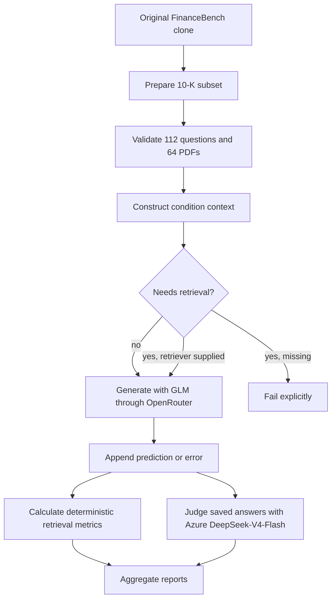
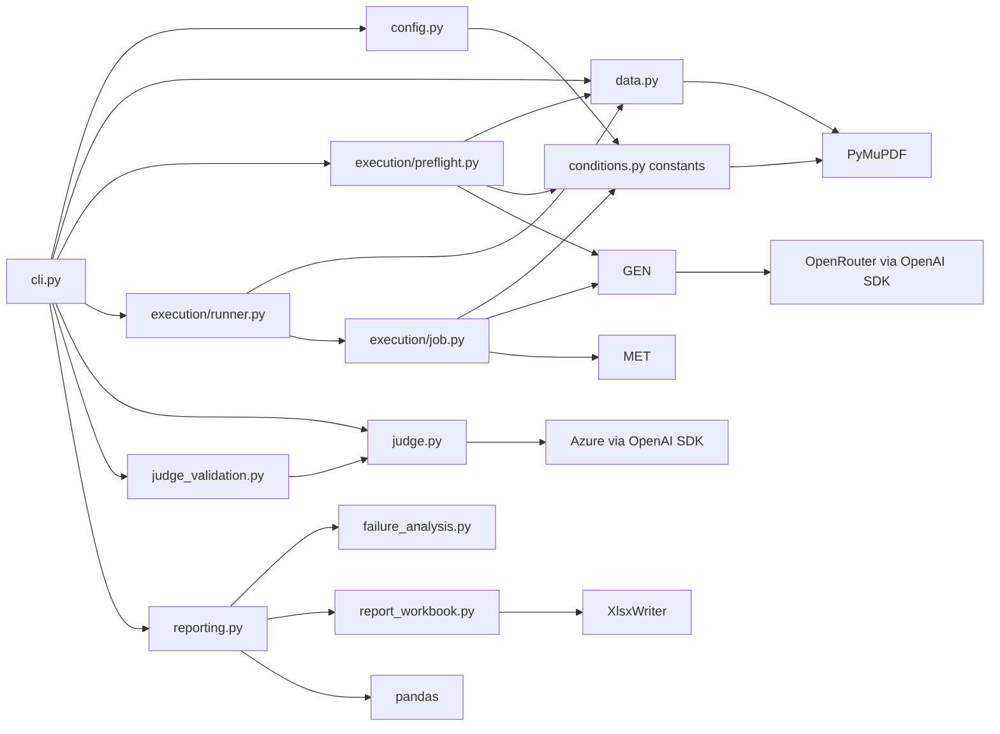
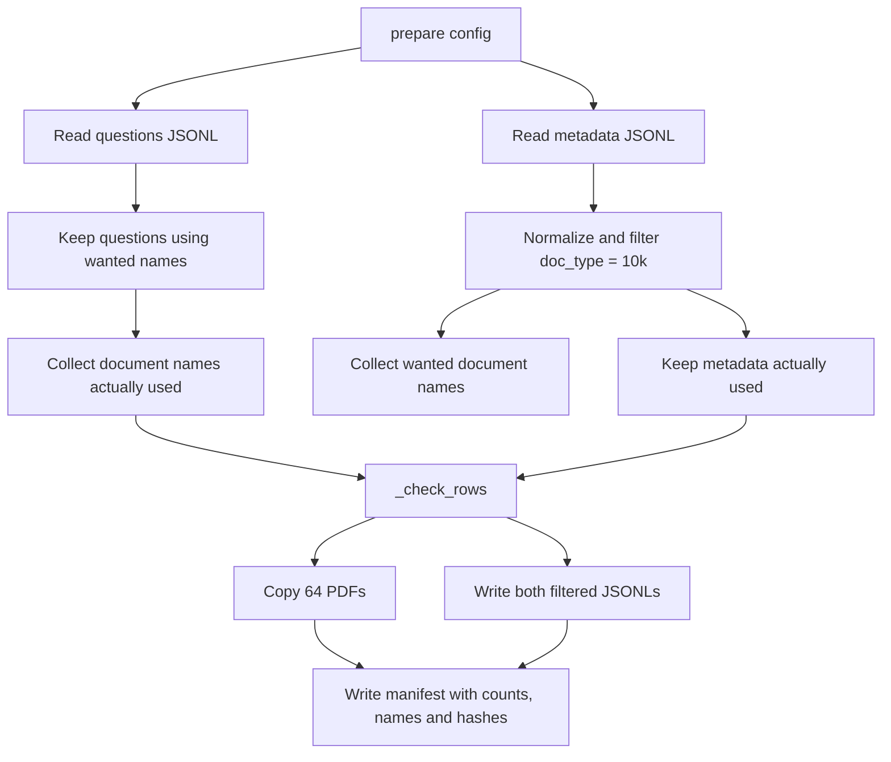
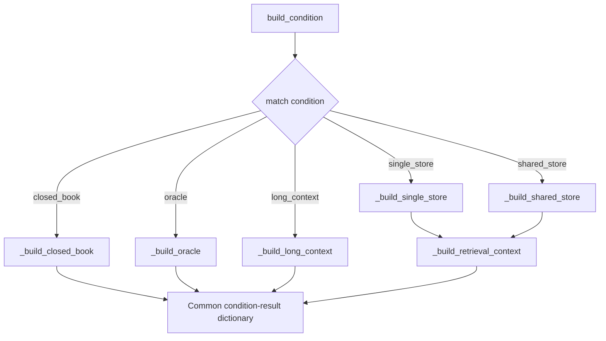
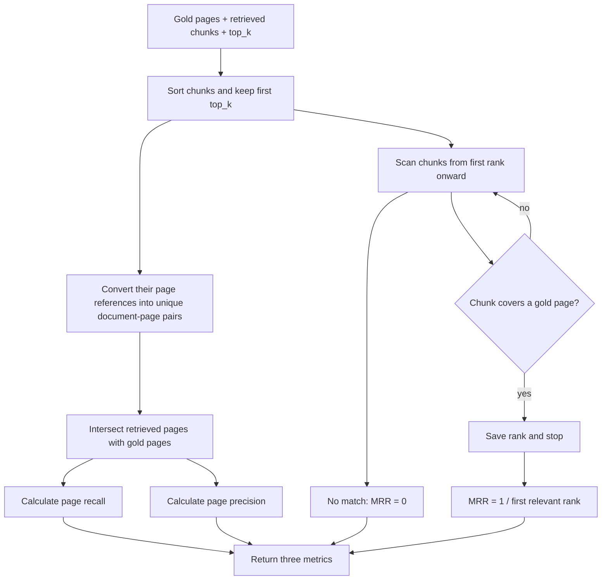
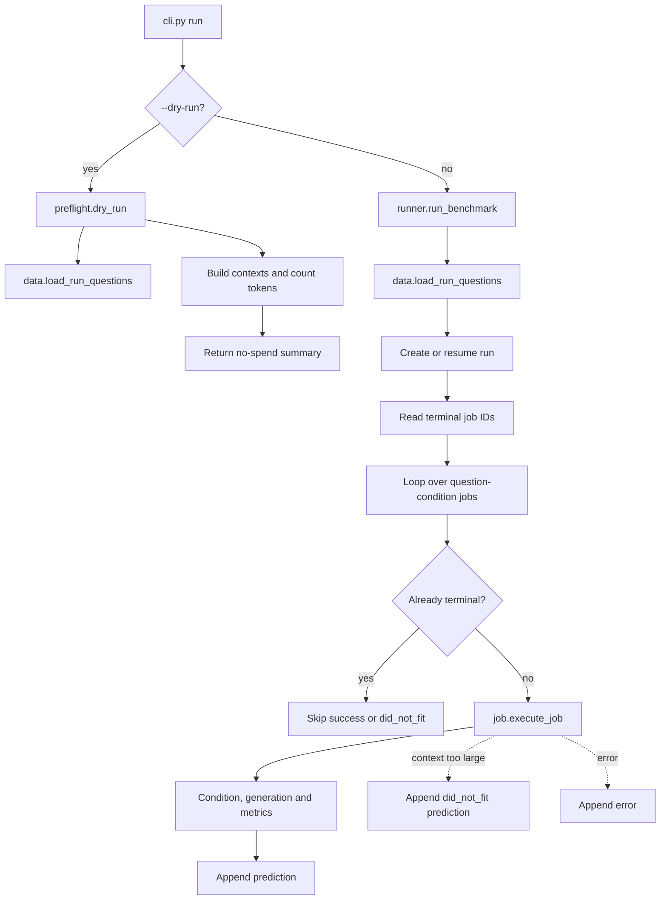
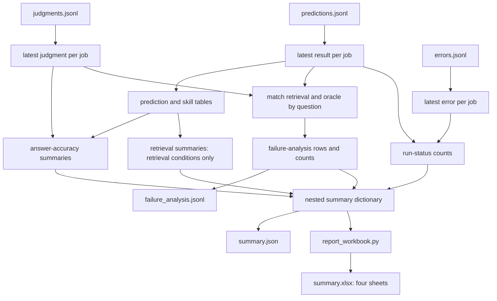
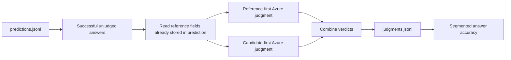
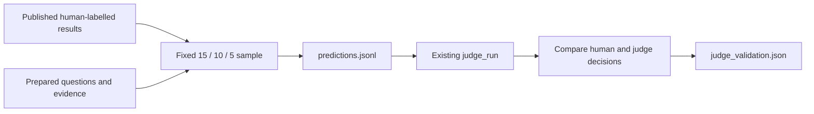
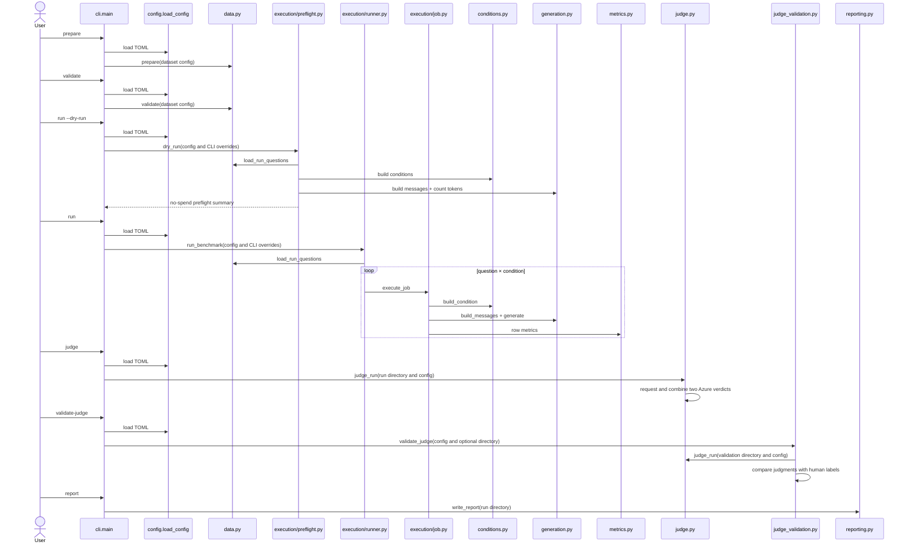

# FinanceBench implementation guide

#THOUGHTS: why we loading pdf table entry instead of actual pdf page itself

Section 15 reconciles this guide with the implemented execution subpackage.

Authoritative requirements: `../Benchmark.md`

Historical inputs only:

- `docs/superpowers/specs/2026-09-07-financebench-benchmark-harness-design.md`
- `docs/superpowers/plans/2026-09-07-financebench-harness-mvp.md`

Those historical documents explain how the first, more engineered implementation
was reached. They are not the current source of truth. This guide explains the
smaller golden-path implementation now present in this repository.

## 1. System purpose and boundary

The current system benchmarks the 112 open-source FinanceBench questions whose
source documents are 10-Ks, across 64 PDFs. It prepares and validates local data,
constructs FinanceBench's five context conditions, generates answers for the
three conditions that do not need a retriever, checkpoints every attempt,
calculates deterministic retrieval metrics, and writes segmented reports.



Currently implemented:

- FinanceBench 10-K preparation and validation;
- five context builders;
- closed-book, oracle, and long-context generation;
- replaceable retrieval interface, without a real retriever;
- page recall, page precision, and page MRR;
- resumable two-pass Azure DeepSeek answer judging and binary accuracy;
- checkpoint/resume and segmented reporting;
- no-spend tests and dry runs.

Deferred:

- real single-store/shared-store retriever and vector store;
- HiREC/LOFin;
- smoke and pattern validation subsets;

The judge implementation is fake-client tested and its one-answer paid Azure
smoke test passed. Validation against published human labels is the next gate.

The approved terminal `did_not_fit` outcome is implemented. The current
1,048,576-token configuration has zero oversized long-context jobs; the
largest measured prompt is 535,722 tokens.

## 2. Project bootstrap and controls

The benchmark is a named package under `src/sec_rag_benchmark/` because its
modules import one another and share one installed command; it also has several dependencies.

This avoids ambiguous
imports such as `from data import ...` and lets `uv run sec-rag-benchmark` invoke
the package consistently.

The following commands bootstrap the equivalent package and dependencies in a
new project directory; they are not claimed as the exact historical commands
originally entered. The project metadata and CLI mapping shown below are then
kept in `pyproject.toml`.

```bash
uv init --package --python 3.12 --name sec-rag-benchmark --build-backend uv
uv add "openai==3.8.0" "pandas==3.0.5" "pymupdf==1.28.2" \
  "transformers==5.17.0" "jinja2==3.1.6" "xlsxwriter==3.2.9"
uv add --dev "pytest==9.1.1"
uv lock
uv sync
```

`uv init` creates the package controls, `uv add` records exact direct
dependencies, `uv lock` resolves the complete dependency graph, and `uv sync`
creates or updates the local virtual environment.

| Tool | Current purpose | Why it is present |
|---|---|---|
| Python 3.12 | Runtime | Stable language baseline selected in `.python-version` |
| `uv` | Package, environment and lockfile management | Recreates direct and transitive dependency versions |
| OpenAI SDK | OpenRouter generation now; Azure DeepSeek judge next | OpenRouter uses Responses; the separate Foundry client uses Chat Completions |
| Transformers + Jinja2 | GLM tokenizer and its chat-template renderer | Counts the formatted prompt before sending it |
| PyMuPDF | PDF page count and text extraction | Conditions and validation operate on physical pages |
| pandas | Build grouped report rows | Reporting calculations are tabular; preparation remains plain JSON |
| XlsxWriter | Render the formatted `summary.xlsx` workbook | It supports separate sheets, section bands and explicit cell formats |
| pytest | Automated checks | Validates the golden path without paid requests |

LangChain, Chroma, Azure-specific libraries, and a vector database are not installed
because the current executable path does not use them. Add them only after their
design is approved.

| Project control | Purpose |
|---|---|
| `.python-version` | Selects Python 3.12 for this repository |
| `pyproject.toml` | Defines the package, direct dependencies, build backend, and CLI |
| `uv.lock` | Pins the complete resolved dependency graph |
| `.venv/` | Generated local environment; ignored by Git |
| `.env.example` | Documents credential names without containing secrets |
| `.env` | Ignored local credentials; the terminal must load them into the process environment |
| `configs/financebench.toml` | Public, editable dataset, generation, and run settings |

In `pyproject.toml`, `[project]` describes the package, `[build-system]` selects
`uv_build` (basically allows you to import src/sec_rag_benchmark), and `[dependency-groups]` contains development-only tools. The CLI
mapping:

```toml
[project.scripts]
sec-rag-benchmark = "sec_rag_benchmark.cli:main"
```
- `uv init` created below package (where we added sec_rag_benchmark):
    ```
    project root/
    ├── pyproject.toml
    └── src/
    ```
- We create the actual source files under `src/sec_rag_benchmark*`
- run `uv sync`, which does
    - reads .toml and uv.lock, creates .venv, sees build-backend 'uv_build'
        - this asks uv_build to 'install' i.e. locate the location of our local project 'sec_rag_benchmark'
        - name 'sec-rag-benchmark' → sec_rag_benchmark
        - since uv build looks under default `src/` directory, finds `src/sec_rag_benchmark`
    - `src/sec_rag_benchmark` is found, .pth lcoation pointer is saved under .venv
    - https://docs.astral.sh/uv/concepts/build-backend/#module
    - By default, a single root module is expected at src/<package_name>/\__init__.py.
- [project.scripts] declares `sec-rag-benchmark = "sec_rag_benchmark.cli:main"`, turn 'main()' function in 'cli.py' into a convenient terminal command called 'sec_rag_benchmark', as it essentially does:
    ```python
    from sec_rag_benchmark.cli import main
    main()
    ```
    - so can call arguments to be used in the parser e.g. `uv run sec-rag-benchmark prepare` runs main() in cli.py, which runs the 'prepare' argument that's parsed


`pyproject.toml` controls the Python project; `configs/financebench.toml` controls a benchmark run.

## 3. File structure and module relationships

Sections 5–12 follow the order in which to read the implementation; each section
identifies its exact source file, function order, and corresponding test.

The run-related modules live together under `execution/`:

```text
configs/financebench.toml          public editable run settings
src/sec_rag_benchmark/
├── config.py                      load and validate TOML configuration
├── data.py                        prepare, validate, load questions
├── conditions.py                  dispatch to five condition builders
├── generation.py                  prompt and OpenRouter request
├── metrics.py                     score one job and normalize skill labels
├── judge.py                       make and checkpoint two-pass Azure judgments
├── judge_validation.py            compare the judge with published human labels
├── failure_analysis.py            classify and summarize retrieval failures
├── reporting.py                   calculate nested report data and write JSON
├── report_workbook.py              render the report data as a workbook
├── execution/
│   ├── preflight.py               no-spend condition and token checks
│   ├── job.py                     execute one question-condition pair
│   └── runner.py                  loop, checkpoint and resume real runs
└── cli.py                         arguments, match/case, output and exit codes
tests/
├── conftest.py                    tiny two-question/PDF fixtures
├── test_failure_analysis.py       focused failure-classification tests
└── test_golden_path.py            compact integration behavior tests
```




## 4. Main data shapes

The preparation command creates this generated local directory:

```text
data/financebench/
├── financebench_open_source_10k.jsonl
├── financebench_document_information_10k.jsonl
├── manifest.json
└── pdfs/
    └── 64 selected FinanceBench PDFs
```

The directory is not committed to Git; it can be reproduced from the read-only
FinanceBench clone. The required libraries and their rationale are listed in
section 2.

### Prepared question

The original question keys are preserved. `load_questions()` adds one in-memory
key without rewriting the stored JSONL:

```python
{
    "financebench_id": "q1",
    "question": "What was revenue?",
    "answer": "$42 million",
    "doc_name": "example_2023_10K.pdf",
    "question_type": "metrics-generated",
    "question_reasoning": "Information extraction",
    "justification": "The reference answer follows from ...",
    "evidence": [
        {
            "doc_name": "example_2023_10K.pdf",
            "evidence_page_num": 12,
            "evidence_text_full_page": "..."
        }
    ],
    "document_metadata": {"doc_type": "10K", "doc_period": "2023", "...": "..."}
}
```

### Condition result
Records info model should receive

```python
{
    "financebench_id": "q1",
    "condition": "oracle",
    "question": "What was revenue?",
    "context": "[Document: ... | Page index: 12]\n...",
    "context_pages": [("example_2023_10K.pdf", 12)],
    "retrieved_chunks": []
}
```

### Future retrieved chunk contract

```python
{
    "chunk_id": "example:12:0",
    "text": "Revenue was $42 million ...",
    "doc_name": "example_2023_10K.pdf",
    "pages": [12],
    "score": 0.91,
    "rank": 1
}
```

### Prediction row

```python
{
    "job_id": "<config-hash>:q1:oracle",
    "status": "success",
    "financebench_id": "q1",
    "question": "What was revenue?",
    "gold_answer": "$42 million",
    "gold_evidence": [
        {
            "doc_name": "example_2023_10K.pdf",
            "evidence_page_num": 12,
            "evidence_text_full_page": "..."
        }
    ],
    "human_justification": "The reference answer follows from ...",
    "model_answer": "$42 million",
    "eval_mode": "oracle",
    "question_type": "metrics-generated",
    "cognitive_skills": ["information_extraction"],
    "gold_pages": [["example_2023_10K.pdf", 12]],
    "retrieved_chunks": [],
    "page_recall": None,
    "page_precision": None,
    "page_mrr": None,
    "requested_model": "z-ai/glm-5.3-flash",
    "request_id": "response_...",
    "returned_model": "z-ai/glm-5.3-flash",
    "provider": "Z.AI",
    "usage": {},
    "cost": None,
    "latency_seconds": 0.1,
    "completed_at": "2026-09-16T12:00:00+00:00"
}
```

No answer-accuracy field is written during generation. The judge reads this
saved row, which already contains all reference inputs it needs, and persists
its decision separately. `cost` is retained from OpenRouter's usage metadata
when returned and is otherwise explicitly `null`.

### Judgment row

`src/sec_rag_benchmark/judge.py` appends one combined result after both
judge calls complete:

```python
{
    "job_id": "<config-hash>:q1:oracle",
    "status": "complete",
    "accuracy": 1,
    "manual_review": False,
    "prompt_version": "financebench-binary-judge-v2",
    "requested_model": "DeepSeek-V4-Flash",
    "passes": [
        {
            "prompt_order": "reference_first",
            "verdict": 1,
            "reason": "The candidate gives the same value as the reference.",
            "returned_model": "DeepSeek-V4-Flash",
            "request_id": "resp_...",
            "usage": {},
            "latency_seconds": 1.2
        },
        {
            "prompt_order": "candidate_first",
            "verdict": 1,
            "reason": "The answers agree after equivalent numeric formatting.",
            "returned_model": "DeepSeek-V4-Flash",
            "request_id": "resp_...",
            "usage": {},
            "latency_seconds": 1.1
        }
    ],
    "completed_at": "2026-09-16T12:01:00+00:00"
}
```

`accuracy` is `1` or `0` only when both passes agree. It is `None` and
`manual_review` is `True` when they disagree. A `did_not_fit` prediction has no
candidate answer, so it is not sent to the judge.

### Failure-analysis row

Reporting joins each retrieval-condition result to the oracle result for the
same `financebench_id`. It writes the diagnosis separately from generation and
judging so neither source record is rewritten:

```python
{
    "job_id": "<config-hash>:q1:shared_store",
    "oracle_job_id": "<config-hash>:q1:oracle",
    "financebench_id": "q1",
    "eval_mode": "shared_store",
    "question_type": "metrics-generated",
    "cognitive_skills": ["numerical_reasoning"],
    "analysis_status": "classified",
    "oracle_accuracy": 1,
    "condition_accuracy": 0,
    "target_documents": ["example_2023_10K.pdf"],
    "retrieved_documents": ["different_2023_10K.pdf"],
    "retrieved_target_document": False,
    "page_recall": 0.0,
    "page_precision": 0.0,
    "page_mrr": 0.0,
    "failure_category": "retrieval_context_failure",
    "failure_subtype": "wrong_document",
    "manual_review": False,
    "classification_rule": "No retrieved chunk came from the target filing",
    "condition_judge_reasons": ["The candidate used a value from another filing."],
    "oracle_judge_reasons": ["The oracle answer matches the reference."]
}
```

`analysis_status` distinguishes a completed classification from an unjudged
answer, a judge disagreement or missing comparison data. The category and
subtype are conclusions supported by the recorded fields; they do not replace
those fields.

### Accuracy summary row

`reporting._answer_accuracy_for_subset()` returns one row describing one
selected group of predictions:

```python
{
    "report_view": "condition",
    "eval_mode": "oracle",
    "total_predictions": 112,
    "agreed_judgments": 105,
    "disagreements": 4,
    "unjudged": 2,
    "did_not_fit": 1,
    "accuracy_excluding_did_not_fit": 0.86,
    "accuracy_including_did_not_fit": 0.85,
}
```

The caller first selects the predictions belonging to the group. Any extra
named arguments in the function call are collected into the temporary
`subset_identity` dictionary. `**subset_identity` inserts those labels into
the returned row; it is not stored as a nested dictionary.

| Report view | Extra named arguments | Resulting `subset_identity` |
|---|---|---|
| Overall | none | `{}` |
| Condition | `eval_mode="oracle"` | `{"eval_mode": "oracle"}` |
| Generation method | `question_type="calculated"` | `{"question_type": "calculated"}` |
| Cognitive skill | `cognitive_skill="numerical_reasoning"` | `{"cognitive_skill": "numerical_reasoning"}` |
| Cross-tab | both fields | `{"question_type": "calculated", "cognitive_skill": "numerical_reasoning"}` |

### Judge-validation rows

`validation_sample.jsonl` records the published human decision being tested:

```python
{
    "job_id": "judge-validation:financebench_id_03029",
    "financebench_id": "financebench_id_03029",
    "source_result_file": "gpt-4_oracle.jsonl",
    "source_model": "gpt-4",
    "source_eval_mode": "oracle",
    "human_label": "Correct Answer",
    "expected_accuracy": 1,
    "candidate_answer": "The FY2018 capital expenditure was $1,577 million.",
}
```

`judge_validation.json` records whether the completed gate passed:

```python
{
    "status": "complete",
    "passed": True,
    "source_commit": "cc39aeb4afdf33909ee1412188bf89035950c2eb",
    "source_file_hashes": {...},
    "completed": 30,
    "agreements": 28,
    "agreement_rate": 0.9333,
    "minimum_agreement": 0.90,
    "by_human_label": {...},
    "confusion_matrix": {...},
    "mismatches": [...],
}
```

An input that fails the context preflight instead records this terminal row in
`predictions.jsonl`:

```python
{
    "job_id": "<config-hash>:q1:long_context",
    "status": "did_not_fit",
    "financebench_id": "q1",
    "eval_mode": "long_context",
    "model_answer": None,
    "error": "Complete prompt and output reserve exceed the context window"
}
```

It preserves the job in the condition's denominator but is never sent to either
generation or judging again.

## 5. Configuration loading and routing

`config.load_config()` reads `configs/financebench.toml` and routes its sections
as follows:

```text
[dataset]    → data.py preparation, validation, paths, and expected counts
[generation] → generation.py model request and context limits
[judge]      → judge.py Azure request, prompt version, and judge limits
[judge_validation] → judge_validation.py sample quotas, seed, and pass threshold
[run]        → execution modules: experiment/variant labels, conditions,
               retrieval depth, and results path
```

`src/sec_rag_benchmark/config.py` has one responsibility: load and verify the
TOML configuration.

```text
load_config(config_path):
    read the TOML file into a dictionary
    resolve dataset and results paths relative to the repository root
    verify configured condition names
    verify the OpenRouter/provider requirements
    verify GLM generation and Azure judge settings
    return the validated top-level configuration dictionary
```

It is separate because the TOML contains dataset, generation and run settings.
Experiment settings that can affect results remain visible in
`configs/financebench.toml`.

The public benchmark configuration sets
`reasoning_effort = "high"`, `max_output_tokens = 8192`, and
`retrieval_depth = 10`. GLM-5.3-Flash supports `low`, `high` and `max`; using a
supported value avoids OpenRouter silently mapping an unsupported level. The
8,192-token output limit gives high-effort reasoning and the visible answer
room within the same response budget.

```toml
[generation]
reasoning_effort = "high"
max_output_tokens = 8192
token_safety_margin = 1024
```

The run section also names the methodology represented by the directory:

```toml
[run]
experiment = "financebench"
variant = "baseline-context-conditions-v1"
conditions = ["closed_book", "oracle", "long_context"]
retrieval_depth = 10
results_dir = "results"
```

`experiment` and `variant` use lowercase letters, numbers and hyphens. They are
stored in the effective `config.toml`, included in the generated directory
name, and displayed in `summary.json` and the workbook Overview sheet.

The judge section keeps every result-affecting choice public while the
endpoint and key remain private environment variables:

```toml
[judge]
provider = "azure"
model = "DeepSeek-V4-Flash"
deployment = "DeepSeek-V4-Flash"
prompt_version = "financebench-binary-judge-v2"
max_output_tokens = 512
timeout_seconds = 180.0
max_retries = 5
```

The validation section makes the human-label gate reproducible:

```toml
[judge_validation]
source_commit = "cc39aeb4afdf33909ee1412188bf89035950c2eb"
seed = 42
correct_examples = 15
incorrect_examples = 10
refusal_examples = 5
minimum_agreement = 0.90
```

## 6. Data preparation and validation flow

In `src/sec_rag_benchmark/data.py`, read `prepare()` → `validate()` →
`load_run_questions()` → `load_questions()` → `_check_rows()` → the
small I/O, PDF, and hash helpers. Read
the three data tests in `tests/test_golden_path.py` alongside it, using the
fixture records in `tests/conftest.py`.

The implementation keeps this as one module because all three public
operations belong to the FinanceBench dataset lifecycle. The long preparation
steps are separated by purpose:

```text
prepare()
├── _select_10k_subset()
├── _check_rows()
├── _replace_prepared_files()
└── _write_manifest()

validate()
├── _check_rows()
└── _validate_manifest()

load_questions()
└── read both JSONLs and join metadata in memory

load_run_questions()
├── validate()
└── load_questions(), then apply an optional limit
```

The small `_read_jsonl()`, `_write_jsonl()`, `_hash()`, `_pdf_path()` and
`_evidence_doc()` functions remain file/PDF helpers.



Representative pseudocode:

```text
prepare(config):
    read source question and metadata records
    questions, metadata = _select_10k_subset(...)
    _check_rows(questions, metadata, source PDFs, expected counts)
    generated_files = _replace_prepared_files(...)
    _write_manifest(generated_files, selection information)
    return observed counts

validate(config):
    load generated JSONLs
    _check_rows(questions, metadata, prepared PDFs, expected counts)
    compare expected and actual PDF filenames
    _validate_manifest(...)
    return counts

load_questions(output_dir):
    load questions, load doc metadata
    combine them

load_run_questions(dataset_config, limit):
    validate the prepared dataset
    load its joined questions
    reject a non-positive limit
    return all questions or the requested first questions
```

The helper responsibilities are:

```text
_select_10k_subset():
    filter metadata to normalized 10k
    keep questions referencing those documents
    discard metadata not used by a selected question
    return selected questions and metadata

_check_rows(questions, metadata, pdf_dir, expected counts):
    check that both JSONL record types contain their required fields
    check that every financebench_id is unique
    check that each question matches exactly one metadata row by doc_name
    check that the question and document totals are exactly 112 and 64

    FOR each question:
        locate and open its PDF
        record the PDF's number of pages
        check that its evidence is a non-empty list

        FOR each evidence item:
            check that it names the same document as the question
            check that evidence_page_num is a valid zero-indexed PDF page

    return nothing when every check passes
    raise DataError immediately when a check fails

_replace_prepared_files():
    remove stale generated PDFs
    copy the selected source PDFs
    write both filtered JSONLs
    return every generated file that must be hashed

_write_manifest():
    record source, filter, counts, PDF names and file hashes

_validate_manifest():
    compare manifest settings, filenames and hashes with prepared files
```

`_check_rows()` is the shared dataset gate. `prepare()` calls it against the
selected source records and source PDFs **before writing generated data**.
`validate()` calls the same helper against the prepared JSONLs and copied PDFs
before permitting a benchmark run. This avoids maintaining two different sets
of rules for what counts as a valid FinanceBench subset.

Its inputs and result are:

```text
questions       selected question dictionaries
metadata        selected document-information dictionaries
pdf_dir         directory in which those documents must exist
expected counts configured in financebench.toml

success         no return value; execution continues
failure         DataError explaining the first invalid condition found
```

Important behavior:

- Both JSONL schemas and complete evidence lists remain intact.
- Evidence pages are zero-indexed and document-aware.
- Preparation deletes stale PDFs only inside the generated output directory.
- The manifest acts as provenance receipt, file inventory, and integrity check.
- `_check_rows()` opens each distinct PDF once and reuses its page count when
  several questions reference the same filing.

## 7. Condition construction

`src/sec_rag_benchmark/conditions.py` keeps one public dispatcher
but moves each condition's substantial work into a named builder. Read it as:

```text
build_condition()
├── _build_closed_book()
├── _build_oracle()
├── _build_long_context()
├── _build_single_store()
│       └── _build_retrieval_context()
└── _build_shared_store()
        └── _build_retrieval_context()

then read:
gold_pages() → _pdf_pages() → _page_block()
```

Read alongside `test_all_conditions_and_retrieval_scopes()` in
`tests/test_golden_path.py`.

### Condition-dispatch pseudocode

```text
build_condition(question, condition, PDFs, all document names, retriever, top_k):
    MATCH condition:
        CASE closed_book:
            condition_data = _build_closed_book()

        CASE oracle:
            condition_data = _build_oracle(question)

        CASE long_context:
            condition_data = _build_long_context(question, PDFs)

        CASE single_store:
            condition_data = _build_single_store(
                question, retriever, top_k
            )

        CASE shared_store:
            condition_data = _build_shared_store(
                question, all document names, retriever, top_k
            )

        CASE unknown value:
            raise an unknown-condition error

    combine the common question fields with condition_data
    return one condition-result dictionary
```

Each private builder returns the same three keys:

```python
{
    "context": "text supplied to the model",
    "context_pages": [("document.pdf", 12)],
    "retrieved_chunks": [],
}
```

The two retrieval conditions differ only in document scope. Their small named
builders make that distinction visible, then both call one shared chunk-to-
context algorithm:

```text
_build_single_store()
    scope = only the question's document
    call _build_retrieval_context(...)

_build_shared_store()
    scope = all selected documents
    call _build_retrieval_context(...)

_build_retrieval_context()
    require a retriever
    retrieve ranked chunks within scope
    format chunks into model context
    record unique document-aware pages
    return context, pages and chunks
```



The retriever public shape is:

```python
Retriever = Callable[[str, tuple[str, ...], int], list[dict[str, Any]]]
```

That means `retriever(question_text, document_scope, top_k)` returns ranked chunk
dictionaries. A missing retriever raises `RetrieverUnavailable`.

## 8. Generation flow

In `src/sec_rag_benchmark/generation.py`, read `build_messages()` → `generate()`
→ `count_prompt_tokens()` → `get_tokenizer()` → `_selected_provider()`. Read alongside
`test_generation_pins_provider_without_real_api_call()` and
`test_generation_rejects_empty_output_and_oversized_prompt()` in
`tests/test_golden_path.py`.

The implementation gives generation's three stages distinct names:

```text
generate()
├── _check_context_capacity()
│       └── count_prompt_tokens() → get_tokenizer()
├── _create_openrouter_client() only when no client was supplied
├── client.responses.create()
└── _read_generation_result()
        └── _selected_provider()
```

```text
generate(messages, config, optional client):
    _check_context_capacity(messages, config)

    IF no client was supplied:
        client = _create_openrouter_client(config)

    send the Responses API request
    return _read_generation_result(response, config, elapsed time)

_check_context_capacity():
    count the complete formatted prompt
    reserve output tokens and the safety margin
    raise ContextLimitError if the total exceeds the context window

_create_openrouter_client():
    require OPENROUTER_API_KEY
    create the OpenAI client using OpenRouter's URL and retry settings

_read_generation_result():
    reject an empty answer
    collect model, provider, usage, cost and latency
    return the answer-and-provenance dictionary
```


`count_prompt_tokens()` uses the official GLM-5.3-Flash tokenizer and applies
the model's chat template with the configured reasoning effort. This includes
role markers and the assistant-generation marker rather than counting only the
visible strings. `get_tokenizer()` downloads the small tokenizer/configuration
files on first use, then `lru_cache` and Hugging Face's disk cache reuse them;
it does not download or run the model weights. Both the Transformers version
and Hugging Face tokenizer revision are pinned for repeatable counts.

`max_output_tokens = 8192` limits and reserves room for both model reasoning
and the visible answer. The separate
`token_safety_margin = 1024` still allows for possible formatting differences
between the locally applied template and OpenRouter's serving path. The check
therefore compares input tokens + output-token reserve + safety tokens with the
configured token context window.
The pinned OpenAI SDK sends `client.responses.create()` to OpenRouter's base
URL.

`ContextLimitError` is not an API failure. `execution/runner.py` catches it and
appends a terminal `did_not_fit` row to
`predictions.jsonl`. Resume will skip that job exactly as it skips an answer
that was generated successfully. Actual API failures remain in `errors.jsonl`
and remain retryable.

Provider routing is an OpenRouter-only request extension passed through the
SDK's `extra_body`. It orders the `z-ai` upstream provider first and disables
fallbacks so the serving route cannot silently vary between experiment jobs.
The `X-OpenRouter-Metadata: enabled` header asks OpenRouter to return routing
metadata. `_selected_provider()` records the endpoint marked `selected`; it
returns `None` instead of guessing when that metadata is absent.

## 9. Retrieval metrics

In `src/sec_rag_benchmark/metrics.py`, read `page_metrics()` and
`cognitive_skills()`. These both transform one question/job rather than
aggregating a complete run. Read alongside
`test_metrics_use_document_aware_unique_pages_and_chunk_rank()` in
`tests/test_golden_path.py`.

### What enters and leaves `page_metrics()`

The function scores one question under one retrieval condition. Its inputs have
these shapes:

```python
gold = [
    ("A.pdf", 2),
    ("A.pdf", 5),
]

chunks = [
    {"doc_name": "wrong.pdf", "pages": [2], "rank": 1},
    {"doc_name": "A.pdf", "pages": [2, 5], "rank": 2},
    {"doc_name": "A.pdf", "pages": [2], "rank": 3},
]

top_k = 10
```

`("A.pdf", 2)` is one document-aware page. `("wrong.pdf", 2)` is a
different page even though both use page index 2. The returned dictionary is
stored on that job's prediction row:

```python
{
    "page_recall": 1.0,
    "page_precision": 2 / 3,
    "page_mrr": 0.5,
}
```

The helper breakdown is:

```text
page_metrics()
├── _unique_pages_from_chunks()
└── _first_relevant_chunk_rank()
```

### `page_metrics()` pseudocode

```text
INPUT:
    gold pages
    retrieved chunks
    retrieval depth top_k

sort chunks by retrieval rank
keep only the first top_k chunks

unique retrieved pages = _unique_pages_from_chunks(ranked chunks)

count how many unique retrieved pages are gold pages
calculate page recall and page precision

first rank = _first_relevant_chunk_rank(gold pages, ranked chunks)
calculate page MRR from first rank, or zero when there is no match

RETURN recall, precision and MRR
```

```text
_unique_pages_from_chunks():
    create an empty set
    FOR each chunk:
        FOR each page covered by that chunk:
            add (document name, page number) to the set
    return the set

_first_relevant_chunk_rank():
    FOR each ranked chunk:
        construct that chunk's document-aware pages
        IF any page is gold:
            return this chunk's rank immediately
    return nothing when no chunk matches
```



The pseudocode concepts deliberately use the same names as the Python:

| Pseudocode concept | Python variable |
|---|---|
| gold pages | `gold_pages` |
| first `top_k` chunks in rank order | `ranked_chunks` |
| distinct retrieved document/page pairs | `unique_retrieved_pages` |
| retrieved pages that are also gold | `retrieved_gold_pages` |
| number used in both metric numerators | `number_of_gold_pages_retrieved` |
| first chunk covering any gold page | `first_relevant_chunk_rank` |

### Worked example

After sorting, all three example chunks remain. Converting them into a set gives:

```python
unique_retrieved_pages = {
    ("wrong.pdf", 2),
    ("A.pdf", 2),
    ("A.pdf", 5),
}
```

The rank-3 duplicate of `("A.pdf", 2)` does not add another page. Intersecting
that set with the two gold pages gives two matches:

```text
page recall    = 2 retrieved gold pages / 2 gold pages = 1.0
page precision = 2 retrieved gold pages / 3 retrieved pages = 0.666...
```

MRR asks a different question: how early did the first useful **chunk** appear?
Rank 1 covers only `("wrong.pdf", 2)`, so it does not match. Rank 2 covers both
gold pages, so the loop saves rank 2 and stops:

```text
page MRR = 1 / first relevant chunk rank = 1 / 2 = 0.5
```

`cognitive_skills()` is separate from this calculation. It performs the strict
conversion below before `write_report()` uses the labels.

```text
cognitive_skills(raw label):
    IF the value is None:
        return ["unlabelled"]

    split case-insensitively on standalone OR
    trim each part
    discard only empty parts created by the known trailing OR

    FOR each remaining complete label:
        map Information extraction
        map Numerical reasoning
        map Logical reasoning
        map Logical reasoning (based on numerical reasoning) to Logical reasoning
        raise an error if no exact case-insensitive mapping exists

    remove duplicate mapped skills while preserving their order
    return the mapped skills
```

The implemented parser reproduces 57 numerical-reasoning, 36
information-extraction, 21 logical-reasoning and 14 unlabelled assignments over
the prepared 112-question dataset. The total is 128 because 16 questions have
multiple skills.

## 10. Preflight, one-job execution and real-run orchestration

This workflow is split across three files because the three operations have
different purposes. Read them in this order:

```text
execution/preflight.py   dry_run()       inspect work without generating answers
execution/job.py         execute_job()   turn one pair into one prediction
execution/runner.py      run_benchmark() control the real loop and files
```

The three modules use `data.load_run_questions(dataset_config, limit)`, which validates
the prepared dataset, loads its questions and applies the optional limit.

### `execution/preflight.py`: no-spend inspection

`dry_run()` does not create a results directory or API client:

```text
load_run_questions()
select and validate condition names

FOR each condition:
    IF it requires a retriever:
        record "requires retriever"
    ELSE:
        build each condition context
        build its model messages
        count its prompt tokens
        record the largest prompt and any context-limit failures

RETURN planned jobs, conditions, token results and API requests = 0
```

Read it alongside `test_dry_run_preflights_jobs_without_api_requests()`.

### `execution/job.py`: execute exactly one job

`execute_job()` handles one pair such as `q2 + oracle`:

```text
build the condition context
build the shared messages
generate one answer
calculate retrieval metrics when retrieval was used
combine question, answer, provenance and metrics
return one prediction dictionary
```

It does not loop over questions, select a run directory or write files. This
keeps the model-facing pipeline readable separately from run administration.

### `execution/runner.py`: control one real run

Read `run_benchmark()` first, then its three small file/run helpers:

```text
run_benchmark()
├── _create_or_resume_run()
├── _completed_jobs()
├── _did_not_fit_prediction()
└── _append()
```

`run_benchmark()` performs the complete real workflow:

```text
load_run_questions()
select and validate condition names
create or resume the run directory
read already terminal job IDs

FOR each question and condition:
    create its stable job ID

    IF already terminal (success or did_not_fit):
        count it as skipped
    ELSE:
        TRY execute_job() and append its prediction
        IF the complete prompt does not fit, append did_not_fit to predictions
        IF it fails, append its error

RETURN run directory and generated/did-not-fit/skipped/failed counts
```

`_create_or_resume_run()` writes or verifies the effective `config.toml` and
derives the run key. A new directory is named
`<timestamp>--<experiment>--<variant>`; resumption still uses the exact path
passed through `--run-dir`. `_completed_jobs()` reads both successful and
`did_not_fit` IDs from `predictions.jsonl`. `_did_not_fit_prediction()` builds
the non-answer row for an oversized prompt. `_append()` immediately adds one
terminal result or failure to its JSONL, so a later crash does not discard
earlier answers.



Reusing a run directory with different effective settings still fails instead
of mixing incompatible results.

## 11. Reporting and result artifacts

This section describes the implemented nested JSON, workbook and
failure-analysis reports. The previous flat `summary.json` and wide
`summary.csv` have been replaced.

Read `src/sec_rag_benchmark/reporting.py` first. Its public
`write_report()` calculates report data and writes `summary.json`. Then read
`src/sec_rag_benchmark/report_workbook.py`, whose public workbook writer will
turn that summary and the detailed failure rows into `summary.xlsx`. This
separation keeps calculations in one place and spreadsheet formatting in
another.

### Purpose and input

`page_metrics()` calculated three scores for one retrieved question. In
contrast, `write_report()` reads all saved jobs and answers questions such as
"What was average recall for `single_store`?" Its main input is the append-only
`predictions.jsonl`, containing one JSON object per line. For example:

```json
{"job_id":"q1:single_store","status":"success","eval_mode":"single_store","question_type":"calculated","cognitive_skills":["information_extraction","numerical_reasoning"],"page_recall":1.0,"page_precision":0.5,"page_mrr":1.0}
```

### The four reporting questions

The report keeps four related questions separate:

```text
Did the planned job run?
→ execution status

Was its answer correct?
→ answer accuracy

Did retrieval find the gold pages?
→ retrieval metrics

What likely caused an incorrect result?
→ failure diagnosis
```

#### 1. Execution status

Every planned question-condition job has one current state:

- `success`: generation produced an answer;
- `did_not_fit`: the complete prompt exceeded the context limit and is terminal;
- `failed`: the latest attempt produced a retryable error;
- `missing`: no result or error was recorded.

The Overview sheet and `summary.json → run_status` report these counts overall
and by condition. This layer says whether work completed; it does not say
whether an answer was correct.

#### 2. Answer accuracy

For each generated answer, the two judge passes produce one reporting state:

- `correct`: both passes return `1`;
- `incorrect`: both passes return `0`;
- `judge_disagreement`: the passes differ, so accuracy is `null`;
- `unjudged`: no completed judgment exists;
- `did_not_fit`: there is no candidate answer to judge.

The Answer accuracy sheet reports accuracy including and excluding
`did_not_fit`, plus separate disagreement and unjudged counts.

#### 3. Retrieval metrics

Only `single_store` and `shared_store` execute retrieval, so only those rows
receive page recall, page precision and page MRR. Each average records its own
sample size. The other three conditions report retrieval as not applicable.

#### 4. Failure diagnosis

This layer combines execution status, judgments, oracle results, retrieved
chunk provenance and page recall. It explains what the saved evidence supports
about an incorrect retrieval-condition answer. It preserves context-limit,
unclassified and manual-review outcomes instead of forcing every row into a
causal category. The detailed decision order appears under “The important data
states” below.

The calculation path will remain visible in the public function:

```text
write_report()
├── _latest_rows_by_job_id() for predictions
├── _latest_rows_by_job_id() for errors
├── _latest_rows_by_job_id() for judgments
├── calculate execution-status counts
├── _answer_accuracy_views()
│   └── _answer_accuracy_for_subset()
├── _retrieval_metric_views()
│   ├── _expand_by_cognitive_skill()
│   └── _average_retrieval_metrics()
├── failure_analysis.build_failure_analysis()
│   └── match retrieval results to oracles and classify each row
├── failure_analysis.summarize_failure_analysis()
├── write failure_analysis.jsonl
├── write nested summary.json
└── report_workbook.write_report_workbook()
    ├── _write_metric_sheet()
    ├── _write_table()
    └── _write_condition_sections()
```

### `write_report()` pseudocode

```text
INPUT:
    predictions.jsonl
    judgments.jsonl
    errors.jsonl
    run configuration

latest predictions = _latest_rows_by_job_id(predictions.jsonl)
latest errors = _latest_rows_by_job_id(errors.jsonl)

for execution status:
    compare planned jobs with latest predictions and errors
    count success, did_not_fit, failed and missing overall and by condition

keep successful predictions

predictions table = one row per successful prediction
skill table = _expand_by_cognitive_skill(successful predictions)

for answer accuracy:
    summarize all predictions
    summarize each condition
    within each condition, summarize each generation method
    within each condition, summarize each cognitive skill
    within each condition, summarize each method/skill combination

for retrieval metrics:
    keep only single_store and shared_store predictions
    create the same five summaries

for failure diagnosis:
    match each retrieval-condition result to the oracle for the same question
    preserve did_not_fit as a separate context-limit outcome
    preserve missing judgments and judge disagreements as unclassified
    if the retrieval answer is correct, record success
    otherwise, if the oracle is incorrect, record an oracle baseline failure
    otherwise, inspect retrieved document names and page recall
    assign the supported retrieval-failure subtype
    retain the inputs and rule used for the classification

write detailed failure_analysis.jsonl rows
write nested summary.json
render summary.xlsx from the same summary data
remove an obsolete summary.csv left by an earlier report run
return the summary
```

```text
_latest_rows_by_job_id(path):
    read every non-empty JSON line when the file exists
    FOR each row:
        store it under its job_id
        replace an earlier row with the same job_id
    return the latest row for each job

_expand_by_cognitive_skill(predictions):
    FOR each prediction:
        FOR each skill assigned to that prediction:
            add one reporting-only copy labelled with that skill
    return the expanded rows
```



### The important data states

`prediction_attempts` is an ordinary list of dictionaries read from the JSONL.
Because the runner may be resumed, more than one attempt can theoretically have
the same `job_id`. Assigning each attempt into `latest_prediction_by_job_id`
means the last occurrence becomes that job's current result.

`successful_predictions` removes rows that are not successful. Pandas then
turns that list into `predictions_table`, where each dictionary becomes one row
and each dictionary key becomes a column:

```text
job_id           eval_mode      question_type  page_recall
q1:single_store  single_store   calculated     1.0
q2:single_store  single_store   reported       0.5
```

A prediction may have two skills. To include it in both summaries, the code
creates `predictions_by_skill`, which contains a reporting-only copy for each
skill, then converts it into `skill_predictions_table`:

```text
job_id           cognitive_skill
q1:single_store  information_extraction
q1:single_store  numerical_reasoning
```

The original prediction still exists once in `predictions_table`; it is copied
only in the skill-reporting table. Skill totals therefore overlap.

Failure diagnosis creates a separate data state. It matches rows by
`financebench_id`, then compares each `single_store` or `shared_store` answer
with that question's oracle answer. It does not insert diagnoses into
`predictions.jsonl` or `judgments.jsonl`.

The classifier does not compare chunk text with the reference answer. The
retriever already records every chunk's document and zero-indexed pages, while
the prediction records the gold document-page pairs. The classifier converts
both into sets of `(doc_name, page_index)` pairs:

```text
gold_pages = {
    ("example_2023_10K.pdf", 12),
    ("example_2023_10K.pdf", 13),
}

retrieved chunk 1 pages = {
    ("example_2023_10K.pdf", 12),
}

retrieved chunk 2 pages = {
    ("different_2023_10K.pdf", 13),
}

retrieved gold pages = gold_pages ∩ all retrieved chunk pages
                     = {("example_2023_10K.pdf", 12)}

page recall = 1 retrieved gold page / 2 gold pages = 0.5
```

A chunk from page 13 of the wrong filing does not match gold page 13 because
the document name is part of the identity. Page-level matching cannot prove
that the chunk contains the exact answer passage. That is why full page recall
with an incorrect answer remains a manual-review case.

`failure_analysis.build_failure_analysis()` follows this order:

```text
did_not_fit
→ context-limit outcome

missing judgment, judge disagreement or missing oracle comparison
→ not automatically classifiable

retrieval answer correct
→ success

oracle incorrect + retrieval answer incorrect
→ oracle_baseline_failed

oracle correct + retrieval answer incorrect
→ retrieval_context_failure
```

Only the final case receives a retrieval-failure subtype:

```text
zero retrieved chunks
→ no_chunks_retrieved

one or more chunks, but none belongs to the target filing
→ wrong_document

at least one chunk belongs to the target filing, but page recall = 0
→ wrong_section_or_chunk

0 < page recall < 1
→ partial_gold_page_recall

page recall = 1, but the answer remains incorrect
→ retrieved_gold_pages_but_answer_failed; manual review required
```

Answer correctness is checked before these subtypes. A correct answer remains
`success` even when page recall is below one, for example when an unannotated
page contains equivalent evidence. `partial_gold_page_recall` therefore means
only that an incorrect-answer run missed some annotated pages; it does not
claim that those missing pages caused the error.

The direct `doc_name` values in the retrieved chunks determine whether the
target filing was retrieved. Comparing shared-store recall with single-store
recall would not prove a wrong-document failure because shared-store retrieval
could have returned the correct filing but the wrong pages.

```text
build_failure_analysis(predictions, judgments):
    index predictions by financebench_id and eval_mode

    FOR each single_store or shared_store prediction:
        find its judgment
        find the oracle prediction and judgment for the same question
        construct gold (document, page) pairs from gold_pages
        construct retrieved (document, page) pairs from retrieved_chunks
        retain both judge passes' reasons

        IF the retrieval prediction is did_not_fit:
            record context_limit
        ELSE IF its judgment is missing or disputed:
            record the matching unclassified status
        ELSE IF its answer is correct:
            record success
        ELSE IF the oracle result cannot support comparison:
            record the matching unclassified status
        ELSE IF the oracle answer is incorrect:
            record oracle_baseline_failed
        ELSE IF no chunks were retrieved:
            record no_chunks_retrieved
        ELSE IF no chunk document matches a target document:
            record wrong_document
        ELSE IF page recall is 0:
            record wrong_section_or_chunk
        ELSE IF page recall is between 0 and 1:
            record partial_gold_page_recall
        ELSE IF page recall is 1:
            record retrieved_gold_pages_but_answer_failed
            require manual review
        ELSE:
            record insufficient_analysis_data

    sort rows by financebench_id and eval_mode
    RETURN rows
```

`failure_analysis.summarize_failure_analysis()` then counts rows by condition,
analysis status, category and subtype. It also returns the methodology legend,
the total requiring manual review and the total left unclassified. Raw counts
are used rather than percentages while judgment coverage may be incomplete.

### The five report views

`write_report()` creates these five kinds of summary row. The `report_view`
field identifies which question that row answers:

- `overall`: every successful prediction together;
- `condition`: one subset per `eval_mode`, such as `single_store`;
- `generation_method`: one subset per condition and FinanceBench
  `question_type`;
- `cognitive_skill`: one subset per condition and normalized cognitive skill;
- `cross_tab`: one subset per condition, `question_type` and cognitive skill.

Condition is deliberately retained on the last three views. This lets a reader
compare, for example, calculated questions under `oracle` separately from
calculated questions under `closed_book`.

Each numbered block in the Python selects the rows for one view and passes that
concrete subset to `_average_retrieval_metrics()`. For example, the condition
block passes only the `single_store` rows when it creates the following result:

```json
{
  "report_view": "condition",
  "eval_mode": "single_store",
  "total_predictions": 112,
  "page_recall": 0.72,
  "page_recall_sample_size": 112
}
```

### What `_average_retrieval_metrics()` does

Read this helper after the five blocks in `write_report()`. It performs the same
small calculation for whichever subset it receives:

```text
INPUT:
    one selected group of predictions
    the name and identity of that group

count every prediction in the group

FOR recall, precision and MRR:
    discard None values
    calculate the average of remaining values
    record how many values contributed

RETURN one summary row
```

For example, the condition block calls it with the `single_store` DataFrame,
`report_view="condition"`, and `eval_mode="single_store"`. The helper creates
one dictionary for the relevant list inside `retrieval_metrics`.

`total_predictions` counts every answer in the subset. Each separate
`<metric>_sample_size` counts only rows where that retrieval metric applies.
Retrieval summaries do not contain oracle, closed-book or long-context rows at
all because those conditions did not retrieve anything. Skill views overlap
when a question has multiple labels.

### Machine-readable `summary.json`

The JSON separates the four reporting questions instead of mixing unrelated
states and metrics in one list:

```json
{
  "run_status": {},
  "answer_accuracy": {
    "overall": [],
    "by_condition": [],
    "by_generation_method": [],
    "by_cognitive_skill": [],
    "cross_tab": []
  },
  "retrieval_metrics": {
    "overall": [],
    "by_condition": [],
    "by_generation_method": [],
    "by_cognitive_skill": [],
    "cross_tab": []
  },
  "failure_analysis": {
    "methodology": {},
    "counts_by_condition": [],
    "manual_review_count": 0,
    "unclassified_count": 0
  }
}
```

For an oracle-only run, every retrieval array is empty. The answer-accuracy
arrays remain populated. `failure_analysis.methodology` records the same
category definitions displayed in the workbook, so downstream readers can
interpret the counts without relying on undocumented code.

### Human-readable `summary.xlsx`

`report_workbook.py` renders four sheets and places the two run labels on the
first sheet:

1. `Overview`: experiment, variant, planned, successful, failed, missing,
   `did_not_fit`, completion and overall answer accuracy.
2. `Answer accuracy`: Overall, By condition, By generation method within
   condition, By cognitive skill within condition, and Cross-tab within
   condition.
3. `Retrieval metrics`: the same five tables for `single_store` and
   `shared_store` only.
4. `Failure analysis`: a visible category legend, failure counts by condition,
   manual-review and unclassified counts, and a filterable question-level
   diagnosis table.

Detailed tables use a condition header band followed by indented detail rows.
The condition is not repeated on every row, and cells are not merged. Counts
are integers; accuracy, recall, precision and MRR use percentage formatting.
The cognitive-skill tables state that multi-label sample sizes are not
additive. If a run has no retrieval conditions, the retrieval sheet says
`No applicable retrieval results.` Charts are intentionally omitted.

```text
results/<timestamp>--<experiment>--<variant>/
├── config.toml        effective public run configuration
├── predictions.jsonl append-only success and did_not_fit outcomes
├── judgments.jsonl   append-only completed two-pass judgments
├── errors.jsonl      append-only retryable generation or judge failures
├── failure_analysis.jsonl one auditable diagnosis per analysed question-condition
├── summary.json      machine-readable report and completion status
└── summary.xlsx      four-sheet human-readable report
```

### Failure-analysis implementation slice

This implemented vertical slice keeps the classifier, derived JSONL, summary
and workbook sheet in one runnable reporting operation. It adds no dependency
and does not change the CLI or configuration.

Read the changed code in this order:

```text
reporting.write_report()
    → failure_analysis.build_failure_analysis()
    → failure_analysis.summarize_failure_analysis()
    → write failure_analysis.jsonl and summary.json
    → report_workbook.write_report_workbook()
```

Files and responsibilities:

- `src/sec_rag_benchmark/failure_analysis.py` contains the two functions
  above and the single methodology legend;
- `src/sec_rag_benchmark/reporting.py` calculates execution status by
  condition, coordinates failure analysis and replaces the derived JSONL;
- `src/sec_rag_benchmark/report_workbook.py` renders the legend,
  counts and filterable detail rows on the fourth sheet;
- `tests/test_failure_analysis.py` covers every classification branch;
- `tests/test_golden_path.py` covers report-file and workbook integration.

The classifier tests cover context limits, missing and disputed judgments,
success, unavailable oracle comparisons, oracle baseline failure, zero chunks,
wrong documents, wrong pages, partial recall, full recall with answer failure,
and missing analysis data. Integration tests cover per-condition execution
counts, deterministic JSONL replacement, nested summary data and all four
workbook sheets. Tests use saved dictionaries and make no API requests.

The implementation must comment why oracle is the comparison baseline, why
document identity is checked before page recall, why zero chunks is distinct
from wrong-document retrieval, and why full page recall still may require
manual review. It should not comment ordinary Python syntax.

Verify the slice with:

```bash
uv run pytest tests/test_failure_analysis.py -q
uv run pytest tests/test_golden_path.py -q
uv run pytest -q
uv lock --check
git diff --check
```

The as-built classifier recalculates page recall from `gold_pages` and each
chunk's `(doc_name, pages)` provenance rather than trusting the already saved
score. This makes the diagnosis auditable and guarantees that an equal page
number from another filing cannot count as a match. The calculated value is
stored in each analysis row. The slice remains uncommitted until user review.

### Azure binary answer judge

Read `src/sec_rag_benchmark/judge.py` from its public `judge_run()` first,
followed by `_judge_answer()`, `_build_judge_messages()`,
`_request_verdict()`, `_combine_verdicts()`, and finally the small file/client
helpers above them. Judging is a separate pass over
saved predictions, so changing or retrying the judge never regenerates answers.

The data changes shape at each step:

```text
prediction dictionary
→ two message lists
→ two Azure response objects
→ two validated verdict dictionaries
→ one combined judgment dictionary
→ one JSON line in judgments.jsonl
```

The three function outputs are:

```python
# _build_judge_messages() output
list[dict[str, str]]

# _request_verdict() output
{
    "verdict": 1,
    "reason": "The values are equivalent.",
    "returned_model": "DeepSeek-V4-Flash",
    "request_id": "...",
    "usage": {...},
    "latency_seconds": 1.2,
}

# _combine_verdicts() output
{
    "job_id": "...",
    "accuracy": 1,
    "manual_review": False,
    "passes": [reference_first, candidate_first],
}
```

```text
judge_run(run_dir, config):
    load successful predictions
    load job IDs already present in judgments.jsonl

    FOR each unjudged prediction:
        result = _judge_answer(prediction, judge config, client)
        append result to judgments.jsonl

    IF an Azure request fails:
        append a stage="judge" row to errors.jsonl
        leave the job eligible for retry

    return judged, skipped and failed counts

_judge_answer(...):
    build the reference-first input
    request one structured verdict

    build the candidate-first input
    request one structured verdict

    combine both verdicts into one judgment row

_build_judge_messages(..., prompt_order):
    include the question, reference answer, complete evidence,
    human justification and candidate answer
    keep the labels explicit
    change only whether the reference or candidate block appears first

_request_verdict(...):
    call Chat Completions and request one small JSON object
    strictly validate verdict 0 or 1 and a concise reason locally
    return the verdict plus model, request, usage and latency metadata

_combine_verdicts(first, second):
    IF both are 1: return accuracy=1, manual_review=false
    IF both are 0: return accuracy=0, manual_review=false
    ELSE: return accuracy=None, manual_review=true
```

In compact form:

```text
1 + 1 → accuracy 1, manual_review false
0 + 0 → accuracy 0, manual_review false
1 + 0 or 0 + 1 → accuracy null, manual_review true
```

Prompt version `financebench-binary-judge-v2` explicitly tells both passes to
grade only the candidate, requires all material parts, and assigns refusals,
non-answers and materially incomplete answers a zero. These rules address the
order-instability found in the first 30-answer human-label validation.

`manual_review` is created by `_combine_verdicts()`; it is not returned by
Azure. In the report,
`summary.json → answer_accuracy → <report view> → disagreements`
counts these conflicting two-pass judgments.



Only completed two-pass results enter `judgments.jsonl`, so resumption skips
them. A failure before both calls finish remains in `errors.jsonl` and is
retried. This deliberately favors a small, readable implementation; if the
second request fails, the first request may be repeated on resume.

`judge_run()` creates the client lazily only after it finds a successful,
unjudged prediction. `_create_azure_client()` appends `/openai/v1` when it is
not already present on the configured project endpoint.

The DeepSeek client receives the project endpoint from
`AZURE_DEEPSEEK_ENDPOINT`, appends `/openai/v1`, and authenticates with
`AZURE_DEEPSEEK_API_KEY`. It uses `client.chat.completions.create()` because
Microsoft publishes DeepSeek-V4-Flash as a Chat Completions model. This does
not alter `generation.py`: GLM generation continues using OpenRouter's
Responses API.

Judge calls are sequential. The pinned OpenAI client retries connection errors,
timeouts, HTTP 429 rate limits and server errors with backoff, up to the
configured `max_retries`. Every completed two-pass judgment is checkpointed
before the next answer. If retries are exhausted, the error remains retryable
when the `judge` command is resumed.

Reporting joins judgments to predictions by `job_id`. It adds binary accuracy
to the same five views already used for retrieval metrics. Each view records
agreed judgments, disagreements requiring review, unjudged answers and
`did_not_fit` outcomes. Accuracy excluding `did_not_fit` uses agreed judged
answers as its denominator. Accuracy including `did_not_fit` retains those
terminal jobs in the denominator while adding no correct answer for them.

### Human-label validation gate

Read `judge_validation.py` after `judge.py`. Start with `validate_judge()`, then
follow `create_validation_sample()` through `_source_candidates()`,
`_select_candidates()` and `_prediction_from_sample()`. Finish with
`summarize_validation()` and `_selected_source_hashes()`. The module converts
published FinanceBench answers into the existing prediction shape and then
reuses `judge_run()` instead of creating another judge implementation.

```text
Pinned FinanceBench results
→ fixed 15 correct / 10 incorrect / 5 refusal sample
→ ordinary predictions.jsonl rows
→ existing two-pass judge_run()
→ compare each judgment with its human label
→ judge_validation.json
```

```text
create_validation_sample(config, run_dir):
    verify the pinned FinanceBench results are available
    retain only the prepared 112 question IDs
    join evidence, justification, question type and reference answer
    select 30 unique questions with a fixed seed
    cover all three question types and multiple result files
    write validation_sample.jsonl and compatible predictions.jsonl

validate_judge(config, config_path, requested_run_dir=None):
    create or resume the validation directory
    create the complete sample before any Azure request
    call the existing judge_run()
    compare completed judgments with expected_accuracy
    write judge_validation.json
    return its path and validation counts
```

`Correct Answer` maps to expected accuracy `1`; `Incorrect Answer` and
`Refusal` map to `0`. A two-pass disagreement has `accuracy = null`, so it is a
mismatch requiring manual review. Passing requires at least 27 of 30 matches.
The report also separates all three human labels so refusals cannot conceal
weak grading of substantive answers.



```text
results/judge-validation-<timestamp>/
├── config.toml
├── validation_sample.jsonl
├── predictions.jsonl
├── judgments.jsonl
├── errors.jsonl
└── judge_validation.json
```

Missing source files or insufficient sample coverage fail before Azure is
called. Azure failures remain resumable. Fewer than 30 completed judgments
produces `status = "incomplete"`, never a passing result. The real source-only
check produced all 30 required rows across all three question types and 16
published result files without creating an Azure client.

## 12. CLI and complete call flow

Finish with `src/sec_rag_benchmark/cli.py`. Its single public function,
`main()`, contains argument definition, argument parsing, explicit `match/case`
dispatch, short module calls, user-facing output and top-level exit codes. There
is no separate `_parser()` and no set of one-line command wrappers.

Read `main()` from top to bottom alongside the CLI routing test in
Section 13. Preview `config.load_config()` first, as described in Section 5,
then revisit `preflight.dry_run()` and `runner.run_benchmark()` from Section 10
when their cases are reached.

### `main()` pseudocode

```text
create the sec-rag-benchmark argument parser
define prepare, validate, run, report, judge and validate-judge subcommands
define each subcommand's arguments
parse the terminal arguments

TRY:
    match the requested command
    perform the short action listed below
    print its result
    return exit code 0

IF a known application error is raised:
    print one error message
    return exit code 2
```

Each `case` remains short:

| Case | Action |
|---|---|
| `prepare` | load config → `data.prepare()` → print counts |
| `validate` | load config → `data.validate()` → print counts |
| `run --dry-run` | load config → `preflight.dry_run()` → print preflight |
| real `run` | load config → `runner.run_benchmark()` → print directory/counts |
| `report` | `reporting.write_report()` → print successful count |
| `judge` | load config → `judge.judge_run()` → print judged/skipped/failed counts |
| `validate-judge` | load config → `judge_validation.validate_judge()` → print agreement and pass/fail |

The short preparation case intentionally remains visible rather than being
wrapped in a `prepare_command()` function:

```python
case "prepare":
    config = load_config(args.config)
    counts = prepare(config["dataset"])
    print(
        f"Prepared {counts['questions']} questions "
        f"and {counts['documents']} documents"
    )
    return 0
```

This follows the Boot.dev CLI pattern: the `case` explains what the terminal
command does, while `data.prepare()` contains the actual preparation algorithm.



The available commands are `prepare`, `validate`, `run`, `judge`,
`validate-judge`, and `report`.
The judge case parses `--config` and `--run-dir`, then delegates the complete
operation to `judge_run()`.

### Terminal commands, in execution order

During this slice, start every new terminal session from its isolated worktree:

```bash
cd "/Users/zubairasim/Documents/SEC RAG/.worktrees/azure-ragas-judge"
```

The following setup commands are safe: they do not call an LLM or spend API
credit. Run the `git clone` only if `benchmarks/financebench` does not already
exist in this worktree.

```bash
git clone https://github.com/patronus-ai/financebench.git benchmarks/financebench
git -C benchmarks/financebench checkout cc39aeb4afdf33909ee1412188bf89035950c2eb
uv sync
uv lock --check
uv run pytest -q
```

To see the commands or the options accepted by a particular command:

```bash
uv run sec-rag-benchmark --help
uv run sec-rag-benchmark prepare --help
uv run sec-rag-benchmark validate --help
uv run sec-rag-benchmark run --help
uv run sec-rag-benchmark report --help
uv run sec-rag-benchmark judge --help
uv run sec-rag-benchmark validate-judge --help
```

Prepare the reproducible local 10-K subset, then validate its 112 questions and
64 PDFs. These commands do not make API requests:

```bash
uv run sec-rag-benchmark prepare --config configs/financebench.toml
uv run sec-rag-benchmark validate --config configs/financebench.toml
```

Preflight all three currently executable conditions without spending API
credit:

```bash
uv run sec-rag-benchmark run --config configs/financebench.toml --dry-run
```

For a quicker no-spend check, limit the input to five questions and choose the
conditions explicitly:

```bash
uv run sec-rag-benchmark run \
  --config configs/financebench.toml \
  --conditions closed_book oracle long_context \
  --limit 5 \
  --dry-run
```

The retrieval conditions can also be enumerated in a dry run, but the output
will state that they require the future retriever:

```bash
uv run sec-rag-benchmark run \
  --config configs/financebench.toml \
  --conditions single_store shared_store \
  --limit 5 \
  --dry-run
```

Before a real generation run, create an ignored `.env` file containing
`OPENROUTER_API_KEY=...`. Load it into the current shell with:

```bash
set -a
source .env
set +a
```

The next command **makes paid OpenRouter requests**. Do not pass `--run-dir`
when starting a new run: the CLI automatically creates a timestamped directory
under `results/` and prints its path:

```bash
uv run sec-rag-benchmark run \
  --config configs/financebench.toml \
  --conditions closed_book oracle long_context
```

For example, the command may print a directory named
`results/20260913-143052--financebench--baseline-context-conditions-v1`. Keep
the actual path printed by your run.

If the run stops, load the API key again in a new terminal and pass that existing
directory through `--run-dir`. Keep the same conditions. The runner skips job
IDs already recorded as successful or `did_not_fit`:

```bash
uv run sec-rag-benchmark run \
  --config configs/financebench.toml \
  --conditions closed_book oracle long_context \
  --run-dir results/20260913-143052--financebench--baseline-context-conditions-v1
```

After generation, create or refresh `summary.json` and `summary.xlsx`. Reporting
reads saved files and does not call an LLM. Replace the example timestamp below
with the directory printed by your run:

```bash
uv run sec-rag-benchmark report \
  --run-dir results/20260913-143052--financebench--baseline-context-conditions-v1
```

After completing the Azure setup guide, load `.env`. This command will make two
paid Azure requests for each successful, previously unjudged answer:

```bash
uv run sec-rag-benchmark judge \
  --config configs/financebench.toml \
  --run-dir results/20260913-143052--financebench--baseline-context-conditions-v1
```

Use a run containing one generated answer for the first paid smoke test. Review
its `judgments.jsonl` before judging a larger run. Azure account and deployment
instructions are in `Azure Judge Setup.md` beside this guide.

After the smoke test, validate the judge against the fixed human-labelled
sample. This makes at most 60 paid Azure requests and prints the validation
directory to inspect:

```bash
uv run sec-rag-benchmark validate-judge \
  --config configs/financebench.toml
```

If interrupted, rerun with the printed directory so completed judgments are
skipped:

```bash
uv run sec-rag-benchmark validate-judge \
  --config configs/financebench.toml \
  --run-dir results/judge-validation-20260917-120000
```

## 13. Test design and requirement traceability

| Requirement or behavior | Test or status |
|---|---|
| Preserve source rows; prepare/validate/load | `test_prepare_validate_and_load_preserve_source_rows` |
| Reject missing PDF and ambiguous metadata | `test_prepare_rejects_missing_pdf_and_ambiguous_metadata` |
| Reject duplicate IDs and invalid pages | `test_validation_rejects_bad_question_data` |
| Each named condition builder returns the shared result shape | `test_all_conditions_and_retrieval_scopes` |
| Single-store and shared-store pass distinct scopes to the shared retrieval builder | `test_all_conditions_and_retrieval_scopes` |
| Document-aware recall/precision and chunk-rank MRR | `test_metrics_use_document_aware_unique_pages_and_chunk_rank` |
| Strict skill parsing handles all known variants and rejects unknown labels | `test_cognitive_skills_strictly_normalize_known_labels` and `test_cognitive_skills_reject_unknown_labels` |
| Prepared data reproduces 57/36/21/14 skill counts | Verified directly against the prepared 112-question JSONL |
| Configuration requires safe experiment/variant labels and exposes high effort, 8,192 output tokens and retrieval depth 10 | `test_load_config_resolves_paths_and_rejects_unknown_condition` |
| New run paths and report overview contain experiment and variant | `test_runner_checkpoints_resumes_and_reports` and `test_report_places_multi_skill_prediction_in_each_skill_view` |
| Nested JSON contains five condition-aware views for each metric family | `test_report_places_multi_skill_prediction_in_each_skill_view` and `test_accuracy_reporting_counts_agreement_disagreement_and_did_not_fit` |
| Retrieval reports exclude conditions that did not retrieve | `test_report_places_multi_skill_prediction_in_each_skill_view` |
| Workbook contains Overview, Answer accuracy, Retrieval metrics and Failure analysis sheets | `test_report_places_multi_skill_prediction_in_each_skill_view` |
| Oracle-only workbook explains that retrieval results do not apply | `test_accuracy_reporting_counts_agreement_disagreement_and_did_not_fit` |
| Multi-label skill reporting remains non-additive | `test_report_places_multi_skill_prediction_in_each_skill_view` |
| Rerunning a report removes obsolete `summary.csv` | `test_report_places_multi_skill_prediction_in_each_skill_view` |
| Record requested/returned model, provider, usage, latency and cost without paid call | `test_generation_pins_provider_without_real_api_call` |
| Preserve evidence and human justification for later judging | `test_runner_checkpoints_resumes_and_reports` |
| Append checkpoints, resume, and report | `test_runner_checkpoints_resumes_and_reports` |
| Context overflow raises `ContextLimitError` before an API request | `test_generation_rejects_empty_output_and_oversized_prompt` |
| Runner records that overflow as `did_not_fit`; resume skips it | `test_runner_resume_skips_did_not_fit` |
| Generation API errors remain retryable | Proposed `test_runner_retries_generation_api_error` |
| Configuration loading resolves paths and rejects invalid settings | `test_load_config_resolves_paths_and_rejects_unknown_condition` |
| `execution/preflight.py` owns dry-run selection, context checks and zero requests | `test_dry_run_preflights_jobs_without_api_requests` |
| `run_benchmark()` establishes or resumes a run and executes every job | `test_runner_checkpoints_resumes_and_reports` |
| CLI routes preparation, validation and dry-run commands | `test_cli_prepare_validate_and_no_spend_dry_run` |
| CLI routes the judge command without creating its own client | `test_cli_judge_delegates_without_creating_a_real_client` |
| Exact real 112-question/64-PDF acceptance | Verified manually; not bundled because source clone is ignored |
| No answer-accuracy calculation during generation | `test_runner_checkpoints_resumes_and_reports` |
| Both judge prompt orders contain every required reference field | `test_prompt_orders_include_every_required_financebench_field` |
| Judge agreements produce binary accuracy and disagreement produces `None` | `test_judge_run_combines_two_orders_and_resumes` |
| Malformed output and missing credentials fail clearly | `test_request_validation_and_missing_credentials` |
| Completed judgments resume; Azure failures retry; `did_not_fit` is not judged | `test_judge_run_combines_two_orders_and_resumes` and `test_api_failure_is_retryable_and_did_not_fit_is_not_judged` |
| Segmented accuracy reports judged, disputed, unjudged and `did_not_fit` counts | `test_accuracy_reporting_counts_agreement_disagreement_and_did_not_fit` |
| Zero chunks and wrong-document retrieval remain distinct | `test_classifies_retrieval_failures_from_documents_and_page_recall` |
| Target-document chunk with zero page recall is classified as `wrong_section_or_chunk` | `test_classifies_retrieval_failures_from_documents_and_page_recall` |
| Partial gold-page recall is recorded without claiming that it caused the incorrect answer | `test_classifies_retrieval_failures_from_documents_and_page_recall` |
| Full page recall with an incorrect answer requires manual review | `test_classifies_retrieval_failures_from_documents_and_page_recall` |
| Oracle failure does not attribute the cause to retrieval | `test_preserves_nonclassifiable_and_context_limit_outcomes` |
| `did_not_fit`, unjudged and judge-disagreement outcomes remain separate | `test_preserves_nonclassifiable_and_context_limit_outcomes`, `test_unavailable_oracle_states_remain_explicit` and `test_disputed_condition_and_missing_provenance_remain_unclassified` |
| Execution status is reported overall and by condition | `test_report_counts_failed_and_missing_jobs_by_condition` |
| Failure-analysis JSONL and workbook preserve the classification inputs, rule and legend | `test_report_places_multi_skill_prediction_in_each_skill_view` |
| Validation sampling is deterministic, uses 15/10/5 labels, unique questions, all question types and multiple sources | `test_create_validation_sample_is_reproducible_and_balanced` |
| Human/judge matches, null verdicts and the 90% gate are summarized correctly | `test_judge_validation_scores_matches_nulls_and_threshold` |
| Missing or insufficient source results fail before Azure; completed validations resume | `test_missing_results_fail_before_creating_an_azure_client`, `test_insufficient_sample_fails_before_creating_an_azure_client` and `test_validate_judge_reuses_completed_results` |
| CLI delegates `validate-judge` without constructing a client | `test_cli_delegates_validate_judge` |
| Real retriever, HiREC and pattern suite | Explicitly deferred |

Run the verification commands listed in section 2. The tests use a tiny generated
fixture, fake generator, fake OpenRouter client and fake Azure judge client;
they make no paid request.

## 14. As-built differences from the engineered branch

| Earlier implementation | Golden-path implementation |
|---|---|
| Layered subpackages and many wrappers | Small flat modules with one visible responsibility |
| Nested immutable dataclasses and `MappingProxyType` | Ordinary documented dictionaries |
| Atomic staging, backup activation, source fingerprints | Direct deterministic preparation plus manifest hashes |
| `run_plan.json` and result-store abstraction | Effective `config.toml`, append helpers, stable job IDs |
| Many narrow test files | Compact golden-path and focused behavior suites |
| Approximately 4,000 more implementation/test lines | Smaller path intended for learner review |

Safeguards retained because they directly support benchmark validity:

- exact question/document counts and schema checks;
- evidence page and PDF validation;
- source/filter/file-hash manifest;
- explicit context-limit failure;
- provider pinning and lazy credentials;
- immediate checkpoints and compatible configuration snapshot;
- document-aware retrieval metrics and applicable denominators.

## 15. As-built reconciliation status

### Refactor implemented and awaiting user review

Sections 2, 3 and 5–13 now describe the code as built:

- `config.py` owns `load_config()`;
- `data.py` separates selection, row checks, prepared-file replacement and
  manifest work into named helpers;
- `conditions.py` dispatches to one named builder per condition;
- `generation.py` separates capacity checking, client construction and response
  parsing;
- `metrics.py` contains per-job calculations only;
- `failure_analysis.py` owns document-aware causal classification and its
  machine-readable methodology legend;
- `reporting.py` owns latest-attempt selection, skill expansion and the nested
  report calculations, including execution status by condition;
- `report_workbook.py` owns the four-sheet workbook layout and formatting only;
- `execution/preflight.py` owns the no-spend `dry_run()` path;
- `execution/job.py` owns `execute_job()` for one question-condition pair;
- `execution/runner.py` owns the complete `run_benchmark()` workflow and
  checkpoint files;
- `cli.py` defines arguments inside `main()` and uses `match/case` to make each
  terminal route visible.

The public commands and metric definitions remain unchanged. Reporting writes
nested `summary.json`, derived `failure_analysis.jsonl`, and a four-sheet
`summary.xlsx` instead of the former wide CSV.

### Execution subpackage implemented

Section 10 and its diagrams now match the code. The run-related files are
grouped under `src/sec_rag_benchmark/execution/`; `_select_run_inputs()` has
been removed, and `data.load_run_questions()` owns validation, loading and the
optional question limit. No command, result file or benchmark calculation
changed.

The code-reading route is integrated into sections 2 and 5–12. Section 11 now
describes the implemented terminal `did_not_fit` outcomes, separately persisted
Azure binary judgments, nested summaries and workbook renderer.

The metrics/runner reconciliation is implemented: deterministic numeric answer
scoring has been removed, and the separate judge supplies binary answer
accuracy for reporting.

### Guide-to-code comment map

The source comments intentionally mirror this guide at the boundaries where a
reader needs design context:

- `data.py` comments trace 10-K selection, idempotent rebuilding, manifest
  provenance, complete-PDF validation, and the in-memory metadata join;
- `config.py` comments explain path resolution and cross-section checks;
- `conditions.py` comments connect each named builder to the information
  supplied under its condition;
- `generation.py` comments connect shared prompting, conservative context
  accounting, lazy credentials, and provider pinning;
- `execution/preflight.py` comments trace no-spend context and token checks;
- `execution/job.py` comments trace one question-condition job and retrieval-metric
  applicability;
- `execution/runner.py` comments trace run setup, looping, checkpointing and
  resumption;
- `metrics.py` comments explain unique document-aware pages, chunk-ranked MRR,
  and per-job cognitive-skill normalization;
- `reporting.py` comments explain multi-label segmentation and per-metric
  denominators and follow the five nested views in this section;
- `report_workbook.py` comments distinguish ordinary tables from condition
  header bands and keep workbook formatting separate from metric calculation;
- `cli.py` comments distinguish data preparation, no-spend preflight, generation,
  and report-only orchestration.

These comments explain purpose, data flow, and non-obvious rationale. Routine
Python syntax remains uncommented so the code and this guide do not become two
duplicated implementations that can drift independently.

For each slice, review its uncommitted Git diff in GitLens, discuss questions,
and record approved corrections here before committing it.
