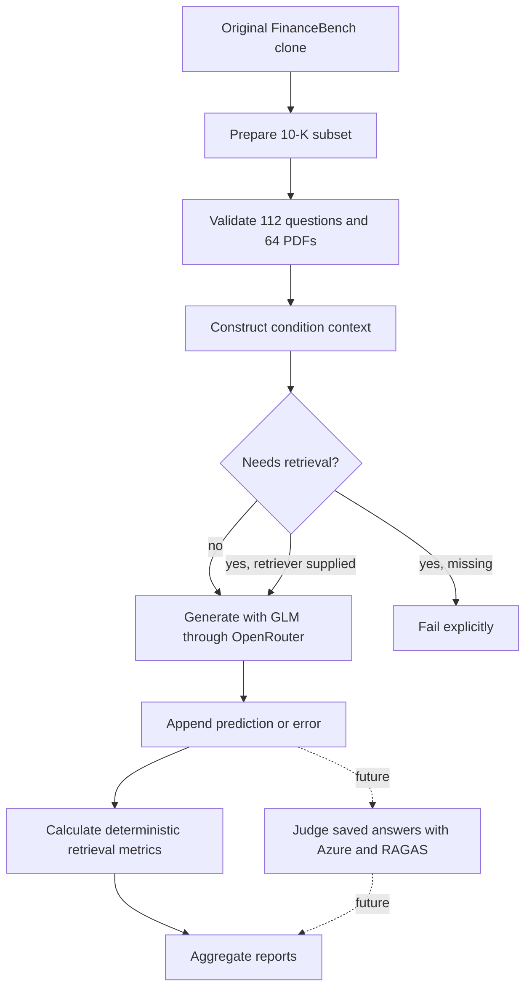
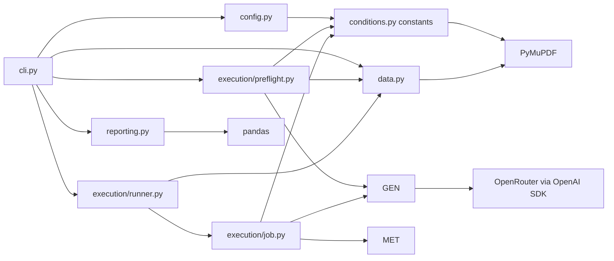
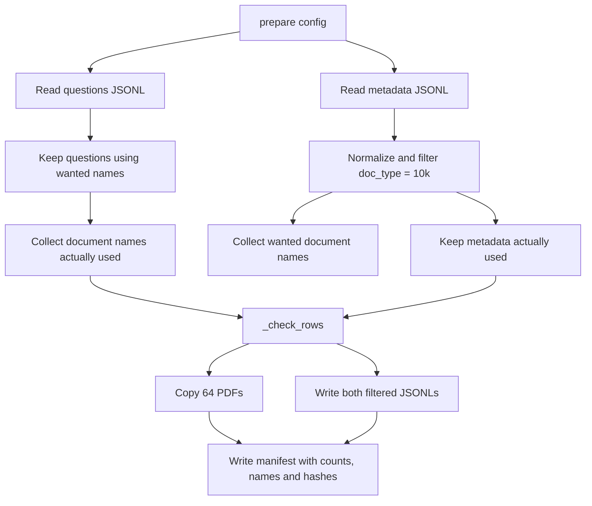
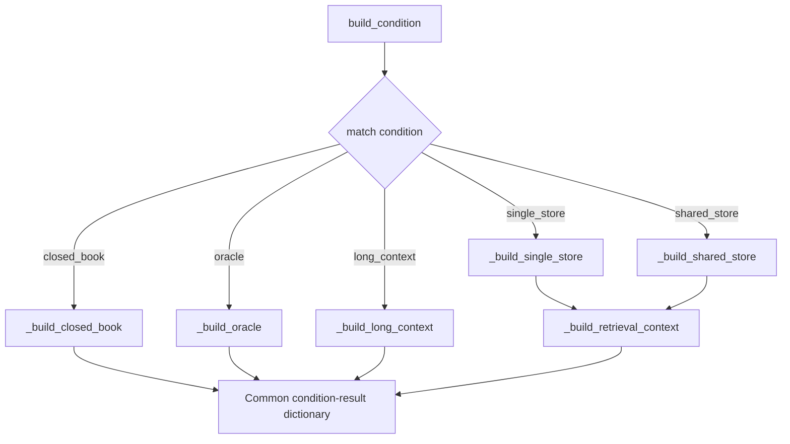
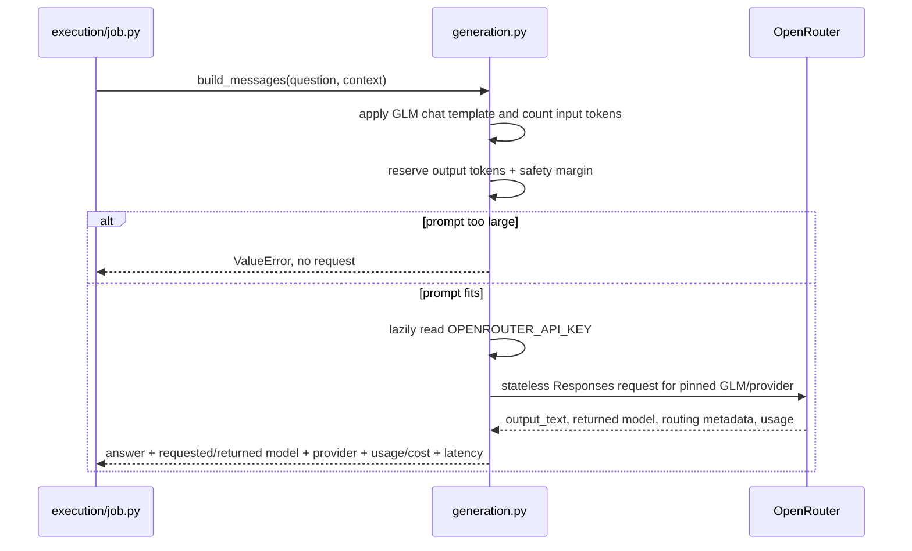
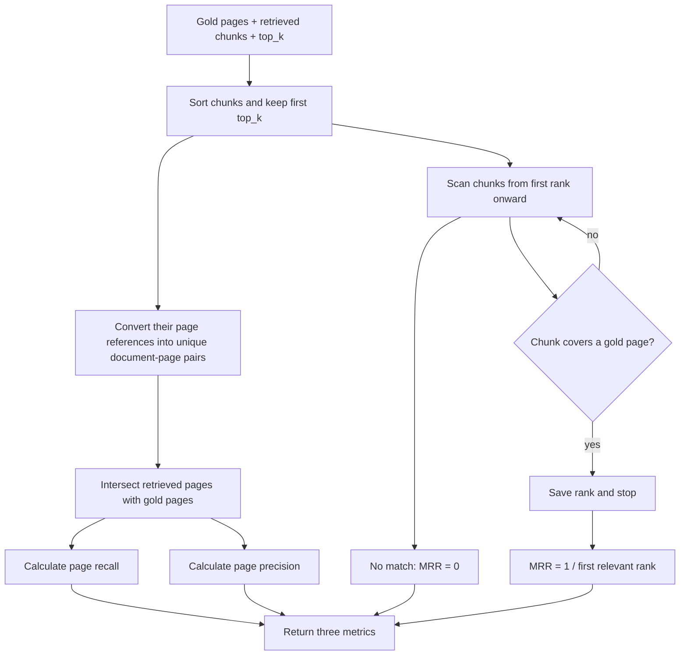
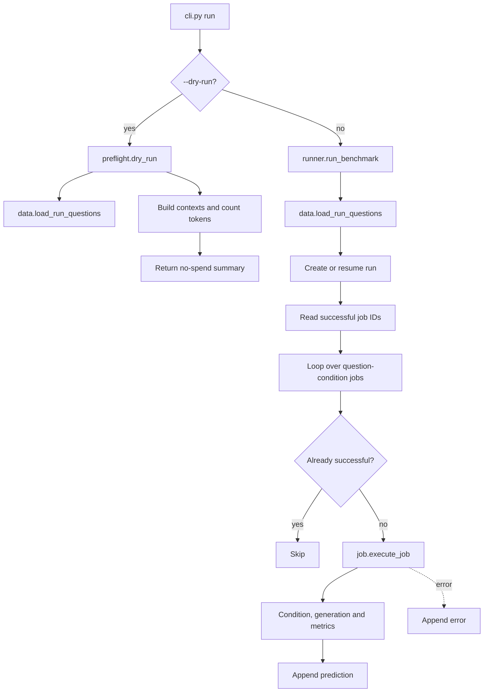
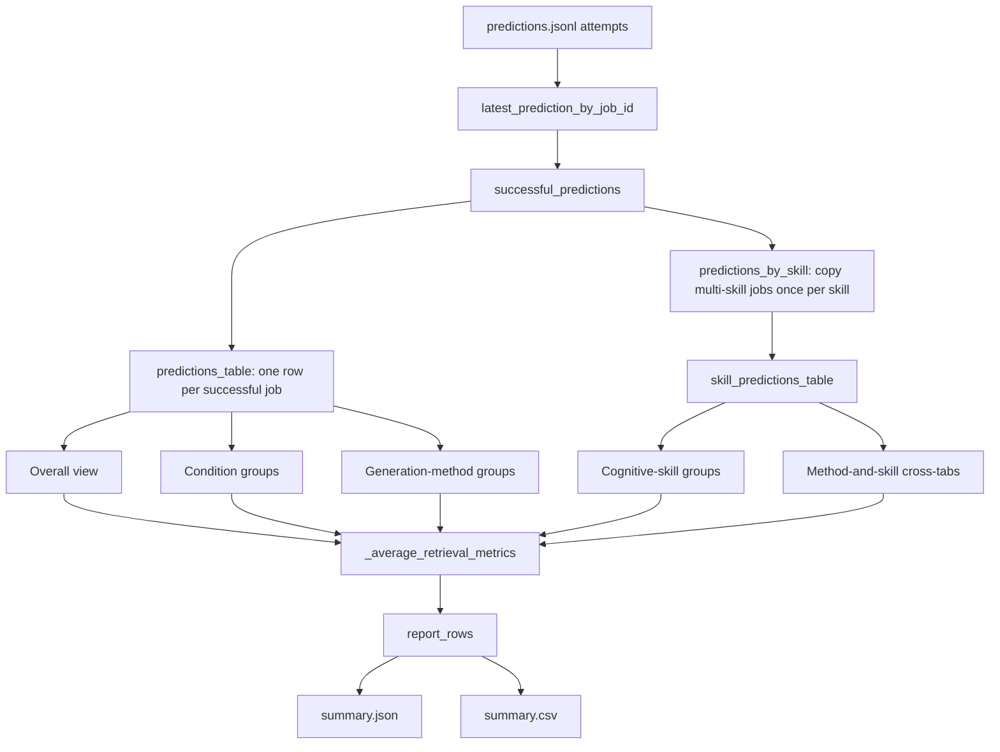
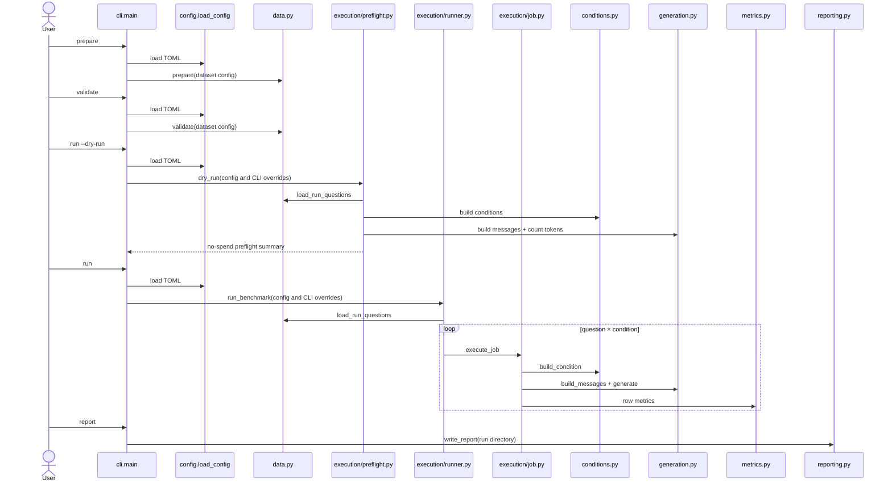

# FinanceBench implementation guide

#THOUGHTS: why we loading pdf table entry instead of actual pdf page itself

Section 15 reconciles this guide with the implemented execution subpackage.

Authoritative requirements: `../Benchmark.md`

Historical inputs only:

- `docs/superpowers/specs/2026-09-07-financebench-benchmark-harness-design.md`
- `docs/superpowers/plans/2026-09-07-financebench-harness-mvp.md`

Those historical documents explain how the first, more engineered implementation
was reached. They are not the current source of truth. This guide explains the
smaller golden-path implementation now present in this repository.

## 1. System purpose and boundary

The current system benchmarks the 112 open-source FinanceBench questions whose
source documents are 10-Ks, across 64 PDFs. It prepares and validates local data,
constructs FinanceBench's five context conditions, generates answers for the
three conditions that do not need a retriever, checkpoints every attempt,
calculates deterministic retrieval metrics, and writes segmented reports.



Currently implemented:

- FinanceBench 10-K preparation and validation;
- five context builders;
- closed-book, oracle, and long-context generation;
- replaceable retrieval interface, without a real retriever;
- page recall, page precision, and page MRR;
- checkpoint/resume and segmented reporting;
- no-spend tests and dry runs.

Deferred:

- real single-store/shared-store retriever and vector store;
- Azure GPT answer judge through RAGAS, which will provide the official answer-
  accuracy result;
- HiREC/LOFin;
- smoke and pattern validation subsets;
- final policy for nine conservatively oversized long-context jobs.

## 2. Project bootstrap and controls

The benchmark is a named package under `src/sec_rag_benchmark/` because its
modules import one another and share one installed command; it also has several dependencies.

This avoids ambiguous
imports such as `from data import ...` and lets `uv run sec-rag-benchmark` invoke
the package consistently.

The following commands bootstrap the equivalent package and dependencies in a
new project directory; they are not claimed as the exact historical commands
originally entered. The project metadata and CLI mapping shown below are then
kept in `pyproject.toml`.

```bash
uv init --package --python 3.12 --name sec-rag-benchmark --build-backend uv
uv add "openai==3.8.0" "pandas==3.0.5" "pymupdf==1.28.2" \
  "transformers==5.17.0" "jinja2==3.1.6"
uv add --dev "pytest==9.1.1"
uv lock
uv sync
```

`uv init` creates the package controls, `uv add` records exact direct
dependencies, `uv lock` resolves the complete dependency graph, and `uv sync`
creates or updates the local virtual environment.

| Tool | Current purpose | Why it is present |
|---|---|---|
| Python 3.12 | Runtime | Stable language baseline selected in `.python-version` |
| `uv` | Package, environment and lockfile management | Recreates direct and transitive dependency versions |
| OpenAI SDK | OpenRouter-compatible GLM client | OpenRouter exposes an OpenAI-compatible API |
| Transformers + Jinja2 | GLM tokenizer and its chat-template renderer | Counts the formatted prompt before sending it |
| PyMuPDF | PDF page count and text extraction | Conditions and validation operate on physical pages |
| pandas | Grouping and CSV report output | Reporting is tabular; preparation remains plain JSON |
| pytest | Automated checks | Validates the golden path without paid requests |

LangChain, Chroma, RAGAS, Azure libraries, and a vector database are not installed
because the current executable path does not use them. Add them only after their
design is approved.

| Project control | Purpose |
|---|---|
| `.python-version` | Selects Python 3.12 for this repository |
| `pyproject.toml` | Defines the package, direct dependencies, build backend, and CLI |
| `uv.lock` | Pins the complete resolved dependency graph |
| `.venv/` | Generated local environment; ignored by Git |
| `.env.example` | Documents credential names without containing secrets |
| `.env` | Ignored local credentials; the terminal must load them into the process environment |
| `configs/financebench.toml` | Public, editable dataset, generation, and run settings |

In `pyproject.toml`, `[project]` describes the package, `[build-system]` selects
`uv_build` (basically allows you to import src/sec_rag_benchmark), and `[dependency-groups]` contains development-only tools. The CLI
mapping:

```toml
[project.scripts]
sec-rag-benchmark = "sec_rag_benchmark.cli:main"
```
- `uv init` created below package (where we added sec_rag_benchmark):
    ```
    project root/
    ├── pyproject.toml
    └── src/
    ```
- We create the actual source files under `src/sec_rag_benchmark*`
- run `uv sync`, which does
    - reads .toml and uv.lock, creates .venv, sees build-backend 'uv_build'
        - this asks uv_build to 'install' i.e. locate the location of our local project 'sec_rag_benchmark'
        - name 'sec-rag-benchmark' → sec_rag_benchmark
        - since uv build looks under default `src/` directory, finds `src/sec_rag_benchmark`
    - `src/sec_rag_benchmark` is found, .pth lcoation pointer is saved under .venv
    - https://docs.astral.sh/uv/concepts/build-backend/#module
    - By default, a single root module is expected at src/<package_name>/\__init__.py.
- [project.scripts] declares `sec-rag-benchmark = "sec_rag_benchmark.cli:main"`, turn 'main()' function in 'cli.py' into a convenient terminal command called 'sec_rag_benchmark', as it essentially does:
    ```python
    from sec_rag_benchmark.cli import main
    main()
    ```
    - so can call arguments to be used in the parser e.g. `uv run sec-rag-benchmark prepare` runs main() in cli.py, which runs the 'prepare' argument that's parsed


`pyproject.toml` controls the Python project; `configs/financebench.toml` controls a benchmark run.

## 3. File structure and module relationships

Sections 5–12 follow the order in which to read the implementation; each section
identifies its exact source file, function order, and corresponding test.

The run-related modules live together under `execution/`:

```text
configs/financebench.toml          public editable run settings
src/sec_rag_benchmark/
├── config.py                      load and validate TOML configuration
├── data.py                        prepare, validate, load questions
├── conditions.py                  dispatch to five condition builders
├── generation.py                  prompt and OpenRouter request
├── metrics.py                     score one job and normalize skill labels
├── reporting.py                   aggregate saved jobs into reports
├── execution/
│   ├── preflight.py               no-spend condition and token checks
│   ├── job.py                     execute one question-condition pair
│   └── runner.py                  loop, checkpoint and resume real runs
└── cli.py                         arguments, match/case, output and exit codes
tests/
├── conftest.py                    tiny two-question/PDF fixtures
└── test_golden_path.py            compact behavior tests
```




## 4. Main data shapes

The preparation command creates this generated local directory:

```text
data/financebench/
├── financebench_open_source_10k.jsonl
├── financebench_document_information_10k.jsonl
├── manifest.json
└── pdfs/
    └── 64 selected FinanceBench PDFs
```

The directory is not committed to Git; it can be reproduced from the read-only
FinanceBench clone. The required libraries and their rationale are listed in
section 2.

### Prepared question

The original question keys are preserved. `load_questions()` adds one in-memory
key without rewriting the stored JSONL:

```python
{
    "financebench_id": "q1",
    "question": "What was revenue?",
    "answer": "$42 million",
    "doc_name": "example_2023_10K.pdf",
    "question_type": "metrics-generated",
    "question_reasoning": "Information extraction",
    "justification": "The reference answer follows from ...",
    "evidence": [
        {
            "doc_name": "example_2023_10K.pdf",
            "evidence_page_num": 12,
            "evidence_text_full_page": "..."
        }
    ],
    "document_metadata": {"doc_type": "10K", "doc_period": "2023", "...": "..."}
}
```

### Condition result
Records info model should receive

```python
{
    "financebench_id": "q1",
    "condition": "oracle",
    "question": "What was revenue?",
    "context": "[Document: ... | Page index: 12]\n...",
    "context_pages": [("example_2023_10K.pdf", 12)],
    "retrieved_chunks": []
}
```

### Future retrieved chunk contract

```python
{
    "chunk_id": "example:12:0",
    "text": "Revenue was $42 million ...",
    "doc_name": "example_2023_10K.pdf",
    "pages": [12],
    "score": 0.91,
    "rank": 1
}
```

### Prediction row

```python
{
    "job_id": "<config-hash>:q1:oracle",
    "status": "success",
    "financebench_id": "q1",
    "question": "What was revenue?",
    "gold_answer": "$42 million",
    "gold_evidence": [
        {
            "doc_name": "example_2023_10K.pdf",
            "evidence_page_num": 12,
            "evidence_text_full_page": "..."
        }
    ],
    "human_justification": "The reference answer follows from ...",
    "model_answer": "$42 million",
    "eval_mode": "oracle",
    "gold_pages": [["example_2023_10K.pdf", 12]],
    "retrieved_chunks": [],
    "page_recall": None,
    "page_precision": None,
    "page_mrr": None,
    "requested_model": "z-ai/glm-5.3-flash",
    "returned_model": "z-ai/glm-5.3-flash",
    "provider": "Z.AI",
    "usage": {},
    "cost": None,
    "latency_seconds": 0.1
}
```

No answer-accuracy field is written during generation. The future judge reads
this saved row, which already contains all reference inputs it needs, and
persists its binary decision separately. `cost` is retained from OpenRouter's
usage metadata when returned and is otherwise explicitly `null`.

## 5. Configuration loading and routing

`config.load_config()` reads `configs/financebench.toml` and routes its sections
as follows:

```text
[dataset]    → data.py preparation, validation, paths, and expected counts
[generation] → generation.py model request and context limits
[run]        → execution modules: conditions, retrieval depth, and results path
```

`src/sec_rag_benchmark/config.py` has one responsibility: load and verify the
TOML configuration.

```text
load_config(config_path):
    read the TOML file into a dictionary
    resolve dataset and results paths relative to the repository root
    verify configured condition names
    verify the OpenRouter/provider requirements
    verify GLM reasoning-effort and token-limit settings
    return the validated top-level configuration dictionary
```

It is separate because the TOML contains dataset, generation and run settings.
Experiment settings that can affect results remain visible in
`configs/financebench.toml`.

## 6. Data preparation and validation flow

In `src/sec_rag_benchmark/data.py`, read `prepare()` → `validate()` →
`load_run_questions()` → `load_questions()` → `_check_rows()` → the
small I/O, PDF, and hash helpers. Read
the three data tests in `tests/test_golden_path.py` alongside it, using the
fixture records in `tests/conftest.py`.

The implementation keeps this as one module because all three public
operations belong to the FinanceBench dataset lifecycle. The long preparation
steps are separated by purpose:

```text
prepare()
├── _select_10k_subset()
├── _check_rows()
├── _replace_prepared_files()
└── _write_manifest()

validate()
├── _check_rows()
└── _validate_manifest()

load_questions()
└── read both JSONLs and join metadata in memory

load_run_questions()
├── validate()
└── load_questions(), then apply an optional limit
```

The small `_read_jsonl()`, `_write_jsonl()`, `_hash()`, `_pdf_path()` and
`_evidence_doc()` functions remain file/PDF helpers.



Representative pseudocode:

```text
prepare(config):
    read source question and metadata records
    questions, metadata = _select_10k_subset(...)
    _check_rows(questions, metadata, source PDFs, expected counts)
    generated_files = _replace_prepared_files(...)
    _write_manifest(generated_files, selection information)
    return observed counts

validate(config):
    load generated JSONLs
    _check_rows(questions, metadata, prepared PDFs, expected counts)
    compare expected and actual PDF filenames
    _validate_manifest(...)
    return counts

load_questions(output_dir):
    load questions, load doc metadata
    combine them

load_run_questions(dataset_config, limit):
    validate the prepared dataset
    load its joined questions
    reject a non-positive limit
    return all questions or the requested first questions
```

The helper responsibilities are:

```text
_select_10k_subset():
    filter metadata to normalized 10k
    keep questions referencing those documents
    discard metadata not used by a selected question
    return selected questions and metadata

_check_rows(questions, metadata, pdf_dir, expected counts):
    check that both JSONL record types contain their required fields
    check that every financebench_id is unique
    check that each question matches exactly one metadata row by doc_name
    check that the question and document totals are exactly 112 and 64

    FOR each question:
        locate and open its PDF
        record the PDF's number of pages
        check that its evidence is a non-empty list

        FOR each evidence item:
            check that it names the same document as the question
            check that evidence_page_num is a valid zero-indexed PDF page

    return nothing when every check passes
    raise DataError immediately when a check fails

_replace_prepared_files():
    remove stale generated PDFs
    copy the selected source PDFs
    write both filtered JSONLs
    return every generated file that must be hashed

_write_manifest():
    record source, filter, counts, PDF names and file hashes

_validate_manifest():
    compare manifest settings, filenames and hashes with prepared files
```

`_check_rows()` is the shared dataset gate. `prepare()` calls it against the
selected source records and source PDFs **before writing generated data**.
`validate()` calls the same helper against the prepared JSONLs and copied PDFs
before permitting a benchmark run. This avoids maintaining two different sets
of rules for what counts as a valid FinanceBench subset.

Its inputs and result are:

```text
questions       selected question dictionaries
metadata        selected document-information dictionaries
pdf_dir         directory in which those documents must exist
expected counts configured in financebench.toml

success         no return value; execution continues
failure         DataError explaining the first invalid condition found
```

Important behavior:

- Both JSONL schemas and complete evidence lists remain intact.
- Evidence pages are zero-indexed and document-aware.
- Preparation deletes stale PDFs only inside the generated output directory.
- The manifest acts as provenance receipt, file inventory, and integrity check.
- `_check_rows()` opens each distinct PDF once and reuses its page count when
  several questions reference the same filing.

## 7. Condition construction

`src/sec_rag_benchmark/conditions.py` keeps one public dispatcher
but moves each condition's substantial work into a named builder. Read it as:

```text
build_condition()
├── _build_closed_book()
├── _build_oracle()
├── _build_long_context()
├── _build_single_store()
│       └── _build_retrieval_context()
└── _build_shared_store()
        └── _build_retrieval_context()

then read:
gold_pages() → _pdf_pages() → _page_block()
```

Read alongside `test_all_conditions_and_retrieval_scopes()` in
`tests/test_golden_path.py`.

### Condition-dispatch pseudocode

```text
build_condition(question, condition, PDFs, all document names, retriever, top_k):
    MATCH condition:
        CASE closed_book:
            condition_data = _build_closed_book()

        CASE oracle:
            condition_data = _build_oracle(question)

        CASE long_context:
            condition_data = _build_long_context(question, PDFs)

        CASE single_store:
            condition_data = _build_single_store(
                question, retriever, top_k
            )

        CASE shared_store:
            condition_data = _build_shared_store(
                question, all document names, retriever, top_k
            )

        CASE unknown value:
            raise an unknown-condition error

    combine the common question fields with condition_data
    return one condition-result dictionary
```

Each private builder returns the same three keys:

```python
{
    "context": "text supplied to the model",
    "context_pages": [("document.pdf", 12)],
    "retrieved_chunks": [],
}
```

The two retrieval conditions differ only in document scope. Their small named
builders make that distinction visible, then both call one shared chunk-to-
context algorithm:

```text
_build_single_store()
    scope = only the question's document
    call _build_retrieval_context(...)

_build_shared_store()
    scope = all selected documents
    call _build_retrieval_context(...)

_build_retrieval_context()
    require a retriever
    retrieve ranked chunks within scope
    format chunks into model context
    record unique document-aware pages
    return context, pages and chunks
```



The retriever public shape is:

```python
Retriever = Callable[[str, tuple[str, ...], int], list[dict[str, Any]]]
```

That means `retriever(question_text, document_scope, top_k)` returns ranked chunk
dictionaries. A missing retriever raises `RetrieverUnavailable`.

## 8. Generation flow

In `src/sec_rag_benchmark/generation.py`, read `build_messages()` → `generate()`
→ `count_prompt_tokens()` → `get_tokenizer()` → `_selected_provider()`. Read alongside
`test_generation_pins_provider_without_real_api_call()` and
`test_generation_rejects_empty_output_and_oversized_prompt()` in
`tests/test_golden_path.py`.

The implementation gives generation's three stages distinct names:

```text
generate()
├── _check_context_capacity()
│       └── count_prompt_tokens() → get_tokenizer()
├── _create_openrouter_client() only when no client was supplied
├── client.responses.create()
└── _read_generation_result()
        └── _selected_provider()
```

```text
generate(messages, config, optional client):
    _check_context_capacity(messages, config)

    IF no client was supplied:
        client = _create_openrouter_client(config)

    send the Responses API request
    return _read_generation_result(response, config, elapsed time)

_check_context_capacity():
    count the complete formatted prompt
    reserve output tokens and the safety margin
    raise an explicit error if the total exceeds the context window

_create_openrouter_client():
    require OPENROUTER_API_KEY
    create the OpenAI client using OpenRouter's URL and retry settings

_read_generation_result():
    reject an empty answer
    collect model, provider, usage, cost and latency
    return the answer-and-provenance dictionary
```



`count_prompt_tokens()` uses the official GLM-5.3-Flash tokenizer and applies
the model's chat template with the configured reasoning effort. This includes
role markers and the assistant-generation marker rather than counting only the
visible strings. `get_tokenizer()` downloads the small tokenizer/configuration
files on first use, then `lru_cache` and Hugging Face's disk cache reuse them;
it does not download or run the model weights. Both the Transformers version
and Hugging Face tokenizer revision are pinned for repeatable counts.

`max_output_tokens` limits and reserves room for the answer. The smaller
`token_safety_margin = 1024` still allows for possible formatting differences
between the locally applied template and OpenRouter's serving path. The check
therefore compares input tokens + output-token reserve + safety tokens with the
configured token context window.
The pinned OpenAI SDK sends `client.responses.create()` to OpenRouter's base
URL.

Provider routing is an OpenRouter-only request extension passed through the
SDK's `extra_body`. It orders the `z-ai` upstream provider first and disables
fallbacks so the serving route cannot silently vary between experiment jobs.
The `X-OpenRouter-Metadata: enabled` header asks OpenRouter to return routing
metadata. `_selected_provider()` records the endpoint marked `selected`; it
returns `None` instead of guessing when that metadata is absent.

## 9. Retrieval metrics

In `src/sec_rag_benchmark/metrics.py`, read `page_metrics()` and
`cognitive_skills()`. These both transform one question/job rather than
aggregating a complete run. Read alongside
`test_metrics_use_document_aware_unique_pages_and_chunk_rank()` in
`tests/test_golden_path.py`.

### What enters and leaves `page_metrics()`

The function scores one question under one retrieval condition. Its inputs have
these shapes:

```python
gold = [
    ("A.pdf", 2),
    ("A.pdf", 5),
]

chunks = [
    {"doc_name": "wrong.pdf", "pages": [2], "rank": 1},
    {"doc_name": "A.pdf", "pages": [2, 5], "rank": 2},
    {"doc_name": "A.pdf", "pages": [2], "rank": 3},
]

top_k = 5
```

`("A.pdf", 2)` is one document-aware page. `("wrong.pdf", 2)` is a
different page even though both use page index 2. The returned dictionary is
stored on that job's prediction row:

```python
{
    "page_recall": 1.0,
    "page_precision": 2 / 3,
    "page_mrr": 0.5,
}
```

The helper breakdown is:

```text
page_metrics()
├── _unique_pages_from_chunks()
└── _first_relevant_chunk_rank()
```

### `page_metrics()` pseudocode

```text
INPUT:
    gold pages
    retrieved chunks
    retrieval depth top_k

sort chunks by retrieval rank
keep only the first top_k chunks

unique retrieved pages = _unique_pages_from_chunks(ranked chunks)

count how many unique retrieved pages are gold pages
calculate page recall and page precision

first rank = _first_relevant_chunk_rank(gold pages, ranked chunks)
calculate page MRR from first rank, or zero when there is no match

RETURN recall, precision and MRR
```

```text
_unique_pages_from_chunks():
    create an empty set
    FOR each chunk:
        FOR each page covered by that chunk:
            add (document name, page number) to the set
    return the set

_first_relevant_chunk_rank():
    FOR each ranked chunk:
        construct that chunk's document-aware pages
        IF any page is gold:
            return this chunk's rank immediately
    return nothing when no chunk matches
```



The pseudocode concepts deliberately use the same names as the Python:

| Pseudocode concept | Python variable |
|---|---|
| gold pages | `gold_pages` |
| first `top_k` chunks in rank order | `ranked_chunks` |
| distinct retrieved document/page pairs | `unique_retrieved_pages` |
| retrieved pages that are also gold | `retrieved_gold_pages` |
| number used in both metric numerators | `number_of_gold_pages_retrieved` |
| first chunk covering any gold page | `first_relevant_chunk_rank` |

### Worked example

After sorting, all three example chunks remain. Converting them into a set gives:

```python
unique_retrieved_pages = {
    ("wrong.pdf", 2),
    ("A.pdf", 2),
    ("A.pdf", 5),
}
```

The rank-3 duplicate of `("A.pdf", 2)` does not add another page. Intersecting
that set with the two gold pages gives two matches:

```text
page recall    = 2 retrieved gold pages / 2 gold pages = 1.0
page precision = 2 retrieved gold pages / 3 retrieved pages = 0.666...
```

MRR asks a different question: how early did the first useful **chunk** appear?
Rank 1 covers only `("wrong.pdf", 2)`, so it does not match. Rank 2 covers both
gold pages, so the loop saves rank 2 and stops:

```text
page MRR = 1 / first relevant chunk rank = 1 / 2 = 0.5
```

`cognitive_skills()` is separate from this calculation. It converts the raw
FinanceBench reasoning text into the skill labels used later by `write_report()`.

## 10. Preflight, one-job execution and real-run orchestration

This workflow is split across three files because the three operations have
different purposes. Read them in this order:

```text
execution/preflight.py   dry_run()       inspect work without generating answers
execution/job.py         execute_job()   turn one pair into one prediction
execution/runner.py      run_benchmark() control the real loop and files
```

The three modules use `data.load_run_questions(dataset_config, limit)`, which validates
the prepared dataset, loads its questions and applies the optional limit.

### `execution/preflight.py`: no-spend inspection

`dry_run()` does not create a results directory or API client:

```text
load_run_questions()
select and validate condition names

FOR each condition:
    IF it requires a retriever:
        record "requires retriever"
    ELSE:
        build each condition context
        build its model messages
        count its prompt tokens
        record the largest prompt and any context-limit failures

RETURN planned jobs, conditions, token results and API requests = 0
```

Read it alongside `test_dry_run_preflights_jobs_without_api_requests()`.

### `execution/job.py`: execute exactly one job

`execute_job()` handles one pair such as `q2 + oracle`:

```text
build the condition context
build the shared messages
generate one answer
calculate retrieval metrics when retrieval was used
combine question, answer, provenance and metrics
return one prediction dictionary
```

It does not loop over questions, select a run directory or write files. This
keeps the model-facing pipeline readable separately from run administration.

### `execution/runner.py`: control one real run

Read `run_benchmark()` first, then its three small file/run helpers:

```text
run_benchmark()
├── _create_or_resume_run()
├── _successful_jobs()
└── _append()
```

`run_benchmark()` performs the complete real workflow:

```text
load_run_questions()
select and validate condition names
create or resume the run directory
read already successful job IDs

FOR each question and condition:
    create its stable job ID

    IF already successful:
        count it as skipped
    ELSE:
        TRY execute_job() and append its prediction
        IF it fails, append its error

RETURN run directory and generated/skipped/failed counts
```

`_create_or_resume_run()` writes or verifies the effective `config.toml` and
derives the run key. `_successful_jobs()` reads successful IDs from
`predictions.jsonl`. `_append()` immediately adds one success or failure to its
JSONL, so a later crash does not discard earlier answers.



Reusing a run directory with different effective settings still fails instead
of mixing incompatible results.

## 11. Reporting and result artifacts

Read `src/sec_rag_benchmark/reporting.py` now that the saved
prediction and error rows from `execution/runner.py` are familiar. This file contains only
run-level aggregation: read `write_report()` first, then
`_average_retrieval_metrics()`, which performs the repeated averaging for one
subset.
Continue with `test_runner_checkpoints_resumes_and_reports()` and
`test_report_places_multi_skill_prediction_in_each_skill_view()`.

### Purpose and input

`page_metrics()` calculated three scores for one retrieved question. In
contrast, `write_report()` reads all saved jobs and answers questions such as
"What was average recall for `single_store`?" Its main input is the append-only
`predictions.jsonl`, containing one JSON object per line. For example:

```json
{"job_id":"q1:single_store","status":"success","eval_mode":"single_store","question_type":"calculated","cognitive_skills":["information_extraction","numerical_reasoning"],"page_recall":1.0,"page_precision":0.5,"page_mrr":1.0}
```

The helper breakdown keeps the five report views visible in the public
function while extracting the two data-preparation stages:

```text
write_report()
├── _latest_rows_by_job_id() for predictions
├── _latest_rows_by_job_id() for errors
├── _expand_by_cognitive_skill()
└── _average_retrieval_metrics() for each report group
```

### `write_report()` pseudocode

```text
INPUT:
    predictions.jsonl
    errors.jsonl
    run configuration

latest predictions = _latest_rows_by_job_id(predictions.jsonl)
latest errors = _latest_rows_by_job_id(errors.jsonl)
keep successful predictions

predictions table = one row per successful prediction
skill table = _expand_by_cognitive_skill(successful predictions)

summarize all successful predictions
summarize each condition
summarize each generation method
summarize each cognitive skill
summarize each generation-method/cognitive-skill combination

count planned, successful, failed and missing jobs
write summary.json and summary.csv
return the summary
```

```text
_latest_rows_by_job_id(path):
    read every non-empty JSON line when the file exists
    FOR each row:
        store it under its job_id
        replace an earlier row with the same job_id
    return the latest row for each job

_expand_by_cognitive_skill(predictions):
    FOR each prediction:
        FOR each skill assigned to that prediction:
            add one reporting-only copy labelled with that skill
    return the expanded rows
```



### The important data states

`prediction_attempts` is an ordinary list of dictionaries read from the JSONL.
Because the runner may be resumed, more than one attempt can theoretically have
the same `job_id`. Assigning each attempt into `latest_prediction_by_job_id`
means the last occurrence becomes that job's current result.

`successful_predictions` removes rows that are not successful. Pandas then
turns that list into `predictions_table`, where each dictionary becomes one row
and each dictionary key becomes a column:

```text
job_id           eval_mode      question_type  page_recall
q1:single_store  single_store   calculated     1.0
q2:single_store  single_store   reported       0.5
```

A prediction may have two skills. To include it in both summaries, the code
creates `predictions_by_skill`, which contains a reporting-only copy for each
skill, then converts it into `skill_predictions_table`:

```text
job_id           cognitive_skill
q1:single_store  information_extraction
q1:single_store  numerical_reasoning
```

The original prediction still exists once in `predictions_table`; it is copied
only in the skill-reporting table. Skill totals therefore overlap.

### The five report views

`write_report()` creates these five kinds of summary row. The `report_view`
field identifies which question that row answers:

- `overall`: every successful prediction together;
- `condition`: one subset per `eval_mode`, such as `single_store`;
- `generation_method`: one subset per FinanceBench `question_type`;
- `cognitive_skill`: one subset per normalized cognitive skill;
- `cross_tab`: one subset per `question_type`/cognitive-skill combination.

Each numbered block in the Python selects the rows for one view and passes that
concrete subset to `_average_retrieval_metrics()`. For example, the condition
block passes only the `single_store` rows when it creates the following result:

```json
{
  "report_view": "condition",
  "eval_mode": "single_store",
  "total_predictions": 112,
  "page_recall": 0.72,
  "page_recall_sample_size": 112
}
```

### What `_average_retrieval_metrics()` does

Read this helper after the five blocks in `write_report()`. It performs the same
small calculation for whichever subset it receives:

```text
INPUT:
    one selected group of predictions
    the name and identity of that group

count every prediction in the group

FOR recall, precision and MRR:
    discard None values
    calculate the average of remaining values
    record how many values contributed

RETURN one summary row
```

For example, the condition block calls it with the `single_store` DataFrame,
`report_view="condition"`, and `eval_mode="single_store"`. The helper creates
one dictionary and appends it to `report_rows`.

`total_predictions` counts every answer in the subset. Each separate
`<metric>_sample_size` counts only rows where that retrieval metric applies.
An oracle summary can therefore contain 112 predictions but have a page-recall
sample size of zero. Skill views overlap when a question has multiple labels.

```text
results/<run-id>/
├── config.toml        effective public run configuration
├── predictions.jsonl append-only successful jobs
├── errors.jsonl      append-only failed attempts
├── summary.json      machine-readable report and completion status
└── summary.csv       spreadsheet-friendly grouped metrics
```

### Future final-answer judge

Judging is a separate pass over saved predictions, so generated answers do not
need to be regenerated when judging is retried or changed. For each answer, the
judge input will contain:

- the question;
- the FinanceBench reference answer;
- the complete FinanceBench reference-evidence list;
- the human labeller's `justification` field;
- the candidate model answer.

The judge will return the binary correct/incorrect value used for official final-
answer accuracy. The precise RAGAS integration, Azure deployment configuration,
judge prompt, and validation against human-reviewed examples remain a later
vertical slice.

## 12. CLI and complete call flow

Finish with `src/sec_rag_benchmark/cli.py`. Its single public function,
`main()`, contains argument definition, argument parsing, explicit `match/case`
dispatch, short module calls, user-facing output and top-level exit codes. There
is no separate `_parser()` and no set of one-line command wrappers.

Read `main()` from top to bottom alongside the CLI routing test in
Section 13. Preview `config.load_config()` first, as described in Section 5,
then revisit `preflight.dry_run()` and `runner.run_benchmark()` from Section 10
when their cases are reached.

### Proposed `main()` pseudocode

```text
create the sec-rag-benchmark argument parser
define prepare, validate, run, report and judge subcommands
define each subcommand's arguments
parse the terminal arguments

TRY:
    match the requested command
    perform the short action listed below
    print its result
    return exit code 0

IF a known application error is raised:
    print one error message
    return exit code 2
```

Each `case` remains short:

| Case | Action |
|---|---|
| `prepare` | load config → `data.prepare()` → print counts |
| `validate` | load config → `data.validate()` → print counts |
| `run --dry-run` | load config → `preflight.dry_run()` → print preflight |
| real `run` | load config → `runner.run_benchmark()` → print directory/counts |
| `report` | `reporting.write_report()` → print successful count |
| `judge` | report that Azure/RAGAS judging is unavailable |

The short preparation case intentionally remains visible rather than being
wrapped in a `prepare_command()` function:

```python
case "prepare":
    config = load_config(args.config)
    counts = prepare(config["dataset"])
    print(
        f"Prepared {counts['questions']} questions "
        f"and {counts['documents']} documents"
    )
    return 0
```

This follows the Boot.dev CLI pattern: the `case` explains what the terminal
command does, while `data.prepare()` contains the actual preparation algorithm.



The available commands are `prepare`, `validate`, `run`, `report`, and `judge`.
The refactor changes only code ownership and reading order. Command names,
arguments, output artifacts, no-spend behavior and exit behavior remain the
same. `judge` still intentionally reports unavailable.

### Terminal commands, in execution order

Start every new terminal session from the golden-path worktree:

```bash
cd "/Users/zubairasim/Documents/SEC RAG/.worktrees/financebench-golden-path"
```

The following setup commands are safe: they do not call an LLM or spend API
credit. Run the `git clone` only if `benchmarks/financebench` does not already
exist in this worktree.

```bash
git clone https://github.com/patronus-ai/financebench.git benchmarks/financebench
uv sync
uv lock --check
uv run pytest -q
```

To see the commands or the options accepted by a particular command:

```bash
uv run sec-rag-benchmark --help
uv run sec-rag-benchmark prepare --help
uv run sec-rag-benchmark validate --help
uv run sec-rag-benchmark run --help
uv run sec-rag-benchmark report --help
uv run sec-rag-benchmark judge --help
```

Prepare the reproducible local 10-K subset, then validate its 112 questions and
64 PDFs. These commands do not make API requests:

```bash
uv run sec-rag-benchmark prepare --config configs/financebench.toml
uv run sec-rag-benchmark validate --config configs/financebench.toml
```

Preflight all three currently executable conditions without spending API
credit:

```bash
uv run sec-rag-benchmark run --config configs/financebench.toml --dry-run
```

For a quicker no-spend check, limit the input to five questions and choose the
conditions explicitly:

```bash
uv run sec-rag-benchmark run \
  --config configs/financebench.toml \
  --conditions closed_book oracle long_context \
  --limit 5 \
  --dry-run
```

The retrieval conditions can also be enumerated in a dry run, but the output
will state that they require the future retriever:

```bash
uv run sec-rag-benchmark run \
  --config configs/financebench.toml \
  --conditions single_store shared_store \
  --limit 5 \
  --dry-run
```

Before a real generation run, create an ignored `.env` file containing
`OPENROUTER_API_KEY=...`. Load it into the current shell with:

```bash
set -a
source .env
set +a
```

The next command **makes paid OpenRouter requests**. Do not pass `--run-dir`
when starting a new run: the CLI automatically creates a timestamped directory
under `results/` and prints its path:

```bash
uv run sec-rag-benchmark run \
  --config configs/financebench.toml \
  --conditions closed_book oracle long_context
```

For example, the command may print a directory named
`results/20260913-143052`. Keep the actual path printed by your run.

If the run stops, load the API key again in a new terminal and pass that existing
directory through `--run-dir`. Keep the same conditions. The runner skips job
IDs already recorded as successful:

```bash
uv run sec-rag-benchmark run \
  --config configs/financebench.toml \
  --conditions closed_book oracle long_context \
  --run-dir results/20260913-143052
```

After generation, create or refresh `summary.json` and `summary.csv`. Reporting
reads saved files and does not call an LLM. Replace the example timestamp below
with the directory printed by your run:

```bash
uv run sec-rag-benchmark report --run-dir results/20260913-143052
```

The following is the reserved future command. It currently exits with an
explicit "not implemented" error and performs no judging:

```bash
uv run sec-rag-benchmark judge --run-dir results/20260913-143052
```

## 13. Test design and requirement traceability

| Requirement or behavior | Test or status |
|---|---|
| Preserve source rows; prepare/validate/load | `test_prepare_validate_and_load_preserve_source_rows` |
| Reject missing PDF and ambiguous metadata | `test_prepare_rejects_missing_pdf_and_ambiguous_metadata` |
| Reject duplicate IDs and invalid pages | `test_validation_rejects_bad_question_data` |
| Each named condition builder returns the shared result shape | `test_all_conditions_and_retrieval_scopes` |
| Single-store and shared-store pass distinct scopes to the shared retrieval builder | `test_all_conditions_and_retrieval_scopes` |
| Document-aware recall/precision and chunk-rank MRR | `test_metrics_use_document_aware_unique_pages_and_chunk_rank` |
| Aggregation in `reporting.py` writes the expected summary | `test_report_places_multi_skill_prediction_in_each_skill_view` and `test_runner_checkpoints_resumes_and_reports` |
| Record requested/returned model, provider, usage, latency and cost without paid call | `test_generation_pins_provider_without_real_api_call` |
| Preserve evidence and human justification for later judging | `test_runner_checkpoints_resumes_and_reports` |
| Append checkpoints, resume, and report | `test_runner_checkpoints_resumes_and_reports` |
| Configuration loading resolves paths and rejects invalid settings | `test_load_config_resolves_paths_and_rejects_unknown_condition` |
| `execution/preflight.py` owns dry-run selection, context checks and zero requests | `test_dry_run_preflights_jobs_without_api_requests` |
| `run_benchmark()` establishes or resumes a run and executes every job | `test_runner_checkpoints_resumes_and_reports` |
| CLI routes preparation, validation and dry-run commands | `test_cli_prepare_validate_and_no_spend_dry_run` |
| Exact real 112-question/64-PDF acceptance | Verified manually; not bundled because source clone is ignored |
| No answer-accuracy calculation during generation | `test_runner_checkpoints_resumes_and_reports` |
| Judge-only official answer accuracy | Explicitly deferred |
| Real retriever, HiREC and pattern suite | Explicitly deferred |

Run the verification commands listed in section 2. The tests use a tiny generated
fixture, fake generator, and fake OpenRouter client; they make no paid request.

## 14. As-built differences from the engineered branch

| Earlier implementation | Golden-path implementation |
|---|---|
| Layered subpackages and many wrappers | Small flat modules with one visible responsibility |
| Nested immutable dataclasses and `MappingProxyType` | Ordinary documented dictionaries |
| Atomic staging, backup activation, source fingerprints | Direct deterministic preparation plus manifest hashes |
| `run_plan.json` and result-store abstraction | Effective `config.toml`, append helpers, stable job IDs |
| Many narrow test files | One compact golden-path behavior suite |
| Approximately 4,000 more implementation/test lines | Smaller path intended for learner review |

Safeguards retained because they directly support benchmark validity:

- exact question/document counts and schema checks;
- evidence page and PDF validation;
- source/filter/file-hash manifest;
- explicit context-limit failure;
- provider pinning and lazy credentials;
- immediate checkpoints and compatible configuration snapshot;
- document-aware retrieval metrics and applicable denominators.

## 15. As-built reconciliation status

### Refactor implemented and awaiting user review

Sections 2, 3 and 5–13 now describe the code as built:

- `config.py` owns `load_config()`;
- `data.py` separates selection, row checks, prepared-file replacement and
  manifest work into named helpers;
- `conditions.py` dispatches to one named builder per condition;
- `generation.py` separates capacity checking, client construction and response
  parsing;
- `metrics.py` contains per-job calculations only;
- `reporting.py` owns latest-attempt selection, skill expansion and aggregation;
- `execution/preflight.py` owns the no-spend `dry_run()` path;
- `execution/job.py` owns `execute_job()` for one question-condition pair;
- `execution/runner.py` owns the complete `run_benchmark()` workflow and
  checkpoint files;
- `cli.py` defines arguments inside `main()` and uses `match/case` to make each
  terminal route visible.

The public commands, arguments, result artifacts and metric definitions remain
unchanged. The implemented refactor added focused tests for configuration
loading and the runner's no-spend dry-run boundary.

### Execution subpackage implemented

Section 10 and its diagrams now match the code. The run-related files are
grouped under `src/sec_rag_benchmark/execution/`; `_select_run_inputs()` has
been removed, and `data.load_run_questions()` owns validation, loading and the
optional question limit. No command, result file or benchmark calculation
changed.

The code-reading route is integrated into sections 2 and 5–12. Future answer
judging remains an unimplemented slice that will add separately persisted binary
answer accuracy.

The metrics/runner reconciliation is now implemented: deterministic numeric
answer scoring has been removed from `metrics.py`, prediction rows, reports, and
tests. Final-answer accuracy remains absent until the approved judge slice.

### Guide-to-code comment map

The source comments intentionally mirror this guide at the boundaries where a
reader needs design context:

- `data.py` comments trace 10-K selection, idempotent rebuilding, manifest
  provenance, complete-PDF validation, and the in-memory metadata join;
- `config.py` comments explain path resolution and cross-section checks;
- `conditions.py` comments connect each named builder to the information
  supplied under its condition;
- `generation.py` comments connect shared prompting, conservative context
  accounting, lazy credentials, and provider pinning;
- `execution/preflight.py` comments trace no-spend context and token checks;
- `execution/job.py` comments trace one question-condition job and retrieval-metric
  applicability;
- `execution/runner.py` comments trace run setup, looping, checkpointing and
  resumption;
- `metrics.py` comments explain unique document-aware pages, chunk-ranked MRR,
  and per-job cognitive-skill normalization;
- `reporting.py` comments explain multi-label segmentation and per-metric
  denominators;
- `cli.py` comments distinguish data preparation, no-spend preflight, generation,
  and report-only orchestration.

These comments explain purpose, data flow, and non-obvious rationale. Routine
Python syntax remains uncommented so the code and this guide do not become two
duplicated implementations that can drift independently.

For each slice, review its uncommitted Git diff in GitLens, discuss questions,
and record approved corrections here before committing it.
