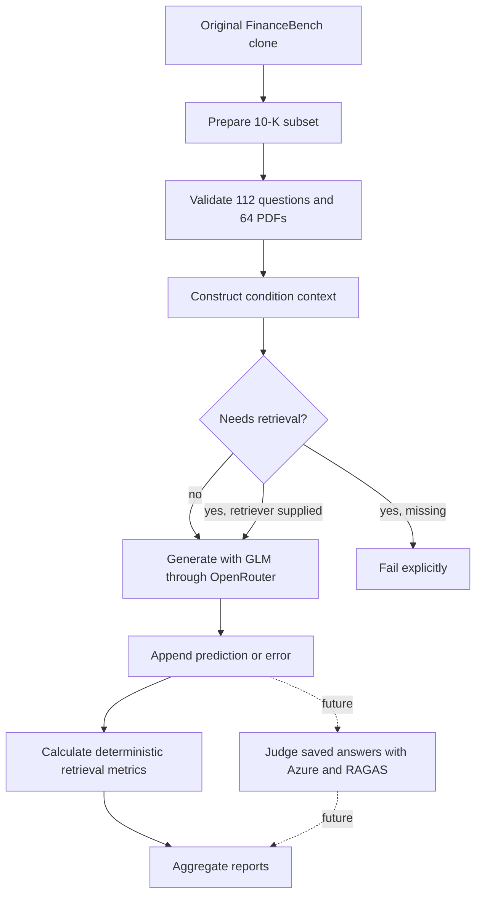
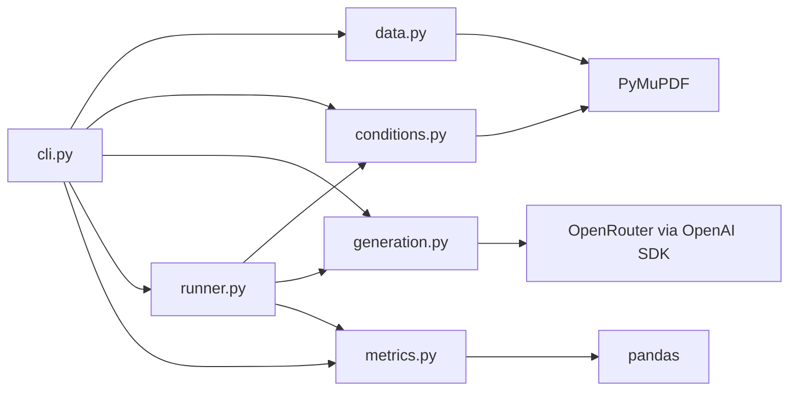
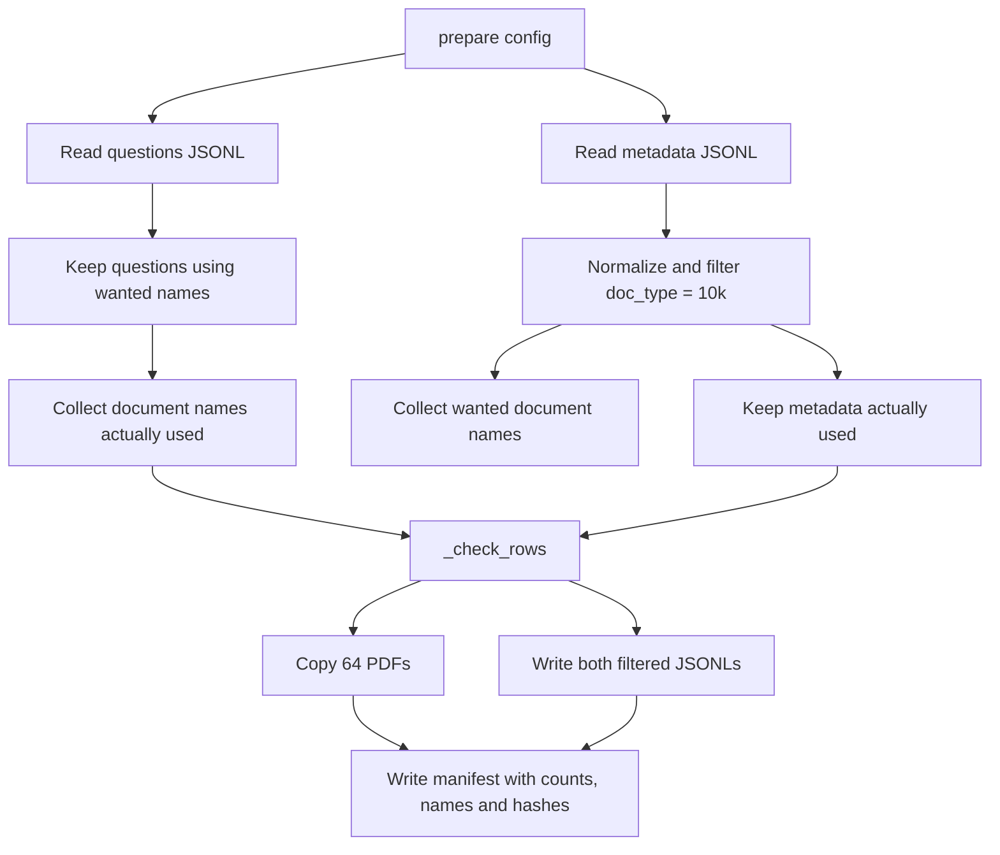
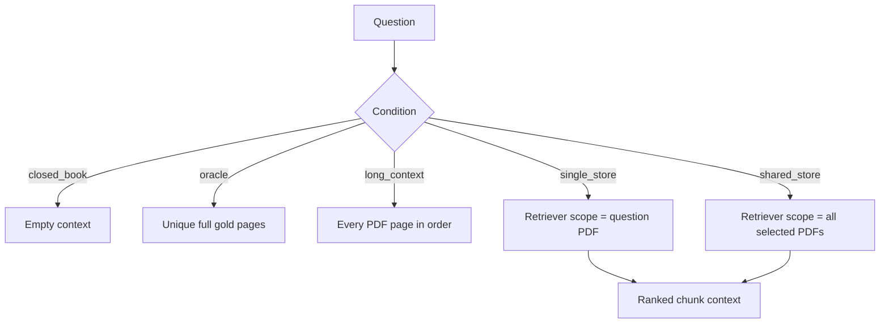
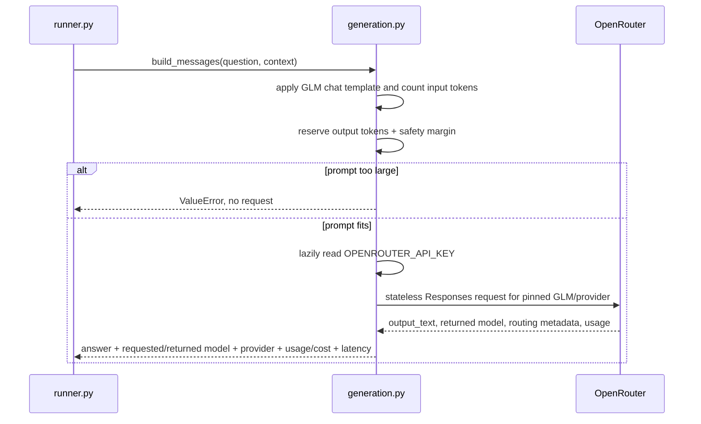
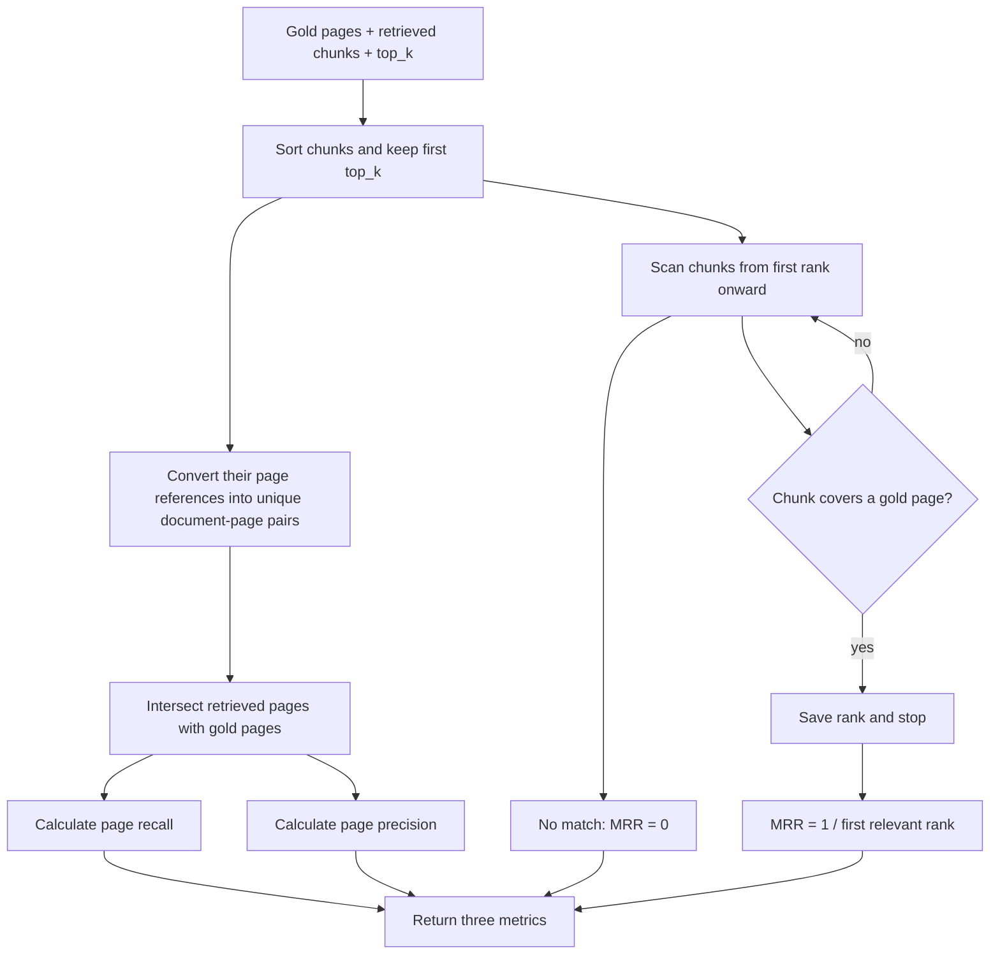
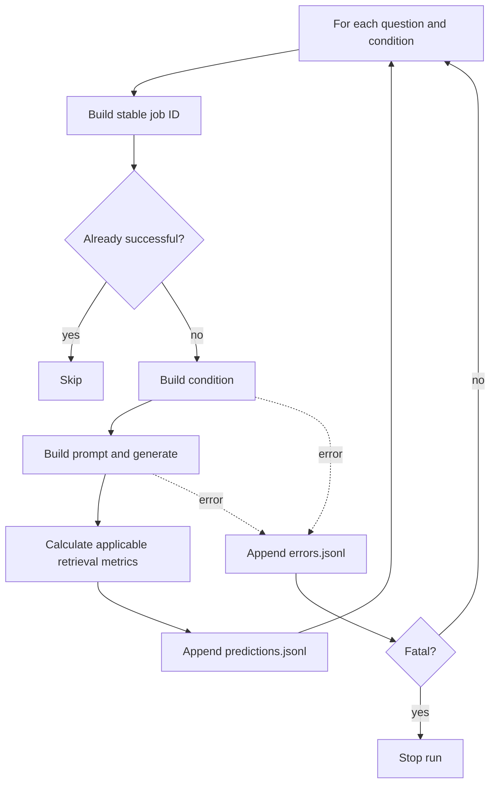
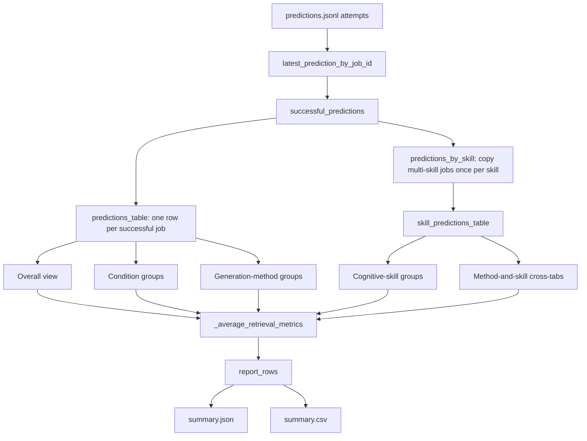
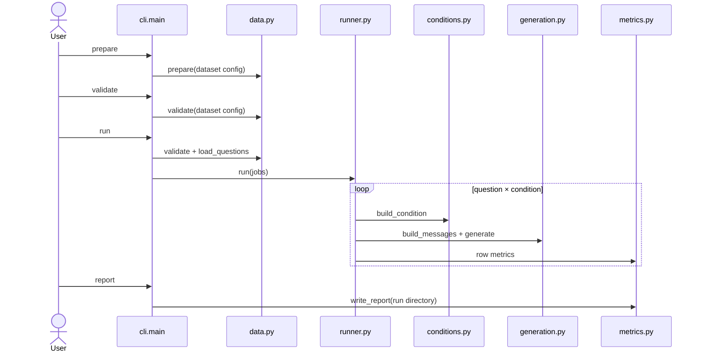

# FinanceBench implementation guide

#THOUGHTS: why we loading pdf table entry instead of actual pdf page itself

Status: reconstructed as-built guide for learner review

Authoritative requirements: `../Benchmark.md`

Historical inputs only:

- `docs/superpowers/specs/2026-09-07-financebench-benchmark-harness-design.md`
- `docs/superpowers/plans/2026-09-07-financebench-harness-mvp.md`

Those historical documents explain how the first, more engineered implementation
was reached. They are not the current source of truth. This guide explains the
smaller golden-path implementation actually present on
`feature/financebench-golden-path`.

## 1. System purpose and boundary

The current system benchmarks the 112 open-source FinanceBench questions whose
source documents are 10-Ks, across 64 PDFs. It prepares and validates local data,
constructs FinanceBench's five context conditions, generates answers for the
three conditions that do not need a retriever, checkpoints every attempt,
calculates deterministic retrieval metrics, and writes segmented reports.



Currently implemented:

- FinanceBench 10-K preparation and validation;
- five context builders;
- closed-book, oracle, and long-context generation;
- replaceable retrieval interface, without a real retriever;
- page recall, page precision, and page MRR;
- checkpoint/resume and segmented reporting;
- no-spend tests and dry runs.

Deferred:

- real single-store/shared-store retriever and vector store;
- Azure GPT answer judge through RAGAS, which will provide the official answer-
  accuracy result;
- HiREC/LOFin;
- smoke and pattern validation subsets;
- final policy for nine conservatively oversized long-context jobs.

## 2. Project bootstrap and controls

The benchmark is a named package under `src/sec_rag_benchmark/` because its
modules import one another and share one installed command. This avoids ambiguous
imports such as `from data import ...` and lets `uv run sec-rag-benchmark` invoke
the package consistently.

The following commands bootstrap the equivalent package and dependencies in a
new project directory; they are not claimed as the exact historical commands
originally entered. The project metadata and CLI mapping shown below are then
kept in `pyproject.toml`.

```bash
uv init --package --python 3.12 --name sec-rag-benchmark --build-backend uv
uv add "openai==3.8.0" "pandas==3.0.5" "pymupdf==1.28.2" \
  "transformers==5.17.0" "jinja2==3.1.6"
uv add --dev "pytest==9.1.1"
uv lock
uv sync
```

`uv init` creates the package controls, `uv add` records exact direct
dependencies, `uv lock` resolves the complete dependency graph, and `uv sync`
creates or updates the local environment.

| Tool | Current purpose | Why it is present |
|---|---|---|
| Python 3.12 | Runtime | Stable language baseline selected in `.python-version` |
| `uv` | Package, environment and lockfile management | Recreates direct and transitive dependency versions |
| OpenAI SDK | OpenRouter-compatible GLM client | OpenRouter exposes an OpenAI-compatible API |
| Transformers + Jinja2 | GLM tokenizer and its chat-template renderer | Counts the formatted prompt before sending it |
| PyMuPDF | PDF page count and text extraction | Conditions and validation operate on physical pages |
| pandas | Grouping and CSV report output | Reporting is tabular; preparation remains plain JSON |
| pytest | Automated checks | Validates the golden path without paid requests |

LangChain, Chroma, RAGAS, Azure libraries, and a vector database are not installed
because the current executable path does not use them. Add them only after their
design is approved.

| Project control | Purpose |
|---|---|
| `.python-version` | Selects Python 3.12 for this repository |
| `pyproject.toml` | Defines the package, direct dependencies, build backend, and CLI |
| `uv.lock` | Pins the complete resolved dependency graph |
| `.venv/` | Generated local environment; ignored by Git |
| `.env.example` | Documents credential names without containing secrets |
| `.env` | Ignored local credentials; the terminal must load them into the process environment |
| `configs/financebench.toml` | Public, editable dataset, generation, and run settings |

In `pyproject.toml`, `[project]` describes the package, `[build-system]` selects
`uv_build` (basically allows you to import src/sec_rag_benchmark), and `[dependency-groups]` contains development-only tools. The CLI
mapping:

```toml
[project.scripts]
sec-rag-benchmark = "sec_rag_benchmark.cli:main"
```
- `uv init` created below package (where we added sec_rag_benchmark):
    ```
    project root/
    ├── pyproject.toml
    └── src/
    ```
- We create the actual source files under `src/sec_rag_benchmark*`
- run `uv sync`, which does
    - reads .toml and uv.lock, creates .venv, sees build-backend 'uv_build'
        - this asks uv_build to 'install' i.e. locate the location of our local project 'sec_rag_benchmark'
        - name 'sec-rag-benchmark' → sec_rag_benchmark
        - since uv build looks under default `src/` directory, finds `src/sec_rag_benchmark`
    - `src/sec_rag_benchmark` is found, .pth lcoation pointer is saved under .venv
    - https://docs.astral.sh/uv/concepts/build-backend/#module
    - By default, a single root module is expected at src/<package_name>/\__init__.py.
- [project.scripts] declares `sec-rag-benchmark = "sec_rag_benchmark.cli:main"`, turn 'main()' function in 'cli.py' into a convenient terminal command called 'sec_rag_benchmark', as it essentially does:
    ```python
    from sec_rag_benchmark.cli import main
    main()
    ```
    - so can call arguments to be used in the parser e.g. `uv run sec-rag-benchmark prepare` runs main() in cli.py, which runs the 'prepare' argument that's parsed


`pyproject.toml` controls the Python project; `configs/financebench.toml` controls
a benchmark run. `cli.load_config()` reads the latter and routes its sections as
follows:

```text
[dataset]    → data.py preparation, validation, paths, and expected counts
[generation] → generation.py model request and context limits
[run]        → cli.py/runner.py conditions, retrieval depth, and results path
```

Use these commands after the one-time bootstrap:

```bash
uv lock --check
uv run pytest -q
uv run sec-rag-benchmark prepare --config configs/financebench.toml
uv run sec-rag-benchmark validate --config configs/financebench.toml
uv run sec-rag-benchmark run --config configs/financebench.toml --dry-run
```

Read `.python-version`, `pyproject.toml`, `.env.example`, and
`configs/financebench.toml` in that order. Then inspect only `load_config()` in
`src/sec_rag_benchmark/cli.py`; the rest of that file is explained in section 11.
Read alongside `test_cli_prepare_validate_and_no_spend_dry_run()` in
`tests/test_golden_path.py`. `uv.lock` does not need line-by-line review.

## 3. File structure and module relationships

All paths below are relative to the `feature/financebench-golden-path` worktree
root. Sections 5–11 follow the order in which to read the implementation; each
section identifies its exact source file, function order, and corresponding test.

```text
configs/financebench.toml          public editable run settings
src/sec_rag_benchmark/
├── data.py                        prepare, validate, load
├── conditions.py                  build five context conditions
├── generation.py                  prompt and OpenRouter request
├── metrics.py                     retrieval metrics and report aggregation
├── runner.py                      job loop, checkpoint, resume
└── cli.py                         terminal entry point and orchestration
tests/
├── conftest.py                    tiny two-question/PDF fixtures
└── test_golden_path.py            compact behavior tests
```



There is no `records.py`. Modules exchange ordinary dictionaries. This makes
the small benchmark easier to inspect, at the cost of weaker static type safety.

## 4. Main data shapes

The preparation command creates this generated local directory:

```text
data/financebench/
├── financebench_open_source_10k.jsonl
├── financebench_document_information_10k.jsonl
├── manifest.json
└── pdfs/
    └── 64 selected FinanceBench PDFs
```

The directory is not committed to Git; it can be reproduced from the read-only
FinanceBench clone. The required libraries and their rationale are listed in
section 2.

### Prepared question

The original question keys are preserved. `load_questions()` adds one in-memory
key without rewriting the stored JSONL:

```python
{
    "financebench_id": "q1",
    "question": "What was revenue?",
    "answer": "$42 million",
    "doc_name": "example_2023_10K.pdf",
    "question_type": "metrics-generated",
    "question_reasoning": "Information extraction",
    "justification": "The reference answer follows from ...",
    "evidence": [
        {
            "doc_name": "example_2023_10K.pdf",
            "evidence_page_num": 12,
            "evidence_text_full_page": "..."
        }
    ],
    "document_metadata": {"doc_type": "10K", "doc_period": "2023", "...": "..."}
}
```

### Condition result
Records info model should receive

```python
{
    "financebench_id": "q1",
    "condition": "oracle",
    "question": "What was revenue?",
    "context": "[Document: ... | Page index: 12]\n...",
    "context_pages": [("example_2023_10K.pdf", 12)],
    "retrieved_chunks": []
}
```

### Future retrieved chunk contract

```python
{
    "chunk_id": "example:12:0",
    "text": "Revenue was $42 million ...",
    "doc_name": "example_2023_10K.pdf",
    "pages": [12],
    "score": 0.91,
    "rank": 1
}
```

### Prediction row

```python
{
    "job_id": "<config-hash>:q1:oracle",
    "status": "success",
    "financebench_id": "q1",
    "question": "What was revenue?",
    "gold_answer": "$42 million",
    "gold_evidence": [
        {
            "doc_name": "example_2023_10K.pdf",
            "evidence_page_num": 12,
            "evidence_text_full_page": "..."
        }
    ],
    "human_justification": "The reference answer follows from ...",
    "model_answer": "$42 million",
    "eval_mode": "oracle",
    "gold_pages": [["example_2023_10K.pdf", 12]],
    "retrieved_chunks": [],
    "page_recall": None,
    "page_precision": None,
    "page_mrr": None,
    "requested_model": "z-ai/glm-5.3-flash",
    "returned_model": "z-ai/glm-5.3-flash",
    "provider": "Z.AI",
    "usage": {},
    "cost": None,
    "latency_seconds": 0.1
}
```

No answer-accuracy field is written during generation. The future judge reads
this saved row, which already contains all reference inputs it needs, and
persists its binary decision separately. `cost` is retained from OpenRouter's
usage metadata when returned and is otherwise explicitly `null`.

## 5. Data preparation and validation flow

In `src/sec_rag_benchmark/data.py`, read `prepare()` → `validate()` →
`load_questions()` → `_check_rows()` → the small I/O, PDF, and hash helpers. Read
the three data tests in `tests/test_golden_path.py` alongside it, using the
fixture records in `tests/conftest.py`.



Representative pseudocode:

```text
prepare(config):
    read source question and metadata records
    filter metadata to normalized 10k
    select questions referencing those documents
    discard metadata not used by a selected question
    validate exact selection against source PDFs
    replace generated PDF subset and JSONLs
    hash generated files and write manifest
    return observed counts

validate(config):
    load generated JSONLs
    repeat record/page/count validation
    compare expected and actual PDF filenames
    compare manifest settings and file hashes
    return counts

load_questions(output_dir):
    load questions, load doc metadata
    combine them
```

Important behavior:

- Both JSONL schemas and complete evidence lists remain intact.
- Evidence pages are zero-indexed and document-aware.
- Preparation deletes stale PDFs only inside the generated output directory.
- The manifest acts as provenance receipt, file inventory, and integrity check.
- The current implementation reopens a repeated PDF for each question during
  `_check_rows()`; this is understandable at current scale but could later be
  simplified to use the existing `page_counts` dictionary as a true cache.

## 6. Condition construction

In `src/sec_rag_benchmark/conditions.py`, read `build_condition()` first, then
`gold_pages()`, `_pdf_pages()`, and `_page_block()`. Read alongside
`test_all_conditions_and_retrieval_scopes()` in `tests/test_golden_path.py`.



The retriever public shape is:

```python
Retriever = Callable[[str, tuple[str, ...], int], list[dict[str, Any]]]
```

That means `retriever(question_text, document_scope, top_k)` returns ranked chunk
dictionaries. A missing retriever raises `RetrieverUnavailable`.

## 7. Generation flow

In `src/sec_rag_benchmark/generation.py`, read `build_messages()` → `generate()`
→ `count_prompt_tokens()` → `get_tokenizer()` → `_selected_provider()`. Read alongside
`test_generation_pins_provider_without_real_api_call()` and
`test_generation_rejects_empty_output_and_oversized_prompt()` in
`tests/test_golden_path.py`.



`count_prompt_tokens()` uses the official GLM-5.3-Flash tokenizer and applies
the model's chat template with the configured reasoning effort. This includes
role markers and the assistant-generation marker rather than counting only the
visible strings. `get_tokenizer()` downloads the small tokenizer/configuration
files on first use, then `lru_cache` and Hugging Face's disk cache reuse them;
it does not download or run the model weights. Both the Transformers version
and Hugging Face tokenizer revision are pinned for repeatable counts.

`max_output_tokens` limits and reserves room for the answer. The smaller
`token_safety_margin = 1024` still allows for possible formatting differences
between the locally applied template and OpenRouter's serving path. The check
therefore compares input tokens + output-token reserve + safety tokens with the
configured token context window.
The pinned OpenAI SDK sends `client.responses.create()` to OpenRouter's base
URL. The standard Responses fields are `input`, `max_output_tokens`,
`reasoning`, and `store=False`; OpenRouter's endpoint is stateless and rejects
stored response state. The harness omits the deprecated `truncation` parameter
and instead raises its own error before making a request when the complete
prompt and output reserve cannot fit.

Provider routing is an OpenRouter-only request extension passed through the
SDK's `extra_body`. It orders the `z-ai` upstream provider first and disables
fallbacks so the serving route cannot silently vary between experiment jobs.
The `X-OpenRouter-Metadata: enabled` header asks OpenRouter to return routing
metadata. `_selected_provider()` records the endpoint marked `selected`; it
returns `None` instead of guessing when that metadata is absent.

The result records the requested model from configuration separately from the
model returned by OpenRouter. `response.output_text` supplies the answer. The
result also records the serving provider, token usage, latency, and
OpenRouter-reported `usage.cost`. Cost remains `null` when the response does not
include it; the harness does not silently estimate it from a separate price
table. The fake-client tests verify this request and response mapping without a
paid API call; one later paid smoke request must verify the extensions against
the live GLM endpoint before a benchmark run.

## 8. Retrieval metrics

In `src/sec_rag_benchmark/metrics.py`, read `page_metrics()` and
`cognitive_skills()` now; leave `write_report()` for section 10. Read alongside
`test_metrics_use_document_aware_unique_pages_and_chunk_rank()` in
`tests/test_golden_path.py`.

### What enters and leaves `page_metrics()`

The function scores one question under one retrieval condition. Its inputs have
these shapes:

```python
gold = [
    ("A.pdf", 2),
    ("A.pdf", 5),
]

chunks = [
    {"doc_name": "wrong.pdf", "pages": [2], "rank": 1},
    {"doc_name": "A.pdf", "pages": [2, 5], "rank": 2},
    {"doc_name": "A.pdf", "pages": [2], "rank": 3},
]

top_k = 5
```

`("A.pdf", 2)` is one document-aware page. `("wrong.pdf", 2)` is a
different page even though both use page index 2. The returned dictionary is
stored on that job's prediction row:

```python
{
    "page_recall": 1.0,
    "page_precision": 2 / 3,
    "page_mrr": 0.5,
}
```

### Pseudocode followed by `page_metrics()`

```text
INPUT:
    gold pages
    retrieved chunks
    retrieval depth top_k

sort chunks by retrieval rank
keep only the first top_k chunks

create an empty set of unique retrieved pages

FOR each retrieved chunk:
    FOR each page covered by that chunk:
        add (document name, page number) to the set

count how many unique retrieved pages are gold pages

page recall =
    gold pages retrieved / all gold pages

page precision =
    gold pages retrieved / all unique retrieved pages

set first relevant chunk rank to nothing

FOR each ranked chunk:
    construct that chunk's (document name, page number) pairs

    IF any pair is a gold page:
        save this chunk's rank
        stop searching

IF a relevant chunk was found:
    page MRR = 1 / its rank
ELSE:
    page MRR = 0

RETURN recall, precision and MRR
```



The pseudocode concepts deliberately use the same names as the Python:

| Pseudocode concept | Python variable |
|---|---|
| gold pages | `gold_pages` |
| first `top_k` chunks in rank order | `ranked_chunks` |
| distinct retrieved document/page pairs | `unique_retrieved_pages` |
| retrieved pages that are also gold | `retrieved_gold_pages` |
| number used in both metric numerators | `number_of_gold_pages_retrieved` |
| first chunk covering any gold page | `first_relevant_chunk_rank` |

### Worked example

After sorting, all three example chunks remain. Converting them into a set gives:

```python
unique_retrieved_pages = {
    ("wrong.pdf", 2),
    ("A.pdf", 2),
    ("A.pdf", 5),
}
```

The rank-3 duplicate of `("A.pdf", 2)` does not add another page. Intersecting
that set with the two gold pages gives two matches:

```text
page recall    = 2 retrieved gold pages / 2 gold pages = 1.0
page precision = 2 retrieved gold pages / 3 retrieved pages = 0.666...
```

MRR asks a different question: how early did the first useful **chunk** appear?
Rank 1 covers only `("wrong.pdf", 2)`, so it does not match. Rank 2 covers both
gold pages, so the loop saves rank 2 and stops:

```text
page MRR = 1 / first relevant chunk rank = 1 / 2 = 0.5
```

`cognitive_skills()` is separate from this calculation. It converts the raw
FinanceBench reasoning text into the skill labels used later by `write_report()`.

## 9. Runner and checkpoints

In `src/sec_rag_benchmark/runner.py`, read `run()` first, followed by
`_successful_jobs()` and `_append()`. Read alongside
`test_runner_checkpoints_resumes_and_reports()` in `tests/test_golden_path.py`.



The CLI copies the effective TOML into the run directory and hashes it to form
part of each job ID. Reusing a run directory with different effective settings
fails instead of mixing results.

## 10. Reporting and result artifacts

Return to `src/sec_rag_benchmark/metrics.py` and read `write_report()` now that
the saved prediction and error rows from `runner.py` are familiar. Within it,
read the five explicitly labelled reporting blocks in order, then read
`_average_retrieval_metrics()`, which performs the repeated averaging for one
subset.
Continue with `test_runner_checkpoints_resumes_and_reports()` and
`test_report_places_multi_skill_prediction_in_each_skill_view()`.

### Purpose and input

`page_metrics()` calculated three scores for one retrieved question. In
contrast, `write_report()` reads all saved jobs and answers questions such as
"What was average recall for `single_store`?" Its main input is the append-only
`predictions.jsonl`, containing one JSON object per line. For example:

```json
{"job_id":"q1:single_store","status":"success","eval_mode":"single_store","question_type":"calculated","cognitive_skills":["information_extraction","numerical_reasoning"],"page_recall":1.0,"page_precision":0.5,"page_mrr":1.0}
```

### Pseudocode followed by `write_report()`

```text
INPUT:
    predictions.jsonl
    errors.jsonl
    run configuration

read every saved prediction attempt

FOR each job_id:
    retain its latest prediction

keep only predictions whose status is success

create the ordinary predictions table

create a second table for cognitive-skill reporting:
    FOR each successful prediction:
        FOR each cognitive skill on that prediction:
            add one copy labelled with that skill

create an empty list called report_rows

summarize all successful predictions
add that overall summary to report_rows

FOR each condition:
    select predictions from that condition
    average their retrieval metrics
    add one condition summary

FOR each generation method:
    select predictions from that method
    average their retrieval metrics
    add one generation-method summary

FOR each cognitive skill:
    select predictions labelled with that skill
    average their retrieval metrics
    add one cognitive-skill summary

FOR each generation-method and cognitive-skill combination:
    select predictions matching both
    average their retrieval metrics
    add one cross-tab summary

count planned, successful, failed and missing jobs

write report_rows and completion counts to summary.json
write report_rows as a table to summary.csv
```



### The important data states

`prediction_attempts` is an ordinary list of dictionaries read from the JSONL.
Because the runner may be resumed, more than one attempt can theoretically have
the same `job_id`. Assigning each attempt into `latest_prediction_by_job_id`
means the last occurrence becomes that job's current result.

`successful_predictions` removes rows that are not successful. Pandas then
turns that list into `predictions_table`, where each dictionary becomes one row
and each dictionary key becomes a column:

```text
job_id           eval_mode      question_type  page_recall
q1:single_store  single_store   calculated     1.0
q2:single_store  single_store   reported       0.5
```

A prediction may have two skills. To include it in both summaries, the code
creates `predictions_by_skill`, which contains a reporting-only copy for each
skill, then converts it into `skill_predictions_table`:

```text
job_id           cognitive_skill
q1:single_store  information_extraction
q1:single_store  numerical_reasoning
```

The original prediction still exists once in `predictions_table`; it is copied
only in the skill-reporting table. Skill totals therefore overlap.

### The five report views

`write_report()` creates these five kinds of summary row. The `report_view`
field identifies which question that row answers:

- `overall`: every successful prediction together;
- `condition`: one subset per `eval_mode`, such as `single_store`;
- `generation_method`: one subset per FinanceBench `question_type`;
- `cognitive_skill`: one subset per normalized cognitive skill;
- `cross_tab`: one subset per `question_type`/cognitive-skill combination.

Each numbered block in the Python selects the rows for one view and passes that
concrete subset to `_average_retrieval_metrics()`. For example, the condition
block passes only the `single_store` rows when it creates the following result:

```json
{
  "report_view": "condition",
  "eval_mode": "single_store",
  "total_predictions": 112,
  "page_recall": 0.72,
  "page_recall_sample_size": 112
}
```

### What `_average_retrieval_metrics()` does

Read this helper after the five blocks in `write_report()`. It performs the same
small calculation for whichever subset it receives:

```text
INPUT:
    one selected group of predictions
    the name and identity of that group

count every prediction in the group

FOR recall, precision and MRR:
    discard None values
    calculate the average of remaining values
    record how many values contributed

RETURN one summary row
```

For example, the condition block calls it with the `single_store` DataFrame,
`report_view="condition"`, and `eval_mode="single_store"`. The helper creates
one dictionary and appends it to `report_rows`.

`total_predictions` counts every answer in the subset. Each separate
`<metric>_sample_size` counts only rows where that retrieval metric applies.
An oracle summary can therefore contain 112 predictions but have a page-recall
sample size of zero. Skill views overlap when a question has multiple labels.

```text
results/<run-id>/
├── config.toml        effective public run configuration
├── predictions.jsonl append-only successful jobs
├── errors.jsonl      append-only failed attempts
├── summary.json      machine-readable report and completion status
└── summary.csv       spreadsheet-friendly grouped metrics
```

### Future final-answer judge

Judging is a separate pass over saved predictions, so generated answers do not
need to be regenerated when judging is retried or changed. For each answer, the
judge input will contain:

- the question;
- the FinanceBench reference answer;
- the complete FinanceBench reference-evidence list;
- the human labeller's `justification` field;
- the candidate model answer.

The judge will return the binary correct/incorrect value used for official final-
answer accuracy. The precise RAGAS integration, Azure deployment configuration,
judge prompt, and validation against human-reviewed examples remain a later
vertical slice.

## 11. CLI and complete call flow

Finish with `src/sec_rag_benchmark/cli.py`: read `main()` → `load_config()` →
`_parser()`. Read alongside `test_cli_prepare_validate_and_no_spend_dry_run()`.



The available commands are `prepare`, `validate`, `run`, `report`, and `judge`.
`run --dry-run` enumerates work and preflights non-retrieval contexts without
creating an OpenRouter client. `judge` intentionally reports unavailable.

### Terminal commands, in execution order

Start every new terminal session from the golden-path worktree:

```bash
cd "/Users/zubairasim/Documents/SEC RAG/.worktrees/financebench-golden-path"
```

The following setup commands are safe: they do not call an LLM or spend API
credit. Run the `git clone` only if `benchmarks/financebench` does not already
exist in this worktree.

```bash
git clone https://github.com/patronus-ai/financebench.git benchmarks/financebench
uv sync
uv lock --check
uv run pytest -q
```

To see the commands or the options accepted by a particular command:

```bash
uv run sec-rag-benchmark --help
uv run sec-rag-benchmark prepare --help
uv run sec-rag-benchmark validate --help
uv run sec-rag-benchmark run --help
uv run sec-rag-benchmark report --help
uv run sec-rag-benchmark judge --help
```

Prepare the reproducible local 10-K subset, then validate its 112 questions and
64 PDFs. These commands do not make API requests:

```bash
uv run sec-rag-benchmark prepare --config configs/financebench.toml
uv run sec-rag-benchmark validate --config configs/financebench.toml
```

Preflight all three currently executable conditions without spending API
credit:

```bash
uv run sec-rag-benchmark run --config configs/financebench.toml --dry-run
```

For a quicker no-spend check, limit the input to five questions and choose the
conditions explicitly:

```bash
uv run sec-rag-benchmark run \
  --config configs/financebench.toml \
  --conditions closed_book oracle long_context \
  --limit 5 \
  --dry-run
```

The retrieval conditions can also be enumerated in a dry run, but the output
will state that they require the future retriever:

```bash
uv run sec-rag-benchmark run \
  --config configs/financebench.toml \
  --conditions single_store shared_store \
  --limit 5 \
  --dry-run
```

Before a real generation run, create an ignored `.env` file containing
`OPENROUTER_API_KEY=...`. Load it into the current shell with:

```bash
set -a
source .env
set +a
```

The next command **makes paid OpenRouter requests**. Do not pass `--run-dir`
when starting a new run: the CLI automatically creates a timestamped directory
under `results/` and prints its path:

```bash
uv run sec-rag-benchmark run \
  --config configs/financebench.toml \
  --conditions closed_book oracle long_context
```

For example, the command may print a directory named
`results/20260913-143052`. Keep the actual path printed by your run.

If the run stops, load the API key again in a new terminal and pass that existing
directory through `--run-dir`. Keep the same conditions. The runner skips job
IDs already recorded as successful:

```bash
uv run sec-rag-benchmark run \
  --config configs/financebench.toml \
  --conditions closed_book oracle long_context \
  --run-dir results/20260913-143052
```

After generation, create or refresh `summary.json` and `summary.csv`. Reporting
reads saved files and does not call an LLM. Replace the example timestamp below
with the directory printed by your run:

```bash
uv run sec-rag-benchmark report --run-dir results/20260913-143052
```

The following is the reserved future command. It currently exits with an
explicit "not implemented" error and performs no judging:

```bash
uv run sec-rag-benchmark judge --run-dir results/20260913-143052
```

## 12. Test design and requirement traceability

| Requirement or behavior | Current test |
|---|---|
| Preserve source rows; prepare/validate/load | `test_prepare_validate_and_load_preserve_source_rows` |
| Reject missing PDF and ambiguous metadata | `test_prepare_rejects_missing_pdf_and_ambiguous_metadata` |
| Reject duplicate IDs and invalid pages | `test_validation_rejects_bad_question_data` |
| Construct all five conditions and correct scopes | `test_all_conditions_and_retrieval_scopes` |
| Document-aware recall/precision and chunk-rank MRR | `test_metrics_use_document_aware_unique_pages_and_chunk_rank` |
| Record requested/returned model, provider, usage, latency and cost without paid call | `test_generation_pins_provider_without_real_api_call` |
| Preserve evidence and human justification for later judging | `test_runner_checkpoints_resumes_and_reports` |
| Append checkpoints, resume, and report | `test_runner_checkpoints_resumes_and_reports` |
| CLI prepare/validate/dry-run with zero requests | `test_cli_prepare_validate_and_no_spend_dry_run` |
| Exact real 112-question/64-PDF acceptance | Verified manually; not bundled because source clone is ignored |
| No answer-accuracy calculation during generation | `test_runner_checkpoints_resumes_and_reports` |
| Judge-only official answer accuracy | Explicitly deferred |
| Real retriever, HiREC and pattern suite | Explicitly deferred |

Run the verification commands listed in section 2. The tests use a tiny generated
fixture, fake generator, and fake OpenRouter client; they make no paid request.

## 13. As-built differences from the engineered branch

| Earlier implementation | Golden-path implementation |
|---|---|
| Layered subpackages and many wrappers | Six direct modules |
| Nested immutable dataclasses and `MappingProxyType` | Ordinary documented dictionaries |
| Atomic staging, backup activation, source fingerprints | Direct deterministic preparation plus manifest hashes |
| `run_plan.json` and result-store abstraction | Effective `config.toml`, append helpers, stable job IDs |
| Many narrow test files | One compact golden-path behavior suite |
| Approximately 4,000 more implementation/test lines | Smaller path intended for learner review |

Safeguards retained because they directly support benchmark validity:

- exact question/document counts and schema checks;
- evidence page and PDF validation;
- source/filter/file-hash manifest;
- explicit context-limit failure;
- provider pinning and lazy credentials;
- immediate checkpoints and compatible configuration snapshot;
- document-aware retrieval metrics and applicable denominators.

## 14. As-built reconciliation status

The code-reading route is integrated into sections 2 and 5–11. Future answer
judging remains an unimplemented slice that will add separately persisted binary
answer accuracy.

The metrics/runner reconciliation is now implemented: deterministic numeric
answer scoring has been removed from `metrics.py`, prediction rows, reports, and
tests. Final-answer accuracy remains absent until the approved judge slice.

### Guide-to-code comment map

The source comments intentionally mirror this guide at the boundaries where a
reader needs design context:

- `data.py` comments trace 10-K selection, idempotent rebuilding, manifest
  provenance, complete-PDF validation, and the in-memory metadata join;
- `conditions.py` comments distinguish the oracle, long-context, single-store,
  and shared-store information supplied to the shared generator;
- `generation.py` comments connect shared prompting, conservative context
  accounting, lazy credentials, and provider pinning;
- `runner.py` comments trace one question-condition job, retrieval-metric
  applicability, checkpointing, and deferred separate judging;
- `metrics.py` comments explain unique document-aware pages, chunk-ranked MRR,
  multi-label segmentation, and per-metric denominators;
- `cli.py` comments distinguish data preparation, no-spend preflight, generation,
  and report-only orchestration.

These comments explain purpose, data flow, and non-obvious rationale. Routine
Python syntax remains uncommented so the code and this guide do not become two
duplicated implementations that can drift independently.

For each slice, compare the golden-path branch with its base in GitLens, discuss
questions, and record any approved correction here before changing code. Future
slice changes remain uncommitted until the user reviews their actual diff.
